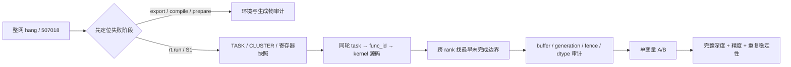
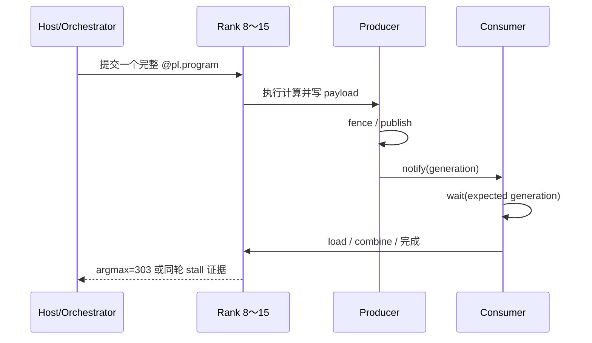

# N=1（单程序）整网随机卡死定位案例：入口与结论

> 本文是 `pypto-whole-net-hang-debug` 的案例入口。它保留最需要先读的背景、术语、
> 证据边界和最终结论；长时间线、具体排查步骤、项目启动准入标准和原始证据索引
> 分拆到独立 reference，避免每次定位都加载原先 3,600 多行的单文件。
>
> 当前案例对象：0162 机器、逻辑设备 8～15、一个 `@pl.program` 承载完整 45 层、
> 其中 42 个 MoE 层、native W8A8、权重和 KV 通过 IPC、dispatch pull + combine
> pull、真实 token 6127、batch 16（只有 row0 有效）、最终 golden 为 `argmax=303`。

## 阅读地图

| 你的问题 | 先读哪里 | 结果 |
|---|---|---|
| 想快速知道发生了什么、哪些结论仍然成立 | 本文 §1～§3 | 统一术语、对象和证据边界 |
| 想按日期复盘为什么问题持续这么久 | [完整时间线](n1-timeline.md) | 从环境 blocker 到最终 512B A/B 的演化 |
| 想复核“为什么这个结论成立/被推翻” | [关键因果链](n1-causal-chains.md) | 按假设、决定性实验、证据等级和保留项展开 |
| 想实际排查新的整网 stall | [排障实践](n1-debugging-playbook.md) | 从失败阶段、寄存器、TASK 到 kernel/通信/buffer |
| 想启动另一个整网项目 | [项目启动准入标准](n1-project-admission.md) | Day 0 设计门禁、验证梯度和发布准出 |
| 想查原始文档、日志和 stable manifest | [证据索引](n1-evidence-index.md) | 当前 SSOT、phase、notes 和恢复锚点 |





## 最终结论速览

| 结论类别 | 当前结论 | 证据边界 |
|---|---|---|
| 当前生产形态 | N=1 单 `@pl.program`；多程序永久排除 | 用户裁定和项目设计约束 |
| 当前通信组合 | dispatch pull + combine pull | canonical 文档冻结；不是 push+push |
| 必须保留的结构性修改 | per-layer communication window、正确 layer/index boundary、inverse_map、native W8A8 数值修复、真实 IPC 生命周期 | 即使不是最后随机 stall 的唯一变量，也不能回退 |
| 最终布局变量 | control signal 从 32B 物理分配扩大到 512B 并隔离 | 在 0162 exact-source 完整对象上与 stall 消失强关联 |
| 稳定性事实 | exact-source 版本完成 20/20，均 `rc=0` 且 `argmax=303` | 不能改写成 clean-pin 三仓 20/20 |
| clean-pin 事实 | 三仓 clean pin 在 0162 有独立 canonical smoke | smoke 不是历史 exact-source 20/20 的替代 |
| 未证明内容 | 没有真实 AICore PC 或 bit-level trace，不能声称某条 ISA 指令是唯一根因 | 结论停在 kernel/通信/物理布局边界 |

## 1. 案例摘要

### 1.1 先用自然语言说明这个案例

这不是一个“某个 kernel 偶尔卡住、改一行代码就结束”的小问题，而是一个
跨越多个 session 的整网排障事件。被测程序是 step3p5 的完整 decode 路径：
前面有 3 个 dense/attention 层，后面有 42 个 Mixture-of-Experts（MoE，混合
专家）层，总共 45 个模型层。为了验证 N=1 whole-net 方案，45 层被编排进同一个
`@pl.program`，一次提交中完成整网计算，而不是每层单独由 host 重新发起。

最终固定的测试是在 0162 机器的 8 个设备（逻辑设备 8～15）上执行一个真实请求：

- 输入 token 是 6127，`ctx=1`，即只验证一个 token 的上下文；
- batch 物理大小是 16，但只有第 0 行是真实 token，第 1～15 行是 padding；
- 权重是原生 W8A8，即权重和激活都按 INT8 路径计算，不允许退回
  BF16-dequant；
- 权重和 KV cache（注意力的 Key/Value 缓存）都通过 IPC（进程间共享已经分配
  的设备内存）导入；
- dispatch（把 token 发往目标专家）和 combine（取回并聚合专家输出）都使用
  pull，即由接收方按已经发布的地址主动拉取数据；
- 正确输出的唯一 golden（参考答案）是最终 logits 的 `argmax=303`。

在问题暴露期间，同一个外层失败常常有两种表现：

```text
成功时：约 2.5 秒完成，输出 argmax=303
失败时：等待调度器超时，报告 507018；S1 running-stalled 表示已经开始运行的
        设备任务长时间没有完成
```

更麻烦的是，“程序完成”与“结果正确”在历史上也不是同一件事：有些版本能够
返回但输出是 NaN 或错误 token；另一些版本能够偶尔返回正确的 303，却在相同
代码的下一次运行中卡死。因此必须同时回答两个独立问题：

1. 整网是否每次都能完成，且没有 scheduler stall；
2. 完成后是否仍然保持原生 W8A8 语义，并得到 `argmax=303`。

如果只看 `507018`，会把以下不同问题误认为同一个问题：

- 设备驱动、固件、CANN 软件栈或过期 runtime 导致的环境失败；
- host 没有把任务成功派发到设备侧 AICPU 控制处理器；
- host 内存或设备侧预分配内存区不足；
- 相邻模型层复用了仍在使用的跨卡通信窗口；
- `gate_topk` 内部 merge-sort 输入契约错误；
- attention 输出没有通过 `pl.Out` 正确写回；
- whole-net 内联 routed expert 没有遵循已验证的 native W8A8 边界；
- 跨设备参与者的“发布数据—保证可见—发送通知—等待通知”协议没有继续前进；
- 控制信号的物理布局和相邻数据载荷落在同一硬件缓存行。

这也是本案例持续时间较长的根本原因：每解决一个前置问题，后面被遮挡的
下一层问题才会出现；同时历史测试对象还在 0234/0162 两台机器、主动远端写入
或由接收方拉取、只执行 1/20/42 个混合专家层、虚拟权重/host 拷贝权重/真实
IPC 权重之间变化。如果没有保存准确源码、编译产物、运行时版本和输入环境
清单，就很容易把不同问题的结果拼成一个错误故事。

排查过程大致分成六层：

1. 先清理环境、runtime binary、IPC capability、SDMA workspace 和 host/device
   内存问题，确保失败真的进入 `rt.run`；
2. 用“只纳入 1 个混合专家层”和“连续纳入 2 个混合专家层”的可控缩减实验，
   确认跨层通信窗口发生了确定性的内存别名；
3. 用同一次运行的设备 `TASK` 日志、`kernel_config.py` 和生成源码，把第 3 个
   设备任务精确定位到 `gate_topk`，修复 merge-sort 输入不满足前置条件的问题；
4. 用独立 `pl.Out` 输出逐算子中间结果，先修 attention 输出交接，再把异常幅值
   定位到整网内联的 routed expert，并坚持原生 W8A8，而不是回退 BF16；
5. 在精度已经可以得到 303 后，继续区分完成确认波、主动写入/接收方拉取边界、
   不同设备停留位置和真正的随机卡死；
6. 最后回到完整 buffer 清单，只改变控制信号的物理分配，从逻辑数据量 32B
   隔离到 512B，并在固定发布对象上重复验证。

最终在 0162 上冻结的发布测试对象是：

```text
machine                 = gpu-a910x-0162
devices                 = 8..15
program                 = whole_decode_faithful_real
MoE layers              = 42  (P_FAITHFUL_MOE_LAYERS=42)
token                   = 6127
weights                 = native W8A8 via IPC
KV cache                = via IPC
dispatch                = fixed-slot pull
combine                 = pull
golden                  = argmax 303
```

最终 control signal 的逻辑视图仍然是 `[8,1] INT32`，逻辑数据量为 32B；改变的
是物理隔离空间：

```text
logical signal view     = [8,1] INT32 = 32B
physical allocation     = 512B
COMM_CONTROL_SIGNAL_BYTES = 512
216/216 signal buffers  = 512B
all relative offsets    %512 = 0
whole comm window size  %512 = 0
```

在准确绑定到 `0e7a0fdd` 的模型源码上，0162 使用全新启动的 8 个 exporter
进程连续运行 20 次，20 次均 `rc=0` 且 `argmax=303`。随后又在 pypto-lib、
pypto 和 simpler 三个仓库均固定到无未提交修改的 commit 后，单独执行了一次
完整 42 层快速健康检查。

这两类证据必须分开阅读：前者是完整的 20 次重复稳定性证据，但当时 pypto 和
simpler 仍包含尚未提交的 runtime 支持；后者绑定了三仓 clean commits，但目前
只有一次快速健康检查，不能写成“三仓 clean commit 已连续通过 20 次”。

结论边界：

- 在 0162 上，512B 控制信号物理隔离与随机卡死消失具有强关联，并由准确源码
  版本上的 20/20 支持；
- 现有记录没有提供完整归档的成对 A/B 对照表，不能把它升级成严格的跨机器
  “强单变量因果证明”；
- 项目后续记录称 0234 在仅确认 pypto-lib 三个 release 文件与
  `0e7a0fdd` 逐字节一致后，使用全新进程池的正式测试 3/3 卡死；由于完整
  pypto/simpler/runtime binary/environment 未绑定，本次审计不能把它称为
  同一完整发布对象的跨机器复现；本次审计也因 SSH permission denied
  未能独立复核 0234；
- 没有逐 bit trace 证明某一个 signal bit 丢失；
- 没有真实 AICore PC 证明某条 TPUT/TGET/WAIT 指令是唯一根因；
- 不能把历史某次停留的 kernel 名当成所有失败的唯一位置。

### 1.2 本文中的缩写、变量和数字怎么读

为了让没有参与历史调试的人也能读懂，下面先固定术语。后文会尽量使用完整
中文描述；只有在需要对应源码变量、日志字段或历史原始记录时，才保留缩写。

| 写法 | 含义 | 本案例中的具体解释 |
|---|---|---|
| **N=1 / N1** | 一个 whole-net `@pl.program` | 不是只有 1 层，也不是 batch size=1；表示 45 层被放进一个 program 中完成 |
| **MoE** | Mixture-of-Experts，混合专家层 | 本模型前 3 层是 dense/attention，后面有 42 个 MoE 层 |
| **P_FAITHFUL_MOE_LAYERS** | 实际生成/执行的 MoE 层数量开关 | `=0` 表示只执行 dense 前缀；`=1` 表示加入第一个 MoE 层；`=20`、`=31` 表示只执行前 20、前 31 个 MoE 层；`=42` 才是完整深度 |
| **P0/P1/P20/P31/P42** | 上一行变量的历史简写 | `P42` 不是优先级、进程号或第 42 个 task，只是 `P_FAITHFUL_MOE_LAYERS=42`；后文看到 `P0/P1` 时也应理解成 0/1 个 MoE 层 |
| **K=1/K=2/K=42** | 跨层通信窗口缩减实验中的层数 | 这里的 K 表示实验中连续纳入通信窗口测试的 MoE 层数量，不是 batch、rank 或 kernel 编号；`K=2` 是用来复现 shared-window alias 的关键对照 |
| **P42 release** | 完整 42 个 MoE 层的发布对象 | 加上前面的 3 个 dense/attention 层，总模型深度是 45 层 |
| **TP=8** | Tensor Parallel，张量并行度为 8 | 8 个设备共同切分张量计算 |
| **EP=8** | Expert Parallel，专家并行度为 8 | 8 个设备共同承载/交换专家路由数据 |
| **W8A8** | Weight INT8 + Activation INT8 | 权重和激活都走原生 INT8 计算；不是 BF16 权重运行时反量化后的替代路径 |
| **IPC** | Inter-Process Communication；本案例中特指跨进程/跨设备导入已分配的设备内存 | 权重和 KV cache 都通过 IPC 导入，不能把 H2D 临时拷贝当作同一个测试对象 |
| **KV** | Key/Value cache | 自注意力使用的 key/value 缓存，本案例也通过 IPC 导入 |
| **H2D** | Host-to-Device | 从 host 内存拷贝到设备内存；历史上用于和真实 IPC 权重路径做对照 |
| **pull + pull** | dispatch 使用 pull，combine 也使用 pull | 不是 PUSH+pull，也不是历史 push+push 探针；当前 release 的组合必须写完整 |
| **S1 running-stalled** | PTO2 scheduler 的 running-stalled 分类 | S1 不是“第 1 层”；它表示采样时至少有一个已经分配到 core 的 RUNNING task 长时间没有完成 |
| **507018** | 外层 runtime/host 错误码 | 只表示一次运行失败，不能单独说明是 OOM、依赖死锁、kernel bug 还是环境问题 |
| **TASK / func_id** | device 任务快照 / 生成 kernel 的函数编号 | `stuck_task_id` 不能直接当 `func_id`；必须用同轮 TASK 和 exact `kernel_config.py` 映射 |
| **A/B** | 受控对照实验 | 例如比较 32B 与 512B 的控制信号物理分配；目标是固定完整 42 个 MoE 层、输入、数据类型和通信协议，只改变一个变量 |
| **rank** | 分布式设备中的逻辑参与者编号 | 当前 release 使用逻辑设备 8～15，对应 8 个 rank |
| **AICore/AIV** | 设备上的计算核心类型 | 日志中的 `aiv0:3` 是 AIV kernel 编号；它不是源码中的 Python task 顺序 |
| **SSA** | Static Single Assignment，中间表示中的单赋值版本 | 文档说两个 layer 复用了同一个 SSA buffer，指的是生成后的中间对象/物理生命周期发生别名 |
| **RAW-only-v1** | Read-after-Write only 的依赖模型 | 它要求仍可能被前一层读取的中间 buffer 不能提前复用给下一层 |
| **PC** | Program Counter，AICore 当前指令地址 | 本案例没有真实 AICore PC，因此结论停在 kernel/通信边界，没有声称某条 ISA 指令是根因 |

本文还使用以下运行和证据术语：

| 写法 | 含义 |
|---|---|
| **stall / hang** | 程序没有继续完成；可能是 kernel 长时间不返回、通信等待不满足或调度器检测到没有 forward progress。它不是某一种具体根因的同义词 |
| **RUN_CLEAN** | 该次运行返回成功并完成了 device execution；它本身不代表数值正确，也不代表重复运行稳定 |
| **canonical** | 项目冻结的唯一准出对象和命令口径；本案例是 0162、真实 token 6127、完整 42 个 MoE 层、native W8A8、KV IPC、pull+pull |
| **golden** | 用来判断数值是否正确的参考结果；本案例的最终 golden 是 `argmax=303` |
| **smoke** | 一次快速健康检查；可以发现 clean stack 是否基本可运行，但不能替代正式重复稳定性测试 |
| **exact-source** | 运行日志绑定到明确的源码 commit 和生成文件 hash，而不是只凭 branch 名称判断“应该是同一份代码” |
| **pin / clean pin** | 明确固定的仓库 commit；clean pin 还要求对应工作树没有未提交修改 |
| **manifest** | 复现对象的完整清单，包括源码、runtime、二进制、工具链、checkpoint、设备、环境变量和测试输入 |
| **fresh exporter pool** | 为本轮测试新启动的 8 个 per-rank 权重/KV exporter；避免复用上一轮残留的设备内存、IPC key 或进程状态 |
| **forward progress** | 已提交的 task、kernel 或通信协议仍在向完成状态推进；S1 running-stalled 表示采样时没有观察到这种推进 |

特别注意：本文中出现的 `P` 和 `K` 都只是历史实验记号。为了避免误读，新的
记录应优先写成：

```text
P_FAITHFUL_MOE_LAYERS=0（不执行 MoE）
P_FAITHFUL_MOE_LAYERS=1（执行 1 个 MoE 层）
P_FAITHFUL_MOE_LAYERS=42（完整 42 个 MoE 层）
K=2（两个 MoE 层复用窗口/每层独立窗口的对照）
```

不要只写“P1 clean”“P20 wrong”或“K2 stall”而不说明：这是哪个 program、
哪种 dispatch/combine 组合、哪台机器、哪份 source/build，以及它是否包含真实
权重和真实 token。

## 2. 证据标签与案例边界

### 2.1 本文如何标注历史结论

这次事件跨越多个 session，历史文档中存在“当时合理、后来被更强证据推翻”的
判断。本文使用以下标签，避免把过程性判断重新传播成事实：

| 标签 | 含义 |
|---|---|
| **[直接证实]** | 同轮 device 日志、exact build、寄存器/TASK、数值输出或发布测试直接支持 |
| **[强关联]** | 单变量或近似单变量 A/B 与结果高度相关，但仍缺 matched 对照、PC 或跨机器充分性证明 |
| **[当时假设]** | 当时用于决定下一实验的候选解释，尚未完成排他证明 |
| **[后续证伪]** | 后续 device、exact mapping、控制实验或稳定性复验推翻 |
| **[历史记录，未独立复核]** | 来自 Git 历史或旧机器记录，本次文档重构没有重新运行原始对象 |

历史文档中的“root cause”“SOLVED”“device-verified”不能脱离它当时的
测试对象和验证强度阅读。例如：

```text
P_FAITHFUL_MOE_LAYERS=1
只执行 1 个 MoE 层，本次运行完成
```

只能说明“只执行 1 个 MoE 层”的测试对象完成，不能自动升级成“完整执行
42 个 MoE 层”也能稳定完成；同理：

```text
argmax=303 once
```

只能说明一次精度路径正确，不能升级成稳定 release。

### 2.1.1 本案例的结论应该怎样读

本文中每个阶段的“结论”都要回答四个不同问题，不能只看最后一句：

1. **当时到底观察到了什么？**
   例如 `completed=4/32`、`TASK state=RUNNING`、`argmax=303` 或
   `TaskMapSize=0`。这些是现象，不是根因。
2. **为什么这个现象支持某个假设？**
   例如 dummy H2D clean、IPC weight stall 会自然支持“IPC/VA 有关”，但它
   仍然没有证明具体卡在哪个 kernel。
3. **什么实验把假设从相关性提升或降级？**
   exact `TASK kernels=[aiv0:3]` 加同轮 `kernel_config.py`，比“MoE 内部
   第 3 个 task 看起来像 all-to-all”强得多；同理，完整 42 个 MoE 层连续
   20/20 通过，比只执行 1 个 MoE 层的一次完成强得多。
4. **结论的作用域和保留项是什么？**
   一个修改可能同时是“架构上必须保留”“数值上必须保留”“与 stall 消失
   强关联”，但不一定是同一个根因。本文会把这些作用域分开。

因此，阅读任何一段时应按如下顺序复述：

```text
对象是什么？
失败在哪个阶段？
证据直接指向什么？
还有哪些替代解释没有排除？
后续哪次实验改变了结论？
最终保留的是代码、诊断方法，还是仅仅一条历史经验？
```

### 2.2 本文回顾的不是一个根因

长期事件的共同外观是 `507018`、timeout、hang 或“运行不前进”，但至少经历了
以下不同故障族：

```text
环境和 stale runtime / pyc
跨卡 IPC capability / SDMA workspace
host -> AICPU dispatch TaskMapSize=0
跨层 communication-window alias
host RAM / device arena OOM
gate_topk mrgsort 状态机不终止
pl.Out / generator / layer-index 边界错误
native W8A8 routed expert 数值错误
概率性 publish/fence/notify/wait stall
最终 control-signal physical layout 风险
```

因此本文最重要的边界是：

> **相同外层错误码不等于相同故障；相同“看起来卡住”也不等于同一 kernel、
> 同一通信原语或同一层。**

### 2.3 六个不能互相替代的验证 bar

本案例反复被推翻，核心原因之一是把不同强度的 bar 混写成同一个“通过”：

```text
compile clean
    != prepare clean
    != dispatch clean
    != rt.run clean
    != numerical correct
    != repeated canonical release
```

对应到本案例的单程序整网：

```text
只执行 1/20 个 MoE 层完成 != 完整执行 42 个 MoE 层可发布
RUN_CLEAN != argmax 303
一次 303 != 20/20
model source exact != runtime manifest exact
clean-pin smoke != clean-pin 20-run
```

### 2.4 机器和对象作用域

历史过程先后使用 0162 和 0234，也曾在 live vLLM co-tenancy、standalone
dummy-weight、standalone real-weight IPC 等不同对象上运行。本文只把
2026-07-16 至 2026-07-17 的下列对象称为 release-qualified：

```text
machine                        = gpu-a910x-0162
devices                        = 8..15
program                        = whole_decode_faithful_real
P_FAITHFUL_MOE_LAYERS          = 42（完整执行 42 个 MoE 层）
dispatch                       = fixed-slot pull
combine                        = pull
weights                        = native W8A8 IPC
KV                             = IPC
token                          = 6127
golden                         = argmax 303
batch                          = 16, row0 valid, row1..15 padding
```

0234 的历史结果、主动远端写入模式的结果、只执行 1/20 个 MoE 层的结果和
与 vLLM 同卡运行的结果都是排障证据，不是这个发布对象的同义词。

## 3. 为什么这个问题持续很久

### 3.1 多个 blocker 共用同一个外层错误

`507018` 在这个项目中曾表示：

- CANN/AICPU bootstrap 缺库；
- stale runtime `.so`；
- host 到 AICPU 没有真正派发 task；
- AICore kernel 已 RUNNING 但不完成；
- 越界、未初始化或错误状态机引发的 kernel hang；
- timeout 包裹的通信等待；
- cleanup/恢复阶段的次生错误。

如果只按错误码搜索，很容易把一个阶段的修复错误套到另一个阶段。
正确做法是先记录失败阶段：

```text
exporter
compile
prepare
IPC import
dispatch
rt.run
worker teardown
```

再读取对应阶段的 TASK/CLUSTER/COND、kernel 和 dmesg。

### 3.2 每移除一个 blocker，下一层才暴露

这次长期过程具有明显的“洋葱结构”：

1. 编译没通过时，看不到 device dispatch；
2. device runtime 不一致时，看不到 whole-net scheduler；
3. shared communication window 仍然别名时，看不到完整 42 个 MoE 层的真实权重路径；
4. host/device OOM 时，看不到首个真实 MoE kernel；
5. `gate_topk` deterministic hang 修复后，才看到精度/NaN；
6. 精度路径修到 `argmax=303` 后，才有资格讨论随机 stall；
7. 随机 stall 消失后，才发现候选 20-run 与 release source SHA 不完全一致；
8. exact-model-source 20/20 补齐后，才进一步 formalize 三仓 clean pins。

因此“问题持续很久”不意味着团队一直在重复修同一行代码；更多时候是旧 blocker
挡住了后面的真实故障。

### 3.3 诊断对象持续漂移

历史上先后出现：

```text
单卡 / 双卡 / 8 卡
dummy 权重 / BF16-dequant / native W8A8
H2D 权重 / IPC 权重 / KV IPC
执行 0/1/20/31/41/42 个 MoE 层的历史对象
push+push / pull+push / pull+pull
0234 / 0162
不同 generator 输出 / 不同 dirty runtime
```

如果没有每轮保存 manifest，一次 clean 和下一次 stall 可能根本不是同一对象。
这也是后来必须建立 `N1-CANONICAL-TEST.md` 和 stable environment 文档的原因。

### 3.4 诊断工具本身也曾制造错误结论

本案例出现过三类典型诊断污染：

1. **stale `__pycache__`**：源码已改，运行却仍读取旧配置；
2. **generator substring 截断**：调试生成器命中错误的 `return`，把 MoE body
   截断，导致一批 bisect 实际运行的是坏程序；
3. **orchestration 内 early-return 无法裁掉后续 DAG**：以为只跑到某 stage，
   实际后续 InCore kernel 仍 materialize。

所以任何诊断旋钮都必须通过 exact generated source 和 build artifact 证明它
真的改变了被测路径。

### 3.5 概率问题会制造“过早胜利”

最终随机 stall 的 clean 概率一度约为三分之一。这样的概率足以制造：

- 连续 3 次 clean；
- logging 打开后 clean；
- 某个 patch 后暂时 clean；
- 换机器后偶发 clean；
- 某个错误修改仍得到 `argmax=303`。

如果验证只做 1 到 3 次，极易把时序扰动误判为修复。2026-07-14 的
completion-wave“已修”结论随后被 clean tree 的 `STALL/CLEAN/STALL` 复验推翻，
正是这个问题。

### 3.6 精度和 forward progress 是两个独立 gate

历史 clean run 能得到 `argmax=303`，说明正确数学路径存在；它不说明通信稳定。
反过来，dummy 权重或错误 gate 可能让程序稳定完成，却完全没有证明真实精度。

最终要求始终是：

```text
stability == PASS
AND
argmax == 303
AND
native W8A8
AND
完整执行 42 个 MoE 层
AND
exact source/manifest
```

任何通过回退 BF16-dequant、缩减为只执行 1 个 MoE 层、使用虚拟 gate，或仅检查
`rc=0` 得到的“稳定”，都不构成解决。

## 进一步阅读

- [完整时间线](n1-timeline.md)：日期导航，再按需进入早期前史、N1 bring-up、
  精度/stall/release 主线。
- [关键因果链](n1-causal-chains.md)：集中复核被推翻判断、证据等级和必须保留的修改。
- [排障实践](n1-debugging-playbook.md)：分流到 stall 定位或设计审计与准出。
- [项目启动准入标准](n1-project-admission.md)：分流到设计 Gate、实现/发布 Gate
  和 Day 0 模板。
- [证据索引](n1-evidence-index.md)：当前 stable、phase、notes 和历史恢复点。
