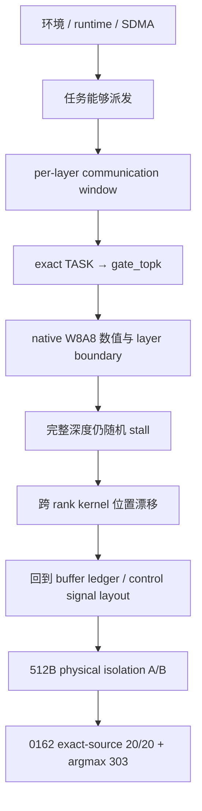

# N1 案例：关键因果链与历史判断复核

> 本文从完整时间线中独立出七条最容易被误读的因果链。每条都按
> “前置对象 → 当时假设 → 决定性实验 → 证据等级 → 保留/撤回项”展开。
> 日期顺序和阶段背景见 [完整时间线](n1-timeline.md)。

## 因果关系总图



## 七条因果链索引

| 因果链 | 主要回答 | 当前证据等级 |
|---|---|---|
| 4.17.1 per-layer window | 为什么这是确定性真修复 | 已证实的独立 blocker |
| 4.17.2 exact TASK | 为什么 IPC/VA/all-to-all 归因被推翻 | 同轮直接证据 |
| 4.17.3 首个 NaN | 为什么“执行一个 MoE 层就错”仍不等于首个 kernel 根因 | 诊断边界 |
| 4.17.4 completion-wave | 为什么短样本通过不能宣布修复 | 后续复验推翻 |
| 4.17.5 kernel 位置漂移 | 为什么漂移本身指向共享边界 | 强证据，不到指令级 |
| 4.17.6 512B isolation | 为什么是强关联而非唯一硬件证明 | 0162 exact-source 20/20 |
| 4.17.7 最终修改集合 | 为什么不能只保留“32 改 512” | 多类正确性修改叠加 |

## 4.17 关键结论的完整因果链


前面的时间线回答“哪一天发生了什么”。本节进一步回答“为什么当时会这样判断、
什么证据把判断升级或降级、最后哪些内容进入了 release”。后续 session 复用
本案例时，应优先参考本节，而不是只摘取某个阶段最后一句“根因”。

### 4.17.1 为什么 07-10 的 per-layer communication window 是确定性真修复

**前置约束。** N1 选择把 42 个 MoE layer 放进同一个 `@pl.program`。因此，
多个 layer 的通信操作进入同一个 host orchestration 和同一个调度 DAG。按照
RAW-only-v1 的设计，仍可能被上一层远端 rank 访问的中间 buffer，不能在下一层
直接复用为另一个逻辑对象；否则 SSA/lifetime 描述和硬件实际访问会不一致。

**观测。** 只执行 1 个 MoE 层、复用一套 communication/scratch window 时可以
完成；执行 2 个 MoE 层并继续复用同一套窗口时，开始稳定出现
`507018`/scheduler timeout。生成的 `host_orch.py` 明确显示 layer-3 和
layer-4 的 `chip_orch` 复用了同一个 `combine_done_buf`、`recv_x`、
`pub_counts`、`routed_y` 和相关 signal SSA。这个证据比“层数变大所以概率
变差”更具体：它直接显示相邻 layer 指向了相同的 communication object。

**为什么提出 alias 假设。** 1 层和 2 层实验的主要结构差异，就是是否引入
第二个使用同一套通信窗口的 MoE 层；失败发生在下一层进入时，而不是 compile、
prepare 或首个 dispatch。
如果上一层的远端 reader 仍在使用窗口，下一层重新写 signal/payload，正好会
表现为下一层等待不满足、旧 generation 提前通过或下游读到错误数据。

**决定性实验。**

```text
2 个 MoE 层复用一套通信窗口       -> 确定性卡死
2 个 MoE 层各用独立通信窗口       -> 运行完成
完整 42 个 MoE 层各用独立通信窗口 -> 运行完成
```

**结论。** 这组对照直接证明 07-10 的 shared-window alias 是一个独立的、
确定性的架构 bug；per-layer distinct window 是针对它的真修复。它解决的是
“跨层 communication object 生命周期重叠”，不等于证明 07-16 的随机 stall
也是同一个 alias。后续随机问题发生在已经逐层 distinct 的版本上，所以两者
必须拆开。

**保留与不覆盖。**

- 保留每层独立的 communication window、signal、payload 和 hidden handoff；
- 保留 writer/reader/lifetime ledger；
- 不再用“上一层看起来完成了”作为下一层复用依据；
- 不能因为两层通信窗口别名修复通过，就断言所有后续卡死都来自同一种别名；
- 不能用不同 buffer 名称替代实际生成 SSA、physical offset 和 lifetime 审计。

### 4.17.2 为什么 07-12 的 exact TASK 证据推翻了 IPC/VA/EP all-to-all 归因

**前置背景。** 真实权重改为每个 rank 独立 exporter，再通过 IPC 导入后，
dummy H2D weight 版本可以运行，而 real IPC weight 版本在早期停住；不执行
MoE 层时可以完成，至少执行 1 个 MoE 层时失败。仅凭这些结果，最自然的候选
是“大 IPC pool 与 MoE expert-parallel all-to-all 存在虚拟地址或 peer-access
冲突”。

**为什么这个假设当时合理。**

1. H2D 和 IPC 的内存类型确实不同；
2. “不执行 MoE”和“至少执行 1 个 MoE 层”的分界恰好落在 MoE 入口；
3. 当时 `stuck_task_id` 的低位曾被错误地当作 task/func 顺序；
4. 按 MoE 源码顺序看，a2a 确实接近第一个重通信操作。

但这四点只能建立候选关系，不能说明 device 实际执行的 kernel。

**决定性证据。** 打开 V0 device 日志后，同轮快照为：

```text
TASK task_id=3 state=RUNNING
kernels=[aiv0:3]
fanin=3/3
core=28
```

再用同一次 build 的 `kernel_config.py` 查询 `func_id=3`：

```text
func_id=3 -> gate_topk
```

这条证据来自实际提交到 device 的 kernel 列表和 exact build 映射，比“task3
在 MoE 源码中看起来像 a2a”强得多。`fanin=3/3` 还说明该 task 的输入依赖
已经满足；它不是简单的 host DAG missing dependency。

**代码级原因。** N1 内联 generator 使用了错误的 sort pipeline：

```text
sort32
-> mrgsort(block_len=64)
-> 4 x 256-run
-> format2 merge two half-blocks
```

format2 的前提是每个输入本身已经是一条完整有序序列，但两个半块内部仍各有
多个有序 run，因此输入契约被破坏。分散 gate score 会让 merge state machine
不终止，最终表现为 `S1/RUNNING`，而不是一个清晰的 host-side 越界错误。

**修复和边界。** 改成完整的 DeepSeek 风格 format1 渐进 merge chain 后，
完整 42 个 MoE 层的 native W8A8 IPC 运行通过，sort-only probe 也与 torch top-k 对齐。因此：

- [直接证实] 这一次 deterministic task3 stall 的具体 kernel 是 `gate_topk`；
- [直接证实] 代码问题是 mrgsort 输入前置条件错误；
- [后续证伪] “IPC child-memory/VA 是这一次 task3 stall 的根因”；
- [后续证伪] “task3 就是 EP all-to-all”。

保留 V0 日志隔离、同轮 `kernel_config.py` 映射、format1 merge 实现，以及
“standalone validated kernel 不代表 generator 内联副本相同”的审计要求。

### 4.17.3 为什么“不执行 MoE 时有限、执行 1 个 MoE 层时 NaN”不能直接证明 INT8 kernel 是首个根因

**观测。**

```text
P_FAITHFUL_MOE_LAYERS=0 -> finite
P_FAITHFUL_MOE_LAYERS=1 -> NaN
```

它只说明错误首次出现在“引入第一层 MoE 的完整路径”之后，并不能区分：

```text
MoE arithmetic
attention -> MoE handoff
pl.Out writeback
未初始化 buffer
dispatch/combine protocol
```

**为什么先怀疑 INT8 MoE。** 当时正从 BF16-dequant bring-up 迁移到 native
W8A8，且 whole-net 内联 routed expert 与 standalone validated `moe.py`
并不完全相同；因此“第一层 MoE 一打开就 NaN”与 INT8 path 存在合理相关性。

**为什么 padding 实验不够。** 对 routed input/hidden tile 做 zero-fill 后仍然
NaN，只能排除一种 A-operand padding 解释，不能证明 MoE arithmetic 是首个
错误点。

**决定性 op-level dump。** 使用独立 `pl.Out dbg_out` 把阶段输出导出：

```text
post_norm       -> 1.45       正常
local_routed_x  -> 1.45       正常
shared expert   -> 1.62       正常
local_routed_y  -> 3.99e11    首个异常
moe_out         -> 1.95e11    继承异常
```

这组数据揭示了两个先后叠加的问题：

1. 早期 NaN 的第一处边界错误是 `attn_only_orch` 的 `pl.Out` 被局部 tensor
   遮蔽，导致 attention 结果没有写进 `h_mid_out`，MoE handoff 读取未初始化值；
2. 修复 writeback 后残留的 1e11 幅值，才由 whole-net inlined
   `_expert_routed` 与 validated `moe.py` 的 native W8A8 实现漂移产生。

因此，“只执行 1 个 MoE 层出现 NaN”不是单一根因，而是至少两个不同边界问题先后叠加后的共同外观。

最终保留：

- `attn_only_orch` 的真实 Out writeback；
- 独立 op-level dump，而不是 orchestration 内 early return；
- whole-net routed path 对齐已在 device 验证的 dispatch-side native W8A8；
- 禁止用 BF16-dequant 回退把 NaN/幅值错误隐藏起来。

### 4.17.4 为什么 completion-wave 曾经看起来修好，却不能作为最终结论

**当时结果。** 在 hand-written `tp_all_reduce` 中加入 completion wave，并对
combine 做 zero/publication 调整后，历史记录得到：

```text
完整 42 个 MoE 层连续 7 次 RUN_CLEAN
argmax=303 3/3
```

**为什么这个解释看似成立。** 修改形式与框架中已验证的 two-wave collective
相似，且短期同时改善了稳定性和精度；从局部协议看，它不像单纯提高 timeout
的 workaround。

**决定性反例。** 使用同一 clean tree、关闭额外 logging，并对同一个完整
42 个 MoE 层真实输入重新验证：

```text
run1 STALL
run2 CLEAN argmax=303
run3 STALL
```

所以 7 次 clean 不能证明 completion-wave 消除了随机问题。可能的解释包括
概率性短样本、logging/运行时序扰动、exporter/runtime 对象差异，或其他同时
存在的 layout/protocol 修改。

**最终作用域。** completion-wave 可以作为某些独立 collective protocol 的
正确性增强，但不能写成 N1 随机 stall 的最终根因或完整修复。后续验证必须
回到关闭额外 logging、绑定准确源码、完整执行 42 个 MoE 层和 canonical
重复测试。

### 4.17.5 为什么“kernel 位置漂移”本身也是证据

不同失败 build/rank 曾出现：

```text
push baseline: func28 = _dispatch_push
pull build:    _dispatch_pull / _pull_routed_y / combine / residual
rank 8-14:     _pull_routed_y
rank 15:       _dispatch_pull
```

如果只看某一次日志，容易直接写成“stall root cause = 这个 kernel”。但跨 rank
collective 实际是一条：

```text
producer -> publish -> fence/notify -> peer wait -> load -> consumer
```

不同 rank 在采样时可能处于同一条协议链的不同位置：一个仍在发布，另一个已
进入 pull，第三个正在等待下游 combine。后面的 kernel 可能只是比前面多走了
几步，并不是新的独立根因。

因此 kernel 位置漂移说明：

1. 不能按出现次数最多的函数宣布统一挂点；
2. 要按 layer/generation 排序，寻找所有 rank 最早共同失去 forward progress
   的边界；
3. 没有真实 PC 时，结论只能停在 kernel/通信边界；
4. physical layout、signal generation、offset、zero-init 和 producer/consumer
   lifetime 必须回到同一个 ledger。

这也是最终不能把 PUSH/TPUT、`_pull_routed_y` 或某个 signal bit 写成唯一硬件
根因的原因。

### 4.17.6 为什么 512B 是强关联，而不是已经证明的唯一根因

**修改前。** signal 的逻辑对象是：

```text
[8,1] INT32 = 32B
```

此前物理 allocation 也只有 32B。不同 control signal、signal 与 payload 可能
紧密排列；逻辑上是不同 tensor，但底层一致性/互联管理可能以 512B 粒度处理
相邻地址。于是 `AtomicAdd/Set`、payload load/store 和其他 control signal
可能共享同一物理 line。

**为什么它成为最后的候选。** 到 07-16 时，per-layer alias 已修、gate_topk
deterministic bug 已修，但完整执行 42 个 MoE 层时仍有随机 stall；push 和
pull 都曾失败，
不同 rank 的最早未完成 kernel 会漂移，同时 dmesg 没有 fault、illegal VA 或
真实 PC。继续修改某个 kernel 内部指令已经无法形成干净的最小 A/B，于是回到
buffer ledger 检查 control plane 的 physical isolation。

**A/B 不变量。**

```text
只改：physical signal allocation 32B -> 512B
不改：完整 42 个 MoE 层、token、native W8A8、KV IPC、pull+pull、
      AtomicAdd/Ge、layer boundary、数学和 route mapping
```

生成物检查：

```text
216/216 signals nbytes=512
all relative offsets %512=0
window size %512=0
```

结果是 0162 fresh exporter pool 的 exact release source 连续 20 次：

```text
20/20 rc=0
20/20 argmax=303
worker-run dmesg 无新增 fault/507018/running-stalled
```

**为什么仍不能写成唯一根因。**

1. 没有完整归档 matched 32B A 组和 512B B 组的逐项 source/build/run 表；
2. 没有真实 AICore PC 或 bit-level signal trace；
3. 0234 历史记录没有完整绑定同样的三仓/runtime manifest；
4. 512B 同时改变了物理地址间距和潜在一致性行为，不能仅凭结果推断是
   某个 signal bit、cache line 还是某个协议操作起作用。

准确措辞是：

> 在 0162 固定 release object 上，512B control-signal physical isolation 是
> 最终最小 layout 变量，并与历史随机 stall 消失具有强关联；准确源码、完整
> 42 个 MoE 层的 20/20 测试支持该结论，但现有材料没有证明它是跨机器充分
> 条件、某个具体 bit 的丢失机制，或某个 TPUT/WAIT 指令的唯一硬件根因。

### 4.17.7 为什么最终必须同时保留 pull、inverse_map、per-layer buffer 和 512B

最终 release 不是“只把 32 改成 512”后随便跑出来的版本。它包含几类来源不同、
不能互相替代的修改：

| 修改 | 解决的问题/提供的价值 | 证据 | 删除后的风险 | 是否可称为最终 stall 根因 |
|---|---|---|---|---|
| fixed-slot dispatch pull | 固定 source/destination 路由和可复算 offset，减少 push/pull 边界歧义 | pull wiring、完整 42 个 MoE 层发布对象 | 重新引入 push 远端写路径或旧边界 | 不能单独称唯一根因 |
| dispatch-produced `inverse_map` | 让 combine 消费同一份 dispatch 路由结果 | generator round-trip、final boundary | combine 重算状态，可能产生 offset/order 不一致 | 架构正确性 |
| self local-load / peer remote-load | 明确本地与跨卡访问语义，避免 self route 走错误 peer 路径 | design doc、device/canonical | self/peer 路径混淆、地址或同步错误 | 边界正确性 |
| per-layer distinct window | 解决 07-10 已证实的 RAW-only alias | 两层和完整 42 层的通信窗口对照 | 重新出现 deterministic cross-layer alias | 早期独立 blocker，不是最终唯一根因 |
| native W8A8 dispatch-side quant | 修复 whole-net routed expert 与 validated `moe.py` 漂移 | 逐算子输出、执行 1/20/31 个 MoE 层 | NaN/1e11、违反用户精度约束 | 精度/设计修复 |
| signed tail、zero-init、padding 语义 | 防止 empty tile、旧 generation、padding 行污染 | shape/tail/layout 审计 | 越界、NaN、提前 wait 或错误 route | 正确性前提 |
| 512B control-signal isolation | 最终最小物理 layout A/B | 0162、准确源码、完整 42 个 MoE 层连续 20/20 | 重新暴露历史随机 stall 风险 | 强关联，非唯一硬件证明 |

因此，最终代码不能只保留 512B 一行：512B 只改变 control signal 的物理隔离，
不能替代 layer boundary、native W8A8、route mapping、tail/initialization 或
已经解决的 per-layer lifetime 问题。
