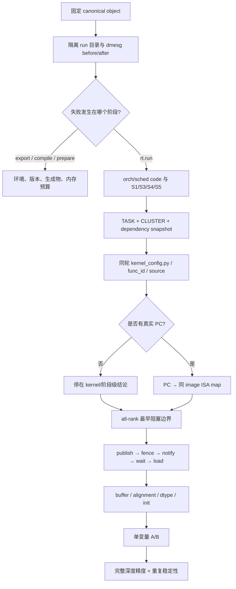
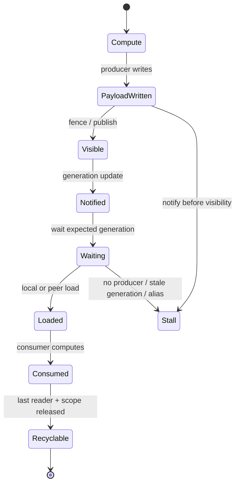

# N=1 案例：整网 Hang 排障实践导航

> 本文只保留执行路径和分流入口。定位 task/kernel/通信边界时读“stall 定位”；
> 审计 buffer、做 A/B、验证精度与发布时读“设计审计与准出”。

## 排障链条总图

## 按需阅读

| 当前问题 | 文档 |
|---|---|
| 失败阶段、507018 分类、TASK/CLUSTER、task→kernel、PC、跨 rank 边界 | [stall 定位入口](n1-stall-localization.md) |
| generator、buffer、对齐、dtype 和最小 A/B | [设计审计与最小 A/B](n1-design-audit.md) |
| exact-source 20-run、clean-pin、因果边界和准出清单 | [发布验证](n1-release-validation.md) |
| 需要知道这些步骤在本案例中如何逐日演化 | [时间线导航](n1-timeline.md) |

## 通信边界状态图

