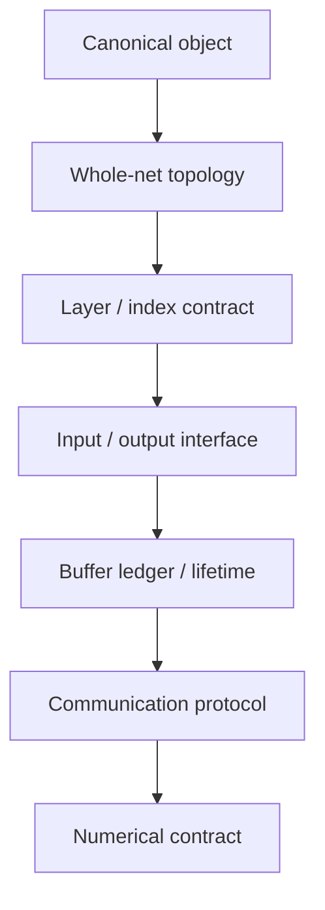

# 整网项目设计准入：Gate 0～5

> 本文覆盖编码前必须冻结的项目定义、整网拓扑、layer/index、接口合同、buffer
> ledger、通信状态机和 native W8A8 数值合同。Gate 0～4 未通过时禁止写正式 kernel。

## 设计对象关系图



## 15.1 Agent 的总约束：先设计，后编码，证据强度决定结论强度

接手一个新的整网项目时，Agent 必须遵守：

1. **先读顶层设计约束。** 先确认 runtime、memory、task、dependency、
   communication、shape、valid shape、layout 和 sharding 语义，再读模型局部
   kernel。若顶层文档缺失或互相冲突，先记录环境/设计缺口，不允许用局部实现
   猜测框架语义。
2. **先冻结测试对象。** 在第一次编码前就定义最终模型深度、真实输入、batch、
   padding、权重格式、KV 来源、并行方式、设备、数值 golden 和稳定性判据。
3. **先画层边界和通信边界。** 先明确每层的输入、输出、producer、consumer、
   ownership、数据类型、物理布局和最后使用者，再决定 kernel 如何拆分。
4. **先建立 buffer ledger。** 没有 logical/physical size、alignment、
   lifetime、初始化和 alias 记录的 buffer，不允许进入正式实现。
5. **稳定性与精度是两个独立准入门。** 一次运行完成不能替代数值正确；一次
   数值正确不能替代重复稳定。
6. **坚持目标数据类型和目标通信架构。** 如果项目要求 native W8A8、IPC、
   单程序整网或固定 pull/push 组合，不能通过 BF16 回退、H2D 替代、缩层、
   retry 或 timeout 增大来宣布完成。
7. **同一轮证据必须绑定。** task、kernel、生成源码、binary、日志、dmesg、
   数值输出和 source hash 必须来自同一次 run/build；不能从不同历史运行拼接
   一条“完整证据链”。
8. **先做证伪实验。** 对任何根因候选，优先设计能推翻它的最小 A/B，而不是
   不断给它增加解释。
9. **结构性正确修改和最终 stall 变量分开记录。** 一个修改即使不是最后的
   随机卡死根因，只要修复了真实 layer boundary、dtype、索引、初始化或生命周期
   问题，就应保留；不能为了追求“最小最终 diff”把它删除。
10. **文档必须跟随证据更新。** 结论发生升级、降级或证伪时，同一会话更新
    active SSOT；不得把旧的 session prompt、过时“SOLVED”状态继续留作当前入口。

Agent 的默认决策顺序应为：

```text
框架不变量
-> 整网拓扑与已批准的 program 边界
-> layer / communication boundary
-> buffer / dtype / index / initialization contract
-> kernel 设计与片上预算
-> 生成器和编译产物
-> 分阶段 device 验证
-> 完整正式对象重复验证
-> clean release manifest
```

若当前问题仍停在前一层，禁止跳到后一层。例如：

- task 尚未派发时，不调 AICore kernel；
- 没有 exact kernel 映射时，不讨论某条 ISA；
- 单层数值尚未正确时，不用完整整网卡死掩盖数值问题；
- 完整深度尚未重复通过时，不宣布 release ready。
## 15.2 文档入口：只维护三个 active SSOT

新的整网项目不要按 session 新建大量互相覆盖的“下一步提示词”。建议只维护：

| 文档 | 创建时间 | 作用 |
|---|---|---|
| `<PROJECT>-DESIGN-AND-ADMISSION.md` | Day 0 | 唯一 active 设计 SSOT，包含项目定义、架构、layer contract、buffer ledger、通信协议、数值合同和 Gate 状态 |
| `<PROJECT>-CANONICAL-TEST.md` | Day 0 | 唯一正式测试对象、命令、输入、golden、稳定性和 dmesg 判据 |
| `<PROJECT>-STABLE-ENV.md` | 第一次 release qualification 前 | 冻结多仓 commit、binary hash、工具链、checkpoint、设备和环境变量 |

原则：

- 设计变化直接更新 design SSOT，不新建另一个相互竞争的 active 版本；
- 每个 Gate 只在 SSOT 中有一个当前状态：`NOT_READY / READY / PASS / BLOCKED`；
- 历史判断移入“被证伪/被替代结论”表，不保留为当前执行指令；
- 原始日志和 build artifact 放到独立 run 目录，由文档记录路径和 hash；
- 不能只记录模型仓库，必须记录所有实际参与运行的仓库和 runtime binary。
## 15.3 Gate 0：项目定义准入

**目的：** 在写任何 kernel 或 orchestration 前，先回答“最终要交付什么”。

Agent 必须在 design SSOT 中填写：

| 字段 | 必须内容 |
|---|---|
| 项目目标 | 是单算子、单层、多层 block、完整 decode，还是 live serving |
| 模型拓扑 | 总层数、dense/MoE/attention 类型、tail/lm_head、每层顺序 |
| program 形态 | 项目已批准的 program 数量、边界和架构依据；已有唯一裁定时不得列替代方案 |
| 并行拓扑 | TP、EP、设备数量、rank 与物理设备映射 |
| 输入 | 真实 token/request、context、batch、有效行与 padding 行 |
| 权重与状态 | checkpoint、native dtype、IPC/H2D、KV 来源、是否允许 fallback |
| 正确性 golden | 单算子、逐层、整网输出和最终 token 判据 |
| 稳定性 gate | 完整正式对象需要连续多少次、timeout、dmesg 判据 |
| 发布对象 | 目标机器、设备范围、多仓和 binary manifest |
| 明确不覆盖 | live/offline、其他机器、其他 batch、其他协议组合等 |

**PASS 条件：**

- 最终 canonical 对象可以用一段无歧义文本复述；
- `N=1`、层数、batch、并行度等数字不会被误解；
- 精度和稳定性判据分别定义；
- 诊断缩减对象和发布对象明确分开。

**NO-GO：**

- “先把代码跑起来，后面再决定 golden”；
- 用随机输入定义发布；
- 允许 BF16-dequant、dummy gate、H2D 或缩层静默替代正式对象；
- 当前 N1 重新提出多程序、逐层 host launch 或 resident tensor 串联；
- 只写 branch，不写 commit、dirty state 和 runtime；
- 不知道最终是 push+push、pull+push 还是 pull+pull。
## 15.4 Gate 1：整网架构与 layer 划分准入

**目的：** 在局部 kernel 设计前，冻结整网 program 边界（包括明确不拆分）、
layer 顺序和索引空间。

Agent 必须提交两张图和一张表。

### 图 A：整网执行拓扑

至少包含：

```text
host / orchestrator
-> program
-> layer 0
-> layer 1
...
-> tail / lm_head
-> host-visible output
```

每个 layer 标明：

- attention、dense MLP、MoE、normalization、tail；
- 所属 orchestration 和 InCore kernel 边界；
- 是否有 TP/EP collective；
- 输入和输出由谁持有；
- 哪些结果跨 layer、跨 rank 或跨 process。

### 图 B：每个 collective 的通信状态机

统一使用：

```text
producer compute
-> payload publish
-> visibility fence
-> notify / generation update
-> peer wait
-> local or remote load
-> consumer compute
-> completion / recycle
```

不能只画“dispatch -> expert -> combine”，必须画出 signal、payload 和代次。

### 表 C：layer/index namespace 表

| absolute layer | layer type | attention local index | dense local index | MoE position | norm index | weight keys | buffer suffix |
|---:|---|---:|---:|---:|---:|---|---|

这一张表必须覆盖所有层，不允许用一个含义模糊的 `layer_idx` 同时表示：

- 模型绝对层号；
- attention 类型内局部索引；
- dense 权重索引；
- MoE position；
- KV offset。

**PASS 条件：**

- 每层只属于一个明确的执行边界；
- 所有索引空间可从表中唯一计算；
- 所有跨层 handoff 有命名接口；
- program 形态符合顶层框架约束；
- 不依赖“后面生成器大概会做对”。

**NO-GO：**

- 还未决定 layer boundary 就开始复制内联 kernel；
- 用源码调用顺序代替生成后的 task 顺序；
- 把单层已验证实现直接假设为整网内联实现；
- 把多个索引空间压成同一个整数；
- 只验证前几层就认为全层索引正确。
## 15.5 Gate 2：每层接口合同准入

**目的：** 把 layer boundary 当成正式 API，而不是一组临时 tensor。

每一个 layer 或 communication phase 必须填写：

| 字段 | 必须内容 |
|---|---|
| 输入对象 | 名称、producer、ownership、rank 语义 |
| 输出对象 | 名称、consumer、是否 host-visible、是否跨层 |
| logical contract | logical shape、valid shape、batch/padding 语义 |
| numerical contract | dtype、量化 scale、累加 dtype、允许误差 |
| physical contract | storage shape、layout、tile、bytes、alignment |
| communication contract | self/peer、local/remote、publish/wait generation |
| initialization | 谁在何时初始化，初始化范围是 logical 还是 whole allocation |
| lifetime | first writer、last reader、何时允许回收或复用 |
| failure observation | 可导出的 debug Out、phase marker、对应日志 |

以 MoE 为例，dispatch 的正式输出应包括：

```text
recv_x
recv_scale
recv_counts
local expert offsets/counts
inverse_map
dispatch completion generation
```

combine 只能消费上述正式输出。若 combine 重新读取另一份 distributed count
matrix 并重算 route mapping，就已经产生第二个不受约束的事实源。

**PASS 条件：**

- 每一个输出都有唯一 producer 和明确 last consumer；
- `pl.Out`、return value 和实际写回对象一致；
- self route 和 peer route 的访问语义分别定义；
- padding、empty tail、partial tile 和 multi-batch 都有行为定义；
- 可在不改变主 DAG 的前提下导出关键阶段输出。

**NO-GO：**

- output 参数被局部 tensor 同名遮蔽；
- 依靠 orchestration 内 early return 做“阶段隔离”却不检查生成 DAG；
- 同一逻辑结果在 dispatch 和 combine 两处分别重建；
- 未定义 padding 行是否参与 route/reduction；
- 只对单 batch 有意义，多 batch 地址公式尚未设计。
## 15.6 Gate 3：buffer ledger、内存预算与对齐准入

**目的：** 在编码前决定每一个 buffer 的逻辑用途、物理空间、地址约束和生命周期。

每个 buffer 必须有一行 ledger：

| 字段 | 说明 |
|---|---|
| layer/phase | 所属层和协议阶段，必须有唯一层后缀 |
| name | signal、payload、scratch、scale、output |
| logical | shape、valid shape、dtype、有效元素 |
| physical | storage shape、nbytes、region、relative offset |
| alignment source | ISA、allocator ABI、memory descriptor、性能 hint |
| actual address | 运行时 `base + offset`，不能只验证 relative offset |
| ownership | local、peer-readable、writer ranks、reader ranks |
| lifetime | first write、last read、recycle point |
| initialization | whole-window zero、logical zero、producer overwrite |
| protocol | Set/AtomicAdd、Eq/Ge、generation |
| alias | 是否跨层/跨 phase 复用，为什么安全 |

必须分别审计四类容易混淆的约束：

1. **tensor storage shape 对齐**：来自 tensor/ISA correctness 规则；
2. **UB Vec 行宽对齐**：来自片上向量操作 correctness 规则；
3. **GM 与 UB 搬运 tile 对齐**：来自 DMA/静态检查规则；
4. **cache-line isolation**：来自 control-plane atomic/一致性和平台 descriptor。

这里必须把两类 512B 约束分开：

- 对本 PyPTO 项目，tensor storage shape 的 512B 对齐和 GM 与 UB 搬运 tile 的
  512B 规则来自顶层设计/静态检查，仍是必须满足的既定约束；
- 不应跨平台硬编码的是**控制信号物理隔离粒度**。它必须从目标平台
  `MemoryRegionDescriptor`、allocator ABI（分配器二进制接口）或正式架构文档
  读取：

```text
natural_alignment
cache_line_bytes
atomic_same_line_serialized
```

然后决定 control signal 是否需要：

```text
alignment = cache_line_bytes
physical bytes >= cache_line_bytes
isolate_cache_line = true
```

同时验证实际地址：

```text
(actual_base + relative_offset) % required_alignment == 0
```

内存预算必须同时覆盖：

- host 峰值，不允许在单 driver 中无意 stack 全 rank 权重；
- 每卡 HBM：权重、KV、communication window、ring arena、固定 runtime 组件；
- 每层 communication window 累计；
- 每个 kernel 的 UB、L1、L0A、L0B、L0C；
- debug Out 和 instrumentation 的额外空间。

**PASS 条件：**

- 所有中间 buffer 在 ledger 中存在；
- 所有跨层 buffer 的 first/last use 可证明；
- control plane 和 data plane 的物理布局可审计；
- host/HBM/on-chip budget 均在限制内并留有余量；
- 运行时 actual address 检查方案已设计；
- 未证明安全的跨层复用默认禁止。

**NO-GO：**

- 只按逻辑 shape 分配，不记录物理 isolation；
- 只验证 `size % alignment == 0`，不验证实际地址；
- signal 和 payload 紧邻但没有平台依据；
- 用相同名字不同 SSA 假装不别名，或不同名字实际指向同一 offset；
- 认为“上一层看起来执行完了”就可以复用，而没有 last remote reader 证明；
- 只检查 HBM，不检查 host 峰值和片上 buffer。
## 15.7 Gate 4：通信协议准入

**目的：** 在写跨 rank kernel 前，把协议写成状态机并逐项证明。

每个 signal 必须回答：

```text
谁写？
写几个 cell？
是否多 writer？
使用 Set 还是 AtomicAdd？
初始值是什么？
每一层/每一轮的 expected generation 是什么？
consumer 使用 Eq 还是 Ge？
payload 在 notify 前如何保证可见？
self route 是否绕开 remote path？
何时允许 signal/payload 被下一代复用？
completion 如何传播和回收？
```

建议为每个 collective 建立表：

| step | rank role | payload operation | signal operation | fence | expected generation | next step |
|---:|---|---|---|---|---:|---|

并覆盖以下最小 case：

- self producer / self consumer；
- peer producer / peer consumer；
- 单 writer / 多 writer；
- 无 token、partial token、满载 token；
- 第一次 generation、连续第二次 generation；
- 两个相邻模型层同时存在于同一 program；
- 正常完成后的 buffer recycle。

**PASS 条件：**

- 每个 wait 都能找到同代 producer；
- 每个 producer 都有唯一可解释的 consumer 集合；
- payload visibility 在 notify 之前建立；
- generation 递增/重置不会被 padding 或旧值提前满足；
- self/peer offset 来自同一份 route snapshot；
- 两层连续运行不会共享未释放状态。

**NO-GO：**

- 看到 wait 卡住就只改 timeout；
- 看到 PUSH 失败就直接改 PULL，而不写新协议；
- completion wave、barrier 或 fence 没有对应状态机；
- notify/wait 使用不同 generation；
- signal 初始化依赖 allocator“可能是零”；
- 只验证单层 collective，不验证相邻两层。
## 15.8 Gate 5：数值、数据类型与 native W8A8 准入

**目的：** 在整网集成前证明每一个数学边界和 dtype 转换都与目标模型一致。

Agent 必须提交逐算子 numerical contract：

| stage | input dtype | accumulation dtype | output dtype | scale/bias dtype | quant/dequant boundary | golden |
|---|---|---|---|---|---|---|

对于 native W8A8 路径，至少明确：

- 权重是否原生 INT8 存储；
- activation 在哪里做 per-token dynamic quant；
- scale shape、dtype、广播方向和初始化；
- gate/up/down matmul 的输入、累加和输出 dtype；
- 中间 clamp 后是否需要第二次 requant；
- shared expert 是否保持 BF16；
- router bias、EPS、clamp 等模型常量是否与 oracle 一致；
- padding 行和 empty tail 是否参与 amax、route、matmul、reduction；
- 禁止用 BF16-dequant 版本掩盖 native W8A8 错误。

数值验证至少分三层：

1. **单算子 golden**：sort、matmul、quant/dequant、activation、reduce；
2. **单层/边界 golden**：attention 输出、dispatch 输出、routed/shared expert、
   combine 输出、residual；
3. **完整整网 golden**：真实输入的最终 logits/token。

**PASS 条件：**

- standalone validated source 与 whole-net 实际内联/生成 source 一致；
- 第一个异常 stage 可以由独立输出定位；
- 所有 scale 有有限范围和正确 shape；
- 正式路径没有 silent fallback；
- 单层数值正确后才扩大到多层。

**NO-GO：**

- “运行完成”就认为数学正确；
- 只看最终 argmax，不看首次异常 stage；
- 用 orchestration early return 代替真实独立输出；
- standalone `moe.py` 已修，但 generator 内联副本仍是旧代码；
- 为了消除 NaN 回退到 BF16 权重路径。
