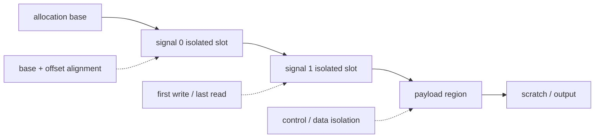

# N1 排障实践：生成器、Buffer 与最小 A/B 审计

> 本文从 exact kernel/通信边界继续向下审计生成物、内存物理布局、dtype、
> padding 和初始化，并规定怎样构造只改变一个变量的 A/B。

## Buffer 物理布局审计图



> slot 大小来自目标平台 descriptor。N1 当前保留值为 512B，但不能把该数值
> 写成所有平台统一的 cache-line correctness 定律。

## 10. 设计和代码审计

### 10.1 generator 与 active builder 不一致

历史 generator 曾把：

```text
完整 count snapshot
inverse_map reconstruction
```

移动到 combine，和正在 device 验证的 active boundary 不一致。

修复要求：

```text
strip active real builder
-> run generator
-> byte compare regenerated source
```

只验证“generator 拒绝覆盖已有 builder”不算 round-trip。

这个问题不是最终 512B A/B 变量，但必须保留修复，否则下一次 regenerate
会重新引入未验证边界。

### 10.2 per-layer distinct buffer

PyPTO 当前依赖模型是 RAW-only v1，依赖 non-aliasing intermediate memory。
本案例审计每层：

```text
attn_sig_buf_Ln
count_done_buf_Ln
data_done_buf_Ln
sh_sig_buf_Ln
combine_done_buf_Ln
send/recv/routed windows
```

要求层后缀唯一，生命周期不重叠复用。该结构被保留，避免把远端尚在访问的窗口
提前复用给下一层。

### 10.3 对齐规则不能混

本案例复核四种不同约束：

```text
storage shape 512B：设计/correctness 不变量
UB Vec row 32B：静态或运行时 correctness 约束
GM<->UB tile 512B：DMA/静态约束
L2 cache line 512B：性能提示，不是 correctness 定律
```

它们作用对象和失败形式不同。

特别是 signal：

```text
logical [8,1] INT32 = 32B
```

逻辑 shape 没错，但物理上 32B signal 可能与相邻 signal/payload 共用 512B line。

### 10.4 dtype、tail、padding 和初始化

保留的正确性约束：

- routed input 在 dispatch 前动态量化为 INT8 + FP32 per-token scale；
- clamp 后中间激活进行第二次 per-token INT8 requant；
- gate/up/down 使用 native INT8 matmul；
- shared expert 保持 BF16；
- `router_bias` BF16-round、EPS=`1e-5`，使用 layer-specific swiglu clamp；
- 不回退 BF16-dequant weights；
- signed `tile_rem` 在转 index 前处理空 tail；
- BATCH=16 中 row1..15 padding 行有定义的初始化和屏蔽；
- communication window 在第一次 notify/wait 前 zero-init；
- routed/gather destination 按协议显式初始化。

这些项不都被证明是 stall 唯一根因，但违反任何一项都可能产生：

```text
错误 offset
提前 wait 通过
永久等待
NaN/越界
507018
数值污染
```

因此不能为了“最小 diff”删除。

### 10.5 片上 memory report

最终 retained build 的报告显示示例：

```text
_dispatch_pull Vec 11.1KB / 184KB
_pull_routed_y Vec 8KB / 184KB
_stage_routed_src Vec 64KB / 184KB
```

这用于排除明显 UB 容量超限，并提供 buffer address/live range。
它不能替代 GM communication window 的 offset/cache-line 审计。

## 11. 最终最小 A/B

### 11.1 A 组风险

逻辑 signal：

```text
[8,1] INT32
8 * 4 = 32B
```

如果物理 allocation 也是 32B，多个 signal 或 signal 与 payload 会紧密排列。
在 512B L2/cache-line 粒度下，它们可能共享同一物理 line。

潜在影响：

- 不同协议的 AtomicAdd/Set 热点共线；
- control plane 与 payload 读写共线；
- 某一 generation 的 wait/notify 受相邻对象影响；
- 问题随层数、allocator offset、调度时序概率出现。

这仍是候选机制，不是自动证明。

### 11.2 B 组只改物理隔离

改动：

```python
COMM_CONTROL_SIGNAL_BYTES = 512
```

保持不变：

```text
logical shape [8,1]
dtype INT32
dispatch/combine 数学
native W8A8
真实 token
完整 42 个 MoE 层
同步 API 语义
```

覆盖：

```text
dense prefix attention/MLP signals
每个 MoE layer 的 attn_sig
count_done
data_done
sh_sig
combine_done
```

生成物审计：

```text
CommBufferSpec = 684
signal/done = 216
216/216 nbytes = 512
all relative offsets %512 = 0
window size = 766525440
window size %512 = 0
```

注意：

```text
size=512B 不够；
(actual_window_base + offset) 也必须 %512==0。
```

本次静态审计证明了 relative offset 和 window size 的 512B 对齐；若 allocator
ABI 没有正式声明 base alignment，还需要逐 rank 记录 actual base。不能用
`window_size%512==0` 单独替代实际地址证明。

### 11.3 为什么该 A/B 有意义

这是最终收敛前最小的 layout 变量：

- 没有换模型；
- 没有缩层；
- 没有换输入；
- 没有回退 dtype；
- 没有重写数学；
- 没有靠 timeout/retry；
- 没有混入另一套 dispatch/combine 组合。

候选 512B 版本应用后，0162 历史随机 stall 收敛为 fresh pool 20/20，这是
强关联证据。发现候选 20-run 与 release smoke source SHA 不同后，继续对
release commit `0e7a0fdd` 重跑 exact-source 20/20，补齐了同一最终源码的
0162 发布证明。由于 matched 32B A 组的 source/build/run 表没有完整归档，
且 0234 项目记录仍有同 commit stall，本文不再称其为严格跨机器单变量证明。
