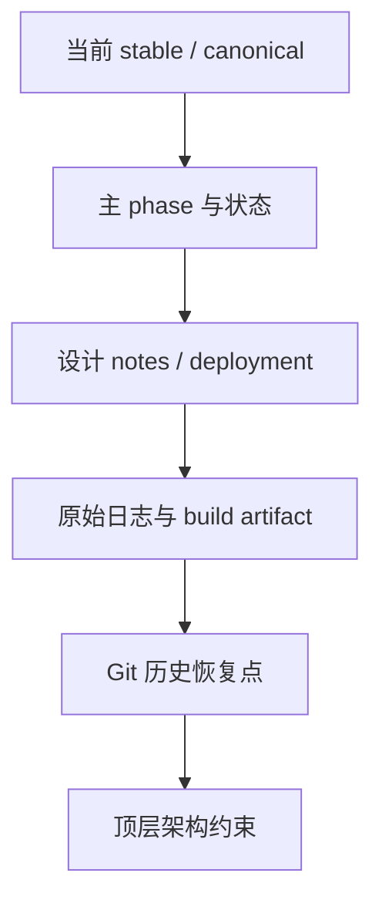

# N1 案例：原始证据索引

> 本文只负责“去哪里找证据”。当前结论先看 [案例入口](n1-case-study.md)，
> 历史过程看 [完整时间线](n1-timeline.md)，排查方法看 [排障实践](n1-debugging-playbook.md)。

## 证据分层图



## 任务到证据的导航表

| 要验证的事实 | 先看 | 再看 |
|---|---|---|
| 当前 0162 single-submit canonical、20/20 | `N1-CANONICAL-TEST.md` | `workspace/logs_n1/single_submit_final_p42_repeat20_20260718_105051/` |
| 当前 0162 stable pins / clean scope | `N1-STABLE-ENV-0162-20260717.md` §1.0 | pypto `e49ce111` + pypto-lib `369e8f91` |
| latest MTP3 的 synthetic 64K resident NPU timing（历史 non-canonical） | `N1-STABLE-ENV-0162-20260717.md` §11 | `workspace/logs_n1/synth64k_resident_20260717/` |
| 某个 stall 是否真的发生在 kernel | [stall 定位入口](n1-stall-localization.md) | 同轮 run 目录、TASK/CLUSTER 和 build |
| 512B isolation 的因果边界 | [关键因果链](n1-causal-chains.md) | `notes/09-cache-line-and-signal-isolation.md` |
| 新项目如何启动 | [项目准入入口](n1-project-admission.md) | Gate 0～10 与 Day 0 模板 |

## 17. 原始证据索引

以下索引按“先看当前事实、再看过程、最后看架构约束”的顺序排列。旧的
`NEXT-SESSION-N-1.md` 已经清理了 active prompt；需要恢复被删除的阶段记录时，
应从 Git history 按提交读取，而不是把历史快照当作当前状态。

### 17.1 当前 stable / canonical

- [`N1-CANONICAL-TEST.md`](../../../../N1-CANONICAL-TEST.md)：唯一 standalone canonical 命令、完整 42 个 MoE 层、
  fresh exporter、20-run gate、dmesg 窗口和三仓复现边界。
- [`N1-STABLE-ENV-0162-20260717.md`](../../../../develop/N1/N1-STABLE-ENV-0162-20260717.md)：0162 stable
  SSOT，源码/runtime pin、clean-pin smoke、实际 layout 和未覆盖范围。
- [`N1-NEXT-SESSION-HANDOFF-20260715.md`](../../../../develop/N1/N1-NEXT-SESSION-HANDOFF-20260715.md)：
  final pull+pull boundary、512B isolation、20/20 与因果措辞。
- [`N1-W8A8-ROUTED-BOUNDARY-DESIGN-20260716.md`](../../../../develop/N1/N1-W8A8-ROUTED-BOUNDARY-DESIGN-20260716.md)：
  attention→dispatch→expert→combine 的 native W8A8 layer contract。

### 17.2 主过程记录

- [`phases/27-n1-whole-net-fusion.md`](../../../../phases/27-n1-whole-net-fusion.md)：从全网 compile、
  runtime/SDMA、comm-window alias、IPC bring-up 到最终 release 的主 phase 记录。
- [`STATUS.md`](../../../../STATUS.md)：跨 phase 的状态变化、0162/0234 scope 和 live blocker。
- [`blockers.md`](../../../../blockers.md)：N1-S-0162、N1-S-0234、Phase 28 live blocker 及历史纠正。
- [`notes/08-integration-churn-postmortem.md`](../../../../notes/08-integration-churn-postmortem.md)：
  为什么“ready”会被更强验证推翻，以及如何建立证伪优先的流程。
- [`notes/09-cache-line-and-signal-isolation.md`](../../../../notes/09-cache-line-and-signal-isolation.md)：
  signal 物理隔离、512B line、base/offset 约束的设计背景。

### 17.3 早期 blocker 和部署背景

- [`archive/prototype-phase-01-19-summary.md`](../../../../archive/prototype-phase-01-19-summary.md)：Phase 15/16/19 的
  单卡、多卡 capability、MoE 早期 507018 和 stale-pyc 经验。
- [`archive/milestones-2026-Q2.md`](../../../../archive/milestones-2026-Q2.md)：按日期压缩的项目主时间线，
  包含 07-04～07-17 的关键里程碑。
- [`deployment/phase16-three-pillars.md`](../../../../deployment/phase16-three-pillars.md)：driver/firmware/CANN
  三件套和 IPC capability 约束。
- [`deployment/troubleshooting-multirank-507899.md`](../../../../deployment/troubleshooting-multirank-507899.md)：
  507899、507018、stale runtime 和 SDMA workspace 的区分。
- [`deployment/troubleshooting-moe-block-8card-gate-topk.md`](../../../../deployment/troubleshooting-moe-block-8card-gate-topk.md)：
  gate_topk 的 V0 TASK→kernel→mrgsort 修复链。
- [`deployment/moe-block-nextwork-and-constraints.md`](../../../../deployment/moe-block-nextwork-and-constraints.md)：
  native W8A8、DeepSeek 对齐、不得绕过 gate 和测试纪律。

### 17.4 Git 历史恢复点

以下提交是恢复 07-12～07-16 过程记录的主要锚点；读取时使用：

```bash
git show <commit>:NEXT-SESSION-N-1.md
git show <commit> -- NEXT-SESSION-N-1.md STATUS.md phases/27-n1-whole-net-fusion.md
```

| 提交 | 过程节点 | 本案例使用的证据 |
|---|---|---|
| `6f5256d` | M3 Out writeback 与初始幅值误诊 | 未初始化 handoff、NaN→finite 的边界 |
| `c28b7ac` | 跨 orchestration / FUSE 假设 | 三个 ordering 修法和错误方向 |
| `3f63429` | FUSE 复诊与 generator truncation | 诊断旋钮不可直接信任 |
| `7f7a144` | op-level dump | `local_routed_y` 首先爆炸，定位 native W8A8 漂移 |
| `d628b89` | A1/A2 中间判断 | pool-byte 假设及后续证伪入口 |
| `af794a6` | L2 index 精度 bug | dense golden L2 cos=0.931→0.999999 |
| `b20cda2` | 首次 token 303 | 一次正确不等于稳定 |
| `653bb0f` | completion-wave 过早闭环 | 3/3 与 7-run 结论的历史状态 |
| `b08f6ae` / `28a6ef3` | combine/vector diff | 残余数值抖动的历史定位 |
| `18ce42b` | clean-tree 复验 | STALL/CLEAN/STALL 推翻 A2 已修 |
| `4d2fc42` | push/pull exact TASK 线 | 10× timeout、pull wiring、kernel mapping 纠正 |
| `80a8ce3` | 0162 二次复现 | push+push 6 次 2 clean/4 stall |
| `2e46485` | 512B isolation 与 release | final pull+pull、20/20、因果边界 |
| `8bbb9cc` / `0ef0109` | stable manifest formalize | release manifest 和 clean environment scope |

### 17.5 顶层设计约束

设计或复查 buffer、通信和层间边界时，优先读取：

```text
/data/chensiyu/hw_project/pypto/pypto_top_level_documents/
  pypto-runtime-arch-docs/02-logical-view/04-memory.md
  pypto-runtime-arch-docs/02-logical-view/05-machine-level-registry.md
  pypto-runtime-arch-docs/02-logical-view/07-task-model.md
  pypto-runtime-arch-docs/02-logical-view/08-communication.md
  pypto-runtime-arch-docs/02-logical-view/11-machine-memory-model.md
  pypto-runtime-arch-docs/02-logical-view/12-dependency-model.md
  pypto-runtime-arch-docs/08-design-decisions.md
  tensor_layout.md
  tensor_valid_shape.md
  tpush_tpop_isa_design_v3.md
```

本案例文档总结的是项目实际排障证据；若与顶层约束发生冲突，应先停止局部
修补，回到顶层设计文档确认语义和适用范围。
