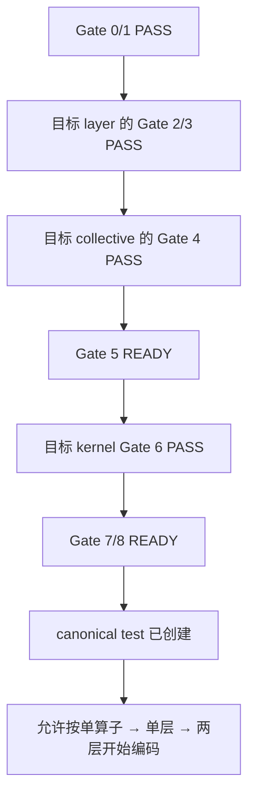

# N1 案例：整网项目启动准入标准导航

> 新项目先读本页，再按当前阶段只加载对应 Gate。当前 N1 的单 `@pl.program`
> 约束是既定架构，任何通用模板都不能重新打开多程序绕过路径。

## Gate 总览图

```mermaid
flowchart LR
    G0["Gate 0<br/>项目定义"] --> G1["Gate 1<br/>拓扑 / layer index"]
    G1 --> G2["Gate 2<br/>每层接口合同"]
    G2 --> G3["Gate 3<br/>buffer / 对齐"]
    G3 --> G4["Gate 4<br/>通信状态机"]
    G4 --> G5["Gate 5<br/>W8A8 数值合同"]
    G5 --> G6["Gate 6<br/>kernel / 片上预算"]
    G6 --> G7["Gate 7<br/>generator"]
    G7 --> G8["Gate 8<br/>可观测性"]
    G8 --> G9["Gate 9<br/>验证梯度"]
    G9 --> G10["Gate 10<br/>release manifest"]
```



## 按需阅读

| 阶段 | 文档 |
|---|---|
| 项目定义、program/layer/index、每层接口、buffer、通信、native W8A8 | [设计准入 Gate 0～5](n1-design-admission-gates.md) |
| kernel、generator、可观测性、验证梯度、release manifest、Agent 汇报与 NO-GO | [实现与发布 Gate 6～10](n1-implementation-release-gates.md) |
| 新项目直接复制的设计模板、案例问题映射和正式编码条件 | [Day 0 模板](n1-project-day0-template.md) |

## 启动准入一页表

| Gate | 进入前必须有 | 失败时回退到 |
|---|---|---|
| 0 | canonical object、目标机器、golden、稳定性门槛 | 项目定义 |
| 1 | 拓扑图、layer/index 表、已批准 program 边界 | 架构设计 |
| 2 | 输入/输出、owner、valid shape、last reader | layer contract |
| 3 | buffer ledger、实际地址检查、HBM/片上预算 | 内存设计 |
| 4 | publish→fence→notify→wait→load 状态机 | 通信设计 |
| 5 | native W8A8 逐算子/逐层 golden | 数值合同 |
| 6 | kernel design card、tile 和 UB/L0 budget | kernel 设计 |
| 7 | generator→generated source→binary 链条 | codegen |
| 8 | all-rank 日志、TASK、dmesg 增量、phase marker | 可观测性 |
| 9 | Level 0～9 的对象和不能证明项 | canonical test |
| 10 | 多仓/binary/toolchain/checkpoint 完整清单 | release manifest |

## 总原则

本节不是对本案例的又一次时间线复述，而是把本次长期排障暴露的问题转换成
下一项目可以直接执行的开发门禁。目标不是承诺“以后绝不会有 bug”，而是：

```text
让架构错误在设计评审阶段暴露；
让 shape、dtype、索引和 buffer 错误在单层/两层阶段暴露；
让通信协议错误在最小跨 rank 对照中暴露；
让生成器漂移在提交前暴露；
让精度错误在逐算子/逐层阶段暴露；
让概率性卡死在完整正式对象的重复测试中暴露；
不要等到完整整网随机卡死后，才从 507018 重新猜根因。
```

这里定义的是**面向后续整网项目的增强标准**。它比本案例早期实际执行的流程
更严格，例如要求最终 clean manifest 也完成重复正式测试；这不追溯改写本案例
已有证据，只用于避免下一项目重复同类弯路。

本节中的术语分工如下，后文不能混用：

- **Gate（准入门）**：设计、实现或发布能否进入下一阶段的检查点；
- **Level（验证级别）**：从静态审计到完整发布对象重复测试的测试梯度；
- **SSOT（Single Source of Truth，唯一事实源）**：同一类当前决策只能有一份
  active 文档，旧结论只能作为历史证据，不能继续充当执行入口；
- **manifest（复现清单）**：源码、二进制、工具链、模型、机器、环境和命令的
  完整绑定，详细解释见 §1.2。

本节后续使用的硬件/编译缩写统一解释为：GM（Global Memory，设备全局内存）、
UB（Unified Buffer，向量核片上统一缓存）、HBM（High Bandwidth Memory，
设备高带宽显存）、L0A/L0B/L0C（矩阵核的片上输入/累加缓存）、DMA（Direct
Memory Access，直接内存访问）、ISA（Instruction Set Architecture，指令集
架构）、ABI（Application Binary Interface，二进制接口）和 DAG（Directed
Acyclic Graph，有向无环依赖图）。CANN 指 Ascend 软件栈，PTOAS 指本项目设备
代码使用的编译工具链；不要只写缩写而不记录具体版本。

还必须区分“通用项目模板”和“当前项目既定架构”。模板允许记录一个项目已经
批准的 program 边界，但不赋予 Agent 重新选择架构的权限。对本 N1 项目，
**N=1 单个 `@pl.program` 是唯一生产形态，多程序永久排除**；后续 Agent 不得把
多程序、逐层 host launch 或 resident tensor 串联重新作为卡死绕过方案。

## 进入正式编码的最短判定


