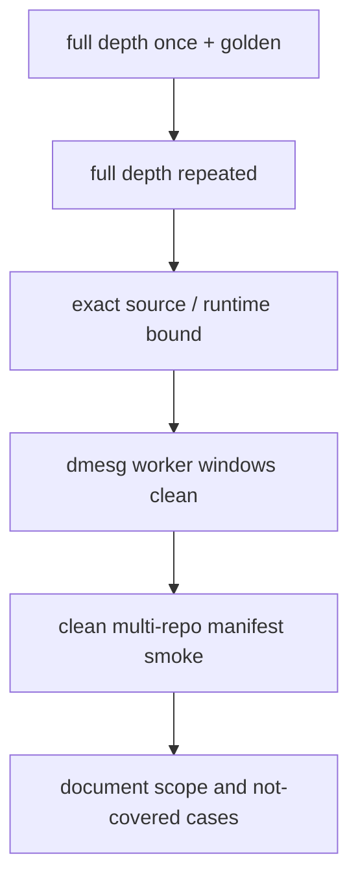

# N1 排障实践：发布验证、因果边界与设计经验

> 本文规定稳定性与精度如何同时准出，怎样区分 exact-source 20/20 和 clean-pin
> smoke，以及哪些结构性修复必须保留、哪些结论不能过度外推。不能把一次
> smoke 写成 20/20；相关性不能称为唯一根因。

## 发布证据层级



## 12. 完整准出验证

### 12.1 最终代码

```text
repo = csy0225/pypto-lib
branch = feat/whole-net-n1-fusion
commit = 0e7a0fddc90c4f2348f1d59e015fb817a0877a02
```

pypto-lib 发布文件：

```text
models/step3p5/decode_layer.py
models/step3p5/moe.py
tools/step3p5/_gen_faithful_real.py
```

后续审计确认 canonical IPC worker 还实际依赖：

```text
pypto n1fusion-base e277de9f
simpler n1fusion-base 36957c6b
```

其中 pypto 提供 stacked weight per-layer sub-view 和
`DistributedWorker.import_ipc_all`，simpler 在 forked chip child ACL context
中执行 IPC import。只拉 pypto-lib 不构成完整复现。

历史 exact-source 20-run 的模型文件来自 `pypto-lib 0e7a0fdd`，但当时
pypto/simpler 的相关 runtime 支持仍是旧 HEAD 上的 dirty source：

```text
pypto HEAD 5e619dc7 + dirty runtime support
simpler HEAD 98ce22a6 + dirty child IPC import
```

因此不能声称 20-run 直接运行在新的 clean pins 上。`e277de9f/36957c6b`
formalize 了相关运行支持，并由下面的 clean-pin smoke 单独验证；该 smoke
不把新提交追溯成旧 20-run 的 byte-identical runtime。

### 12.2 release exact-source 20-run

日志：

```text
/data/chensiyu/hw_project/pypto/workspace/logs_n1/signal512/
signal512_p42_20_20260717_001135
```

结果：

```text
pass=20/20
each rc=0
each argmax=303
TOP5=[303, 9592, 768, 1043, 410]
runtime min/mean/max=2.50/2.5605/2.62s
```

20 次数值指纹一致：

```text
max|next_hidden|=264192.0000
row0|next_hidden|=588.0000
max|h_mid|=294.0000
max|logits|=14.0506
```

源码 SHA 与 release commit 一致：

```text
decode_layer.py          9b6c83ca915ca9fcb5b02223e1a733c1c28fabca45dec6019b3b41a5f3fd7d5d
moe.py                   8a3670a047aff5b5af5d352446d8a35c866708f0eccba2b70904ad18896d5a2a
_gen_faithful_real.py    bf65295b2167bd96516e8ef2cebd97b69ebc7d46a86e13d304180ebf6a514010
```

### 12.3 整理后 smoke

```text
signal512_final_smoke_20260716_230225
release commit = 0e7a0fddc90c4f2348f1d59e015fb817a0877a02
source SHA（日志中的三文件）：
decode_layer.py  9b6c83ca...
moe.py           8a3670a04...
_gen_faithful_real.py  bf65295b...
CANONICAL_RC=0
RUN done 2.57s
argmax=303
FINAL_SMOKE=PASS
```

20 个逐 worker-run 窗口和 smoke worker-run 窗口均无新增：

```text
devmm/page fault
illegal VA/instruction
DMA/UB fault
507018
running-stalled
stranded CQE
```

20-run 的 outer dmesg 窗口包含 exporter pool teardown；该阶段新增 2 条
`stranded cqe`。它们不在任一 worker-run 窗口内，所以不能归因于 whole-net
worker kernel，也不能被删除或笼统写成“整个生命周期 dmesg 完全 clean”。

### 12.4 最终三仓 clean-pin smoke

```text
log =
  /data/chensiyu/hw_project/pypto/workspace/logs_n1/release_manifest/
  final_stack_smoke_20260717_015635

pypto-lib = 0e7a0fddc90c4f2348f1d59e015fb817a0877a02
pypto     = e277de9f2a55a686956d66933301204520bd7374
simpler   = 36957c6b56700ecba3aeb8dbbedd6240594e01de
```

目录时间戳来自 0162 机器时钟。结果：

```text
完整 42 个 MoE 层 / pull+pull / token 6127 / native W8A8 IPC / KV IPC
rc=0
RUN done 2.58s
argmax=303
TOP5=[303, 9592, 768, 1043, 410]
worker-window added relevant dmesg=0
```

outer 窗口在 exporter teardown 后新增 1 条 dev14 `stranded cqe`，不在
worker 执行窗口内。相关 runtime focused tests 为 `127 passed`。

runtime binary SHA256：

```text
libhost_runtime.so
  7b29004b9d047d550ee6689120be83e650a3bcf39b196fd0ea112a3c6271891a
libaicpu_kernel.so
  62b8c2430abc9cafe257b758148c22fc1ab6da1085b0a103ae7bc465c57ca390
libsimpler_aicpu_dispatcher.so
  1b4b8467f0c899af64ebcd2f0a98e83b89160dca32177d0baecebddd3be4f973
_task_interface.cpython-311-x86_64-linux-gnu.so
  318510dfc2a55b27749609fd56850657b77691bc4078d6a7064f6451076f2c53
```

## 13. 保留项与因果边界

### 13.1 应保留的结构性修改

以下修改继续保留：

- fixed-slot pull dispatch；
- dispatch 边界生成 `recv_counts + inverse_map`；
- combine 直接消费该 `inverse_map`；
- self local load、peer remote load；
- per-layer distinct communication buffers；
- signal whole-window zero-init；
- signed tail；
- native INT8 gate/up/down；
- generator 真实 round-trip；
- control signals 512B aligned physical isolation。

原因分三类：

1. **0162 上与 stall 消失强关联的变量**：512B signal isolation；
2. **架构/边界正确性**：inverse_map 所属边界、self/peer 路径、buffer lifetime；
3. **精度/可生成性正确性**：native W8A8、signed tail、generator 一致。

不能把第 2/3 类都包装成“stall root cause”，但也不能删除它们。

### 13.2 可以写和不能写

可以写：

> 在 0162 上，512B signal isolation 是最终最小 layout 变量，并与随机 stall
> 消失强关联；release commit `0e7a0fdd` 已完成 exact-source 20/20。
> worker-run dmesg 窗口与 exporter teardown outer 窗口分别归档。
> 现有材料未证明其为跨机器充分条件或唯一根因。

不能写：

> 已在硬件层证明某个具体 signal bit 丢失。

不能写：

> PUSH/TPUT 或某一个 PC 指令是唯一根因。

不能写：

> 因为某次 rank 停在 `_pull_routed_y`，所有失败都固定发生在那里。

## 14. 设计阶段如何提前避免

### 14.1 在设计评审中提交 buffer ledger

每个 layer/collective 在编码前写清：

```text
logical shape / valid_shape / dtype
physical bytes / alignment
producer / consumer
self/peer access
notify/wait generation
initial value
first use / last use
是否与相邻 payload 共 cache line
是否跨层复用
```

如果当初明确区分：

```text
logical signal bytes != physical isolation bytes
```

32B control signal 共线风险可以在编码前暴露。

### 14.2 把 control plane 和 data plane 分开

设计上要求：

- signal 不与大 payload 共 512B line；
- 不同协议的 atomic counter 不共 line；
- 每层 signal 独立；
- generation 明确，不依赖历史残值；
- whole-window init 和 logical init 均有责任方。

### 14.3 把 layer boundary 当作接口

以 dispatch 为例，接口输出应明确：

```text
recv_x
recv_scale
recv_counts
local expert offsets
inverse_map
completion generation
```

combine 只能消费这些接口输出，不应重新读取分布式状态推导另一套映射。

### 14.4 设计时同时覆盖 batch/pad/dtype

至少列出：

```text
single active row + padded rows
multi-batch
empty tail
full tile / partial tile
self route / peer route
INT8 payload + FP32 scale
padding 行是否进入 route/reduction
```

若未定义，运行时可能表现为数值错、NaN、越界或 stall，且容易被误归因给 scheduler。

### 14.5 让生成物成为评审对象

源码正确不等于 codegen 后正确。设计 gate 应包含：

- exact `kernel_config.py`；
- orchestration task 顺序；
- dependency dump；
- memory report；
- physical window offset；
- generator round-trip；
- final kernel source 中真实 fence/notify/load/store。

## 16. 可复用排查清单

遇到新的整网 hang，按顺序回答：

1. 失败是否发生在 `rt.run` 内？
2. exact source、build、环境、输入是否冻结？
3. `507018` 下的真实 orch/sched code 是什么？
4. 属于 S1/S3/S4/S5 哪类？
5. `TASK` 中的 kernel id 是什么？
6. 是否使用同轮 exact `kernel_config.py`？
7. `COND=ack` 还是 `fin ANOMALY`？
8. 是否存在真实 AICore PC？若无，是否诚实停在 kernel 级？
9. 所有 rank 的最早阻塞边界是什么？
10. 上一个 publish/fence/notify 与当前 wait/load 是否配对？
11. control signal 的 physical isolation 是否满足平台 allocator/coherency ABI？
    N1 当前保留值为 512B；actual `(base+offset)` 是否对齐？
12. storage/UB/GM-L2 四类对齐是否分别检查？
13. buffer 是否跨层别名或提前复用？
14. dtype、tail、padding、batch、初始化是否有定义？
15. 只执行 1 个或 20 个 MoE 层的测试是否仅用于诊断，并最终回到完整的
    canonical 对象？
16. A/B 是否只改一个变量？
17. 最终是否同时通过稳定性、精度、dmesg delta 和 generator gate？
