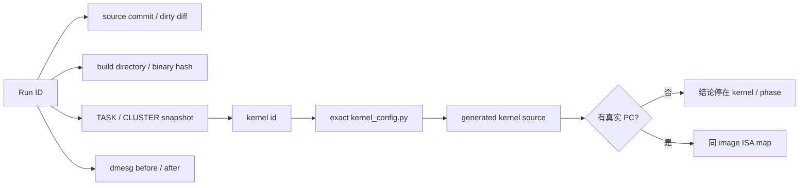

# N1 排障实践：从失败阶段定位到 exact kernel 和跨 rank 边界

> 使用顺序：固定对象 → 分类失败阶段 → 读取 TASK/CLUSTER → 同轮映射 kernel →
> 判断是否存在真实 PC → 跨 rank 找最早失去 forward progress 的边界。

## 证据强度阶梯

| 证据 | 能证明 | 不能证明 |
|---|---|---|
| host `507018` | 本轮失败 | deadlock、OOM 或具体 kernel |
| S1 running-stalled | 已有 RUNNING task 长时间不完成 | 具体 func_id |
| 同轮 TASK/CLUSTER | task、core、fanin、kernel id | kernel 内具体指令 |
| exact `kernel_config.py` | func_id 对应生成 kernel | 跨 rank 最早阻塞者 |
| all-rank 同轮快照 | 通信边界的 producer/consumer 关系 | 无 PC 时的唯一 ISA 根因 |
| 真实 PC + 同 image map | 当前指令位置 | 协议为何进入该状态仍需反推 |

## 同轮证据绑定图



## 5. 固定被测对象

### 5.1 为什么先冻结 canonical

历史上曾出现：

- push+push、pull+push、pull+pull 交替；
- 只执行 1 个、20 个或完整 42 个 MoE 层的对象交替；
- 只检查 `RUN_CLEAN`；
- clean run 得到 303，但另一轮 stall；
- generator 与 active builder 不一致；
- exporter、设备残留、日志目录混用。

如果不冻结对象，任何“修好了”都可能只是换了问题。

本案例最终把以下口径焊死：

```text
真实 token 6127
BATCH=16，只有 row0 有效，row1..15 为 padding
真 native W8A8 权重，不允许 BF16-dequant fallback
真 KV IPC
完整执行 42 个 MoE 层
argmax(full_logits) == 303
同一份 final source 连续 20 次
```

### 5.2 “老基线 303”到底表示什么

历史 clean run 的确多次得到 `argmax=303`。这证明：

```text
在某些时序下，数学路径、权重和主要边界可以得到正确 token
```

它不证明：

```text
该版本稳定
该通信协议无 race
某个历史补丁已经修复 stall
```

因此 303 是精度 golden，不是“概率 clean 版本”的稳定性基线。
## 6. 症状与第一性分类

### 6.1 历史跨机器症状线索（非 exact-object reproduction）

历史记录先在 0234 的 push+push 路径观察到随机 stall，之后在 0162 的后续
固定对象上复现同类症状。由于两轮协议、源码/build 和 runtime manifest
没有完整绑定，这不是严格的同一测试对象跨机器复现。
0162 的六次历史运行中：

```text
2 次 clean
4 次 stall
clean run argmax=303
```

这些记录只能排除“症状一定只在 0234 单机硬件上发生”的过早判断，并建立：

```text
精度可以正确
稳定性仍不正确
```

### 6.2 不能从 507018 直接定性

典型 host 行：

```text
PTO2 scheduler timeout sub_class=S1:running-stalled
completed=39/109
running=1 ready=0 waiting=1
orch_done=0
stuck_task_id=4294967319
stuck_core=26
```

`507018` 只是外层错误。真正有用的是：

```text
sched_error_code=100
sub_class=S1
RUNNING=1
READY=0
WAITING=1
```

因此分类为：

```text
无进展快照中至少存在一个已分配到 core 的 RUNNING task；
该 task 在采样时尚未完成。
```

不是：

```text
READY 无法派发（S3）
只有 dependency WAIT（S4）
orchestrator 不提交（S5）
```

`WAITING=1` 只证明快照中存在 WAIT task；它是否直接依赖该 RUNNING task，
必须由同轮 dependency dump 证明。

历史上调大 ring heap、task window、dep pool 没有建立修复，且没有对应容量 detector
作为直接证据，所以“容量耗尽”被降级。

### 6.3 timeout 只用于区分 slow 与 hang

曾把 scheduler/op/stream timeout 抬高约 10 倍。失败运行仍耗完整 op 预算后不完成。

该实验支持：

```text
不是多等几分钟就能完成的普通慢 kernel
```

但它不提供修复，也不告诉我们卡在哪个子操作。

### 6.4 dmesg 使用 before/after

每轮保存：

```bash
dmesg -T > dmesg.before.txt
# run
dmesg -T > dmesg.after.txt
diff -u dmesg.before.txt dmesg.after.txt
```

重点检查：

```text
devmm/page fault
illegal VA/instruction
DMA/UB fault
507018
running-stalled
stranded CQE
```

案例中的一个重要经验：

- 旧的 `devmm_ioctl_ipc_mem_query` 行在 before/after 中都存在；
- 它不是当前 run 新增证据；
- release exact-source 20-run 的 20 个逐 worker-run 窗口与 smoke worker-run
  窗口没有新增相关 fault；
- 20-run 完成后关闭 fresh exporter pool，outer 窗口新增 2 条
  `stranded cqe`，发生在 dev8/dev11 exporter teardown，不在任何 worker-run
  窗口内。

只 grep 全局 dmesg 会把旧错误误归因给当前运行。
## 7. 从 task 到 exact kernel

### 7.1 第一个关键纠错：task id 不是 func id

典型：

```text
stuck_task_id=4294967319
```

解码：

```text
4294967319 = 0x100000017
ring_id = 1
local_task_id = 23
```

早期曾把 local task 23 直接映射成 kernel 23。这是错误的。

历史 handoff 曾记录同轮 device `TASK`：

```text
TASK ... task_id=4294967319 state=RUNNING ...
kernels=[aic:-1 aiv0:28 aiv1:-1]
```

真正需要查的是 `func_id=28`。但本次 Skill 审计没有重新取得该次失败 run 的
完整 TASK source、exact build hash 与 config hash，所以该映射在本文只作为
历史定位线索；新案例必须按 run/rank/snapshot 表格重新绑定，不能直接复用。

### 7.2 第二个关键纠错：不能按完成比例猜 kernel

早期一次 build 被清理后，只看到：

```text
completed=78/81
```

曾据此猜“已经接近末尾，所以 func36 应是 combine push”。后续保留 exact build，
读取：

```text
build_output/<exact-build>/next_levels/full_moe_chip_orch/kernel_config.py
```

历史记录给出的映射为：

```text
func 28 = _dispatch_pull
func 29 = _dispatch_stage
func 36 = _stage_routed_src
func 37 = _pull_routed_y
func 38 = moe_combine / weighted gather
func 39 = moe_residual_add
```

这推翻了按“位置接近末尾”做的映射。由于本次审计未重新绑定到原始 exact
build，后续 agent 应在新失败 run 中重新读取同轮 `kernel_config.py`，不要把
此表视为当前 0234 stall 的已验证映射。

### 7.3 从 kernel_config 继续到生成源码

映射链：

```text
TASK kernels=[aiv0:37]
-> kernel_config.py func_id 37
-> _pull_routed_y
-> kernels/aiv/_pull_routed_y.cpp
-> orchestration/full_moe_chip_orch.cpp 中对应 task
-> dependency dump 中 producer/consumer
```

保留的生成物包括：

```text
orchestration/host_orch.py
next_levels/<orch>/kernel_config.py
next_levels/<orch>/orchestration/<orch>.cpp
next_levels/<orch>/kernels/{aic,aiv}/*.cpp
passes_dump/36_after_AutoDeriveTaskDependencies.py
report/memory_after_AllocateMemoryAddr.txt
report/perf_hints.log
```

### 7.4 本案例的 PC 边界

普通 scheduler stall 日志可能提供：

```text
task / kernel / core
COND=ack 或 fin
```

但保存的 N1 失败日志没有可用的：

```text
AICore current_pc
error_pc
kernel_start_pc
```

保存的 N1 失败材料足以支持的方法边界是：

```text
exact kernel + 跨 rank 通信边界
```

没有声称定位到某条机器指令。

如果当时存在真实 PC，正确下一步应为：

```text
pc_offset = error_pc - kernel_start_pc
```

再用同一 binary 的 CCE/PTOAS map 定位，并检查该指令之前的 publish/notify/wait
配对操作。没有 PC 时只能通过 phase marker 或 kernel split 继续二分。
## 8. 跨 rank 还原通信边界

### 8.1 不同 rank 停在不同深度

历史 handoff 曾报告：

```text
rank 8–14: _pull_routed_y
rank 15:   _dispatch_pull
```

其他 run 中也报告过 28/29/37/38/39 的组合。本次审计没有重新取得逐 rank
原始 TASK 行和 exact build 绑定，所以这些记录用于说明“跨 rank 反推最早
边界”的方法，不作为当前 0234 stall 的固定挂点。

这说明：

- 不能写成“所有 rank 都固定挂在 routed_h_quant”；
- 下游 combine/residual 可能只是处于更深的流水位置；
- 应寻找最早未完成的跨 rank generation，而不是多数 rank 的最后一个函数。

### 8.2 dispatch 边界审计

最终边界：

```text
pack_publish
-> dispatch_pull
-> dispatch_stage
```

审计内容：

- source 按固定 slot 发布 payload；
- receiver 拉完整 count snapshot；
- receiver 生成 `recv_counts` 和 local expert offset/count；
- 同一 dispatch 边界生成 source-local `inverse_map`；
- self payload 用 local load；
- peer payload 用 remote load；
- `count_done` / `data_done` generation、初始化和 expected 一致。

### 8.3 combine 边界审计

最终边界：

```text
stage_routed_src
-> pull_routed_y(inverse_map)
-> weighted_gather
-> residual
```

关键约束：

- combine 直接消费 dispatch 产生的 `inverse_map`；
- 不在 combine 重新读取 distributed count matrix 构建另一份映射；
- self routed row 使用 local load；
- peer routed row 使用 remote load；
- 每层拥有 distinct routed/signal buffer。

### 8.4 为什么要看“上一对操作”

若快照停在 wait 或 remote load，真正错误可能在前一对 producer 操作：

```text
producer 没写完 payload
producer fence 未覆盖对应 pipe
producer notify generation 错
consumer expected 继承旧值
consumer offset 来自另一份 count snapshot
```

因此 kernel 名只是入口，边界上的 producer/consumer 配对才是检查单元。
## 9. 历史方向纠正

### 9.1 push/TPUT 不是最终唯一根因结论

历史上 push+push 的挂率较高，dispatch pull 一度降低挂率，因此
“跨 die push 脆弱”有实验线索。但后续：

- pull+pull 也会 stall；
- 停留位置跨 dispatch/combine 漂移；
- 最终最小 A/B 是 signal physical isolation；
- 没有 PC 或 bit-level trace 证明某个 TPUT 唯一失败。

所以最终文档只保留：

```text
push/pull 改造是边界设计和实验过程的一部分；
不能写成 PUSH/TPUT 已被硬件层证明为唯一根因。
```

### 9.2 少量 MoE 层不能替代完整深度

只执行 1 个或 20 个 MoE 层的对象，曾用于快速判断：

- 单层代码是否必现；
- 深度是否影响概率；
- 某个边界是否能跑。

但 N1 发布问题是完整执行 42 个 MoE 层。中间层数可能改变：

- 通信 generation 数量；
- buffer 布局；
- allocator offset；
- 调度重叠；
- stall 概率。

最终直接使用完整执行 42 个 MoE 层做决定性 A/B 和 20-run release。任何只执行
20 个 MoE 层时的“wrong/clean”都不再承担最终结论。

### 9.3 completion-wave、串行调度和增大 timeout

这些实验能排除或分类部分假设，但都没有成为最终最小修复：

- completion-wave：可修独立协议缺陷，但不能解释所有残余随机 stall；
- serial orchestrator gate：device 仍可 stall；
- 增大 timeout：只证明非普通慢；
- retry：只能掩盖概率问题。

### 9.4 exporter/compile 失败不是 kernel stall

曾出现 checkpoint 路径、stale exporter、COMMINIT 等问题。只有到达：

```text
built args
rt.run
device scheduler snapshot
```

后，才能归入本案例的 kernel stall。阶段必须在日志中明确标记。
