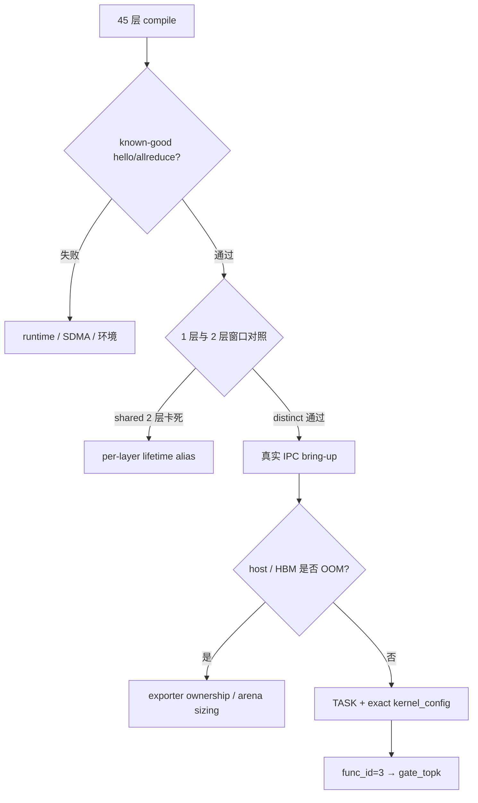

# N1 主线：单程序集成 Bring-up（2026-07-10～2026-07-12）

> 本文覆盖 45 层单 `@pl.program` 编译成功以后，依次暴露的 runtime/SDMA、
> per-layer communication-window alias、真实 IPC、host/HBM OOM 和 exact
> `gate_topk` blocker。

## Blocker 分层图



## 4.6 2026-07-10：N1 编译成功后，连续解开环境和 deterministic alias 两个 blocker

### 45 层单 program compile milestone

`WholeDecodeNetwork`、`WholeDecodeFaithful` 等全 45 层结构先后 compile clean。
**可证明的范围**是前端能够展开 45 层、链接 method，并生成大规模 host
orchestration；**不可证明的范围**包括 device task 是否真正派发、跨 rank
协议是否前进、权重是否正确，以及完整 42 个 MoE 层的精度。后续 507899、
两层 shared-window 别名和 S1 卡死，正是这些更高验证阶段才暴露的问题。

### 507899 曾被误判为 0234 node poison

首次 canonical TP=8 device run 在 comm-domain allocation 报 507899。由于连
known-good allreduce 也失败，当时一度判断节点 IPC poison，并尝试 reboot。

**为什么这个假设当时合理但不充分。** model run 和 known-good allreduce
同时失败，确实把嫌疑从模型源码移到共享环境；但“共享环境”仍包含硬件、driver、
runtime `.so` 和 SDMA workspace 配置，不能直接跳到“节点硬件 poison”。

**决定性实验。** reboot 无效；随后 clean rebuild runtime、关闭 SDMA workspace，
得到：

1. 单卡 hello 507018：stale/mismatched runtime `.so`；
2. 多卡 507899：升级栈把 `SIMPLER_ENABLE_PTO_SDMA_WORKSPACE` force-on。

clean rebuild runtime，并关闭 SDMA workspace 后：

```text
single-card hello PASS
multi-card allreduce PASS
whole-net comm domain allocation PASS
```

因此 **[后续证伪]** “0234 节点硬件 poison”不是已证实根因；恢复来自可重复的
软件栈/config 改变。clean runtime 和 SDMA-OFF 是该环境阶段的必要修复，但不能
解释后续已经进入 whole-net mid-run 的 scheduler timeout。

### dispatch clean 后出现 mid-run scheduler timeout

device 真正执行后，只执行 1 个 MoE 层可以完成，执行 2 个 MoE 层则卡死。
按层数截断的对照实验和本次生成的 `host_orch.py` 显示：

```text
layer 3 chip_orch
layer 4 chip_orch
```

复用了同一个 `combine_done_buf`、recv/pub/routed/signal SSA。N1 单 program
把多个 layer 放在同一 orchestration 中，而依赖模型是 RAW-only v1；远端访问
尚未结束时复用同一个 communication window，违反 non-aliasing。

**[直接证实]**

```text
2 个 MoE 层复用一套通信窗口       -> 确定性卡死
2 个 MoE 层各用独立通信窗口       -> 运行完成
完整 42 个 MoE 层各用独立通信窗口 -> 运行完成
```

因此：

```text
07-10 comm-window alias
```

是已解决的 deterministic architecture bug，但它不等于 07-16 的 probabilistic
signal-layout stall。

### 同期确认三类 layer index 不能混用

模型里至少有三种索引空间：

```text
norm absolute layer index
attention type-local index
dense/MoE local weight index
```

把它们压成一个 `layer_idx` 会导致合法 shape 下读错层。后来的 dense L2 精度
问题正是这一类边界错误的具体实例。
## 4.7 2026-07-11：真实权重 IPC bring-up 逐层暴露 host、runtime 和 device blocker

### self-load 先在 host 侧 OOM

把 8 rank 全部权重 stack 到一个 driver 进程，host 瞬时占用约 752GiB，进程
exit 137。这个失败发生在 device kernel 之前。

**为什么这不是 stall。** 日志停在 host 权重构造/进程被 OOM killer 终止，
没有 `rt.run` 中的 TASK/CLUSTER 快照；因此不能把 exit 137 和后面的 507018
写成一个设备故障。

**架构决策。** N1 单 program 又要求一次拿到全 42 层权重，无法靠逐层 host
streaming 回避 8× stack。于是改为：

```text
8 per-rank exporter
-> each holds one rank device pool
-> import_ipc_all
-> StackedDeviceTensor
-> N1 single-program rt.run
```

该改造解决 host ownership 和内存峰值，同时保留真实 IPC 权重约束；它是完整
复现对象的一部分，不是 07-16 随机 stall 的单独根因。

### IPC import 成功后，先修 runtime contract

依次出现：

- host tensor 未在 prepare 前 `.share_memory_()`；
- `StackedDeviceTensor[r,k]` 不支持 trailing contiguous sub-view。

**为什么这些是 runtime contract，而不是模型数学。** exporter 已创建正确的
per-rank pool，但 prepare 需要跨进程可见的 host metadata；模型按层索引又要求
从 stacked device view 取得 trailing contiguous sub-view。任一合同缺失，都会
在进入目标 kernel 前失败或取不到合法参数。

增强 `StackedDeviceTensor` 和 `import_ipc_all` 后，权重可以按层产生正确 device
sub-view。这个支持后来必须提交到 pypto/simpler clean pin；因此只拉 pypto-lib
即使三个模型文件 byte-match，也不是同一复现对象。

### 进入 device 后先撞 arena OOM

真实 BF16 pool 约 47GiB，再加 4×4GiB ring static arena 和固定组件，超过
64GiB 卡容量，出现 207001。降低 ring heap 到可 fit 后才进入真正的 S1：

```text
completed=4/32
task=0x100000003
running=1
waiting=3
```

**因果边界。** 207001 有明确的 `rtMalloc`/容量证据，降低 ring heap 后 OOM
消失；随后出现的 S1 又有 RUNNING task，所以这是“先移除容量 blocker，才暴露
kernel blocker”，不是 OOM 变成了 S1，也不是调小 heap 修好了后者。

### IPC/VA/a2a 的中间归因

同一 program、同 heap：

```text
dummy H2D weights -> clean
real IPC weights -> stall
P_FAITHFUL_MOE_LAYERS=0（不执行 MoE 层） -> clean
P_FAITHFUL_MOE_LAYERS>=1（至少执行 1 个 MoE 层） -> stall
```

**为什么这个现象会把嫌疑引向 IPC/VA 或 EP all-to-all。** dummy H2D 和 real
IPC 的主要可见差异是权重的物理存储类型；“不执行 MoE”与“至少执行 1 个
MoE 层”的分界又恰好落在第一个 MoE 层。因此，当时合理的工作假设是：
大块 peer-mapped child memory 可能改变
AICore 对权重或通信 window 的可达性，或者首个 EP all-to-all 先触发了该地址
空间冲突。

但这组对照仍有两个未控制变量：执行 0 个或 1 个 MoE 层会改变生成的 task 图
和实际层数；dummy H2D 也不只是“换了数据”，还改变了 allocation、VA 和 IPC
import 路径。它能建立相关性，不能告诉我们具体是哪一个 task、哪一个 kernel
或哪一种同步操作失败。于是历史上一度把根因写成：

```text
large child-memory IPC pool / VA interaction
或首个 ep_all_to_all
```

**[后续证伪]** 当时没有 exact TASK→func 映射，只是按 MoE 内部顺序猜 task3。
第二天 exact device log 证明 task3 实际是 `gate_topk`；因此“IPC/VA 与首个
EP all-to-all 的相关性”不能升级成该 deterministic stall 的代码级根因。
## 4.8 2026-07-12：exact TASK 映射推翻 IPC/VA 假设

隔离日志使用：

```text
ASCEND_GLOBAL_LOG_LEVEL=1
ASCEND_PROCESS_LOG_PATH=<fresh isolated dir>
```

同轮 device 快照：

```text
TASK task_id=3 state=RUNNING
kernels=[aiv0:3]
core=28
fanin=3/3
```

使用该 exact build 的 `kernel_config.py`：

```text
func_id 3 -> gate_topk
```

**为什么这条证据具有决定性。** `state=RUNNING`、`core=28` 说明设备确实已
领取并执行该 task；`fanin=3/3` 说明它的输入依赖在采样时已经满足，因此不能
用“host DAG 缺依赖”解释这个快照。只有把同轮 `kernels=[aiv0:3]` 与同一 build
的 `kernel_config.py` 绑定，才能确定观察到的 task 不是凭源码顺序猜出来的。

**[直接证实]** N1 inlined gate 使用：

```text
SCORE_PAD=512
sort32
-> 16 x 64-run
-> mrgsort(block_len=64)
-> 4 x 256-run
-> format2 two-way merge of two half-blocks
```

最后两个半块各自仍含两个有序段，不满足 format2 输入契约。修为完整的
format1 渐进 merge chain 后，同一对象得到：

- 完整 42 个 MoE 层的真实 native W8A8 IPC 约 3.48s clean；
- sort-only probe 与 torch top-k 对齐；
- 权重 IPC + KV IPC 双路径进入 clean device run。

这组结果把“挂在哪里”和“为什么挂”分成了两层：exact TASK 直接定位到
`gate_topk`，format1 修复后的 forward-progress 与 top-k golden 共同支持
mrgsort 输入契约错误是 deterministic bug；它并没有证明所有 N1 后续 stall 都
来自 gate，也没有证明 IPC memory 从此在任何组合下都无风险。这一步同时推翻：

```text
IPC child-memory 是唯一根因
task3 一定是 ep_all_to_all
只比较“0 个或 1 个 MoE 层”就足以映射具体 kernel
```
