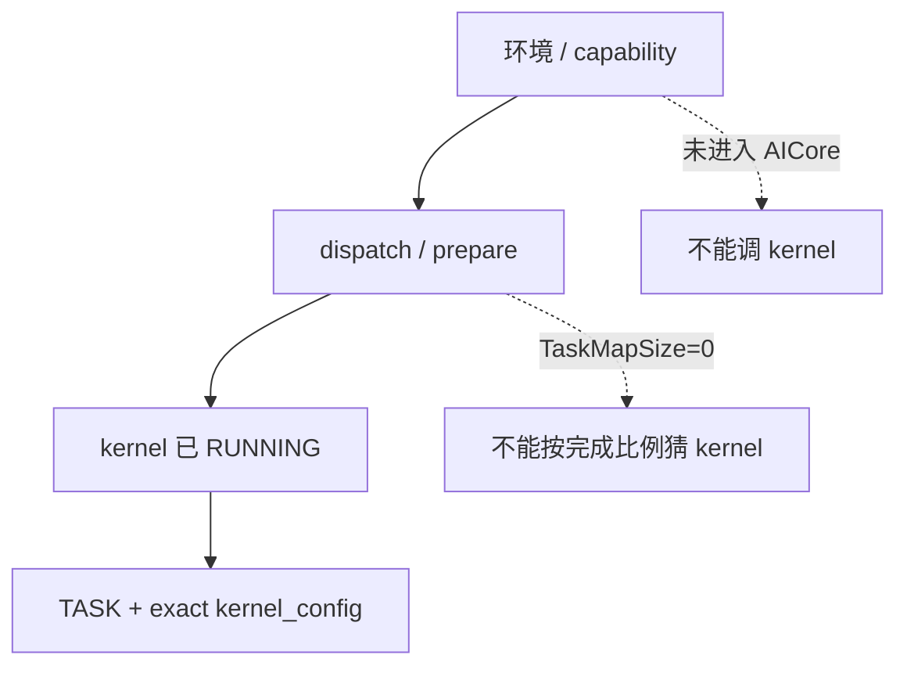

# N1 案例时间线：早期环境与整网前史（2026-06-15～2026-07-09）

> 本文记录 N1 单程序主线之前的环境、部署、同卡运行、早期 `gate_topk` 和
> compile/prepare/dispatch 漂移。它们解释为什么不能把所有 `507018` 合成一个根因。

## 早期 blocker 分类图



## 4.2 2026-06-15～06-24：先学会区分环境失败、shape bug 和 kernel stall

### 2026-06-15：单卡 e2e 能跑，但仍有临时语义

**[历史记录，未独立复核]** Phase 15 单卡 e2e 通过依赖：

- head gate 暂时 identity bypass；
- TP=1 monkey patch；
- dynamic shape/stride workaround。

**当时能回答的问题。** 这组结果只证明：在简化 gate、单 rank 和临时
shape/stride 语义下，前端、代码生成和一部分单卡数据流可以前进。它没有进入
TP=8/EP=8 的跨 rank 协议，也没有覆盖完整 native W8A8 MoE，所以不能回答整网
稳定性或 token-exact 精度。

**为什么必须保留这段前史。** 后续恢复真实 head gate 后，NaN 才从被乘零的
下游流出。也就是说，identity/zero bypass 可以作为 bring-up 旋钮，但会改变
可观测性：被旁路的结果 clean，不能证明被旁路的边界正确。

**最终作用域。** 保留“先标清临时语义和未覆盖面”的方法，不把 06-15 的单卡
pass 当作后续 TP=8、MoE 或完整 42 个 MoE 层的稳定基线。

### 2026-06-19：跨卡 IPC capability 是独立基础设施 blocker

**失败阶段和现象。** **[直接证实于历史部署记录]** 旧 driver/firmware 下
`support_shmem_map_exbus=0`，`aclrtIpcMemImportByKey` 返回 507899。升级到：

```text
driver   25.5.2
firmware 7.8.0.7.220
CANN     9.0.0-beta.1
```

后，跨卡 same-VA IPC 和 simpler L3 allreduce 才能通过。CANN GA 又会因
AICPU 扩展库未下发，在 BootstrapDispatcher 阶段表现为 507018。

**为什么先查环境而不是 kernel。** 这些失败发生在 IPC capability、
comm/bootstrap 或 AICPU 扩展装载阶段，尚未出现已提交到 AICore 的 RUNNING
TASK；因此即使外层也显示 507018，证据链仍停在环境/派发前置层。

**决定性对照和作用域。** capability 和软件栈补齐后，same-VA IPC 与
known-good allreduce 恢复，证明该阶段存在真实基础设施 blocker。但这只为后续
kernel 调试建立前提，不能解释后来已经进入 `rt.run` 的 S1 stall。经验不是
“507018 都是 CANN”，而是：

```text
如果在 Bootstrap/comm init 前失败，先查环境；
只有进入 rt.run 并拿到 TASK/CLUSTER，才讨论 kernel stall。
```

### 2026-06-22：重启后两个同名故障，只有一个是 kernel

**[直接证实于历史记录]**

- 第一次 frontend smoke 失败来自 stale `__pycache__/config...pyc`；
- 清理/刷新 Python source mtime 后 smoke 恢复；
- 同时 MoE device runtime 仍在 5 秒内 507018。

**为什么重启和错误码都不足以分类。** frontend smoke 的恢复与 device runtime
继续失败同时存在，说明它们是两个并行 blocker：一个是 Python/source identity，
另一个才进入 device 路径。若只记录“重启后仍 507018”，会把已消除的 stale
source 和尚未消除的 device 问题压成一个故障。

**最终保留的规则。** 每次先绑定 import path、source mtime/hash 和 build，
再解释当前 run 的 device 行为：

> 先证明正在运行的源码和环境，再解释 device 行为。

### 2026-06-24：第一个 MoE runtime 507018 来自 empty-tail 提交

**[历史记录，未独立复核]** 8 卡 `DecodeLayerMoE` 在 runtime 继续 507018。
当时先用 dispatch-cut 把失败边界从“整个 MoE block”缩到 routed expert：
dispatch-only 能过，而 dispatch+routed 失败。检查 tail 计算后发现
`tile_valid <= 0` 的空尾 tile 仍会走 index/cast/submit；signed remainder 一旦
在无效范围内继续转成 index，可能产生下溢、越界或无意义 kernel 提交。补：

```text
if tile_valid > 0:
    submit expert tile
```

后 8 卡 runtime 通过。

**证据边界。** dispatch-cut、代码条件和修复后的 8 卡 runtime pass 共同支持：
这是该 `DecodeLayerMoE` 对象的确定性 tail/submit bug。本文没有在 2026-07-17
重新运行原始 build，因此按历史证据记录；它也没有覆盖 token golden 或重复
whole-net 完整 42 个 MoE 层。

这与 07-06 的 `gate_topk` mrgsort hang、07-10 的跨层 alias 和 07-16 的随机
signal-layout stall 都不是同一个问题。最终保留的是：

- signed tail 和 empty tile 必须在 cast/index/submit 前处理；
- `507018` 可以来自确定性的局部 shape 逻辑；
- 一次 MoE runtime pass 仍不包含 golden 精度，也不代表整网稳定。
## 4.3 2026-07-04～07-05：与 vLLM 同卡运行时的 507018 不是后来 standalone 完整整网的根因

### routed expert 单独运行先通过

**[历史记录，未独立复核]** routed-expert per-rank kernel 用真实 W8A8
权重完成 device 精度验证。这里复用了 06-24 已补齐的 empty-tail guard；
本阶段主要证明单独 routed 计算和真实权重数学可以正确。

**它为什么重要。** 这建立了一个局部数学基线：真实 W8A8 权重并非天然无法在
device 上计算，empty-tail guard 也确实属于应保留的输入契约。

**它为什么不够。** 该 probe 不包含整网 generator 内联副本、42 层调度、
dispatch/combine 跨 rank 协议、IPC 权重池和 KV IPC。后来 whole-net 的
`_expert_routed` 正是因为与 standalone `moe.py` 漂移而出错，所以“独立 kernel
通过”只能作为对照，不能替代内联生成物审计。

### 与 active vLLM 同卡后出现另一类 507018

live 单层 MoE 的独立 ChipWorker 与 vLLM Worker_TP 共卡时：

```text
默认配置 -> routed 507018
ring heap=4GB -> 16GB static arena OOM 207001
降低 vLLM gpu memory -> OOM 消失，但 507018 仍在部分 rank 出现
```

**为什么当时会怀疑 co-tenancy。** 故障只在 vLLM 与独立 ChipWorker 共卡的
对象中出现，并且 arena 扩大后首先暴露 207001，说明容量和双 runtime/device
context 是必须单独控制的变量。

**决定性区分。** 降低 vLLM HBM 后，207001 消失但部分 rank 的 507018 仍在，
证明“HBM 不足”不是所有失败的统一解释；同时该测试对象不是后来冻结的
standalone 完整整网对象：它没有同时满足单个 `@pl.program`、完整执行 42 个
MoE 层、dispatch pull、combine pull 和 fresh exporter pool。因此
**[历史判断]** 只把它归为独立的同卡运行 blocker，不把其根因外推到 07-16。

保留的经验：

- 207001 与 507018 要分开；
- 调内存能消掉 OOM，不代表消掉 kernel/runtime hang；
- 不允许把 live co-tenancy 的结论直接套到 standalone。
## 4.4 2026-07-06～07-07：第一次用 TASK→kernel 真正抓到 `gate_topk`

**前置对象。** 这里是 EpTpMoE 单块 8 卡真实 W8A8，不是 07-12 的 N1
whole-net build。两个 build 的 `gate_topk` func id 不同：本阶段是 `func_id=2`，
N1 real IPC 后来是 `func_id=3`。

**现象和定位链。** EpTpMoE 出现：

```text
sched_error_code=100
task state=RUNNING
kernels=[aiv0:2]
```

使用该次 build 的 `kernel_config.py` 映射：

```text
func_id 2 -> gate_topk
```

`TASK` 证明已有 AIV task 被分配到 core 且不完成；同轮 exact
`kernel_config.py` 才把它从“MoE 内某个 task”收敛到 `gate_topk`。检查生成 kernel
后，sort pipeline 为：

```text
sort32
-> mrgsort(block_len=64)
-> format2 merge(left_half, right_half)
```

format2 要求左右输入各自已经是完整有序序列，但当时每个半块仍包含多个
64-run。输入不满足状态机前置条件，分散分数下 kernel 不终止。

**决定性实验。** 修为 DeepSeek 风格的 format1 渐进链后，同一 gate 对象可以
完成，且 top-k 结果与 torch 对齐。forward progress 与数值两个 gate 同时通过，
才把这次问题从“task 位于 gate”提升为：

> **[直接证实]** 该单块 build 的 mrgsort 输入前置条件错误，是
> `gate_topk` deterministic RUNNING hang 的代码级原因。

这个修复后来极其关键：N1 whole-net 的 inlined generator 又保留或重新引入了
同类错误，2026-07-12 的 `task_id=3` 最终再次映射到 `gate_topk`。这不是
“历史 bug 不可能再出现”，而是说明：

```text
standalone validated source
!= generator 内联副本
```

**最终保留与不覆盖。** 保留 format1 merge、sort-only golden 以及
TASK→exact func→generated source 的定位方法；不能把本阶段 `func_id=2` 直接
套到 N1 的 `func_id=3`，也不能用 gate 修复解释后来的随机 signal-layout stall。
## 4.5 2026-07-08～07-09：compile、prepare、dispatch 和底座漂移交织

这两天主要是 whole-model 组织方式探索，虽然不是最终随机 stall 根因，但解释了
后续为什么必须固定架构和 manifest。

### multi-program co-prepare 与 `TaskMapSize=0`

历史多程序路径出现：

- ring init 太小，prepare 失败；
- 设到 `2^20` 又引发约 64GiB arena OOM；
- 65536/131072 一类配置能让 prepare 前进；
- prepare clean 后，首个 dispatch 仍可能 `TaskMapSize=0`，task 根本没有到
  device AICPU。

这个签名与 S1 RUNNING kernel 完全不同：

```text
TaskMapSize=0 / AICPU idle
```

**因果解释。** `prepare` 能前进只说明编译结果和部分 runtime 资源已建立；
`TaskMapSize=0` 加 AICPU idle 说明任务映射/派发没有形成，尚不存在可供分析的
AICore RUNNING kernel。增大 ring 配置从“太小”走到约 64GiB arena OOM，也说明
容量旋钮只是在移动失败阶段，不是产品修复。

**最终作用域。** 这类失败归入 host/runtime dispatch 组织，不进入 S1 kernel
stall；保留“先读 TaskMap/dispatcher，再决定是否看 kernel”的分类规则。

### fused attention+MoE 的 compile/device 混淆

一度 attention 重写 compile clean，但 device 验证仍被同一个
`TaskMapSize=0` 路径挡住。后来 separate program/Option-C 路径能运行，
说明“编译成功”只清除了前端 blocker。

这里没有证明 attention 重写的数值或 device 协议正确；它只说明同一个源码可以
在 compile bar 通过、在 dispatch bar 失败。后续文档因此把
compile/prepare/dispatch/run/numerical/repeated-release 六个 bar 分开。

### 07-09 升级栈带来新的漂移

全栈升级引入：

- ptoas/bin 版本差异；
- SplitIncoreOrch 新检查；
- Phase-16 的 SDMA-OFF patch 丢失；
- 一些历史精度 workaround 与 native W8A8 分支分叉。

**[直接经验]** 从这一阶段开始，任何“same code”都必须同时写五仓/工具链/
runtime binary，而不能只写 pypto-lib 分支。
