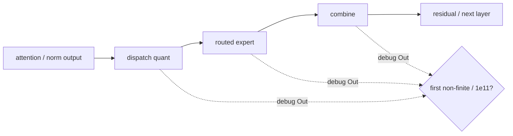

# N1 主线：Native W8A8 精度与 Layer Boundary（2026-07-12～2026-07-14）

> 本文回答“程序完成后为什么仍可能 NaN 或得到错误 token”。精度修复不能替代
> stall 修复，但所有真实接口、索引和 native W8A8 修复都必须保留。

## 首个异常定位图



## 4.9 2026-07-12～07-13：从“能跑”进入精度和 layer boundary 排障

### 恢复真实 head gate 后 NaN 流出

旧 dummy `gate_r=0` 把 attention 输出乘成 0，掩盖了后续数值问题。恢复
on-device head gate 后：

```text
RUN_CLEAN
next_hidden=NaN
logits=NaN
argmax=0
```

这里的 `RUN_CLEAN` 只回答“host/device 调度完成”，而 `NaN` 和 `argmax=0`
回答“结果不正确”。这不是同一次测试互相矛盾，而是恢复真实语义后暴露了原来
被 zero path 遮蔽的数值错误；从此稳定性和精度必须作为两个独立 gate。

### 不执行 MoE 时数值有限、执行 1 个 MoE 层时出现 NaN，但这仍不能直接定位根因

层数 bisect：

```text
P_FAITHFUL_MOE_LAYERS=0（不执行 MoE 层） -> finite
P_FAITHFUL_MOE_LAYERS=1（执行 1 个 MoE 层） -> NaN
```

当时自然怀疑第一层 INT8 MoE。A-operand padding mask 实验仍 NaN，进一步把
嫌疑放到 routed expert、dispatch、combine 和 shared。

**为什么这些候选仍不能直接定案。** “不执行 MoE 时数值有限、执行 1 个 MoE
层时出现 NaN”只把边界缩到第一个 MoE 层的完整路径；padding mask 只覆盖
partial-tile A operand 的一种解释，不能区分 attention handoff、Out writeback、
routed arithmetic 或 combine protocol。随后发现真正的第一处边界 bug：

```text
attn_only_orch 的 resid3_out 局部 tensor
遮蔽了 pl.Out 参数
-> attention 结果没有写到 h_mid_out
-> chip_orch 读取未初始化 handoff
```

修复 Out writeback 后 NaN 消失，但仍出现 1e11～1e12 幅值。

这两个结果必须按先后关系理解：Out writeback 修复的是“attention 结果没有
发布到 `h_mid_out`”这一 handoff 错误；它没有证明后续 routed expert 的数学
已经正确。NaN 消失后仍有巨大有限值，正是说明下一个独立 blocker 已经被暴露，
而不是说明前一个判断“完全错误”。

### 三个 ordering/FUSE 判断又被诊断工具污染

先后尝试：

- 合并两个 per-rank loop；
- 捕获 attn_only 返回值建立 data dependency；
- 直接把 Out 传给 inline attention；
- 把 attention fuse 进 MoE orchestration；
- orchestration 内 early return 做 stage bisect。

期间 generator `_be` 用 substring 搜索 `return next_hidden_out`，命中了错误的
调试分支，把 MoE body 截断在 norm-only。于是若干“某 stage 正常/异常”的数字
实际来自 truncated program。

同时，orchestration 内 Python early return 并不保证后续 InCore kernels 不进入
完整 DAG，导致“只跑 attention”“只跑 norm”的假隔离。

这批结论随后全部降级。可靠的诊断必须使用：

```text
独立 pl.Out dbg_out
host 可见的 op-level dump
exact generated source
```

### 可靠的逐算子输出首次把错误钉到 routed expert

只执行 1 个 MoE 层时导出的独立中间输出：

| stage | max abs | 结论 |
|---|---:|---|
| post_norm | 1.45 | 正常 |
| local_routed_x | 1.45 | dispatch 正常 |
| shared expert output | 1.62 | 正常 |
| local_routed_y | 3.99e11 | 首个异常 |
| moe_out | 1.95e11 | 继承 routed garbage |

**[直接证实]** 错误来自 whole-net inlined `_expert_routed`，不是 FUSE、
collective 或输入幅值。inlined 版本与 standalone validated `moe.py` 漂移：

```text
旧 in-expert INT8 quant/cast/cube
vs
validated dispatch-side quant + materialized INT8
```

修复方向因此明确为原生 W8A8 对齐，而不是回退 BF16-dequant。

**保留边界。** 这组 dump 直接支持“第一处数值异常在 routed expert 输出”
以及“whole-net 内联实现没有遵循 validated native W8A8 边界”；它不等于证明
所有 INT8 问题都已消失，也不等于证明 routed expert 是后续随机 stall 的位置。
修复必须落在 generator/active builder 的共同源头，并以生成物 round-trip 防止
standalone `moe.py` 修好、inline 副本仍旧错误。
## 4.10 2026-07-13：native W8A8 数值修复正确，但完整深度仍会卡死

对齐 validated routed expert 后：

```text
local_routed_y: 3.99e11 -> 1.41
执行 1、20、31 个 MoE 层 -> 完成
完整 42 个 MoE 层 -> 卡死
```

一度根据 comm-window 字节：

```text
执行 20 个 MoE 层，通信窗口约 186MB -> 完成
执行 31 个 MoE 层，通信窗口约 290MB -> 完成
执行 42 个 MoE 层，通信窗口约 391MB -> 卡死
```

以及把“执行 20 个 MoE 层”对象的通信窗口人为扩大后也会卡死，因此一度判断
存在约 290～390MB 的固定字节上限，并以 dispatch-side INT8 缩小 `recv_x`
作为“确定修法”。

**[后续证伪]** standalone allreduce 在更大窗口和不同权重共存条件下仍能通过，
说明不存在这样一个简单的固定字节上限。缩小 footprint 是正确的 native W8A8
设计，也改变了布局和概率，但不能被写成完整 42 个 MoE 层卡死的唯一根因。

这类修改应该按两类记录：

- **保留**：因为 native W8A8、带宽、内存和已验证 `moe.py` 边界正确；
- **撤回根因措辞**：不能声称它独立证明了“comm pool byte limit”。

**为什么仍然保留这个修改。** dispatch-side INT8 使 routed payload、scale 和
native matmul 的 dtype/size 契约与已验证 `moe.py` 一致，也降低了 HBM 和通信
footprint；这些是设计和精度要求，不依赖“固定字节上限”是否存在。因此撤回的
只是“它证明了完整 42 个 MoE 层卡死存在唯一字节上限”这句话，不是撤回
native W8A8 实现本身。
## 4.11 2026-07-14：首次得到 token 303，但发生两次过早闭环

### dense L2 `attn_layer_idx` 是真实精度 bug

用 ctx=1 dense torch golden 和逐层 row0 cosine 对拍：

```text
L0/L1 -> cos=1.0
L2 -> cos=0.931
```

L2 权重已在 call site 预切到单层，却仍传 `attn_layer_idx=1`，内部再次按
layer offset 读取，越界到相邻层权重。修为 0 后：

```text
L2 cos -> 0.999999
```

**[直接证实]** 这是独立的精度根因，应保留。

**为什么这个修复不能顺带关闭 stall。** L2 cosine 从 `0.931` 恢复到
`0.999999`，证明单层权重索引边界确实读错并已纠正；但它发生在数值路径，
并没有改变跨 rank signal、generation 或 pull protocol。随后仍能在正确
`argmax=303` 后 stall，正好说明“精度修复完成”与“forward progress 稳定”是
不同的准出条件。

随后在打开额外 logging、运行时序受到扰动的条件下，完整 42 个 MoE 层跑通一次：

```text
token 6127 -> argmax=303
```

这证明精度路径已经可以正确，但 confirm run 又 stall，所以稳定性仍未关闭。

### completion-wave 与 combine race 一度被宣布为最终修复

历史阶段加入：

- `tp_all_reduce` completion wave；
- combine zero-done/publication barrier；

并记录：

```text
完整 42 个 MoE 层连续 7 次 RUN_CLEAN
argmax 303 3/3
```

**为什么当时容易把它过早升级成结论。** completion-wave 的结构与正确的
collective protocol 相似，且短样本同时改善 rc 和 argmax，所以它有资格作为
候选协议修复；但“7 次 clean”没有说明每次是否是同一 source、同一 exporter
生命周期和同一无 logging 条件，也没有把概率性 clean 与 matched baseline
区分开。

随后 vector diff 又把残余数值抖动指向 combine/routed gather，并尝试
`_serialize_after_shared`；该串行化在完整执行 42 个 MoE 层时又造成 507018。

### 同日晚 clean-tree 复验推翻“A2 已修”

对包含上述修改的 clean tree，关闭额外 logging，并使用同一个完整 42 层真实
输入对象复验：

```text
run1 STALL
run2 CLEAN argmax=303
run3 STALL
```

**[直接证实]** completion-wave 没有可靠关闭随机 stall。历史 7 次 clean 是概率
样本或环境/对象差异，不能作为 release。

它仍可能是独立 collective 中有价值的 completion/publication 正确性增强；
被证伪的是“它足以解释并消除本 N1 随机 stall”，不是“two-wave 机制在所有
协议中都无效”。

这一晚形成最重要的流程规则：

> commit message、handoff 或 agent 报告里的“device verified”必须在当前 exact
> 对象上独立多次复验；概率问题不能由短连续 clean 宣布结束。
