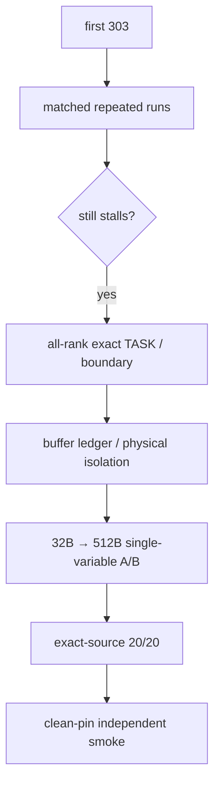

# N1 主线：随机 Stall、512B A/B 与 Release（2026-07-14～2026-07-17）

> 本文从首次得到正确 token 303 开始，说明为什么一次或短样本 clean 不能宣布
> stall 已解决，以及如何用 exact kernel、跨 rank 边界、buffer layout A/B 和
> release manifest 收敛证据。

## 结论升级阶梯

| 观测 | 能写 | 不能写 |
|---|---|---|
| 一次 `argmax=303` | 数学路径有机会正确 | stall 已解决 |
| 短样本连续 clean | 候选修改值得扩大验证 | release ready |
| kernel 在不同 rank/阶段漂移 | 共享边界或协议/layout 候选增强 | 某个 kernel 是唯一根因 |
| 512B exact-source 20/20 | 0162 固定对象上与 stall 消失强关联 | 跨机器充分条件或唯一 ISA 根因 |
| clean-pin 一次 smoke | clean stack 基本可运行 | clean-pin 已 20/20 |



## 4.12 2026-07-15：从现象推论转向 exact kernel 位置

### canonical 口径先被冻结

明确唯一精度/稳定性对象：

```text
whole_decode_faithful_real
P_FAITHFUL_MOE_LAYERS=42
token 6127
native W8A8 weights IPC
KV IPC
argmax must be 303
```

一个重要陷阱是 shell 中遗留：

```text
P_FAITHFUL_MOE_LAYERS=1
```

会产生 2.7s 左右的假 clean 和“执行 0/1 个 MoE 层”的诊断 argmax，而不是完整
执行 42 个 MoE 层。之后每轮日志必须打印实际执行的 MoE 层数，并确认是完整
42 个 MoE 层。

### push baseline 的 exact TASK 证据

push+push baseline 同时能观察到：

```text
clean -> argmax=303
stall -> 507018 / S1
```

同轮失败日志：

```text
TASK ...319 state=RUNNING fanin=6/6 kernels=[aiv0:28] core=26
TASK ...320 state=WAIT    kernels=[aiv0:29] missing_deps=1
completed=39/137
```

exact build 映射：

```text
func28 = _dispatch_push
func29 = _dispatch_stage
```

**[直接证实]** 输入依赖已经满足，`_dispatch_push` 已在 core 上 RUNNING 但不完成；
下游 `_dispatch_stage` 只是等待它。它不是 S4 fanin dependency deadlock。

这一步回答的是“哪一个已提交 task 没有 forward progress”，还没有回答该 task
内部是计算、DMA、fence、notify 还是 wait 在等待。后一个问题必须继续依赖
生成 kernel、上一对 producer/consumer 操作以及跨 rank 的同轮快照，不能从
`func28` 名字直接跳到某条 ISA。

### 有 kernel 位置，不等于有子指令根因

当时先后怀疑：

- 跨 die bulk remote_store/TPUT 完成；
- count_done/data_done barrier；
- 单波 completion protocol；
- 跨 rank dispatch order。

实验包括：

- 增大 scheduler/op/stream timeout 10 倍，仍耗满约 450s 不完成；
- TPut 后补 fence；
- pre-push rendezvous；
- 把 remote write 改成 local write；
- count/data done 加 two-wave；
- AtomicAdd/Set/read-back 等变体。

这些实验会改变挂率或挂点，但没有给出稳定修复。它们的证据等级是“削弱某个
候选机制”，而不是“确认另一个机制”。特别是：

- local-write 后仍可挂，削弱“bulk TPUT 是唯一根因”；
- two-wave 后仍约三分之二 stall，推翻“单波就是最终原因”；
- 没有真实 AICore PC，不能声称卡在具体 `wait_flag` 或某条 ISA。

### push→pull 重写既有价值，也产生过新 bug

先改 dispatch pull，后改 combine pull。过程中曾按 `completed=78/81`
猜 hang 已移到 combine；下一轮保留 exact build 后发现：

```text
func28 = _dispatch_pull
```

从而推翻按完成比例猜 kernel 的结论。

早期 full-pull 实现即使只执行 1 个 MoE 层也会卡死，证明当时的 pull 实现自身
存在 rendezvous、offset 或 handoff 问题，不能以“pull 原语在别处可以完成”
替代整网验证。修订后：

- dispatch pull + combine push 的 clean 概率提高，但仍有 residual stall；
- combine pull 在只执行 1 个 MoE 层时可以完成，但完整 42 个 MoE 层仍会随机
  卡死；
- 最终所有发布组合仍必须直接运行完整 42 个 MoE 层。

应保留的不是“pull 天生不会挂”，而是最终 fixed-slot pull 的清晰边界、
self local-load/peer remote-load 和 dispatch-produced inverse map。

这里还要区分两个结论：pull 重写改善了路由边界、offset 可复算性和 self/peer
语义，是架构上可审计的最终形态；但某一次 pull 版本仍然 stall，说明实现和
buffer/signal 生命周期必须一起验证，不能把“原语名称是 pull”当作稳定性证明。

### 0162 二次复现

在 0162 devices 8..15 上，同一历史 push+push 对象 6 次：

```text
2 clean
4 stall
clean runs argmax=303
```

**[历史记录，未作为 final exact-manifest A/B]** 这排除了“症状必然只在
0234 某个坏芯片”的过早结论，但两台机器当时的完整 runtime dirty state 没有
严格绑定，所以不能升级为完全 matched 的跨机因果实验。
## 4.13 2026-07-16：kernel 位置漂移迫使排查回到跨 rank 边界和物理布局

在后续 pull+pull 失败 build 中，历史记录显示：

```text
rank 8-14 -> _pull_routed_y
rank 15   -> _dispatch_pull
```

这推翻了：

```text
所有 rank 都挂 routed_h_quant
所有 failure 都固定在一个 kernel
```

正确解释是：不同 rank 处于同一个跨 rank protocol 的不同深度。需要从最早
未完成的 publish/fence/notify/wait/load generation 反推，而不是选择出现次数
最多的 kernel。

**为什么这会把排查方向从 kernel 内部拉回 buffer ledger。** 若 rank 15 还在
dispatch pull，而 rank 8–14 已经进入 `_pull_routed_y`，两者可能不是两个独立
故障，而是同一 generation 的 producer/consumer 在不同阶段停住。此时要同时
核对 payload 是否已发布、signal 是否是当前 generation、consumer offset 是否
来自同一份 count snapshot，以及 layer window 是否仍被上一层占用。

### 回到 buffer ledger 后发现 control signal 物理共线风险

逻辑 signal：

```text
[8,1] INT32 = 32B
```

此前物理 allocation 也只有 32B。多个 signal 以及 signal/payload 在一个巨大
comm window 中紧密排列。按照顶层 memory/tensor-layout 约束，必须把
**logical signal bytes、storage-size 对齐、control-plane cache-line isolation、
allocator 的 base/offset 对齐**分开检查；它们不是同一个概念。静态布局审计显示
control-plane hotspot 可能共享 512B line。

最终只改物理分配：

```text
32B -> 512B
COMM_CONTROL_SIGNAL_BYTES = 512
```

保持：

- logical shape/dtype；
- rank indexing；
- native W8A8 数学；
- 完整 42 个 MoE 层；
- token 6127；
- dispatch pull + combine pull；
- AtomicAdd/Ge 协议。

生成物审计：

```text
216/216 signals nbytes=512
all relative offsets %512=0
window size 766525440 %512=0
```

**[强关联]** 应用该最小 layout 变量后，0162 fresh exporter pool 的随机 stall
收敛为连续 20 次 clean 且每次 `argmax=303`。这说明在这个固定对象上，物理
signal isolation 是一个有效的 release 变量；它不说明 512B 是所有平台的硬编码
常数，也不说明已经观察到某个丢失的 signal bit。

### 最终 layer boundary 被固定

```text
dispatch:
  pack_publish
  -> dispatch_pull
  -> dispatch_stage
  -> recv_counts + inverse_map

combine:
  stage_routed_src
  -> pull_routed_y(dispatch-produced inverse_map)
  -> weighted_gather
```

self 使用 local load，peer 使用 remote load；每层 communication window distinct；
整窗 zero-init；routed expert 保持 native W8A8；tail 先 signed 判断再 cast。

这些修改中只有 512B physical isolation 是最终最小 layout A/B 变量；其他项因
架构、精度或生成器一致性保留，不能全部包装成 stall 唯一根因。
## 4.14 2026-07-17：release 证据审计又发现一次“对象不完全相同”

初始候选 20-run：

```text
signal512_p42_20_20260716_220004
```

完成 20/20 后，证据审计发现候选日志绑定的 model source SHA 与整理后的 release
smoke 不完全相同。于是没有直接把候选 20-run 追溯成 release 证明，而是对
release commit：

```text
pypto-lib 0e7a0fddc90c4f2348f1d59e015fb817a0877a02
```

重新执行 exact-model-source 20-run：

```text
signal512_p42_20_20260717_001135
20/20
each rc=0
each argmax=303
runtime 2.50/2.5605/2.62s
```

随后把当时 20-run 依赖的 pypto/simpler dirty runtime 支持 formalize 为 clean
commits：

```text
pypto   e277de9f
simpler 36957c6b
```

并在三仓 clean pin 上执行一次完整 42 个 MoE 层的快速健康检查：

```text
final_stack_smoke_20260717_015635
rc=0
2.58s
argmax=303
worker-window relevant dmesg=0
```

结论必须分开：

- exact-model-source 在当时实际 runtime 组合上有 20/20；
- 三仓 clean pins 有一次独立的完整 42 个 MoE 层 smoke；
- 不能把一次 clean-pin smoke 写成 clean-pin 20-run。
## 4.15 blocker 演化矩阵：哪些是同一外观下的不同问题

| 阶段 | 表面 | 决定性证据 | 真正处理 | 与最终随机 stall 的关系 |
|---|---|---|---|---|
| Phase 16 环境 | 507899/507018 | capability、Bootstrap 日志 | driver/firmware/CANN | 基础前置 |
| 07-10 runtime | 单卡 507018、多卡 507899 | hello/allreduce 对照 | clean `.so` + SDMA OFF | 基础前置 |
| 07-08 dispatch | 507018 timeout | `TaskMapSize=0`, AICPU idle | program/prepare/dispatch 组织 | 不同机制 |
| 07-10 alias | mid-run 507018 | 1 层 shared-window 完成、2 层 shared-window 卡死、per-layer window 完成 | per-layer distinct windows | 已解决 deterministic bug |
| 07-11 OOM | exit137/207001 | host RSS、rtMalloc size | exporter IPC、arena sizing | 不属于 kernel stall |
| 07-12 gate | S1 RUNNING | TASK aiv0:3→`gate_topk` | mrgsort format1 chain | 已解决 deterministic kernel bug |
| 07-12～14 精度 | NaN/wrong argmax | Out dump、layer golden | Out/index/native W8A8 修复 | 与稳定性正交 |
| 07-14～16 随机 stall | clean 303 或 S1 | multi-run、exact TASK、跨-rank漂移 | 边界审计 + signal layout A/B | 最终 0162 release blocker |
## 4.16 被推翻的核心判断清单

| 历史判断 | 为什么当时看似合理 | 什么证据推翻 |
|---|---|---|
| 0234 节点 IPC poison | known-good allreduce 也失败 | reboot 无效；clean runtime + SDMA OFF 恢复 |
| real-weight IPC/VA 导致 task3 stall | H2D clean、IPC stall | exact task3→`gate_topk` |
| task3 是首个 ep_all_to_all | 按 MoE 源码顺序猜 | exact `kernel_config.py` 映射 |
| 不执行 MoE 时数值有限、执行 1 个 MoE 层时出现 NaN，证明 INT8 MoE 内核错 | 首个 MoE 层加入即坏 | `pl.Out` 被遮蔽，handoff 未写 |
| FUSE/跨-orch handoff 是 1e11 唯一根因 | 调试旋钮数字支持 | generator 截断 + reliable op-level Out dump |
| communication window 有固定 290～390MB 上限 | 执行 31/42 个 MoE 层的结果和窗口膨胀实验相关 | 更大的 standalone window 仍能完成，条件不匹配 |
| completion-wave 已修 A2 | 短期 7 clean、303 3/3 | clean tree STALL/CLEAN/STALL |
| task local id 23 是 func23/tp_all_reduce | 把 raw task 低位直接当 func | TASK `kernels=[aiv0:28]` |
| completed=78/81 表示 combine | 接近 orchestration 尾部 | exact build func28=`_dispatch_pull` |
| PUSH/TPUT 是最终唯一根因 | push 探针和 func28 线索 | pull+pull 也 stall，kernel 跨 rank 漂移，无 PC |
| 执行 20 个 MoE 层完成可以代替完整 42 个 MoE 层 | 迭代快、卡死概率较低 | 完整深度会改变布局、同步代次和卡死概率 |
| 一次 argmax303 表示 ready | 数学路径正确 | 同版本下一轮仍 stall |

## 继续阅读

- [关键因果链](n1-causal-chains.md)：对 per-layer window、exact TASK、
  completion-wave、kernel 漂移和 512B 分别做因果复核。
- [设计审计与最小 A/B](n1-design-audit.md)：复用 buffer、地址和生成物审计方法。
- [发布验证与设计经验](n1-release-validation.md)：把本阶段抽象为准出门禁。
