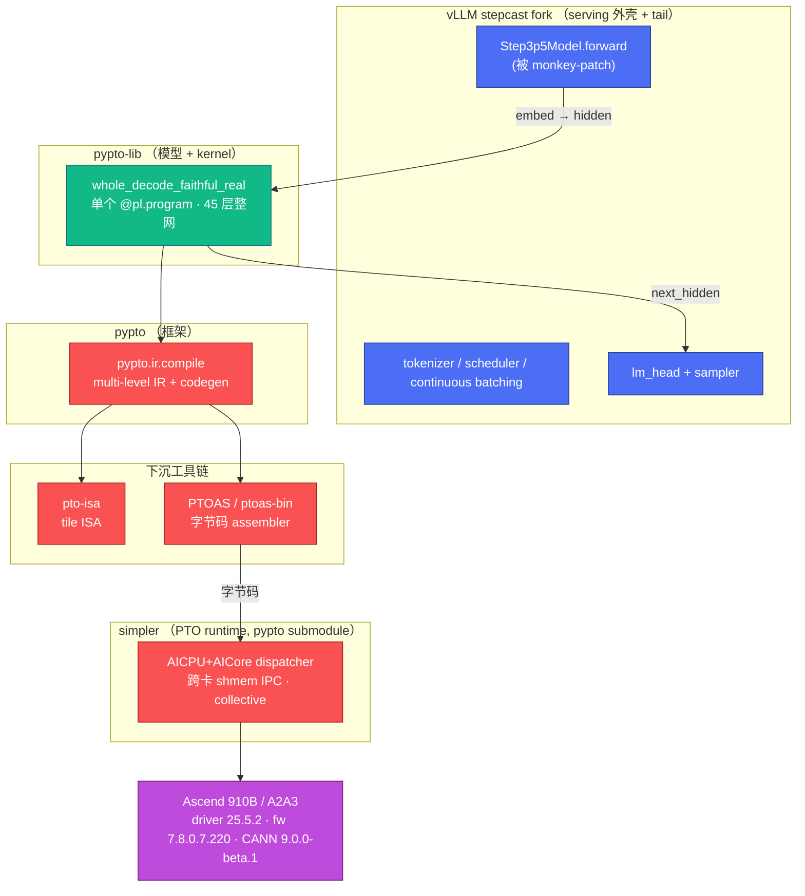

# 00 · 项目背景与目标（Context & Goals）

> **这是"对外介绍本项目"的第一份文档。** 想把项目背景、全景、进度讲给别人听，
> 按这条线读：本文 → [`whole-net/01-system-design.md`](whole-net/01-system-design.md)
> +[`vllm-pypto/01-system-design.md`](vllm-pypto/01-system-design.md)（两个子系统架构）
> → [`../planning/roadmap.md`](../planning/roadmap.md)（进度/路线图）
> → [`../STATUS.md`](../STATUS.md)（此刻状态）。

## 1. 一句话

在 **Ascend 910B NPU** 上，用 **pypto** 编程框架实现 **step3p5** 大模型的
decoder kernel，用 **vLLM**（公司内部 stepcast fork）做 serving / 调度 /
batching / sampling，最终交付一个端到端可服务的推理系统。

## 2. 为什么这么分工

| 关注点 | 谁负责 | 为什么 |
|--------|--------|--------|
| decoder 前向（45 层 attention+MoE） | **pypto** 编译出的整网 kernel | 需要 tile 级融合 + 手工调度榨干 910B 算力；torch-eager 达不到 |
| tokenizer / scheduler / continuous batching / paged-KV 管理 / sampler / OpenAI API | **vLLM** | 这些是成熟 serving 能力，没必要重造 |

核心命题：**vLLM 只做 serving 外壳 + tail（embedding/lm_head/sampler），
45 层 decoder forward 由 pypto 接管**。二者在同 8 张卡上共驻，通过 IPC 零拷贝
共享 KV 与权重。

## 3. 系统全景（5 仓 + vLLM）

## 4. 仓库角色

| 仓库 | 角色 | 关键内容 |
|------|------|----------|
| **pypto** | 编程框架 | Python DSL（`pypto.language[.distributed]`）、multi-level IR、codegen pass。把 `@pl.program` 编成 PTOAS 字节码 + host dispatch `.so`。`pypto/runtime/` 是指向 simpler 的 submodule。 |
| **pypto-lib** | 模型 + kernel | step3p5 家族。整网入口 `models/step3p5/decode_layer_single_chip_hidden.py`（`stepfun/develop`）；attention/MoE/gate/dispatch/combine/expert 组件；`weight_loader.py`；集成代码在 `tools/step3p5/`。 |
| **pto-isa** | tile ISA 虚拟实现 | 定义 tile 算子（matmul/reduce/broadcast…），codegen 下沉到此。硬件特定（910B）。 |
| **PTOAS / ptoas-bin** | 字节码 assembler | LLVM/MLIR 把 pypto MLIR 转设备字节码 + dispatch metadata。实跑用 `ptoas-bin`（当前 v0.45）。 |
| **simpler** | PTO runtime | AICPU+AICore dispatch、跨卡 shmem window IPC、collective。最 platform-touchy —— [Phase 16 三剑合璧](../deployment/phase16-three-pillars.md) 绑定就是为它。 |
| **vLLM stepcast fork** | serving（集成目标） | 含 `vllm/model_executor/models/step3p5.py`。tokenizer/sampler/KV 管理/调度/batching。无我方 fork。 |

> ⚠️ **代码实况（`pypto-lib` @ `stepfun/develop`）**：
> 生产整网**唯一入口** = `whole_decode_faithful_real_single_chip_hidden_only`
> （`models/step3p5/decode_layer_single_chip_hidden.py`）。它把完整 Main 45 层跑在
> **一个 `@pl.program`** 里，输出 **pre-final-norm BF16 hidden**——**strict raw-hidden
> 边界**：final RMSNorm + lm_head + sampling 全在下游（standalone 走 host，live 走
> vLLM）。**无 per-layer production dispatcher**。集成代码在 `pypto-lib/tools/step3p5/`。

## 5. 两个子系统（本项目的两条设计主线）

| 子系统 | 是什么 | 设计文档 | 状态 |
|--------|--------|----------|------|
| **pypto 整网集成** | 把 45 层 decode + tail 融进**一个 `@pl.program`**，8 卡 TP=8/EP=8 跑通、W8A8 精度对齐 | [`whole-net/`](whole-net/) | ✅ 原型跑通（P42 20/20，argmax=303） |
| **vLLM + pypto serving 集成** | 把整网接进 vLLM decode 路径，同卡共驻、IPC 共享 KV/权重、live token-exact 对齐 | [`vllm-pypto/`](vllm-pypto/) | 🟡 进行中（KV bridge / HBM / live A/B 待完成） |

## 6. Build 依赖顺序

从源码 rebuild：`pypto`（框架）→ `pto-isa` → `PTOAS`（通常被 `ptoas-bin` 替代）
→ `simpler`（pypto/runtime submodule）→ `pypto-lib`（依赖以上全部）。

部署机通常只需：`pypto-lib` 源码 + `pip install -e pypto` + simpler build 装上
+ `$PTO_ISA_ROOT` 指向 pto-isa 源码 + `ptoas-bin` 在 `$PATH`/`$LD_LIBRARY_PATH`。
锁定版本见 [`../deployment/version-matrix.md`](../deployment/version-matrix.md)。

## 7. 关键约束（贯穿全项目）

1. **生产形态只允许单个 whole-net `@pl.program`**——禁止退回 per-layer 多 program。
2. **native W8A8 权重路线不回退**——routed expert INT8 权重 + FP32 scale + in-kernel dequant；禁止 BF16-dequant 权重。
3. **多卡部署必须满足 [Phase 16 三剑合璧](../deployment/phase16-three-pillars.md)**（driver 25.5.2 / firmware 7.8.0.7.220 / CANN 9.0.0-beta.1）。
4. **验收以 canonical 测试为准**（[`../reference/canonical-test.md`](../reference/canonical-test.md)）：standalone P42 = token 6127 → argmax 303。

## 8. 相关文档

- **step3p5 模型架构（config + 完整层数流程图）**：[`step3p5-model-architecture.md`](step3p5-model-architecture.md)
- 两子系统架构：[`whole-net/01-system-design.md`](whole-net/01-system-design.md) · [`vllm-pypto/01-system-design.md`](vllm-pypto/01-system-design.md)
- vLLM↔pypto op 映射：[`vllm-pypto/03-vllm-op-mapping.md`](vllm-pypto/03-vllm-op-mapping.md)
- 进度/路线图：[`../planning/roadmap.md`](../planning/roadmap.md)
- 硬件平台绑定：[`../deployment/phase16-three-pillars.md`](../deployment/phase16-three-pillars.md)
