# 02 — Detailed Design (LLD)：各优化子任务

> 每个子任务一张卡片：current-source问题实证 / producer-to-lifetime链路 / 五类差异归属 / capacity与layout / 如何生效 / 参考 / 改法 / 验证 / 落地边界。shape只用于容量和layout说明，不得单独用于架构判断。
> HLD 见 [`01-system-design.md`](01-system-design.md)，状态见 [`task-tracking.md`](task-tracking.md)。
>
> **2026-08-06 current-source override（优先于下方历史正文）**：`P/` 当前必须读
> `pypto-lib stepfun/develop@c9af5790d5fe450e14fd43c88099b87539089d17`；
> 配套 PyPTO 为
> `pypto stepfun/develop@8e92b46808f9f7c09b6431ad4691503f09c12ee5`。
> 唯一 Main 是
> `P/models/step3p5/decode_fwd.py:whole_decode_step3p5`。0724 unroll source、
> rollback selector、自定义 Main module/name 参数和旧 opt compatibility
> package/aliases 已删除。latest-source canonical image manifest
> `sha256:3eb694e0455749b370c2da441f04badb47f2752edb53f2cf4e6acb1fde125479`
> 已通过 0162 BS1×64K Attention/ITL/DFX gate；Wave5 保留为最后一个完整
> production release-qualified 回退基线，历史 R1/R2 已 supersede。
> 下方基于旧 unroll/generator 的内容
> 只用于解释设计起点，不是可执行 base。
>
> 路径约定：`P/` = active `pypto-lib/`；`REF/` =
> `origin/main:models/deepseek/v4-flash/`（`git show REF/<f>` 读取）。
>
## 0. 端到端同构审计合同

本LLD禁止局部shape/name比较。对每个B/C/G结论，先以current source为事实源，再沿以下链路核对V4-Flash与step3p5：

```text
producer → 数学变换/quant/route-map → transport/window
→ consumer → rounding/reduction/placement → lifetime/reuse/allocator
```

审计输出必须分别标注：

- 能力/算法差异；
- 数学语义差异；
- layout/shape差异；
- host/allocator集成差异；
- backend/profile workaround。

若V4-Flash已有同构能力，只有layout或shape不同，归为参数化/存储适配，不能写成架构差异。任何“step3p5独有/必须保留”必须由完整producer-to-lifetime证据支持。任务卡、旧设计和历史probe可能落后于current source；先核对当前source和工作树diff，再执行或更新任务描述。

本次反例仅用于说明通用判定方法：INT8必须连同scale、padding、dequant和rounding核对；owner max必须连owner-vector producer、跨rank聚合、各stage active bound和KV/通信consumer核对；`BATCH=16`必须区分capacity与runtime logical batch；route-weight placement必须连route/weight producer、transport、consumer和最终FP32 weighted reduction核对。它们不是固定shape合同。

> 2026-07-24 的 unroll/generator file:line 已全部退休；当前实现位置只读
> `decode_fwd.py`、`dense_mlp.py`、`whole_decode_holder.py` 及对应合同测试。
> 对账：**A1/B1/SwiGLU-per-layer/B2 已交付**；historical pull C2仅作回归基线。当前通信目标为 **C1 → C2 → C3**，G1目标为runtime dynamic active batch/token。

---

## 0.1 step3p5 关键 shape 速查（TP=EP=8，per-rank）

| 量 | 全量 | per-rank（TP/EP 切分后） | 说明 |
|----|------|--------------------------|------|
| 残差 / hidden | `[CAPACITY, HIDDEN=4096]` BF16 | 同（TP不切batch/hidden） | `CAPACITY`是frontend/部署可配置物理上界；本次逻辑batch/token由runtime active count决定，不能把默认16或row0-only写成产品合同 |
| full-attn q | `NUM_HEADS_FULL=64 → 8192` | `wq_full [4096, 1024]`，q `[CAPACITY, 1024]` | 每 rank 8 头 (`NUM_HEADS_FULL_LOCAL=8`)，`HIDDEN_Q_FULL_LOCAL=1024` |
| swa-attn q | `NUM_HEADS_SWA=96 → 12288` | `wq_swa [4096, 1536]`，q `[CAPACITY, 1536]` | 每 rank 12 头，`HIDDEN_Q_SWA_LOCAL=1536` |
| KV | `NUM_KV_HEADS=8 → 1024` | `wk/wv [4096, 128]`，k/v `[CAPACITY, 128]` | 每 rank **1 KV 头**（`KV_HEADS_LOCAL=1`，`KV_HIDDEN_LOCAL=128`） |
| dense MLP | `INTERMEDIATE=11264` | `w_gate/up [4096, 1408]`，`w_down [1408, 4096]` | `INTERMEDIATE_LOCAL=1408`；3 个 dense 层 |
| MoE routed | `MOE_NUM_EXPERTS=288`，`MOE_INTERMEDIATE=1280` | 每 rank **36 专家**，每专家 `w1/w3 [4096,1280]`、`w2 [1280,4096]` | `MOE_NUM_EXPERTS_LOCAL=36`，`TOP_K=8`；42 个 MoE 层 |
| MoE shared | `SHARE_EXPERT_DIM=1280` | `w_gate/up_s [4096, 160]`，`w_down_s [160, 4096]` | `SHARE_EXPERT_DIM_LOCAL=160` |
| LM head | `VOCAB=128896` | `lm_head_weight [16112, 4096]`，logits shard `[CAPACITY, 16112]` | `VOCAB_LOCAL=16112` |
| MoE comm 窗口 | — | 容量由`active_capacity × TOP_K`、local-expert lane ownership、dtype/alignment和consumer ABI推导 | 历史`1024/128`仅是某配置实例，不是迁移后hard shape；目标为42层共享一套满足capacity上界的window |
| KV cache | — | `k_cache/v_cache [KV_CACHE_ROWS_DYN, 128]` BF16 | 45 层沿 leading 轴堆叠；paged `BLOCK_SIZE=128` |

派生：**MoE 权重/rank/层** BF16 = `36×4096×1280×2B ×3(gate/up/down) ≈ 1.13GB/层`；`×42 ≈ 47.6GB`（= 现状 IPC pool）。INT8 减半 → `≈24GB`。

## 0.2 PERF-B/C/G 当前决策表（2026-07-28）

> 对照对象：current `models/step3p5/decode_fwd.py@563fe62a` 与
> `origin/main:models/deepseek/v4-flash/{decode_fwd.py,moe.py}`。本表是
> B3/C1/C2/C3/G1的当前目标合同。先核对current source与工作树diff，再用V4-Flash端到端数据流对账；旧任务描述/历史probe若冲突，以current source和最新合同为准。所有差异必须经过producer→数学变换→transport/window→consumer→rounding/reduction→lifetime核对。

| 项 | v4-flash | step3p5 current | 差异理由 | 决策 |
|----|----------|-----------------|----------|------|
| B3 KV 所有权 | `CACHE_POOL_NAMES` + `RESIDENT_CACHE_OUTPUT_NAMES`，KV/state tensor 是 resident InOut | canonical `whole_chip_orch` / `host_orch` 已为 `pl.InOut`；holder 通过一次 `import_kv_all()` + `build_stacked_kv_pool()` 绑定 vLLM-owned IPC K/V section | step3p5 是 45 层 consolidated flat `[45*rows,128]`，v4-flash 是模型自己的多 pool ABI，不能只靠 reshape 互换 | **留 current ABI，补强合同与设备验证**：确认 prepare/import 只做一次、run 不 copy 整池、每层只按 `slot_mapping` 写一行 |
| C1 数据窗口 | V4-Flash在多层decode中共享一套MoE windows，并用单调`moe_epoch`复用metadata/payload/combine arrival | canonical 已采用 V4-Flash expert-lane push/gather/scatter/reduce；step3p5 只保留 whole-net/allocator/backend 适配 | 共享 window 的复用条件是上一 epoch 最终 semantic consumer 完成；512B 仅适用于 stacked/reused control slot 的本地隔离 | **已完成**：V4-Flash shared EP window/epoch lineage 已落地；固定 expert lane base 通过 BS1/2/16 与 row0 batch-extension invariance 验证；不恢复 pull |
| C1 TP all-reduce 窗口 | v4-flash 的 MoE 窗口不等于 step3p5 attention/shared TP all-reduce scratch | MoE 层同时带 attention/shared 的 `tmp+signal`，barrier 使用固定阈值（C4 后为 `expected=1/2/3` 三波，C4 前为 `1/2`） | 这两类窗口不是 EP dispatch/combine 协议；直接压成一套会被上一层残留计数提前放行 | **留 per-layer**：只折叠 EP dispatch/combine 的 12 类窗口；attention/shared 的 4 类 scratch 继续逐层隔离。C4 只换了 scratch 内部的算法与通信方向，窗口形状/数量/per-layer 隔离均未变 |
| C1 512B signal stride | V4-Flash 的 control signal 仍是紧凑 `[N_RANKS,1] INT32` + `N_RANKS*4`，且多层复用不等于 512B signal ABI | step3p5 当前 stacked/reused backing 在 backend span/provenance 下需要物理 slot 隔离 | 512B 是 step3p5 当前 backend/profile 适配，不是多层共享本身，也不是 DeepSeek 通用 ABI | **仅 stacked/reused 且参与 notify/wait/AtomicAdd 的 control slot 使用 512B physical stride**，formal/window/slice `[128,1]`，逻辑 loop 只访问前 `n_ranks`；普通 data/MTP 独立 signal 不扩容 |
| C2/C3 dispatch | expert-lane `pl.spmd(N_LOCAL)` payload push、独立payload arrival、expert-lane gather | current canonical仍是fixed-slot peer-major pull和顺序peer TGET | current实现是迁移前历史基线，不再是目标架构 | **已完成**：直接迁移 V4-Flash expert-lane dispatch/combine 数据流；shape 由 runtime capacity/route 上界与 consumer ABI 推导，不采用 probe peer-slab 硬约束 |
| C2/C3 combine | expert-lane scatter/`tensor.put`回source-owned route buffer，独立arrival wait，token reducer按TOPK顺序做FP32累加 | current canonical是staged source + inverse-map TGET + 本地gather | current实现不再作为production目标 | **已完成**：scatter/wait/token reduce 已迁移；保留 whole-net epoch、runtime active token 与既定 FP32 顺序 |
| G1 runtime batch/token ABI | V4-Flash传runtime `num_tokens`，attention/MoE按active bound运行；formal storage可有capacity上界 | step3p5需要owner-vector汇总并贯穿whole-net、KV和通信 | holder/IPC接线是step3p5差异；默认`16`不是逻辑batch硬约束 | **已完成**：runtime active batch/token 决定逻辑范围；若frontend需静态formal shape，只能使用可配置`CAPACITY`上界，并确保attention、MoE、combine和KV写入都屏蔽inactive rows |
| G1 调度轴 | gate/routed expert 以 experts/intermediate/feature 为主要 core fan-out；token 轴是 runtime sequential bound | routed expert 已 `pl.parallel(36)` + intermediate `pl.spmd`，但gate仍按静态capacity维单块执行，combine 以 batch fan-out | decode 常见 T=1；专家/特征轴稳定且更宽，适合作为设备并行轴；动态 batch fan-out 曾触发 UB/lifetime 编译差异 | **改**：gate expert-column chunk 用 `pl.spmd(288/32=9)`；combine 保持 runtime token 顺序、TOPK=8 write-disjoint fan-out；保留 routed expert 36×feature fan-out |
| G1 attention/KV | V4-Flash以runtime token bound驱动attention/KV逻辑访问 | current实现仍含以默认capacity实例生成的静态tile与padding/reserve路径 | 这些只能视为当前frontend实现限制，不能固化成产品语义 | **已完成**：attention 和 KV 写入支持 runtime active batch/token；若保留静态tile/formal shape，必须标为可配置capacity实现并用valid shape/predicate屏蔽inactive rows，禁止为padding token写永久reserve槽 |

---

## Track A — 可观测性 & Baseline

### PERF-A1 · whole-net decode baseline + DFX 采集
- **问题**：whole-net 无 perf 数据 = 盲调。`docs/step3p5`、`docs/performance-tuning.md` 无延迟数据。
- **shape**：不改数据流；被测是 canonical `whole_decode_step3p5`（输入 hidden `[CAPACITY,4096]`/rank → 输出 pre-final-norm hidden `[CAPACITY,4096]`/rank；runtime active count决定有效行）。
- **如何生效**：不优化，只建 baseline。采 `l2_swimlane`（每个 kernel 的起止 + 层间 gap）、`pmu.csv`（cube/vec/mte 利用率）、`perf_hints.log`（MTE 非 512B 对齐点）、`memory_after_AllocateMemoryAddr.txt`（各 buffer 占用峰值），把 45 层每层耗时拆出来 → 定位真正的热层/热 kernel，后续每项拿它回归。
- **改法**（不改模型）：`P/tools/step3p5/whole_decode_holder.py:280` 已有 `enable_scope_stats`；加 `--enable-l2-swimlane`(0/1/2)、`--enable-pmu` 透传 `rt.run`。参考 `P/docs/performance-tuning.md:12,139,247,263`。跑多步 decode，落 `docs/step3p5/perf-baseline.md`（新建）。
- **验证**：产出分层耗时表 + 4 个 DFX 工件路径。
- **边界**：零代码风险。**先做**——解锁 F2 与所有定量对比。

---

## Track B — Mega-kernel 结构

### PERF-B1 · resident 权重池 + leading-dim zero-copy view ABI ✅ 已交付
- **问题**：0724 baseline 的权重已经通过 consolidated IPC pool 常驻，并由
  `build_stacked_weight()` 跨 rank 绑定；current B1 真正缺口不是“消除每步
  全量 H2D”，而是 opt 需要从 canonical FULL/SWA 栈拿到连续的 MoE-only
  bucket，且不能为此复制一套设备权重。
- **shape**：MoE routed 权重 stacked 后 per-rank `moe_w_gate_r [8, 42, 36, 4096, 1280]`（`[N_RANKS, LAYER, N_LOCAL=36, HIDDEN, INTER]`）；attention `wq_full [8, 42, 4096, 1024]`；KV pool `k_cache [8, 45*KV_CACHE_ROWS, 128]`。层内取 `pl.slice(moe_w_gate_r[r], [36,4096,1280], [layer_idx*36, 0, 0])`。
- **如何生效**：沿用原有“一次 import、跨 step resident”的 pool；
  `Wsub()` 对每 rank 的 canonical `DeviceTensor` 做 outermost contiguous
  slice（FULL slots `1:11`、SWA slots `2:32`），再构造成
  `StackedDeviceTensor`。B2 的 dynamic `pl.slice(layer_idx)` 因而直接指向
  原 pool 地址，不创建 opt 专用权重副本。
- **参考**：`REF/decode_fwd.py:162-176`、`:1443-1450`、`REF/moe.py:928-945`。
- **改法**：`P/models/step3p5/weight_loader.py` 按层型堆 `[N_RANKS, L*dim, tail]`；每权重 spec + KV pool 打 `resident="stacked"`；层内消费改 `pl.slice`。
- **改造前 → 当前实现**：
  - 前：一次 IPC import、跨 step resident 已经存在；但只有 canonical
    FULL `[12,...]` / SWA `[33,...]` 桶，opt 的 10/30 层 MoE attention bucket
    没有可直接绑定的连续 ABI。
  - 后：`Wsub()` 复用 canonical pool，FULL 取 `1:11`、SWA `2:32`；
    每 rank 的子视图与跨 rank stacking 都是 zero-copy，dynamic `pl.slice`
    再按 `layer_idx` 取当前层。
- **收益**：为 B2 提供必要的 leading-dim ABI，同时避免单独 materialize
  10 个 FULL + 30 个 SWA attention bucket。按当前 BF16 shape
  （FULL 约 `18.125 MiB/layer`、SWA 约 `26.125 MiB/layer`）推导，
  避免约 `965 MiB≈0.94 GiB/rank` 的额外设备副本。该数字是 shape 容量
  对比，不是 H2D trace 或 latency A/B；0724 baseline 原本就没有
  `24 GiB/rank/step` 的重复权重 H2D，不能把它写成本次收益。
- **验证**：dynamic-offset `pl.slice` device probe 已通过；current N=256
  replacement token/hidden `256/256` exact，证明 layout/offset 改造未引入数值回归。
- **边界**：`resident=` IR 属性本身没有被当前 codegen 消费，收益来自 IPC
  resident + stacked sub-view，不应把属性名当成独立优化。

### PERF-B2 · 45 层 unroll → 单 `pl.range` 循环 ✅ 已交付
- **问题**：`P/tools/step3p5/_gen_faithful_real.py:1273-1326`（L0/L1/L2 直排）+ `:1337-1428`（42 MoE 逐层 emit）→ historical `decode_layer.py` 约 31,686 行、98 个 `*_chip_orch`。
- **shape**：循环体每层消费 hidden `[CAPACITY,4096]` → 输出 hidden `[CAPACITY,4096]`，有效范围由runtime active count决定；层内从 stacked 权重（B1）`pl.slice` 出当层 shard（如 MoE `[36,4096,1280]`）；layer_idx 为 dynamic scalar。
- **如何生效**：unroll 在 Python/DSL 层重复描述各层的调用、切片和依赖；
  折成 `pl.range` 后由一个 loop body 加 dynamic `layer_idx` 表达重复层，
  hidden `[CAPACITY,4096]` 的逐层串接保持不变；`CAPACITY`是可配置上界，不是逻辑batch。
  这直接减少源码/IR 描述重复，但在没有同环境 compiler trace 前，不把它
  换算成“AICPU 调度边 ÷45”或编译耗时比例。
- **参考**：`REF/decode_fwd.py:404-565`（`pl.range(HCA_NUM_LAYERS)` 循环体）。
- **改法**：重写 `_gen_faithful_real.py::_host_orch`（`:1159`），按层型分桶（full-moe / swa-moe / dense）各一个 `pl.range`；首/尾特殊层保留显式。
- **改造前 → 当前实现**：
  - 前：历史 `3af13f4f` faithful whole-net `models/step3p5/decode_layer.py`
    为 `31,686` 行，45 层结构按 layer site 展开，MoE 主体重复 40 份。
  - 后：canonical `models/step3p5/decode_fwd.py` 为 `4,772` 行；L0 显式，L1/L2
    进入 `pl.range(2)`，L3-L42 进入 `pl.range(40)`，L43/L44 保留为必要的
    activation specialization；动态 scalar 通过 `pl.slice` 选择当前层权重。
- **收益**：主体源码体量约 **84.94% 减少**（`31,686→4,772`）；
  MoE 主体 specialization 从 `40→1` 个 runtime loop body，减少重复 IR/
  调度描述，并让编译器跨层复用 loop body。当前没有旧 31k implementation
  与 loop-form implementation 在同一环境重新编译的 wall-clock 对比，不能写成“编译耗时下降 X%”。
- **精度/稳定性验证**：0162 发布镜像内 N=256，canonical-only 清理前后
  token/hidden `256/256` exact，删除 package/alias 前后也为 `256/256` bit-exact，
  `max_abs_diff=0`，TP spread `0.0`；canonical
  step127/128/255 通过，0162 无 8-15 device residual process。
- **raw 边界**：canonical-only 发布镜像对同一 vanilla oracle 为
  `240/256=93.75%`，低于历史 raw `>=95%` gate；清理前 canonical 镜像完全复现，
  所以 raw 差异不是 B2 或兼容入口清理引入，但不能写成 vanilla raw PASS。
- **历史边界**：B2 初始 release 采用 per-layer window stack，不包含 C1；该边界已由
  2026-07-28 C1 shared window/`moe_epoch` 实现与设备回归关闭。

### PERF-B3 · KV pool `resident` + in-place
- **问题**：KV 每 dispatch 可能重传（`P/models/step3p5/attention_full.py:183,211,218` consolidated multi-layer ABI）。
- **shape**：`k_cache/v_cache [KV_CACHE_ROWS_DYN, 128]` BF16 per rank（45 层堆叠）；每 step 只写当前 token 的 1 行 `[1,128]`（`slot_mapping` 定位），读窗口 `[ctx_len,128]`。
- **如何生效**：KV pool 大（数百 MB～GB/rank）。若每 step D2H/H2D 整池，带宽全浪费在没变的历史 KV 上。`resident` + InOut 让池**常驻、原地写**：每 step 仅 MTE 写 1 行 + 读有效窗口，省掉整池往返。
- **参考**：`REF/decode_fwd.py:151-176`（`CACHE_POOL_NAMES` + `RESIDENT_CACHE_OUTPUT_NAMES`）。
- **改法**：KV 归 `CACHE_POOL_NAMES`，`resident="stacked"` + InOut，kernel 原地写。
- **验证**：静态合同确认 canonical entry 是 `pl.InOut`、holder 的 KV IPC
  import/build 只发生在 `__enter__` 且 `run()` 无整池 `copy_`；设备多步 decode
  验证 KV 连续性 + L3 parity，并对相邻 step 的 IPC pool 做 row-diff，除
  `slot_mapping` 指向的每层一行外不得改写历史行。
- **边界**：随 B1；注意 vLLM per-layer pool vs step3p5 consolidated ABI 差异（memory `g5b_kv_bridge_not_pure_reshape`）。

---

## C/D/G 实现演进索引（2026-07-28）

本轮不是单提交完成，而是按“架构迁移 → ABI 修正 → 数值 lineage → 布局不变量”逐层收敛：

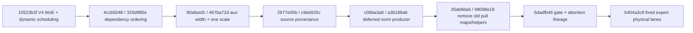

| 提交 | 主要逻辑变化 | 对应优化点 |
|---|---|---|
| `10523b3f` | V4 expert-lane dispatch/combine 与 runtime active-token 主体迁移 | C2/C3/G1 |
| `4ccb5048`, `326d985e` | 用真实 TaskId/阶段顺序约束远端通信依赖 | C1/C3 |
| `90afaed1`, `467ba72d` | 区分 aux 物理宽度与数学字段；scale 收敛为每 token 一列 | C2/D1 |
| `2677e05b`, `c9eb925c` | 保留并传递 source lane provenance，供 combine 唯一回写 | C2/C3 |
| `c06ba3a6`, `a3b186a6` | deferred norm/quant producer 与 UB 分块实现 | D1/G1 |
| `26ab8da6`, `98098e18` | 删除旧 pull map/helper，明确 dynamic-batch 产品合同 | C2/G1 |
| `5dadfb46` | gate 重回 resid/gamma/inv_rms 的 V4 数值 lineage | D1 |
| `b404a3c9` | 动态 compact expert slab 改为固定 expert physical lanes | C2/D2/G1 |

> 读取代码时以 `b404a3c9` 的产品逻辑为本轮设备验收基线；`563fe62a` 仅追加 image CI cleanup 与 `--skip-mtp`，不改变模型数学。

## Track C — MoE 通信协议

### PERF-C1 · shared window set + `moe_epoch` + `WaitCmp.Ge`（关键路径）✅ 已完成
- **完成证据**：`b404a3c9` 固定 expert physical lane base；BS1/2/16 单步 PASS，BS1 persistent 4-step PASS，row0 hidden 对 BS2/BS16 bit-identical。
- **问题**：historical per-layer communication stacks 让42次MoE调用各自持有一套EP窗口，增加常驻HBM、编译期window记账和whole-net生命周期复杂度。
- **V4-Flash 基线**：`origin/main:models/deepseek/v4-flash/decode_fwd.py` 在整网decode中只分配一套MoE communication windows；`moe.py` 使用单调 `moe_epoch`、`AtomicAdd` 与 `WaitCmp.Ge` 区分跨层复用的 metadata arrival、payload arrival 和 combine arrival。
- **如何生效**：step3p5 host只保留一套EP dispatch/combine data/control windows，并让每次MoE调用携带单调epoch。每个signal lineage的notify必须位于其真实producer完成之后，wait必须覆盖远端arrival；window再次被写入前，上一epoch的最终semantic consumer必须结束。
- **协议边界**：C1不规定current pull专属的 `2*epoch-1` ready / `2*epoch` read-complete双波，也不规定必须把多个语义阶段压进同一counter。迁移后的signal数量、epoch步长和是否对阶段分窗，应从V4-Flash数据流、step3p5 whole-net复用关系及runtime DAG推导。
- **window/shape**：目标是“一套满足模型上界的共享window”，不是复制V4-Flash示例shape。payload、metadata、route和control容量必须由step3p5的可配置capacity/route上界、local-expert ownership、INT8 scale物理padding和consumer ABI推导；probe中的peer slab或常量shape不得进入产品合同。
- **512B signal stride 口径**：
  - V4-Flash control signal可保持逻辑 `[N_RANKS,1] INT32`；512B不是通用signal ABI；
  - step3p5仅对同backing中stacked/reused且参与`notify`/`wait`/`AtomicAdd`的control slot使用512B物理隔离；
  - 逻辑访问仍只覆盖实际rank行；普通data window、独立compact signal和probe tensor不得机械扩成512B。
- **保护区**：attention/shared TP all-reduce 的 `tmp+signal` 窗口形状/数量/per-layer 隔离、固定peer累加顺序、FP32 accumulator和最终一次BF16 store保持不变。（**C4 更新**：collective 内部算法已由 full-mesh 换成 reduce-scatter + push all-gather，barrier 由 2 波变 3 波；上述四项不变量全部保留，故 C1 的窗口决策不受影响。）
- **验证**：source ownership/epoch合同 → canonical compile/lowered DAG → 多epoch设备liveness → batch=1/2/8/16 active-route telemetry → live精度与KV row-diff。低层probe只能证明表达能力。

#### 改造脉络、问题与经验（2026-07-28）

##### 示意图：共享 EP window 的 epoch 时序

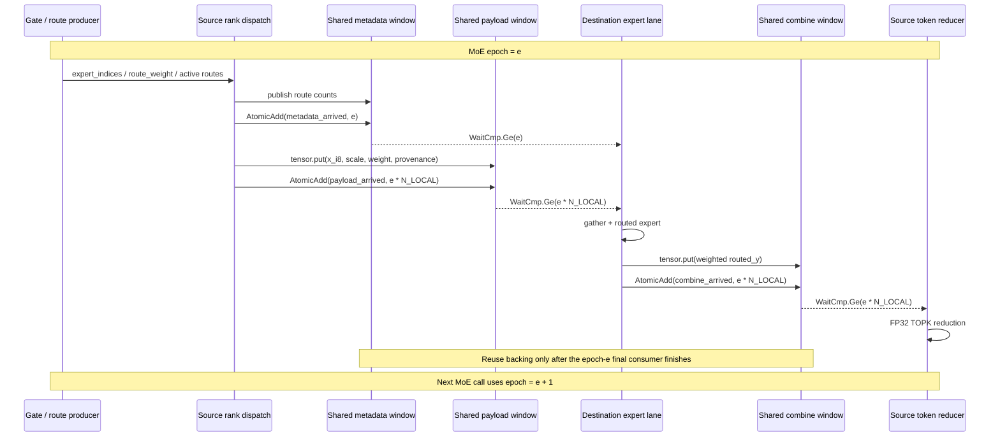

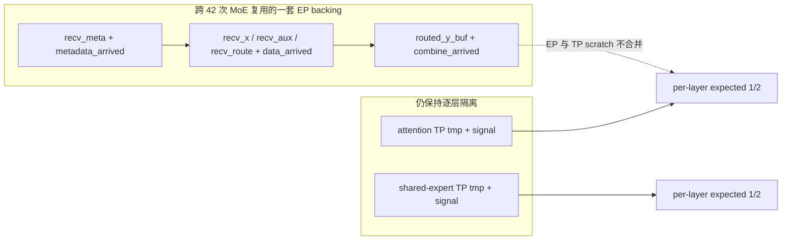


##### 代码符号对照

| 代码符号 | 作用 | 不变量 |
|---|---|---|
| `moe_epoch` | 标记第几次 MoE window 复用 | whole-net 单调 1..42 |
| `meta_arrived` | metadata 发布完成计数 | wait `>= moe_epoch` |
| `data_arrived` | 每个 local expert 的 payload 到达计数 | wait `>= moe_epoch * n_local_experts` |
| `combine_arrived` | 每个 local expert 的回写完成计数 | wait `>= moe_epoch * n_local_experts` |
| `COMM_SIGNAL_STRIDE_I32` | control slot 物理隔离 | 只改变 backing stride，不改变逻辑 rank 数 |

- **之前是什么样**：历史实现按 MoE 层堆叠 dispatch/combine data window 和 signal window，42 次调用各自拥有一套 EP storage；通信协议还带有 pull 时代的 ready/read-complete 双波语义。物理隔离直观，但常驻 HBM、编译期 window 记账和 whole-net 生命周期都被展开。
- **遇到的问题**：不能把“共享 window”简单理解成所有 signal 共用一个 counter，也不能把所有 512B signal 统一扩大。metadata arrival、payload arrival、combine arrival 是三条不同 producer→consumer lineage；attention/shared TP all-reduce 的 per-layer 固定阈值 scratch（C4 后为 `expected=1/2/3`）也不能和 EP 协议混用。只看 signal shape 或 probe 编译通过，也不能证明上一 epoch 的最终 consumer 已经结束。
- **之后是什么样**：whole-net 只为 EP dispatch/combine 保留一套共享的 `recv_meta/recv_x/recv_aux/recv_route/routed_y` backing 和 arrival signal。40 层 runtime loop 使用 `moe_epoch = layer_idx + 1`，specialized layer 使用后续 epoch，形成 1..42 的单调序列。dispatch 的 metadata wait 使用 `expected=moe_epoch`；payload/combine arrival 按 local-expert fan-out 使用 `expected=moe_epoch * n_local_experts`。C1 删除 pull 专属 `2*epoch-1/2*epoch` 合同，但没有删除阶段边界。
- **代码逻辑约束**：metadata notify 必须发生在 route count 发布后；payload notify 必须发生在所有远端 `tensor.put` 完成后；combine notify 必须发生在 routed output scatter 完成后。下一 epoch 只有在本 epoch 的最终 semantic consumer 完成后才能覆盖 backing。512B 只用于同 backing 中反复参与 `AtomicAdd/TWAIT` 的 control slot 物理隔离；逻辑 signal 仍是 rank 行，普通 data、MTP signal 和 attention/shared signal 不机械扩展。
- **经验**：通信优化必须先画出 `producer → remote put/notify → arrival wait → consumer → reuse` DAG，再折叠 storage；每新增阶段都要写清 epoch、expected 增长规则和最终 consumer。多 rank 不 hang 或单个 wait dump 正确，都不足以证明多 epoch liveness。

### PERF-C2 · 迁移 V4-Flash dispatch/combine 数据流 ✅ 已完成
- **完成证据**：gate/top-k 前各阶段 row0 bit-identical；修复固定 expert lanes 后 MoE 输出恢复 batch-extension invariance，未回退 V4 dispatch/combine。
- **目标**：以 `origin/main:models/deepseek/v4-flash/moe.py` 为唯一算法基线，替换current fixed-slot pull目标架构。
- **dispatch**：metadata统计与发布；metadata arrival wait；`pl.spmd(N_LOCAL)` expert-lane payload push；payload arrival wait；`pl.spmd(N_LOCAL)` expert-lane gather。每个expert block拥有不重叠的lane或由已证明offset划分的输出区间。
- **combine**：expert-lane scatter把已完成的 routed-expert 输出写回 origin route；arrival wait 观察所有远端写入；token-level reducer 按既定 TOP-K 顺序在 FP32 中累加 routed rows 与 shared-expert结果。
- **weight placement**：按 V4-Flash，route weight 随 dispatch metadata/payload 进入 expert lane，并在 routed expert 的 W2 epilogue 中与 activation/weight scale 一起完成缩放；combine 不再重复乘 route weight。若 step3p5 的数值 oracle 证明必须保留其他 placement，必须明确记录 rounding 边界和等价性，不能只因当前代码方便而保留。
- **step3p5适配**：保留 runtime dynamic active batch/token、可配置 physical capacity、KV holder/IPC ownership、step3p5 router/expert shape 与 canonical whole-net 入口。INT8 activation + scale、route weight 随 payload 携带、expert-lane scatter/reduce 均直接沿用 V4-Flash；只有 scale padding、capacity、route/count/map 表示和下游 tensor ABI 做参数化适配。
- **不再保留的目标**：fixed-slot peer-major `remote_load` pull、combine pull-back及其专属ready/read-complete协议仅作为历史回归对照，不再是C2完成态或production目标。
- **shape/ABI边界**：不得把V4-Flash示例的 `RECV_MAX`、probe的peer-major slab、`core_num=N_RANKS`、`task_dummy`或任何固定二维shape写成硬约束。实际容量必须证明不会overflow且满足512B storage/alignment和下游consumer ABI。
- **验证**：route/count/map oracle、write-disjoint ownership、remote arrival DAG、active/inactive route数、combine FP32顺序、multi-rank multi-epoch liveness、live precision。

#### 改造脉络、问题与经验（2026-07-28）

##### 示意图：pull 旧路径与 expert-lane 新路径


##### 示意图：动态 compact 为什么破坏 BS1

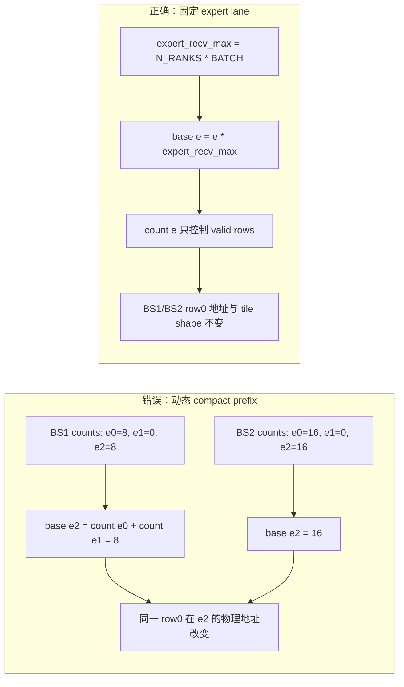

```text
local_recv_max
┌──────────────── expert 0: expert_recv_max rows ────────────────┐
│ source 0 slots │ source 1 slots │ ... │ source 7 slots         │
├──────────────── expert 1: expert_recv_max rows ────────────────┤
│ source 0 slots │ source 1 slots │ ... │ source 7 slots         │
├─────────────────────────────────────────────────────────────────┤
│ ...                                                             │
└──────────────── expert 35: expert_recv_max rows ───────────────┘

physical base(expert e) = e * expert_recv_max
valid rows(expert e)    = local_expert_count[e]
```


##### 代码符号对照

| 代码符号 | 改造后的含义 | 禁止重新引入的语义 |
|---|---|---|
| `expert_recv_max` | 单个 local expert 的固定 `[source, slot]` capacity | 不能由本次 route count 动态缩放 |
| `local_recv_max` | `n_local_experts * expert_recv_max` | 不能退回跨 expert compact prefix |
| `local_expert_count[e]` | expert `e` 的有效 row 数 | 不能决定 expert physical base |
| `local_expert_offset[e]` | 固定 `e * expert_recv_max` | 不能写成前序 count 累加 |
| `recv_aux[...,0/1]` | activation scale / route weight | padding 列无数学语义 |
| `recv_route` / source provenance | combine 回写的唯一地址来源 | 不能在 combine 阶段猜测或重建 |

- **之前是什么样**：step3p5 是 fixed-slot、peer-major 的 pull/pull-back；source 先写固定区域，destination 按 peer 顺序 TGET，combine 再依赖 inverse map 拉回。route owner、expert owner、输出 owner 分散在多套 map 中，难以保持 V4-Flash 的 expert-lane provenance。
- **之后是什么样**：gate 生成 active token 的 TOPK expert id 和 route weight；dispatch 统计 `(destination rank, local expert)` route count 并发布 metadata；source 用 `tensor.put` 推送 INT8 activation、per-token scale、route weight 和 source/route provenance；destination 按固定 `[expert, source, slot]` lane gather；W2 完成后按 provenance scatter 回 source-owned route buffer；source 在 combine arrival 后按 token/TOPK 固定顺序 FP32 reduce。pull/pull-back 仅保留为历史回归基线。
- **辅助 ABI 的问题**：scale 的逻辑语义应是 `[CAPACITY,1]`，早期多列辅助字段容易把物理宽度误当成数学字段；现在 `aux[0]` 是 activation scale、`aux[1]` 是 route weight，其余列仅用于 alignment。source provenance 必须由 dispatch producer 传入，combine 不能根据 route id 猜 source lane；route/count/map 必须从同一 producer 派生，不能由不同阶段重建。
- **决定性 BS1 问题**：初版 gather 后把 local experts 压成动态 prefix，`local_expert_offset[e] = sum(count[0:e])`。因此 BS1 增加相同 row1 后，只要其他 expert count 变化，后续 expert 的 physical base 就移动；最终表现为 attention、post-norm、gate/top-k 全部 bit-identical，但 `moe_out` row0 不同。
- **最终代码改动**：恢复固定 expert lane：
  ```text
  expert_recv_max = n_ranks * BATCH
  expert_base(e)  = e * expert_recv_max
  local_recv_max  = n_local_experts * expert_recv_max
  row(e, source, slot) = expert_base(e) + source_prefix + slot
  ```
  `local_expert_count[e]` 只决定 valid rows；`local_expert_offset[e]` 固定为 `e * expert_recv_max`，dispatch gather、routed expert、combine 全部直接使用相同 base。这样添加 row1 不会改变 row0 的物理地址、tile shape 或 codegen 路径。
- **经验**：不要只在 dispatch/gather/expert/combine 内二分；先检查端到端不变量“添加相同 row1 不得改变 row0”。固定 capacity 是通信/执行 ABI，不是逻辑 batch；若以后 compact，必须证明 indirection 不改变地址 lineage、kernel shape 和 source provenance。

### PERF-C3 · expert-lane SPMD 与 whole-net 调度适配 ✅ 已完成
- **完成证据**：最终 candidate 镜像 Main 8-step PASS；N=256 hidden finite `256/256`、TP spread `0`。
- **目标**：在C2的V4-Flash数据流上完成可编译、可调度的expert-lane fan-out，而不是重新选择是否保留pull。
- **调度轴**：dispatch push/gather与combine scatter按local-expert lane并行；token reducer按token稳定轴并行或采用语义等价实现。worker只计算，不在InCore中递归submit；不得用`pl.parallel`伪装带状态通信并行。
- **真实依赖**：payload-arrival wait必须依赖完整scatter/push；gather依赖metadata与payload arrival；token reduce依赖combine arrival。local RAW不能替代远端arrival，fake scalar或`x*0`不能制造依赖。
- **whole-net适配**：与C1共享window/epoch、G1 active-token、42次MoE调用和现有expert/shared路径闭合；最终consumer完成前不得复用window。
- **非约束项**：`pl.spmd`与captured TaskId是V4-Flash参考表达；若当前frontend需要等价submit形式，只能做最小ABI适配。peer slab、`spmd_submit`、`task_dummy`、sole reducer及probe tensor shape都不是验收硬门槛。
- **保护区**：不改canonical入口、KV ownership、TP all-reduce、top-k FP32累加顺序和最终BF16 store。（TP all-reduce 的算法替换由 C4 单独承担，不在 C3 范围内。）
- **验证**：source/alias合同 → parser/compile → lowered TaskId/DAG → 2-rank/8-rank write-disjoint与多epochliveness → batch=1/2/8/16 DFX → live精度与性能。

#### 改造脉络、问题与经验（2026-07-28）

##### 示意图：任务 DAG 与写入 ownership

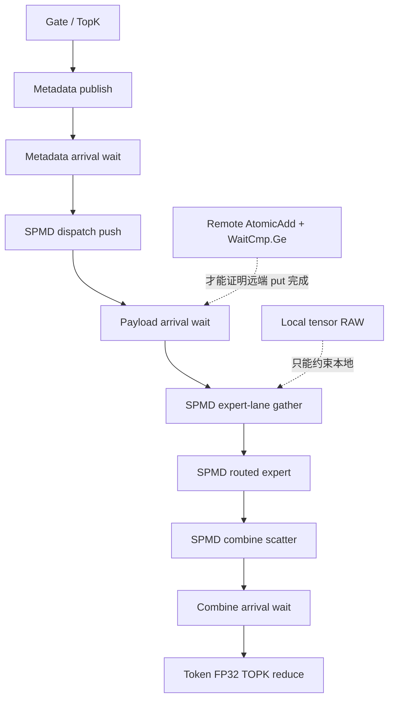

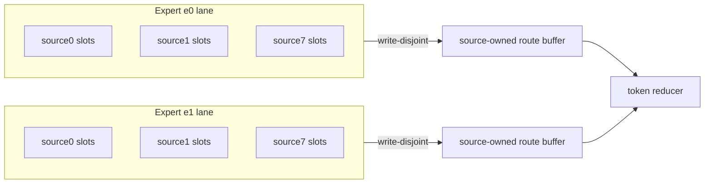

> 每个并行阶段都必须回答：lane key 是什么、写入地址是什么、谁 notify、谁 wait、最终 consumer 是谁。`pl.spmd` 或 `task_dummy` 本身不是正确性证明。


##### 代码符号对照

| 阶段/符号 | 并行 ownership | 完成条件 |
|---|---|---|
| `dispatch_push` | source route → destination expert lane | payload `tensor.put` + arrival notify |
| `dispatch_gather` | local expert 固定区域 | payload wait 已满足 |
| `_expert_routed*` | expert × tile × hidden/intermediate feature | 仅处理 `local_expert_count[e]` valid rows |
| `combine_scatter` | expert output → source-owned route slot | write-disjoint put + arrival notify |
| `combine_reduce` | active token × TOPK | combine wait 后按固定顺序 FP32 累加 |

- **之前是什么样**：pull 路径按 peer 顺序组织通信，设备并行围绕固定 batch/peer 展开。迁移后若只把循环机械改成 `pl.spmd`，可能有并行却没有远端 arrival 依赖；若加入 fake scalar、`x*0` 或 `task_dummy`，又只是制造假依赖。
- **之后的阶段顺序**：metadata publish → metadata wait → payload push → payload wait → expert-lane gather → routed expert → combine scatter → combine wait → token reduce。worker 只计算，不在 InCore 中递归 submit；local RAW 不能替代远端 `tensor.put` 完成通知。
- **代码 ownership**：dispatch push/gather 和 combine scatter 以 local expert 为 lane；每个 expert 区域是 `[e*expert_recv_max,(e+1)*expert_recv_max)`，互不重叠。routed expert 以 `RECV_TILE` 分块并用 `tile_valid/valid_shape` 屏蔽尾部；combine 依据 source/route provenance 写回 source-owned route buffer，sender/expert 的 put 必须 write-disjoint。
- **whole-net 问题**：40 层 MoE 在 runtime `pl.range` 内，另有 L43/L44 specialization；所有调用点必须保持 dispatch/expert/combine 参数和 epoch 语义一致。EP window epoch 为 1..42，attention/shared TP scratch 仍保持 per-layer 固定阈值（C4 后 `expected=1/2/3`），不能因为共处 mega-kernel 就混为一类。
- **经验**：`pl.spmd`、captured TaskId、peer slab、`spmd_submit`、`task_dummy` 和 probe shape 都不是 production 架构判据。真正硬约束是 lane key、写入地址、notify、wait、最终 consumer、write-disjoint 和 reduction 顺序；无法回答这五类问题的并行化不应合入 whole-net。

---

### PERF-C4 · TP all-reduce：full-mesh → reduce-scatter + push all-gather ✅ 已完成
- **完成证据**：pypto-lib `cfbdcce8`（配 pypto `6933b1aa` / simpler `8459d60f`）；已发布镜像 `stepfun-develop-20260729-allreduce-push`（digest `sha256:7924925f…`）。整网 CI PASS，`hidden_tp_spread` 在 ci/main + 3 次 repeat 共 32 步全 `0.0`；ITL p50 −3.64%(ctx=1024) / −3.88%(ctx=4096)。⚠ 该收益属 ctx ≤ 4096 工作点；64k 相对收益必然更小，见 [`../../benchmark/2026-07-28-tp-allreduce-push.md`](../../benchmark/2026-07-28-tp-allreduce-push.md) §1/§2b。
- **位置**：`models/step3p5/decode_fwd.py::WholeDecodeStep3p5.tp_all_reduce`（`@pl.function(type=pl.FunctionType.InCore)`）。调用点 5 处：`attention_full.py:819`、`attention_swa.py:828`、`dense_mlp.py:240`、`decode_fwd.py` 两处 `expert_shared_step`；共 45 层 × 2 = 90 次调用。
- **设计依据边界**：[`03-tp-allreduce-algorithm-comparison.md`](03-tp-allreduce-algorithm-comparison.md) 给出算法选型与 device 侧耗时，但其 §5 原方案（pull 形式 all-gather）**落整网即 8 卡不一致**，已在该文 §5 首就地修正。V4-Flash **没有** TP all-reduce（其 TP seam 是 all-gather hidden + 复算），因此本项没有可直接照搬的 DeepSeek 实现，只沿用其 collective 写法约定（push-then-notify、loop-constant offset、window write-once 语义）。
- **算法步骤**（`shard = HIDDEN/tp_size = 512`，`P=8`）：
  1. **stage-in**：把**其它** rank 拥有的 shard 写进我的 `tmp_window`（跳过自己那段，使每列在整次调用内只有单一 writer）。`pl.parallel`。
  2. **wave 1**：notify 全 peer + wait 全 peer `Ge 1`。`pl.parallel` 扇出。
  3. **reduce-scatter**：只归约我拥有的那一段——`own_tile` 从 `local` 读，其余 7 份从 peer 的 `tmp_window` `remote_load`，按 canonical peer order `0..P-1` 用**单个 FP32 accumulator** 累加，只做**一次** BF16 cast；结果写进 `local`，并 `pld.tile.remote_store` **push** 给每个 peer。累加循环保持 `pl.range`（有 carried 依赖，且避免并发重读打满 HCCS）。
  4. **wave 2**：notify + wait `Ge 2`。
  5. **all-gather**：**纯本地** `pl.load` 读回各 owner 已推来的 shard → 写 `local`。barrier 之后**零远端访问**。
  6. **wave 3**：completion barrier `Ge 3`，沿用改前"返回前所有 peer 已用完本窗口"的合同。
- **为什么 all-gather 必须是 push**：`本地 store → 远端 notify → peer 远端 remote_load` 是**跨方向**握手，payload 落我方 HBM、notify 落对方 HBM，本地 `V→MTE3` fence（codegen 已确认存在）管不到对方的读。mesh 每次调用只有 **1 个**带数据依赖的 pull barrier，pull 形式 twophase 有 **2 个**，暴露翻倍 → 由"侥幸不中"变"几乎必中"。与 03 文档 §5 判 ring 不可用是同一上游缺口。根因链与 12 个被证伪假设见 [`postmortems/13`](../../postmortems/13-tp-allreduce-pull-notify-race.md)。
- **通信量**：每卡远程传输 `56 → 14`（7 pull + 7 push），每卡远程字节 `7×N=896KB → 1.75×N=224KB`；barrier `2 → 3`。窗口形状/数量/per-layer 隔离**不变**（`[BATCH,HIDDEN]` BF16 + `[128,1]` INT32 × 4 类 stack）。
- **数值合同**：与 mesh **bit-identical**——canonical peer order `0..P-1`、单一 FP32 accumulator、每元素恰好一次 BF16 cast/store 全部保留；且一个 shard 只由一个 rank 归约后广播，rank 相关 rounding 在结构上被消除。
- **顺带修复**：`dense_mlp.py:240` 与两处 `expert_shared_step` 原本写成 `self.tp_all_reduce(...)` 丢弃返回值，依赖对普通 `pl.Tensor` 入参的原地副作用。`local` 非 `Out`/`InOut`，只有 `x = f(x)` 才强制 must-alias——违反 dev-constraints §1.1，已全部改为赋值。
- **保护区 / 未动项**：canonical 入口、窗口 ABI（形状/数量/512B stacked stride）、EP dispatch/combine 协议与 `moe_epoch`、KV ownership、MTP 的 compact signal 均未改动。
- **残留与后续**：wave 1 的 stage-in **仍是 pull**，同类弱序依赖仍在，但**暴露量与改前 mesh 相同（各 1 个）**，不构成回归。要彻底消除需 stage-in 也改 push：不新增窗口时（rank r 把对 shard s 的贡献推到 peer s 窗口第 `r*shard` 列，8 来源 × 512 列 = HIDDEN 刚好装下）会因"推 reduced shard 会覆盖 peer 尚未消费的 stage-in 数据"而需要第 4 个 wave；要避免则需第二个窗口（host ABI 改动）。**记为独立后续项。**
- **验证口径**：compile → 站点二分（mesh/twophase 并存，一次只切一类调用点）→ 重复采样的 `hidden_tp_spread`（race 必须重复，单次绿不算）→ 整网 CI → ITL。数据见 [`benchmark/2026-07-28-tp-allreduce-push.md`](../../benchmark/2026-07-28-tp-allreduce-push.md)。

---

## Track D — INT8-native W8A8 MoE（gap-5）

### PERF-D1 · gate deferred-norm + dispatch-side INT8 量化 ✅ 已完成
- **完成证据**：post-norm/gate/top-k BS1 与 BS2 row0 bit-identical；BS1 根因不在 deferred norm producer，D1 保持不回退。
- **问题**：当前 step3p5 的 gate/norm/quant 数据流尚未完全按 V4-Flash 的 deferred-norm 语义收敛，不能把“INT8 activation + scale”误写成 step3p5 新能力。
- **shape**：V4-Flash 基线输出 `x_norm_i8 [CAPACITY,4096]` INT8、`x_norm_scale [CAPACITY,1]` FP32 和 router logits；step3p5 只参数化 `CAPACITY`、router shape、bias 和现有 norm 数学，runtime active rows 有效。
- **如何生效**：沿 V4-Flash 同一条 producer-to-consumer 链，在一次 norm/amax 过程中形成可复用的 INT8 activation 与 dequant scale，并供 gate、dispatch、shared expert 使用；不得把已有的 INT8+scale transport 重新设计成 step3p5 独有 ABI。
- **参考**：`REF/gate.py:103-140`、`:152-170`。
- **改法**：对照 `REF/gate.py` 的 deferred-norm、per-token quant 和 scale 定义，收敛 step3p5 的 producer、payload 和 consumer；scale 统一按 V4-Flash 的 `[CAPACITY,1]` 逻辑语义，物理 padding 仅由 capacity/alignment 决定。
- **验证**：gate 输出 vs BF16 参考 `ratio_allclose`（单元级）。
- **边界**：独立数值 track，与结构线零耦合。

#### 改造脉络、问题与经验（2026-07-28）

##### 示意图：deferred RMSNorm producer 与三个 consumer

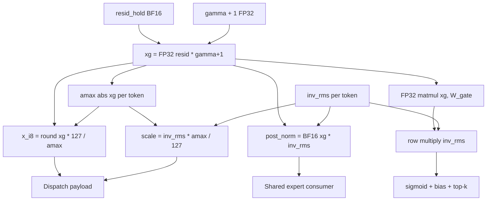

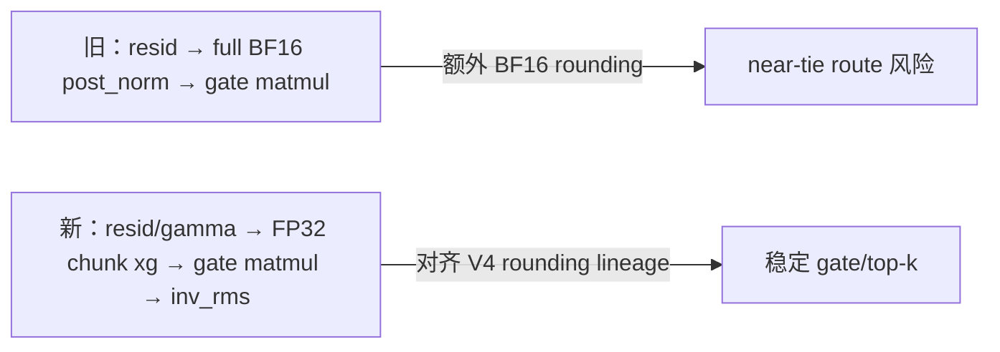


##### 代码符号对照

| 代码符号 | dtype/shape | consumer |
|---|---|---|
| `resid_hold` | BF16 `[BATCH,HIDDEN]` | deferred norm 与 gate 的共同原始输入 |
| `moe_inv_rms` | FP32 `[BATCH,1]` | post-norm、dispatch scale、gate logits |
| `post_norm` | BF16 `[BATCH,HIDDEN]` | shared expert / residual 路径 |
| `x_disp_i8` | INT8 `[BATCH,HIDDEN]` | routed expert dispatch |
| `x_disp_scale` | FP32 `[BATCH,1]` | routed W1 dequant |
| `_gate(resid,...,inv_rms)` | chunked FP32 | sigmoid/bias/top-k |

- **之前是什么样**：post-attention residual 先完整生成 BF16 `post_norm`，gate、dispatch/shared expert 再消费该 tensor；scale 也曾按多列辅助字段传输。这样虽然能跑，但把 V4 deferred-norm 拆成了额外 BF16 rounding 边界。
- **数学与代码改动**：令 `xg = resid * (gamma+1)`，`inv_rms` 为每 token RMS 倒数。一次 `_norm_quant_moe_input()` producer 输出 BF16 `post_norm = BF16(xg*inv_rms)`、FP32 `moe_inv_rms [BATCH,1]`、INT8 `x_disp_i8` 和 FP32 `x_disp_scale [BATCH,1]`；量化 scale 为 `inv_rms * amax(xg) / 127`。gate 不再直接把 BF16 post_norm 当唯一输入，而是按 K chunk 在 FP32 重建 xg，完成 gate matmul 后再乘 `inv_rms`，然后 sigmoid、bias、top-k。
- **为什么要 chunk-wise**：当前 backend UB 无法稳定保留完整 `[BATCH,HIDDEN]` FP32 xg，因此按 K chunk 重算 gamma/`xg`；这是 storage/backend 适配，不是改变数学 lineage。active rows 通过 `active_tokens/valid_shape`，inactive rows 不进入 gate、量化和 dispatch。
- **遇到的误区**：BS1 最终 token 曾仍为 `6127`，容易误判成输入输出透传或 deferred norm 失效；中间 dump 证明 attention/resid、post-norm、gate/top-k 均与 BS2 row0 bit-identical，故 D1 不是根因。后续必须把 producer input、`inv_rms`、scale、gate consumer 一起 dump，不能只看最终 token。
- **经验**：文档必须同时标出 dtype、scale 定义、consumer 应用点和每个 cast/round 边界；`norm→BF16→matmul` 与 `FP32 xg→matmul→inv_rms` 公式相似但 rounding 不同，可能改变 near-tie route。

### PERF-D2 · routed expert INT8×INT8 + requant 链 ✅ 已完成
- **完成证据**：route weight 仍只在 W2 epilogue 乘一次，combine 仅 FP32 reduce；固定 expert lane 后 BS1/2/16 通过。
- **问题**：step3p5 当前已经具备部分 INT8×INT8、scale 和 intermediate requant 路径；剩余工作是按 V4-Flash 统一 expert-lane、tile/pipeline、scale 和 W2 epilogue 语义，而不是从 BF16 重新发明 INT8 架构。
- **shape**：V4-Flash 基线是 per-rank local experts、INT8 activation + per-row dequant scale、INT8 routed weights、INT32 accumulation、intermediate per-row requant 和 BF16 output；step3p5 仅参数化 36 experts、`HIDDEN=4096`、`INTER=1280`、capacity 和下游 ABI。
- **如何生效**：直接对齐 V4-Flash 的 INT8 cube、pipeline、`QUANT_TILE=512` data-tile 以及 W2 epilogue：`activation_scale × intermediate_scale × route_weight × w2_scale` 在 expert lane 完成，之后 scatter BF16 routed output，combine 只做 FP32 token reduction。
- **参考**：`REF/expert_routed.py:88-158`（K_TILE=512 `pl.pipeline(stage=2)`）、`:160-175`（requant）。
- **改法**：以 `REF/expert_routed.py` 为模板收敛当前 routed expert 的 producer/consumer placement；只修改 step3p5 shape、weight layout、capacity 和 backend 必要适配。`QUANT_TILE=512` 仅属于 data tile/cache/MTE 性能对齐，不得与 control-signal 512B stride 混写。
- **验证**：多步 L3（N=128 ≥95% vs vanilla）+ 逐层 detail（当前 BF16-dequant 是待替换的临时路径）。
- **边界**：D1 之后；这是 V4-Flash 数据流迁移与 step3p5 shape 适配，不是新建独立 INT8 架构。

#### 改造脉络、问题与经验（2026-07-28）

##### 示意图：W8A8 routed expert 的 scale 与 rounding 链

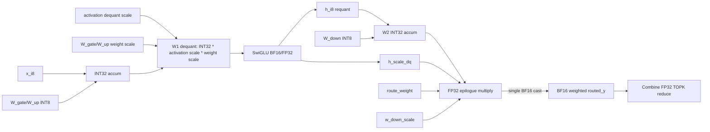

```text
W2 epilogue:
  y_fp32 = FP32(y_acc) * h_scale_dq * route_weight * w_down_scale
  routed_y_bf16 = BF16(y_fp32)

Combine:
  token_fp32 = shared_y + Σ(topk routed_y_bf16)
  # route_weight must NOT be multiplied again here
```


##### 代码符号对照

| 代码符号 | 数值语义 | rounding 边界 |
|---|---|---|
| `local_routed_x_scale` | W1 activation dequant scale | W1 INT32 accumulate 后应用 |
| `h_scale_dq` | SwiGLU intermediate requant 的反 scale | W2 INT32 accumulate 后应用 |
| `local_routed_weight` | route weight | 只在 W2 epilogue 应用一次 |
| `w_down_scale` | W2 per-output-channel scale | W2 epilogue 应用 |
| `local_routed_y` | 已加权 BF16 expert output | combine 前唯一 BF16 cast |
| `combine_step()` | FP32 TOPK reduction | 不再读取 route weight |

- **之前是什么样**：已有 INT8 cube、INT32 accumulate、intermediate requant 和 W2，但 route weight、activation/intermediate/W2 scale 的应用位置没有完全统一，combine 还容易沿用旧逻辑再次处理 route weight。
- **之后的数值链**：lane 携带 `x_i8`、activation scale、route weight、provenance；W1 gate/up 为 INT8×INT8→INT32；SwiGLU 后按 row amax/requant 得到 INT8 intermediate 和 `h_scale_dq`；W2 为 INT8×INT8→INT32；W2 epilogue 应用 `FP32(y_acc) * h_scale_dq * route_weight * w_down_scale` 后才 cast BF16；combine 只按 TOPK 固定顺序做 FP32 reduction。
- **关键问题**：route weight 若在 expert epilogue 和 combine 都乘会平方；若推迟到 combine，则 BF16 routed output 已先 rounding。当前 contract 明确 `combine_step()` 不出现 route weight，weight 只在 routed W2 epilogue 乘一次。
- **tile 与 BS1 问题**：固定 expert capacity 按 `RECV_TILE` 处理，`local_expert_count[e]` 只生成 `tile_valid`；`set_validshape/fillpad` 只处理尾 tile，不能改变 expert base。早期把 BS1/BS2 差异怀疑为 `tile_valid=8/16` SIMD 行为，固定 lane 后恢复，说明根因是动态 expert base，不是单行 expert 数学。
- **经验**：W8A8 必须记录 `producer value + scale definition + transport field + consumer multiply point + cast/round boundary`。`QUANT_TILE=512` 是 data tile/cache/MTE 语义，`COMM_SIGNAL_STRIDE_I32=128` 是 control signal 隔离，两个“512B”不能混写。

---

## Track E — LM head

### PERF-E1 · LM head 4 段 decoupled + 复用 `recv_x_buf`
- **问题**：历史 unroll Main 曾把 `lm_head_orch` inline 进同一 program；当前 canonical Main 已收敛为 hidden-only，不再包含 LM head。
- **shape**：输入hidden `[CAPACITY,4096]`/rank；`lm_head_weight [16112,4096]`/rank（vocab切8）；输出logits shard `[CAPACITY,16112]`/rank → 全vocab `[CAPACITY,128896]`，仅runtime active rows有效。
- **如何生效**：现状 LM head 与末层 MoE 串行、且单独占 buffer。拆 4 段 worker（publish→tp→route→finish）后：(a) publish段（仅发送runtime active hidden rows）可与末层 MoE 的 combine 段**在调度上重叠**；(b) 4 段**复用 MoE 的 `recv_x [1024,4096]` 窗口**作 hidden/logits 中转（MoE 与 LM-head 时分不冲突）→ 复用按capacity上界分配的logits中转buffer。
- **参考**：`REF/lm_head.py:433-515` + `REF/decode_fwd.py:877-901`。
- **改法**：拆 `publish → tp → logits_route → finish` 四 worker，各 `device=r`；复用 `recv_x_buf`。
- **验证**：logits L3 parity + 端到端延迟下降。
- **边界**：该项只能落在 vLLM tail/backend seam，不得把 LM head 重新塞回 canonical hidden-only Main；是否继续实施需单独重审。

---

## Track F — intra-kernel L1/L0 微调

### PERF-F1 · attention `late_dep=task_dummy(deps)` + `allow_early_resolve`
- **shape**：full-attn内`qr_proj`（q `[CAPACITY,1024]`）与`kv_proj`（k/v `[CAPACITY,128]`）+ 前置RMSNorm（`[CAPACITY,4096]`）；仅active rows参与逻辑计算。
- **如何生效**：现状 rms → qr_proj → kv_proj 依赖链偏串行。让 rms 返回 TaskId，kv_proj 挂 `task_dummy(deps=[rms_tid])` 落后 qr_proj 一拍 + scope `allow_early_resolve=True` → qr_proj 与 kv_proj 在 cube/mte 上重叠，藏住 kv_proj 延迟（k/v feature维较小，batch维仅是capacity上界）。
- **参考**：`REF/decode_attention_swa.py:144`、`REF/rmsnorm.py:35-56`、`REF/moe.py:133,182,241,251`。
- **改法**：`P/models/step3p5/attention_full.py` / `attention_swa.py` 加 tid 返回 + `task_dummy` deferral + `allow_early_resolve`。
- **验证**：L3 parity + L2 swimlane 显示 qr/kv 重叠。
- **边界**：A1 出数后评估收益；独立。

### PERF-F2 · matmul pipeline stage 调优 + MTE 512B 对齐
- **shape**：热点matmul——dense `[CAPACITY,4096]×[4096,1408]`、MoE expert `[active_rows,4096]×[4096,1280]`、LM head `[CAPACITY,4096]×[4096,16112]`；M维有效范围由runtime active count决定；K dim = 4096（大）。
- **如何生效**：K=4096 的 matmul 用 `pl.pipeline(stage=2)` 双缓 K-loop；最大 K（如 LM head/input-proj）升 `stage=4` 让 MTE 搬下一块与 cube 算当前块重叠。按 A1 `perf_hints.log` 把非 512B 对齐的 MTE 搬运补齐（INT8 行 512B / BF16 行 512B）→ 消 MTE 停顿。
- **参考**：`REF/expert_routed.py:97,110,167,185`、`P/docs/performance-tuning.md:220,296,263`。
- **改法**：依 A1 hints/PMU 调各 matmul `pl.pipeline(stage=)`；补 MTE 512B 对齐。
- **验证**：PMU cube 利用率↑ + L3 parity。
- **边界**：**需 A1**（照 hints 调，不盲调）。

### PERF-F3 · RMSNorm+quant fused deferred-norm（复用）
- **shape**：dense/attention前的RMSNorm输入 `[CAPACITY,4096]`，仅runtime active rows有效。
- **如何生效**：把 D1 的 deferred-norm（一遍出 norm+scale，不 per-element 应用 `inv_rms`）套到 dense/attention 的 RMSNorm 路径 → 每处省一遍capacity buffer上的全量pass，并避免处理inactive rows。
- **参考**：`REF/rmsnorm.py`、`REF/gate.py`（deferred-norm 同源）。
- **改法**：复用 D1 的 fused norm。
- **验证**：L3 parity。
- **边界**：随 D1。

---

## Track G — 调度轴 / 动态 batch

### PERF-G1 · experts/feature 调度轴 + runtime dynamic active batch/token（对齐DeepSeek）✅ 已完成
- **完成证据**：BS1/2/16 `6127→303`、TP spread `0`；BS1 persistent 4-step 与 row0 batch-extension exact。
- **问题**：current实现把默认capacity实例（历史配置为`BATCH=16`）同时当作formal shape、调度轴和逻辑batch，并在常见decode batch较小时计算或保留inactive padding rows。该数值是当前配置实例，不是step3p5产品硬约束。
- **目标语义**：每次调用由runtime active batch/token决定逻辑范围。owner-vector在whole-net入口汇总出一致active count，并传入attention、gate、dispatch、routed/shared expert、combine、residual和KV写入路径。
- **capacity合同**：若frontend要求静态formal shape，使用可配置`CAPACITY`作为physical storage上界，并满足shape/alignment要求；`CAPACITY`不得被解释为逻辑batch。所有kernel必须通过runtime loop bound、`valid_shape`、predicate或等价机制屏蔽`[active, capacity)`。
- **调度轴**：token轴是runtime bound；稳定并行轴优先使用local experts、expert columns、intermediate和hidden feature。不得为了静态编译继续把capacity轴当作唯一core fan-out。
- **attention/KV**：attention只计算active rows；KV只写active token对应的真实slot。历史固定16-row padding和allocator-owned padding reserve只作为current实现/编译风险记录，不是目标ABI，也不能作为保留inactive KV写入的理由。
- **通信**：C2/C3的V4-Flash expert-lane dispatch push/gather与combine scatter/wait/reduce只处理active routes/rows；window按capacity上界分配，但notify/count/route语义按本次active count运行。
- **参考**：`REF/decode_fwd.py`的owner-vector max，`REF/moe.py`的runtime `active_tokens`与expert-lane `pl.spmd`，以及V4-Flash attention中的runtime token循环。
- **验证**：至少覆盖runtime active batch/token `1/2/8/16`，并覆盖至少一组非16 physical capacity配置；检查active/inactive数值、route count、KV row-diff、window overflow、lowered predicate/valid bound、L3精度和设备DFX。默认16配置通过不能证明dynamic合同完成。
- **边界**：若某frontend版本不能表达所需dynamic bound，应记录当前ABI限制并使用可配置capacity适配；不得把该限制升级为模型固定batch或永久padding/reserve合同。

#### 改造脉络、问题与经验（2026-07-28）

##### 示意图：physical capacity 与 logical active rows 分离

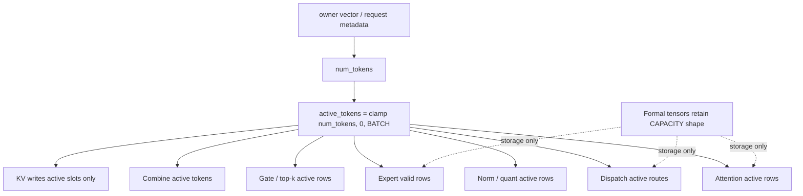

##### 示意图：batch-extension invariance

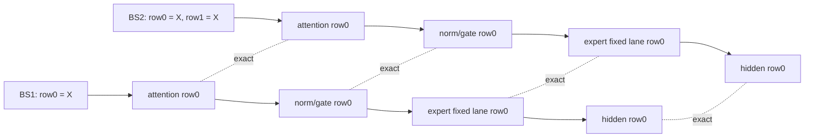

```text
动态 batch 的完整合同：
1. inactive row 不参与计算、通信、reduce 或 KV write；
2. active row 的 physical address 不依赖其他 row 的存在；
3. 增加相同 row1 后，原 row0 每个阶段和最终 hidden 保持 exact。
```


##### 代码符号对照

| 代码符号 | physical / logical 角色 | 不变量 |
|---|---|---|
| `BATCH` / `CAPACITY` | formal storage 上界 | 不是本次逻辑 batch |
| `num_tokens` | runtime 输入 | 各 stage 的 active count 来源 |
| `active_tokens` | clamp 后逻辑范围 | inactive rows 不计算/通信/KV write |
| `expert_recv_max` | expert 固定 physical capacity | 不随 `active_tokens` 改变 |
| `local_expert_count[e]` | 本次有效 route 数 | 只影响 valid rows |
| row0 batch-extension diff | 跨 batch 正确性 oracle | BS1 row0 必须与复制成 BS2 后 exact |

- **之前是什么样**：`BATCH=16` 同时承担 formal storage、循环上界和设备并行轴；即使 holder 传入 active count，部分 attention/MoE/combine 仍可能按 capacity 运行并保留 padding/KV reserve。BS2/8/16 正确不能外推 BS1。
- **之后的 active-token 逻辑**：whole-net 从 owner vector 得到 `num_tokens`，各阶段 clamp 为 `[0,BATCH]` 的 `active_tokens`。attention、norm/quant、gate/top-k、dispatch、routed/shared expert、combine 和 KV 只处理 active rows；formal tensor 仍可保留 capacity shape，但 inactive 区间只是 storage，不是逻辑 batch。
- **调度轴改动**：token 变成 runtime sequential bound；gate 使用 expert-column chunk `pl.spmd`，routed expert 使用 local-expert/intermediate/hidden feature fan-out，避免把 capacity 轴当唯一 core fan-out。
- **决定性问题**：初版 active guard 虽然覆盖循环，动态 compact expert slab 仍使用 route count prefix 改变 expert base，导致 BS1 row0 被 row1 的存在影响。因此 dynamic batch 的合同不只是“inactive row 不计算”，还必须满足 batch-extension invariance。
- **最终代码逻辑**：physical capacity 固定、valid count 动态；每个 expert 永久拥有 `expert_recv_max=n_ranks*BATCH` 行，`local_expert_count[e]` 只控制 valid rows，不控制 physical base；inactive route 不 notify、不 reduce、不写 KV。
- **调试和 dump 经验**：验收必须同时看 token、关键阶段/每层 hidden、TP spread、finite/nonzero、route metadata 和 batch-extension row diff。dump 程序先做 hook 生效自检，并记录 step/layer/stage/rank/active-batch；只看最终最重 token 或只看单层 hidden 都不足以定位问题。
- **后续边界**：已验证 BS1/2/16、BS1 persistent 4-step、candidate Main 8-step 和 N=256 hidden finite/TP spread=0；非默认 physical capacity 与空间压缩仍需额外证明，任何 compact 优化都不能破坏 batch-extension invariance。

---

## Track H — host 侧 per-step 开销

> Track A–G 的口径都是 device 侧。A1 建完 baseline 后首次做 host/device 分账才发现：ITL 85 ms 里
> **只有 ~55 ms 是 device 执行**，约 25 ms 花在 host 上，其中一项独占 21.5 ms。本 track 收这部分。
> 分账方法与全部数据见 [`benchmark/2026-07-29-host-window-memset.md`](../../benchmark/2026-07-29-host-window-memset.md)。

### PERF-H1 · retained window 清零：host 搬零 → device `aclrtMemset` ✅ 已完成

- **完成证据**：simpler `e2efebcb`（over `8459d60f`）+ pypto `1f704616`（over `ce7fcb64`，含 runtime gitlink bump）。
  同镜像 A/B：`main_hidden_8step` 两边 `rc=0 passed=True`，`main_hidden_only_report.json` **除 `run_sec` 外逐字段相同**
  （tokens / `token_exact` / `hidden_finite` / `hidden_tp_spread=0.0` / `hidden_row0_abs_max` 元素级相同）；
  清零 `21.50 → 2.21 ms`，ITL p50 `85.02 → 65.55 ms`（**−22.9%**）；单测 8/8。
  ⚠ CI 整体 rc=1 但**两边同样**失败在 `mtp_hidden_single`（缺未挂载的 host fixture），与本项无关。
- **位置**：`pypto/python/pypto/runtime/distributed_runner.py::DistributedWorker._reset_persistent_domains`
  （`+12/-0`）；`simpler/python/simpler/worker.py` 新增 `_CTRL_MEMSET=19` / `_MEMSET_COUNT`/`_MEMSET_RECORD` codec /
  `_encode`+`_decode_memset_payload` / `_handle_ctrl_memset` / child dispatch 分支 / `Worker.memset_all` /
  `Worker.device_memset_available`（`+120/-0`，**纯新增**）。
- **问题**：`persistent=True` 为省掉每步 domain alloc/free 而**保留**窗口，再手工还原成 fresh-allocation 状态；
  但还原手段选错了——按 `_PERSISTENT_ZERO_CHUNK_BYTES=1 MiB` 分段 `orch.copy_to`，
  每段一次**阻塞** `CTRL_COPY_TO` mailbox 往返。step3p5 单 domain `comm_d0` per-rank `30.58 MiB`
  ⇒ 每步 **31 段 × 8 卡 = 248 次串行往返 + 244.7 MiB H2D**。
  而 backend 给 fresh window 清零用的是 **device 侧 `aclrtMemset`**（`src/a2a3/platform/onboard/host/comm_hccl.cpp`，
  `alloc_domain` 尾部），零 PCIe。**同一个仓库里两条路径做同一件事，persistent 那条选了贵的。**
- **算法步骤**：
  1. host 用 `handle.workers` 组出 `{worker_id: (local_window_base, actual_window_size)}`，
     经 `_config["device_ids"]` 映射成 `{device_id: (base, nbytes)}`（child 只知道自己的物理 device id）。
  2. 保留改前的 provenance 检查 `_child_prov_require_live(worker_id, base, api="memset_all", size=nbytes)`
     —— 单次 memset 拿 base + 全长，本身就是一条已登记 allocation，不再依赖 interior-pointer 放行。
  3. `broadcast_control_all(NEXT_LEVEL, _CTRL_MEMSET, payload)`：payload 一次 staged 进 POSIX shm，
     **每个 child 一个 `std::thread` 并发下发再 join**（`worker_manager.cpp` `broadcast_control_all`）。
  4. child 内 `ctypes` 调 `aclrtMemset(base, nbytes, 0, nbytes)`。payload 里**没有本 device 记录 = no-op**，
     以支持只覆盖部分 chip 的 subset domain。
- **语义等价论证**：地址区间与字节数不变（同 `local_window_base` / `actual_window_size`）、填充值不变、
  `aclrtMemset` **同步**、`broadcast_control_all` join 全部 child 后才返回 ⇒ 「8 卡清零全部完成才 `entry_fn` 下发」
  这条 happens-before **不变**。这条很关键：`tp_all_reduce` 的 3 波 barrier 共用一个 signal cell、
  阈值累积 `Ge 1/2/3`，依赖的正是它（见 [`benchmark/...memset.md`](../../benchmark/2026-07-29-host-window-memset.md) §5 假设 1）。
- **sim 兼容**：`device_memset_available` 按 `platform.endswith("sim")` 判据；sim 无 `libascendcl`，
  **仍走改前的 host chunk 路径**，原代码完整保留（`-0` 删除行）。不是 feature flag，是平台能力判定。
- **顺带消掉的复杂度**：`postmortems/14` 那场事故（0728 三个镜像 dirty 工作树 →
  `Worker.copy_to: device pointer … is not a live allocation`）的根源就是这条逐块 copy_to——
  `base + 1MiB` 是 interior pointer，单点 provenance 检查必然拒，因此逼出了 `8459d60f` 的 span-aware 补丁。
  改成单次 memset 后该压力消失（span-aware 补丁本身仍为 `copy_to` 通用路径保留，不回退）。
- **保护区 / 未动项**：窗口 ABI（数量/形状/512B stacked stride）、`moe_epoch` 与 EP dispatch/combine 协议、
  `persistent=True` 语义、`_PERSISTENT_ZERO_CHUNK_BYTES` 及其 host 路径、`CommBufferSpec` 结构均未改动。
  **特别地：本项不区分 signal / 数据 buffer，仍清整个窗口**，所以不引入任何数值风险。
- **验证口径**：patch-into-image（只含本改动 hunk，`patch -p1` 进已发布镜像）保证被测对象 = image + delta
  → 单测 → ITL 四 mode 对比 → 同镜像 `run_whole_network_ci` A/B 逐字段 diff。
  **不用挂载本地工作树验证**（`postmortems/14`）。
- **残留**：`clear` 仍有 2.21 ms（30.58 MiB 同步 memset，有效 ~14 GB/s + 广播握手）。要再压只能只清
  47,616 B 的信号 buffer（实测 0.87 ms），但那是**语义改变**，须先过 N=128 精度门 —— **当前不做**。

### PERF-H2 · per-rank 视图重建 + 跨卡起跑阶梯 ⬜ 待办

- **现象（实测）**：clean run 里 per-rank `_submit_chip` 进入时刻是**完美等距阶梯**，每 rank `+0.412 ms`：
  `rank0 0.000 … rank7 2.914`（p50，n=20，max 2.986）。submit 阶段合计 3.49 ms。
- **根因**：生成 `host_orch.py` 把整个 per-rank 体（**53 个常量下标 slice + 38 个 `pl.reshape` +
  ~92 个 `make_tensor_arg`/`add_tensor` + 9 个 `add_scalar` + 1 个 `_submit_chip`**）包在
  `for r__idx_v0 in range(0, world_size, 1)` 里，rank-major 串行。
- **对齐 DeepSeek 的结论（重要）**：v4-flash **完全相同** ——
  `models/deepseek/v4-flash/decode_fwd.py:774` 也是 `for r in pl.range(pld.world_size())`，
  循环体内 `weight[r]` 索引 + `decode_fwd(..., device=r)` 交错，同样没有把构造与提交分开；
  它也**没有** step 开头的 rendezvous，第一个跨卡同步同样是数据驱动的
  `pld.system.wait(... arrived ... Ge moe_epoch)`（`moe.py:160-164`）。
  ⇒ **这个阶梯是 pypto codegen 降 `pl.range(world_size)` 的固有形状，不是 step3p5 缺陷，也无上游做法可抄。**
- **v4-flash 唯一可借的一点**：它的 stacked 权重 shape 天然对齐，`weight[r]` 外**不套 `pl.reshape`**；
  step3p5 那 38 个 reshape（`decode_fwd.py:3961` 起）是白付的，约占 per-rank ~190 次 host 调用的 20%。
- **修法与代价（已用红队复核修正过一次）**：
  - 抹平阶梯（先建全部 8 份 `TaskArgs`、再连续 8 次 submit）的代价**只有 ~0.4 ms**，不是更早估的 1.2–2.9 ms：
    关键路径是**最后一个** rank，阶梯下 rank7 在 `t=2.914` 起跑、抹平后在 `t≈3.3` 起跑，净差 `3.3−2.914≈0.39 ms`。
    rank0 那 ~1.2 ms 的 pre-barrier 重叠真实但**不在关键路径上**（它跑完就在 barrier 上等）。
  - 真正的收益来自**减少 host 工作本身**：53 个 slice 下标全是常量、权重 IPC 常驻 ⇒ 这些视图每步完全一样，
    应在 `prepare()` 期建好 per-rank `TaskArgs`，每步只覆写会变的槽
    （`current_hidden`、`seq_lens`/`block_table`/`slot_mapping`/`rope`、KV）。
- **量级**：~3.4 ms / 65 ms = **5.2%**。属 pypto codegen 改动，收益对所有分布式模型通用。

### PERF-H3 · DFX run 第一 barrier 的假长条 ⬜ 待办（观测性，非性能）

- **现象**：DFX 插桩 run 里 step 的**第一个** `tp_all_reduce`（layer 0）在 7/8 卡上被记成
  115 ms（pmu run，17× 慢）到 **379.9 ms**（swim run，476× 慢），其余 89 次全是 39–366 µs。
  straggler 每次换人（pmu 是 rank2，swim 是 rank7）⇒ 非坏卡。
- **危害**：这正是 [`benchmark/2026-07-24-...-perlayer-dfx.md`](../../benchmark/2026-07-24-step3p5-decode-perlayer-dfx.md)
  §1b 把 `tp_all_reduce` 误判成 **74.1% wall** 的直接原因（该文自己的 ⚠ caveat 已预警"通信/等待类算子恰是插桩最易放大的"）。
  clean run 复核后该结论**已被证伪**：steady-state `tp_all_reduce` 只占 device 时间 ~14%。
- **已排除**：不是 host 下发。`_submit_chip` 在 DFX 下只多一次 `config.output_prefix` 字符串拼接再还原
  （`distributed_runner.py`），微秒级；clean run 的 8 卡下发实测等距 0.412 ms、总 skew 2.914 ms。
- **算术上界**：clean run `clear 2.20 + submit 3.49 + drain 59.15 ≈ ITL 64.96`，非 device 时间共 5.7 ms
  ⇒ **380 ms 的 barrier 等待在 clean run 里不可能存在**。
- **方向（未验证）**：chip child 侧 per-rank DFX collector 开销（建目录 / record ring / PMU 缓冲，
  8 卡写同一个 `/out` 挂载）落在被 trace 区间内。注意 `orch._dfx_dispatch_idx` **每 request 重置**
  （`distributed_runner.py:1297`），所以 `rank{r}/d0` 每步被覆盖、留下的是**最后一步**——
  **它不是冷启动一次性开销**。
- **额外理由（分母对账）**：[`benchmark/2026-07-29-release-image-64k-dfx-itl.md`](../../benchmark/2026-07-29-release-image-64k-dfx-itl.md)
  用 instrumented span `435.205 ms` 做分母，得 `tp_all_reduce` 占 **1.84%**；本 track 用 device 执行
  `55.3 ms` 做分母，得 **14.4%**。两者 wall union 都是 **7.989 ms**，是同一个数——
  `435.205 − 379.9 = 55.3`，差的正是 r2t15 那一个 task 的假等待。⇒ **那份报告所有「% span」被同一个
  5.21× 系数系统性压低**（谈绝对量两边一致，其「C/D/F 系对 64k 低 ROI」的结论不受影响；谈占比必须换分母）。
  H3 修完后 span ≈ device 执行，两套百分比自动收敛。
- **候选修法**：① 把 collector init/导出挪出被 trace 区间（production 零影响，首选）；
  ② step 开头加显式 rendezvous，仅在 DFX 开启时启用（复用现有 `enable_l2_swimlane` 开关，不新增 env gate）——
  但两个模型都没有这个模式，属新发明，且要付 PERF-H2 里那 ~0.4 ms。

---

## 通用落地规范

1. **精度验收 = 多步 decode 逐 token** vs live vanilla vLLM W8A8 oracle，seed=6127 / N=128 →
   **≥95% ALIGNED**（`pypto-lib/tests/step3p5/ci/LIVE_PRECISION_AB.md`，`stepfun/develop`）。
   多步已含第一个 token，**不再单列单步/单 token 测试**。stall/hang 用 `_probe_barrier_scale.py`
   + `RUN_CLEAN`（liveness，独立于精度）。
2. **falsify-before-assert**：定位根因用可证伪的隔离实验，不写"假设即事实"（feedback `integration_churn_root_causes`）。
3. **对齐 DeepSeek**：动手前列 step3p5-vs-v4-flash 差异表（差异+理由+改/留），只有"性能更好"才留差异（feedback `align_deepseek_architecture_first`）。
4. **pin substrate**：落地前锁 5 仓 commit（CLAUDE.md 版本表）。
