# TP all-reduce 算法对比 —— step3p5 维度真机实测

> **一句话结论**：step3p5 decode 里每层都要做的 `tp_all_reduce`（8 卡把各自的部分和加起来、再让每张卡都拿到完整结果），
> 现状用的是最朴素的 **onephase（全互联 mesh）** 算法，在真机上又慢又抖。改成
> **twophase_par（reduce-scatter + all-gather，且把扇出循环并行化）** 后，device 侧耗时
> p50 快约 **35%**、均值快约 **59%**、尾延迟（p90）好约 **66%**。
>
> **测量对象**：`pypto/tests/st/distributed/collectives/allreduce_bench.py`（本专项新增的独立微基准，不动模型代码）。
> **测量环境**：0162 真机 `a2a3`（910B），8 卡，0726 发布镜像 `vllm-pypto:stepfun-develop-20260726-step3p5-only`。
> **日期**：2026-07-27。

---

## 0. 先看懂几个名词（中文说明）

写给第一次接触分布式通信 / pypto 的同学。下面这些词在本文反复出现。

| 术语 | 中文说明 |
|------|---------|
| **TP（tensor parallel，张量并行）** | 把一个大权重矩阵按列/行切成 8 份，8 张卡各算一部分。step3p5 用 TP=8。 |
| **all-reduce（全规约）** | 一种集合通信：每张卡手里有一份「部分结果」，all-reduce 之后**每张卡都拿到「所有卡部分结果的和」**。step3p5 里 attention 的 `o_proj`、MoE 的 shared expert 算完都是部分和，必须 all-reduce 求和后才能接残差 + 下一层 RMSNorm。 |
| **P / n_ranks** | 参与通信的卡数。这里 P=8。 |
| **N** | 要规约的数据量。这里是 hidden 张量 `[BATCH=16, HIDDEN=4096]` 的 BF16，约 128 KB。 |
| **rank / peer** | rank = 「我是第几张卡」；peer = 「除我之外的其它卡」。 |
| **reduce-scatter（规约-分散）** | all-reduce 的前半步：P 张卡把数据切成 P 段，第 r 张卡只负责把「第 r 段」从所有卡收齐并求和。结束后每张卡手里有「一段已经加好的结果」。 |
| **all-gather（全收集）** | all-reduce 的后半步：每张卡把自己那段加好的结果广播给所有卡，最后每张卡拼出完整结果。**reduce-scatter + all-gather = 一次完整 all-reduce**。 |
| **mesh（全互联）** | 最朴素的做法：每张卡直接去读其它 7 张卡的**完整**数据，本地全加一遍。实现简单，但每张卡要搬 7 份完整数据。 |
| **ring（环形）** | 把 P 张卡排成一个环，数据一段一段沿环传递，每张卡只跟左右邻居通信。理论上搬的数据最少，但要 `2×(P-1)` 轮同步。 |
| **barrier（屏障）** | 「大家都到齐了再往下走」的同步点。跨卡靠 `notify`（通知别人我到了）+ `wait`（等别人都到）实现。 |
| **fan-out（扇出）** | 「一个对多个」的动作，比如「我向其余 7 张卡各发一个 notify」。现状是用 `for` 一个个串行发，可以改成并行发。 |
| **remote_load / notify / wait** | pypto 的跨卡原语：`pld.tile.remote_load`＝直接读某个 peer 显存里的一块 tile；`pld.system.notify`＝往 peer 的信号位 +1；`pld.system.wait`＝阻塞等某个信号位达到阈值。 |
| **signal window（信号窗口）** | 一小块跨卡可见的 INT32 内存，专门放 barrier 用的计数器。`alloc_window_buffer` 分配时会清零。 |
| **UB（Unified Buffer）** | AICore 上的片上高速缓存，容量很小（约 188 KB）。一个 tile 的工作集超过它就编不过（`Vec buffer usage exceeds platform limit`）。 |
| **FP32 累加** | 8 个 BF16 部分和直接用 BF16 相加会掉精度，所以先 `cast` 成 FP32 累加、最后再 `cast` 回 BF16。 |
| **`pl.range` vs `pl.parallel`** | pypto 的两种循环：`pl.range` 是**串行**循环（一轮接一轮）；`pl.parallel` 是**并行**循环（把每轮映射到不同 AICore 核上同时跑）。仅当各轮之间**互不依赖**时才能用 `pl.parallel`。 |
| **device_wall.sched** | simpler runtime 打的 DFX 计时点，表示这次 kernel 在**设备上**真正执行调度的墙钟时间（单位 ns）。这是我们唯一可信的耗时指标（见 §3）。 |

---

## 1. 背景：现状为什么慢

step3p5 decode 每处理 1 个 token 要过 45 层，每层里 attention 和 MoE 各有一处 `tp_all_reduce`，
全网约有 9 个 `tp_all_reduce` 调用点（`attention_full` / `attention_swa` / `moe` / `decode_fwd` /
`mtp_hidden_fwd` + 4 个 prefill）。它们现在全部是**同一种最朴素的 onephase mesh 算法**。

onephase 的问题：**每张卡都要把其余 7 张卡的完整 `[16,4096]` 读回来**（跨 die 远程读），
每次 all-reduce 每张卡的远程读流量 = `(P-1)×N ≈ 7×128KB ≈ 896KB`；而且这 56 次远程读是**串行**发的。
数据量小的时候，真正的瓶颈是**跨 die 读的次数/延迟 + barrier 同步**，而不是计算。

---

## 2. 五种方法的具体步骤（小白版）

下面每种方法都按「每张卡依次做什么」来写。记号：`P` = 卡数(8)，`N` = HIDDEN(4096)，
`chunk = N/P = 512`，`my_rank` = 当前卡号，`data` = 跨卡可见的中转窗口，`signal` = barrier 信号窗口。

### 2.1 onephase（全互联 mesh）——【模型现状】

思路：每张卡把自己的数据放出来，等大家都放好，然后**把所有卡的完整数据都读回来加一遍**。

1. **stage-in（放数据）**：把自己本地的 `[16,4096]` 写进 `data` 窗口（按 512 列一块分 8 次写，避免 UB 超限）。
2. **barrier（一次全屏障）**：向其余 7 张卡各发一个 `notify`；再 `wait` 等其余 7 张卡都发来 notify。到这一步，所有卡的 `data` 都可读了。
3. **reduce（本地全加）**：对每一块 512 列：先读自己这块，`cast` 成 FP32；再依次 `remote_load` 其余 7 张卡的**同一块**、累加进去；最后 `cast` 回 BF16 写出。**注意：不是"读满某个 peer 的 128KB 再加"，而是按 512 列分 8 块、块内"读一个 peer 的这块就立刻加一次"的 streaming 累加**（tile 级伪代码见 §2.9）。
4. 结果：每张卡都得到完整的和。

- 每卡远程读次数：`8 块 × 7 peer = 56` 次，**串行**（8 卡合计 448 次）。
- barrier：`1` 次。
- 缺点：搬的数据多（每卡 7 份完整 = 896KB），56 次串行远程读延迟累加 → 慢且尾延迟大。
- **数据落点与搬运**：`data`、`signal` 都在**本卡 HBM**；reduce 时 MTE2 经 HCCS 从 **7 个 peer 的 HBM** 各读**整块 128KB** 进**本卡 UB**，AIV 在 UB 里 FP32 累加，MTE3 把结果写回本卡 HBM。（介质与通路总述见 §2.8）
- **竞争特征**：串行发读 → 每卡同时只 **≈1 个**远程读在飞（全局 ≈8），HCCS 没打满；但每卡 896KB 分成 56 次串行读、**延迟逐次累加** → 慢、尾大。

**8-rank 时间序列图**（时间从上往下，箭头=一次跨卡读，灰条=barrier；标注按参考 shape `N=128KB`）：

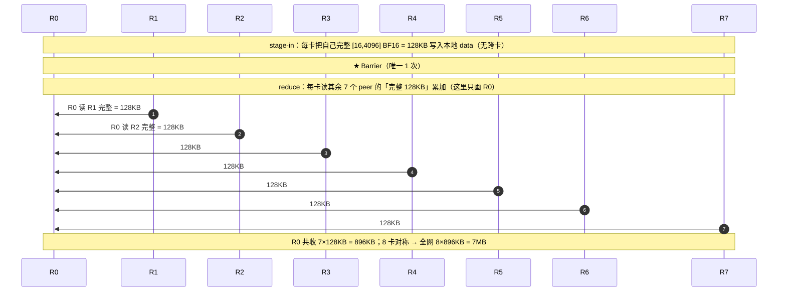

### 2.2 twophase（reduce-scatter + all-gather，mesh 版）

思路：**别让每张卡都加全部**，而是「每张卡只负责加自己那一段」，加完再互相收集。

1. **stage-in**：同上，把本地 `[16,4096]` 写进 `data`。
2. **RS barrier**：一次全屏障（用 signal 的第 0 行）。
3. **reduce-scatter**：`base = my_rank×512`。**只读自己负责的那 512 列**（`data[:, base:base+512]`），从其余 7 张卡 `remote_load` 这同一段并 FP32 累加（同样是块内 read-one-add-one，只是只处理"自己那一块"，tile 级见 §2.9），把加好的结果写回 `data` 自己那段。→ 此时「第 r 段的完整和」就存在第 r 张卡上。
4. **AG barrier**：再一次全屏障（signal 第 1 行）。
5. **all-gather**：`for r in 0..P`：从第 r 张卡读它那段加好的结果，拼进本地 `out[:, r×512 : ]`（自己那段直接用第 3 步的结果）。
6. 结果：每张卡拼出完整的和。

- 每卡远程读次数（**分两阶段**）：
  - **reduce-scatter 阶段**：`7` 次读（自己那一段，从 7 个 peer 各读一次），`7 × 16KB = 112 KB/卡`（8 卡合计 896KB）。
  - **all-gather 阶段**：`7` 次读（收集 7 个 peer 各自加好的段），`7 × 16KB = 112 KB/卡`（8 卡合计 896KB）。
  - 合计：`14` 次、`224 KB/卡`（8 卡合计 1.75MB），远小于 onephase 的 56 次 / 896KB/卡。
- barrier：`2` 次（RS 一次、AG 一次）。
- 直觉：把"读 7 份完整"变成"读自己那一段的 7 份 + 收集 7 段"，每卡跨 die 搬运量从 `7×N` 降到 `1.75×N`。
- **数据落点与搬运**：介质同 onephase（`data`/`signal` 在**本卡 HBM**、累加在 **UB**）。区别在**读多少**：reduce-scatter 时 MTE2 只从 7 个 peer HBM 各读**自己那 16KB 段**进 UB 累加（不再读整块 128KB）；all-gather 再从 7 个 peer HBM 各读 16KB 的"已加好段"、MTE3 拼回本卡 HBM。
- **竞争特征**：每卡 HCCS 搬运量降到 onephase 的 1/4（224KB）；但仍串行 **≈1 读/卡**。在 128KB 小数据下瓶颈本是**延迟**（barrier+每次读固定开销）而非带宽，所以"字节少 4 倍"没换来明显加速 → 实测 twophase ≈ onephase。

**8-rank 时间序列图**（每段 chunk=`[16,512]` BF16 = **16KB**）：

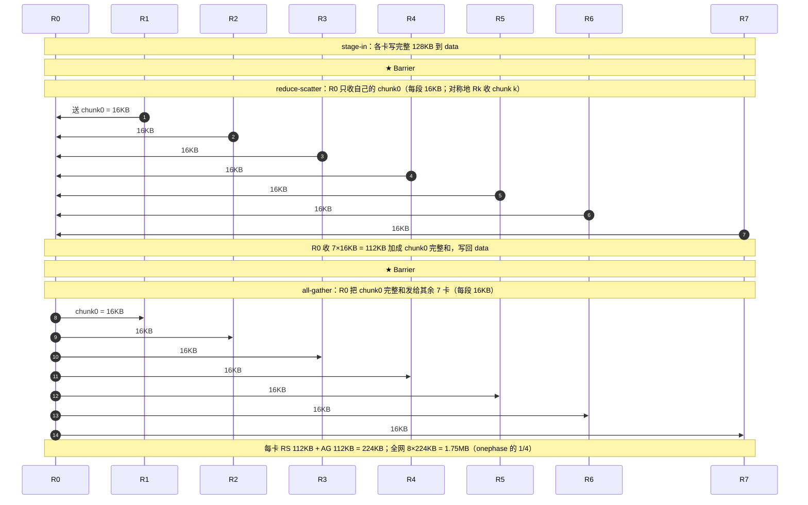

### 2.3 ring（环形 reduce-scatter + all-gather）

思路：排成环，数据只在左右邻居间一段一段传，`2×(P-1)` 轮。理论带宽最省。

1. stage-in。
2. **reduce-scatter：`P-1` 轮**。每轮：先一次屏障（signal 的第 `s` 行），再从**左邻居** `remote_load` 一段、加进本地对应段。转一圈后每张卡攒齐一段的完整和。
3. **all-gather：`P-1` 轮**。每轮：屏障（signal 第 `P-1+s` 行），从左邻居读一段已加好的结果、直接覆盖写入本地对应段。
4. 结果：每张卡拼出完整和。

- 每卡远程读次数（**分两阶段**）：
  - **reduce-scatter 阶段**：`P-1 = 7` 轮，每轮从左邻居读 1 段，`7 × 16KB = 112 KB/卡`。
  - **all-gather 阶段**：`P-1 = 7` 轮，每轮从左邻居读 1 段，`7 × 16KB = 112 KB/卡`。
  - 合计：`14` 次、`224 KB/卡`（8 卡合计 1.75MB）；理论搬运量与 twophase 同级（`≈1.75×N`），环形拓扑下每步只与邻居通信。
- barrier：**`2×(P-1) = 14` 次**（每轮一次全屏障）——这是它的软肋。
- **现状结论：ring 在 pypto DSL 里不可用**（多重独立失败，见 §5 详解）：
  - P=2：**编译失败**（chunk=2048，BATCH=16 的 BF16 tile + FP32 acc 超 UB 188KB）。
  - P=4 / P=8：**死锁**（根因：循环边界用了 Python 常量 `n_ranks` → 编译期 unroll → 展开后的屏障调度死锁）。
  - 修掉死锁后又暴露 **DMA/MTE pipe race**（HIDDEN≥384 结果算错），DSL 无 `pipe_barrier(PIPE_ALL)` 的等价物可修。
- 即便能修：14 次屏障在这种 128KB 小 payload 上，同步开销大概率盖过省下来的带宽。**优先级：放弃。**
- **数据落点与搬运**：介质同上（`data`/`signal` 在 **HBM**、累加在 **UB**）；每轮 MTE2 只从**左邻居**那一张卡的 HBM 读 1 段(16KB)进 UB。搬运量与 twophase 同级（224KB/卡）。
- **竞争特征**：每卡仍 ≈1 读/卡、且只跟邻居通信，理论上互联最不拥塞；但代价是 **14 次全屏障**——小 payload 下同步开销主导，纯亏。

**8-rank 时间序列图**（每段 16KB；只画前 1 轮，共 14 轮）：

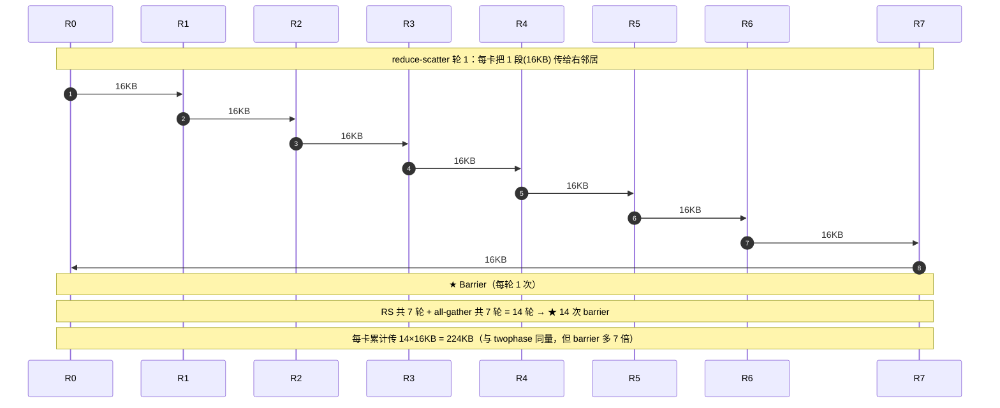

### 2.4 twophase_par（twophase + 并行扇出）——【实测最优】

在 2.2 twophase 的基础上，把**互不依赖**的循环从串行 `pl.range` 改成并行 `pl.parallel`（多核同时干）：

1. **stage-in**：`pl.parallel` —— 8 块并行写。
2. **RS barrier 的 notify / wait**：`pl.parallel` —— 7 个 notify 并行发、7 个 wait 并行等。
3. **reduce-scatter 的累加**：**保持 `pl.range` 串行**（因为累加是有依赖的规约，不能并行）。
4. **AG barrier 的 notify / wait**：`pl.parallel`。
5. **all-gather 的收集**：`pl.parallel` —— 7 段并行读回。

- 关键：**只并行"扇出/收集"这些无依赖的部分**，规约累加仍串行。
- 效果：既有 twophase「远程读次数少」的优势，又用并行把 barrier + gather 的延迟压下去。**实测最快、最稳**。
- **数据落点与搬运**：介质、每卡字节都同 twophase（224KB/卡，HBM 存、UB 算、HCCS 搬）。区别只在**并发编排**：stage-in / all-gather 的多次 HBM↔UB 搬运、barrier 对 peer HBM 信号位的写，都分到多核并发；**reduce-scatter 的 7 次 peer 读仍串行**。
- **竞争特征**：被并行的都是"轻活"——barrier 信号只有几字节（不占数据带宽）、all-gather 无规约依赖；**重规约保持串行 → 每卡仍 ≈1 个重读在飞，不超订 HCCS**。于是**压低了延迟又不制造带宽拥塞**，这是它赢的根本原因。

### 2.5 onephase_par（onephase + 并行）——【反例，更差】

把 onephase 的 8 块 reduce 循环也改成 `pl.parallel`（8 核各自去做自己那块的 7 次远程读）。

- 结果：**更慢**。因为 8 个核同时发起总共 56 次跨 die 远程读 → **跨 die 带宽争抢**，比串行还糟。
- 教训：**"并行"不是万能**。必须**先用 reduce-scatter 把远程读次数从 56 降到 14（twophase），再并行扇出**才对；直接并行一个"读很多份完整数据"的重循环只会加剧链路拥塞。
- **数据落点与搬运**：介质、每卡字节都同 onephase（896KB/卡，HBM 存、UB 算）。区别只在**并发**：8 个列块分给 8 个 AICore 核，**每核各自** MTE2 从 7 个 peer HBM 读整块 → 每卡瞬间 **≈8 个**远程读同时在飞。
- **竞争特征**：全局 **≈64 个**并发远程读一起挤 HCCS 链路 + peer HBM 读端口 → **超订（oversubscribe）**，每个读反被拖慢。**字节没变、并发翻 8 倍 → 净变慢**——这就是"竞争"最直观的反面教材。

### 2.6 `pld.tensor.allreduce`（框架自带 intrinsic）——【两种模式都不可用】

pypto 有个一行搞定的 composite intrinsic：`pld.tensor.allreduce(data, signal, op=Sum, mode="mesh"/"ring")`，
编译器会自动展开成上面的原语。但在 step3p5 维度上：

- **`mode="mesh"`**：intrinsic 内部一次性开一个**整宽 `[16,4096]` 的 FP32 累加器**（256KB，若窗口本身是 FP32 则 512KB），**超 UB 上限 188KB → 编不过**。它不暴露分块参数；想「在 `for` 里逐块调」来绕开，又被 **PTOAS #797** 禁止（见下）。
- **`mode="ring"`**：默认对 BF16 直接发 `pto.tadd`，而 A2/A3 后端只接受 `i32/i16/f16/f32`，**BF16 tadd 编不过**。改用 FP32 window 绕过后**能编能跑了**，但**结果算错**（`max_diff=77`）——composite ring lowering 在这个 shape 下数值有 bug。

> **关于 PTOAS #797**：`pld.tensor.allreduce` 的 barrier 用一块 signal window，靠"分配时清零"保证
> `AtomicAdd(0→1)/WaitGe(1)` 正确。一次 all-reduce 跑完后 signal 不会自动归零，再做一次必须换一块全新清零的 window；
> 而在 `for`/`while` 循环里无法给每个动态迭代都分配新 window。所以编译器**直接禁止把 `pld.tensor.allreduce` 放进 for/while 循环**。
> 真正的修法是做「自复位 signal」，需要 runtime 改动，就 track 在 **PTOAS #797**，尚未修。这条限制正好堵死了「逐块调 intrinsic 绕开 UB」的路。

**小结**：intrinsic 在 step3p5 的 BF16 + HIDDEN=4096 下不是"慢"，而是**根本不可用**——被迫手写；手写里 twophase_par 最优。
- **数据落点与搬运**：intrinsic 也是 `data`/`signal` 在 **HBM**、累加在 **UB**。mesh 编不过的物理原因正是：它要在**片上 UB（~184KB）**里一次性开整宽 `[16,4096]` 的 FP32 累加器（256KB，FP32 window 时 512KB）→ 放不下（见 §2.8 介质表）；这也是 onephase/twophase 必须按 512 列分块的同一条约束。

---

## 2.7 读取次数与"竞争"到底是怎么回事（重点）

前面每种方法说的"远程读次数"都是 **每张卡（per-rank）** 的次数。这里把 **每卡** 和 **8 卡总量** 分开列清，
再讲清"竞争"竞的是什么物理资源。

**基本量纲**（P=8）：
- `N` = 一份 hidden `[16,4096]` BF16 = **128 KB**（这是"一份完整数据"的大小）。
- `chunk` = `N/P` = `[16,512]` BF16 = **16 KB**（切成 8 段后每段的大小）。
- 一次 `pld.tile.remote_load` = 一次**跨卡远程读**（从某个 peer 的 HBM 经卡间互联读一块 tile 回来）。

### 每卡 vs 总量：远程读次数与字节

| 算法 | 每卡远程读**次数** | 每卡远程读**字节** | 8 卡**总次数** | 8 卡**总字节** | 重规约循环的**并发度**（同时在飞的远程读/卡） |
|------|:---:|:---:|:---:|:---:|:---:|
| **onephase**（现状） | `8 块 × 7 peer = 56` | `7 × N = 896 KB` | `448` | `7 MB` | 串行 → **≈1/卡**（全局 ≈8） |
| **onephase_par** | `56`（同上） | `896 KB`（同上） | `448` | `7 MB` | 并行 8 块 → **≈8/卡**（全局 ≈64）❗ |
| **twophase** | `RS 7 + AG 7 = 14` | `1.75 × N = 224 KB` | `112` | `1.75 MB` | 串行 → **≈1/卡** |
| **twophase_par**（最优） | `14`（同上） | `224 KB`（同上） | `112` | `1.75 MB` | 重规约仍串行 **≈1/卡**；只有轻量 barrier + all-gather 并发 |
| **ring** | `2(P-1) = 14` | `≈1.75 × N = 224 KB` | `112` | `1.75 MB` | 串行 ≈1/卡（但 14 次屏障） |

**两个关键读数**：
1. **每卡字节**：onephase = `7×N`（把其余 7 张卡的**完整** 128KB 都读回来）；twophase/ring = `1.75×N`（只读自己那一段的 7 份 + 收集 7 段）。→ **twophase 类每卡搬运量是 onephase 的 1/4**，8 卡总量也是 1/4（7MB → 1.75MB）。
2. **onephase 和 onephase_par 搬的字节完全一样**（都是 896KB/卡）——它们的差别**只在并发度**，不在数据量。

### 分阶段通信量（两阶段算法专门拆开）

onephase 是**单阶段**（1 次 barrier + 1 段读全部）；twophase / ring 是**两阶段**（reduce-scatter + all-gather）。两阶段的每阶段通信量如下（P=8）：

| 算法 | 阶段 | 每卡读次数 | 每卡字节 | 8 卡总字节 | barrier |
|------|------|:---:|:---:|:---:|:---:|
| **onephase** | 单阶段（mesh 直读全加） | 56 | `7×N` = 896 KB | 7 MB | 1 |
| **twophase** | ① reduce-scatter | 7 | `(P-1)/P × N` = 112 KB | 896 KB | 1 |
| | ② all-gather | 7 | `(P-1)/P × N` = 112 KB | 896 KB | 1 |
| | **合计** | **14** | **1.75×N = 224 KB** | **1.75 MB** | **2** |
| **ring** | ① reduce-scatter（P-1 轮） | 7 | `(P-1)/P × N` = 112 KB | 896 KB | P-1 = 7 |
| | ② all-gather（P-1 轮） | 7 | `(P-1)/P × N` = 112 KB | 896 KB | P-1 = 7 |
| | **合计** | **14** | **1.75×N = 224 KB** | **1.75 MB** | **2(P-1) = 14** |

> 说明：两阶段算法每阶段每卡都是 `(P-1)/P × N`（= 7/8 × 128KB = 112KB）。twophase 与 ring 的**通信量完全相同**，
> 区别只在 barrier 次数：twophase 每阶段 1 次全屏障（共 2 次）；ring 每阶段 P-1 轮、每轮 1 次屏障（共 14 次）。
> 这就是为什么在 128KB 小 payload（延迟主导）下 ring 的 14 次屏障是纯亏——通信量没省、同步却贵 7 倍。

### "竞争"竞的是什么

被争抢的物理资源是**卡间互联（HCCS/mesh 链路）的带宽 + 被读卡 HBM 的读带宽**——它是**固定**的。
决定拥塞程度的是"**同一时刻有多少个远程读在飞**"（并发度），不是总字节。

- **onephase（串行）**：每张卡的 56 次读是一个接一个发的，任一时刻每卡只有 **≈1 个** 远程读在飞 → 全局 ≈8 个并发。互联没被打满，但因为**总字节大（896KB/卡）且完全串行**，56 次读的**延迟累加**起来就慢，且尾部抖动大。
- **onephase_par（更差的反例）**：把 8 个列块分给 8 个 AICore 核并行做，每张卡瞬间有 **≈8 个** 远程读同时在飞 → 全局 **≈64 个并发**，去抢那条固定带宽的互联 → **链路被打满/超订（oversubscribe）**，每个读反而更慢。**字节没变、并发翻了 8 倍 → 净变慢**。这就是"竞争"：并发的远程读挤在有限的互联带宽上互相拖慢。
- **twophase（串行）**：每卡只 14 次读、每次只 16KB，总字节是 onephase 的 1/4；并发仍 ≈1/卡。但在 128KB 这种小数据下，瓶颈本就不是带宽而是**延迟**（barrier 同步 + 每次读的固定启动开销），所以"字节少 4 倍"并没换来明显加速 → 实测 twophase ≈ onephase。
- **twophase_par（最优）**：**只把无依赖的轻活并行**——barrier 的 notify/wait（写的是几字节的信号位，不占数据带宽）+ all-gather 的 7 次读（每次 16KB，且 all-gather 无规约依赖）；**而重规约（reduce-scatter 的 7 次读+累加）保持串行**，不制造并发重读。于是它**压低了延迟**（并行同步/收集）**又不触发带宽超订** → 又快又稳。

### 一句话记住
> **先用 reduce-scatter 把"每卡搬运量"从 `7×N` 降到 `1.75×N`（twophase），再只并行"无依赖的同步/收集"（`pl.parallel` fan-out），
> 千万别并行"读很多份完整数据的重规约"（onephase_par 就是踩了这个坑：并发 ×8、带宽超订、反而更慢）。**

---

## 2.8 数据到底放在哪、怎么搬（物理介质与数据通路）

要理解上面的"带宽争抢"，得先知道数据物理上躺在哪、经过哪条路。910B 一台服务器 8 张卡，涉及三种介质：

| 介质 | 是什么 | 容量/特点 | 在 all-reduce 里的角色 |
|------|--------|-----------|------------------------|
| **HBM**（device global memory，GM） | 每张卡的**片外大显存** | 每卡约 64 GB，带宽大但相对 UB 慢 | 存放 `data` 中转窗口、`signal` 信号位、输入/输出张量 |
| **UB**（Unified Buffer） | AICore 上的**片上 SRAM** | **很小，约 184 KB** | 算子的工作区：远程读来的 tile 先落这里，`cast`/`add` 在这里算 |
| **卡间高速互联** | board 上 **die-to-die / HCCS 链路** | 固定带宽，跨卡读走它 | remote_load 从 peer HBM 搬数据回本卡的通道 |

**window 在哪**：`pld.alloc_window_buffer` 底层是 `aclrtMalloc`——**分配在 device HBM**。再通过 ACL IPC 原语
（`aclrtIpcMemGetExportKey` + `aclrtIpcMemImportByKey` + peer-access）把**每张卡的 HBM window 基址**填进
`CommContext.windowsIn[]`（一组 GVA，全局虚拟地址）。于是本卡拿到 `windowsIn[peer] + offset` 就能**直接寻址 peer 那张卡 HBM 里的 window**——这就是跨卡"直接读对方显存"的底层机制（Phase 16 修驱动 `support_shmem_map_exbus` 就是为了让这个 IPC 映射能跨卡建起来）。`signal` 窗口同理也在 HBM，只是很小的一块 INT32。

**一次 `remote_load` 的完整数据通路**（对应 pto-isa 的 TGET：`remote GM → UB → local GM`）：

```
peer 卡 HBM(window)  ──[卡间互联 HCCS]──►  本卡 UB(staging tile)  ──[AIV 向量单元]──►  UB 里 cast FP32 + 累加
      (MTE2 DMA 读)                              (片上 SRAM)                              ──[MTE3 DMA 写]──► 本卡 HBM
```

- **读**：AICore 的 **MTE2**（DMA 读引擎）经卡间互联，把 peer HBM 的一块 tile 搬进**本卡 UB**。
- **算**：`cast`/`add` 由 **AIV（向量单元）**在 **UB** 里做（FP32 累加）——**计算永远在片上 UB，绝不在 HBM 里直接算**，HBM 只负责存和中转。
- **写**：**MTE3**（DMA 写）把 UB 里的结果写回**本卡 HBM**（window 或输出张量）。
- **barrier**：`notify` = 对 **peer HBM** 里的信号位做一次原子写（经互联）；`wait` = 轮询**本卡 HBM** 里的信号位。走的是同一套 IPC 映射，但只是几字节，不占数据带宽。

**关键点**：
1. **不经网卡（NIC）**。8 卡在同一台服务器内，跨卡读写走的是**板上 HCCS 互联 + IPC 共享内存映射**，不走以太网/RDMA 网卡。NIC 只有**跨节点（多台服务器）**才用得到，本场景（单机 TP=8）用不到。
2. 所以前面 §2.7 说的"**被争抢的带宽**" = **HCCS 卡间链路带宽 + 被读那张卡的 HBM 读端口带宽**，**不是网卡**。多张卡同时 remote_load 同一批 peer，就在这条固定的互联/HBM 读带宽上排队。
3. **UB 只有 ~184 KB**，所以 `[16,4096]` FP32 累加器（256 KB）放不下——这正是必须按 512 列分块、以及 pld_mesh intrinsic 编不过的原因（见 §2.6）。

---

## 2.9 读进来之后到底怎么加（tile 级微观流程）

前面说"从 7 个 peer 读回来累加"，这里把**读回来之后具体怎么加**讲到 tile 一级。核心结论先说：
**不是"把某个 peer 的整块 128KB 读满再加"，而是"按 512 列切成 8 块、每块内读一个 peer 就立刻加一次"的 streaming 累加。**

### 为什么一定要切块（先讲清约束）

- 一份完整 hidden `[16,4096]` BF16 = 128 KB；但累加要用 FP32（防掉精度），FP32 的 `[16,4096]` = **256 KB**。
- 片上 **UB 只有 ~184 KB**，256 KB 的累加器**放不进去**。
- 所以按列切成 `HIDDEN/8 = 512` 列一块：FP32 累加器 `[16,512]` = **32 KB**，进得去。（`16` = decode batch 行数，`512` = 该块的列数。）

### onephase 的 reduce：真实伪代码（逐块 + 块内 streaming 累加）

```python
for k0 in pl.range(0, HIDDEN, 512):          # ① 外层 8 块，每块 512 列(=16KB BF16)
    own = pl.load(data, [0, k0], [16, 512])  #   本卡这块 HBM→UB (16KB BF16)
    acc = pl.cast(own, FP32)                 #   UB 里开一个 [16,512] FP32 累加器 (32KB)
    for peer in pl.range(8):                 # ② 块内遍历 7 个 peer
        if peer != my_rank:
            recv = remote_load(data, peer, [0,k0], [16,512])  # peer HBM→UB 这同一块 (16KB)
            acc  = pl.add(acc, pl.cast(recv, FP32))           # 读一个就立刻加一个（streaming）
    pl.store(pl.cast(acc, BF16), [0, k0], out)                # 这块加完 → UB cast BF16 → 写回 HBM
```

**关键点（回答"读完 128KB 后怎么加"）**：
- **不存在"读满 128KB"这个中间态**。128KB 是"一个 peer 的完整数据"，但它从没被整块搬进来过——每次只搬**当前这块的 512 列(16KB)**。
- **块内是 read-one-add-one 流式累加**：读第 1 个 peer 的这块 → 加；读第 2 个 → 加……读完 7 个，`acc` 就是这块 512 列的完整和，写回；再进下一块。
- **任一时刻 UB 的工作集**≈ `acc(FP32 32KB) + 当前 recv(BF16 16KB) + own(16KB)` ≈ **64KB**（< 184KB），所以每块都装得下。
- **每块的动作量**：`1 次 own 读(16KB) + 7 次 remote_load(7×16KB=112KB) + 7 次 cast+add + 1 次 store(16KB)`；共 8 块 → 每卡 `8×7=56` 次 remote_load（对上 §2.7 的数）。
- **引擎流水**：`remote_load` 走 **MTE2**，`cast/add` 走 **AIV**。理想情况下下一个 peer 的 MTE2 读能与当前 AIV 的加重叠；但串行版里 `acc = acc + recv` 形成依赖链，且 `recv` tile 复用，使得"读→加→读→加"基本串起来跑（这也是 onephase 慢的一环）。

### twophase 的 reduce：只加"自己那一块"，再收集

```python
# reduce-scatter：只处理自己拥有的那一块 base = my_rank*512
own = pl.load(data, [0, base], [16, 512]); acc = pl.cast(own, FP32)
for peer in pl.range(8):                     # 同样是块内 read-one-add-one
    if peer != my_rank:
        recv = remote_load(data, peer, [0, base], [16, 512])  # 只读这一块(16KB)
        acc  = pl.add(acc, pl.cast(recv, FP32))
pl.store(pl.cast(acc, BF16), [0, base], data)                 # 加好的这块写回 data

# all-gather：把 7 个 peer 各自加好的块收回来——只搬运，不再加
for r in pl.range(8):
    if r != my_rank:
        red = remote_load(data, r, [0, r*512], [16, 512])  # 读第 r 块的完整和
        pl.store(red, [0, r*512], out)                     # 直接写出（无 add）
    else:
        pl.store(reduced_own, [0, base], out)
```

**与 onephase 的关键差异**：
- onephase 是 **8 块 × 每块加 7 次**（每块都要自己加全 7 个 peer）；twophase 是 **只 1 块（自己那块）× 加 7 次**，另外 7 块由别的卡去加、最后 all-gather **只读不加**。
- 所以每卡的"加法量"从 `8×7=56` 次读+加，降到 `7 次读+加（reduce） + 7 次纯读（gather）`——**加法工作量降到 1/8，远程读字节降到 1/4**。
- all-gather 阶段**没有累加**，只是把别人算好的段搬回本卡 HBM，所以那 7 次读之间**无依赖**，才可以在 twophase_par 里安全并行（§2.4）。

### 一句话
> "读回来怎么加" = **按 512 列切块 → 每块在 UB 里开 FP32 累加器 → 块内每读一个 peer 的这块就立刻加进去（streaming）→ 这块加完写回、再下一块**。onephase 每块都自己加满 7 个 peer（8 块都加）；twophase 只加自己那一块、其余块靠 all-gather 搬回（不加）。

---

## 2.10 barrier 加在哪：是"每块一次"还是"整个集合一次"？（关键区分）

这是最容易搞混、也最影响性能的一点。先给结论：

> **512 切块 与 barrier 是两个正交维度，切块本身不产生任何 barrier。**
> - **onephase：整个 all-reduce 只有 1 次 barrier**（在 stage-in 和 reduce 之间）。
> - **twophase：2 次**（stage-in 后 1 次、reduce-scatter 后 1 次）。
> - **ring：每轮循环 1 次 barrier，共 `2(P-1)=14` 次**——只有它是"每次循环一个 barrier"。

### onephase：1 次 barrier 覆盖全部 8 块

结构（注意 barrier 的位置**在两个 chunk 循环之间**，不在 chunk 循环里面）：

```python
for k0 in pl.range(0, HIDDEN, 512):   # 阶段A：先把整份 [16,4096]（全部 8 块）写进 data
    stage 本块 → data                 #   ← 循环内没有 barrier
barrier()                             # ★ 唯一 1 次 barrier（等所有卡把"整份"都写完）
for k0 in pl.range(0, HIDDEN, 512):   # 阶段B：8 块各自去读 7 个 peer 累加
    reduce 本块 → out                 #   ← 循环内也没有 barrier
```

**为什么 1 次就够**（关键推理）：
1. 阶段A 把**整份 128KB（8 块全部）**写进 `data` 之后，才走 barrier；所以 barrier 一过，**每张卡的完整数据（所有块）都已就位、可安全读**。
2. 阶段B 的 8 块 reduce 只是**读** `data`（只读、不改），结果写到**另一个张量 `out`**。`data` 全程只读、没人改它 → 读哪块、读几遍都不会读到"半成品" → **块之间不需要再同步**。
3. 所以 8 块共享**同一次** barrier。切成 8 块纯粹是为了让 FP32 累加器塞进 UB（§2.9），**跟 barrier 没关系**。

### twophase：2 次 barrier（因为 reduce 结果要写回共享 data）

```python
stage-in（8 块写进 data）
barrier#1                 # ★ 等所有卡 stage-in 完
reduce-scatter：只加"自己那一块" → 写回 data 自己那段   # ← 改了共享 data！
barrier#2                 # ★ 等所有卡都把"自己那段的和"写回 data 完
all-gather：读 7 个 peer 已加好的段 → out
```

**为什么需要第 2 次**：reduce-scatter **把加好的结果写回了共享的 `data`**（不是写到 `out`）。all-gather 要去读**别的卡刚写回的那段**，所以必须先 barrier#2 确认"大家都写回完了"，否则可能读到 peer 还没算完的旧值。→ 两次 barrier，都是**整段一次**，**不是每块一次**（reduce-scatter 内部对自己那一块的 7 次 peer 读，共享 barrier#1，中间无 barrier）。

### ring：这才是"每次循环一个 barrier"

```python
for s in pl.range(P-1):   # reduce-scatter 的 P-1 轮
    barrier(第 s 行)       # ★ 每一轮都要一次 barrier
    从左邻居读 1 段 → 加进本地
for s in pl.range(P-1):   # all-gather 的 P-1 轮
    barrier(第 P-1+s 行)   # ★ 每一轮又一次 barrier
    从左邻居读 1 段 → 覆盖本地
```

**为什么必须每轮一次**：环形传递里，第 `s` 轮要读的那段，是左邻居在**第 `s-1` 轮刚写好的**；存在**轮与轮之间的依赖**，所以每轮开始前都得 barrier 确认上一轮的邻居写完。→ `2(P-1)=14` 次 barrier。这就是 ring 在小 payload 上"纯亏"的根源：**通信量和 twophase 一样，但 barrier 多了 7 倍**。

### 汇总对比

| 算法 | barrier 位置 | barrier 次数 | 512 切块循环内有 barrier 吗 |
|------|-------------|:---:|:---:|
| **onephase** | stage-in 与 reduce 之间，1 处 | **1** | ❌ 无（8 块共享 1 次） |
| **twophase** | stage-in 后 + reduce-scatter 后，2 处 | **2** | ❌ 无（自己那块的 7 次读共享 barrier#1） |
| **ring** | **每一轮**开头 | **`2(P-1)=14`** | ——（ring 是按 rank 分段、按轮循环，不是按 512 列分块） |

> **一句话记住**：**"分块"是本地 UB 的事（为塞下 FP32 累加器），跟跨卡 barrier 无关**；barrier 只跟"要读的 peer 数据是否已就位"有关——onephase 整份一次写好就 1 次、twophase 因为中途写回共享区所以 2 次、ring 因为轮间依赖所以每轮 1 次共 14 次。**"每块 barrier"这种事在这几个实现里都不存在**。

---

## 2.11 示意图

### 一、多 rank 组织（8 卡时间序列图）——总览

> **这三张图（带字节标注版）已分别放入对应小节：onephase→§2.1、twophase→§2.2、ring→§2.3。**
> 此处并排保留一份作总览对照。用 **sequenceDiagram** 画：**8 个 rank = R0…R7**（实际 P=8），
> **时间从上往下**，横跨所有 rank 的灰条 = **barrier**，箭头 = 一次跨卡读/写。

**图 1 — onephase（mesh 全互联）时间线**

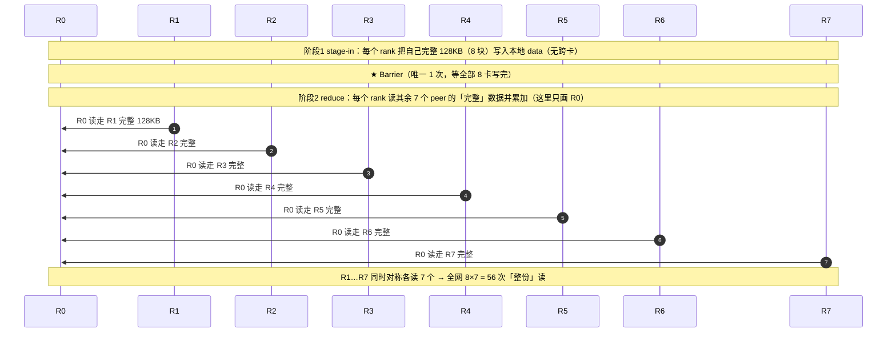

**图 2 — twophase（reduce-scatter + all-gather）时间线**

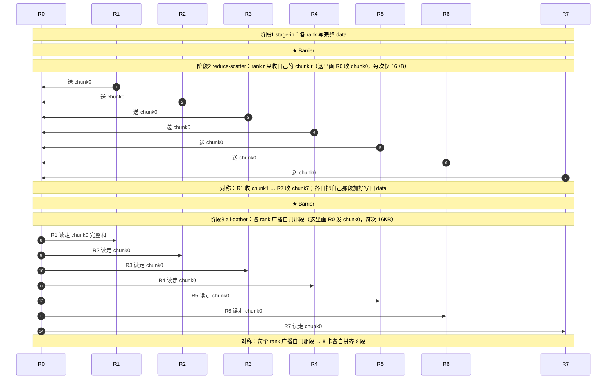

**图 3 — ring（环形）时间线：每轮只传给下一个邻居，每轮 1 次 barrier**

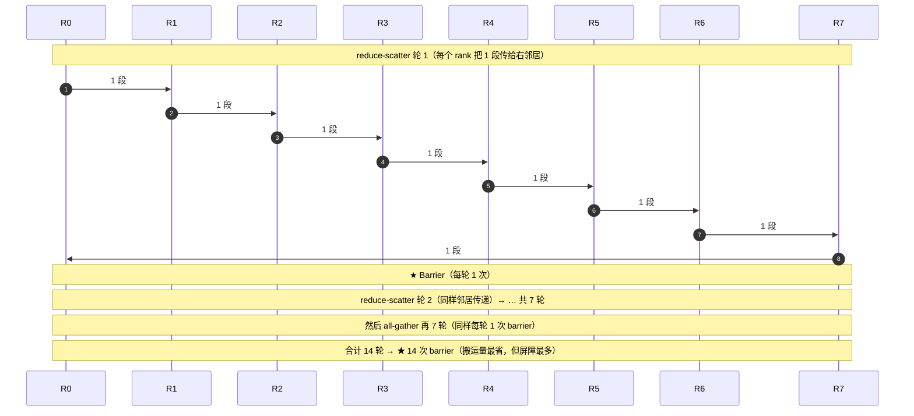


**三种拓扑一句话对比**：

| 算法 | 跨卡连接形态 | 每条边搬什么 | 全网连接数 |
|------|-------------|-------------|-----------|
| onephase(mesh) | **全互联**（每 rank ↔ 所有 rank） | 整份 128KB | 8×7 = 56 |
| twophase | **收敛+广播**（每 rank 只收/发自己那段） | 每段 16KB | RS 56 段 + AG 56 段，但每段只 1/8 大小 |
| ring | **环形**（每 rank 只 ↔ 邻居） | 每段 16KB | 每轮 8 条，共 14 轮 |

---

### 二、单卡内部细节（补充）

### 图 A — 一次"读一个 peer 的一块 + 累加"的物理数据通路

数据在哪、经过什么引擎走到哪：

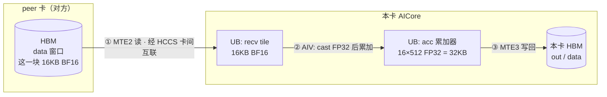

> 计算永远在片上 **UB**；**HBM** 只负责存/中转；跨卡走 **HCCS**，不经网卡。

### 图 B — 一块（512 列）内的 streaming 累加：读一个就加一个

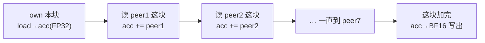

> 不是"把 peer 的 128KB 读满再加"，而是**读一个 peer 的这块(16KB) 就立刻加一次**；一份完整数据从没被整块搬进 UB 过。

### 图 C — barrier 到底加在哪（三个算法对比，重点）

**onephase：整个集合只 1 次 barrier**（在两个 chunk 循环之间，循环内都没有 barrier）

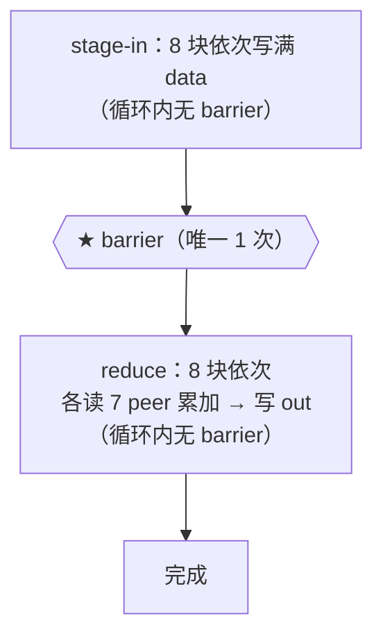

**twophase：2 次 barrier**（因为 reduce-scatter 把结果写回了共享 data）

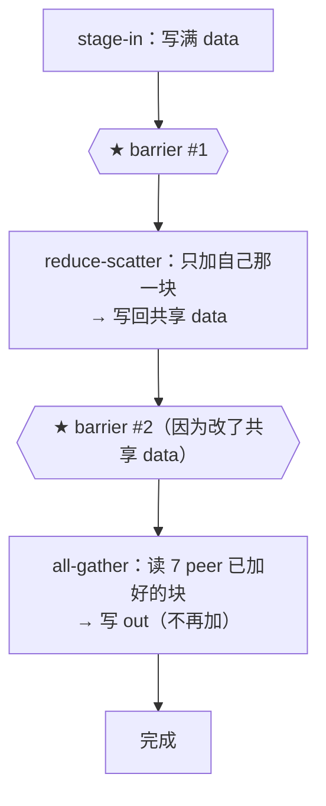

**ring：每一轮循环 1 次 barrier，共 14 次**（轮间有依赖）

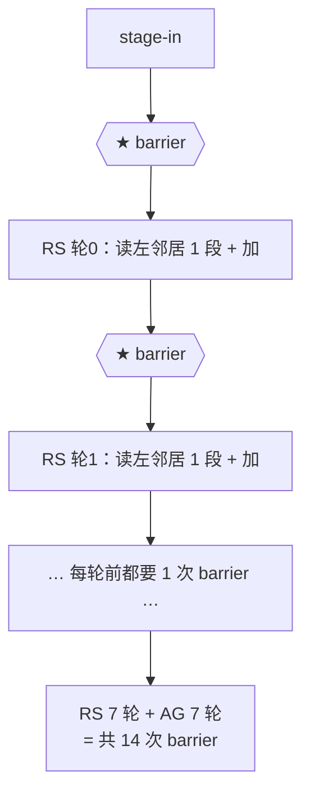

> 对比一眼看懂：**onephase 1 次 / twophase 2 次 barrier**（每个 phase 一次，跟 512 分块无关）；**ring 14 次 barrier**（每轮一次）。ring 通信量和 twophase 一样，却多花 7 倍屏障 → 小 payload 上纯亏。

---

## 3. 测量方法（为什么这么测）

- **必须真机**：用 0162 的 `a2a3`（910B）真卡，不是仿真（`a2a3sim` 在该镜像里缺 `g++-15`，且仿真不反映真机跨 die 通信）。
- **不能看 wall-clock**：本微基准每次 `compiled()` 会 fork 8 个 chip worker 进程（每次 ~4.6s 都是 fork+init 开销），wall-clock 完全被它淹没，无意义。
- **用 device 侧 STRACE**：simpler runtime 会打 `device_wall.sched` 计时点（ns），表示 kernel 在设备上真正执行的墙钟时间，排除了 fork/init。这是唯一可信指标。
- **多样本 + 看分位数**：每个模式跑 `iters=10`（外加 golden + warmup），8 张卡各出一份 → ~104 个样本；看 **p50（中位数）/ mean（均值）/ p90（尾）**。
- **抖动说明**：绝对 μs 有 run-to-run 抖动（冷启动的 golden/warmup dispatch 也计入样本），但 **twophase_par < onephase 的排序在所有 run 里一致**。

---

## 4. 实测结果

### 4.1 决定性对比（iters=10，各 104 样本，`device_wall.sched`，单位 μs）

| 变体 | p50 | mean | p90 | max | 相对现状 |
|------|-----|------|-----|-----|---------|
| **onephase**（现状） | 317 | 603 | 1308 | 3088 | 基线 |
| **twophase_par**（最优） | **205** | **246** | **439** | **956** | p50 **-35%** / mean **-59%** / p90 **-66%** |

### 4.2 四路对比（iters=5，各 56 样本，佐证「为什么是 twophase_par」）

| 变体 | p50 | mean | max | 结论 |
|------|-----|------|-----|------|
| onephase（现状） | 215 | 299 | 760 | 基线 |
| onephase_par | 277 | 329 | 809 | **更差**（并行 56 次远程读→带宽争抢） |
| twophase | 211 | 291 | 726 | ≈ onephase（小数据下省带宽收益不明显） |
| **twophase_par** | 139–214 | **219–235** | 433–673 | **最优** |

### 4.3 正确性 + 可编译性一览

| 变体 | 能否编译/运行 | golden 正确性（`max_diff`） |
|------|--------------|---------------------------|
| onephase | ✅ | 0.0 ✅ |
| twophase | ✅ | 0.0 ✅ |
| twophase_par | ✅ | 0.0 ✅ |
| onephase_par | ✅ | 0.0 ✅（但更慢） |
| ring（手写） | ❌ P=2 编译失败(UB) / P=4·P=8 死锁 | — |
| pld_mesh（intrinsic） | ❌ UB 超限 | — |
| pld_ring（intrinsic） | ⚠ 加 FP32 window 后能跑 | **77.0 ❌ 结果错** |

---

## 5. 结论与建议

> **⚠ 2026-07-28 整网落地修正（必读，优先于本节原文）**
>
> 本节原本建议"把 9 处 `tp_all_reduce` 从 onephase 改成 twophase_par"。该建议基于
> §6 的**独立微基准**（probe）得出，**直接落到整网会引入 8 卡结果不一致**：
>
> | all-gather 形式 | 整网 8-step `hidden_tp_spread` |
> |---|---|
> | onephase mesh（改前） | 全 `0.0` |
> | **twophase_par，pull 形式 all-gather**（本节原方案） | `58.5, 4.1, 2.0, 2.6, 4.0, 3.1, 2.7, 2.5` ❌ |
> | **twophase_par，push 形式 all-gather**（修正方案） | 全 `0.0` ✅（3 次重复 24 步） |
>
> **根因**：`本地 store → 远端 notify → peer 远端 remote_load` 这条**跨方向**握手在当前
> runtime 下不保证顺序（payload 落我方 HBM、notify 落对方 HBM，本地 `V→MTE3` fence 管不到）。
> mesh 每次调用只有 **1 个**带数据依赖的 pull barrier（wave2 是纯 completion），
> twophase 的 pull 形式有 **2 个**，暴露翻倍 → 从"侥幸不中"变成"几乎必中"。
>
> 这与本文 §5 判 ring 不可用的是**同一个上游缺口**，只是当时记成了"缺
> `pipe_barrier(PIPE_ALL)`"；实际更准确的表述是：**pull-after-remote-notify 不可靠，
> push-then-notify 可靠**（payload 与 notify 同方向）。
>
> **正确落地形式**：reduce-scatter 保持 pull（它复用 wave1，暴露量与 mesh 相同），
> all-gather 必须改 `pld.tile.remote_store` push + notify，barrier 之后**零远端访问**、
> 全部本地 `pl.load`。这也正是 V4-Flash dispatch/combine 的写法
> （`origin/main:models/deepseek/v4-flash/moe.py`："payload-arrival notify folded into the push"）。
>
> **§4 的 device 侧耗时数据仍然有效**（它测的是通信本身），但**§4.3 的 twophase / twophase_par
> "golden 正确性 0.0"不可外推到整网** —— 微基准是单次孤立 all-reduce，没有 45 层其它 kernel 的
> 时序压力，对该 race 完全不敏感。落地细节与完整弯路见
> [`postmortems/13-tp-allreduce-pull-notify-race.md`](../../postmortems/13-tp-allreduce-pull-notify-race.md)。

1. **换 twophase_par（all-gather 用 push 形式，见上方修正）**：把 `tp_all_reduce` 从 onephase 改成
   reduce-scatter + push all-gather + 并行扇出。
   预期 device 侧单次 all-reduce p50 快 ~35%、尾延迟好 ~66%，且**保持 FP32 累加**（精度不变）、结构改动可控。
2. **不要用 `pld.tensor.allreduce` intrinsic**：BF16 + HIDDEN=4096 下 mesh 爆 UB、ring 结果错，不可用。
3. **两点方法论**（本次踩坑总结）：
   - **先降远程读次数、再并行**：onephase_par 反例说明，直接并行一个"读很多份完整数据"的重循环会加剧跨 die 带宽争抢。正确顺序是先 reduce-scatter（56→14 次读），再并行无依赖的扇出。
   - **只并行无依赖的循环**：stage-in / notify / wait / all-gather 可以 `pl.parallel`；规约累加有依赖，必须 `pl.range` 串行。
4. **与既有子任务的关系**：本结论直接支撑 [`task-tracking.md`](task-tracking.md) 里的 **PERF-C3**（"peer loop `pl.range` → `pl.spmd`/`pl.parallel`"）——但要补一句：C3 光并行不够，得配合 reduce-scatter 才是净收益。

**ring 深度排查结论（已定位，判定放弃）**：ring 在 pypto DSL 里踩到三个独立的坑，逐层揭开：

1. **P=2 编译失败**：chunk=`N/2`=2048，`[16,2048]` BF16 tile + FP32 累加器超 UB（327680 > 188416）。
2. **P=4 / P=8 死锁**（**根因**）：`_build_ring` 的外层循环边界用了工厂期闭包的 **Python 常量 `n_ranks`**（而非运行期从 CommContext 读）。编译器因此**在编译期把外层 ring 循环 unroll 展开**，展开后的 `notify-all / wait-all` 屏障序列在 P=4/P=8 产生跨 rank 死锁调度。**对照** canonical `test_l3_allreduce_ring.py` 用运行期读 `pld.get_comm_ctx / pld.rank / pld.nranks`，循环保持 dynamic 不 unroll，故不死锁。**修法**＝改成运行期 CommContext 读——死锁消失。
3. **修掉死锁后暴露 DMA/MTE pipe race**（**上游 DSL 缺口**）：每轮 `TSTORE` 更新自己的 chunk 后、下一轮 `TNOTIFY` 通知 peer 前，缺一道把 MTE 管线排空的屏障。C++ 参考 `allreduce_ring_kernel.cpp` 在此处插 `pipe_barrier(PIPE_ALL)`；**pypto DSL 没有可用等价物**（`pl.system.fence()` 无效、`bar_all/bar_v/bar_m` 无 codegen、`cacheinvalid()` 无效）。表现为规模阈值：HIDDEN≤256 正确、≥384 结果错（P=8 `max_diff≈70`）。据排查 agent 报告，连 canonical 参考在 P=8 也会算错（`max_diff≈923`），只因 CI 只测 P=2/4 且 SIZE=256（低于 race 阈值）而"看起来通过"。

> 上述第 2 点（死锁根因）与"改运行期读即消除死锁"已复现确认；第 3 点（pipe-race + canonical 在大 P 亦错）为排查 agent 报告、本人未逐条复验。此外本人复验 agent 的修复版时，cards 0-7 上还撞到一个**另一类** `507018`（`rtMemExportToShareableHandleV2 feature not support` 的 IPC shareable-handle 故障）。

**判定**：ring 在当前 DSL 下**不可用且不值得修**（死锁可修，但正确性卡在缺 `pipe_barrier(PIPE_ALL)` 的上游 DSL 缺口）；即便修好，14 次屏障对 128KB 小 payload 也大概率慢于 twophase_par。**放弃 ring，用 twophase_par。**

---

## 6. 复现步骤（怎么自己跑一遍）

**前提**：能 SSH 到 0162（`infra@gpu-a910x-0162.host.platform.shaipower.com`），0726 镜像已在 containerd 里。

**微基准文件**：`pypto/tests/st/distributed/collectives/allreduce_bench.py`（已入库：`csy0225/pypto stepfun/develop@ce7fcb64`）
（支持 `--mode {onephase,onephase_par,twophase,twophase_par,ring,pld_mesh,pld_ring}`、`-d <卡范围>`、`--iters`、`--warmup`）。

```bash
# 在 0162 上，用 0726 镜像挂 8 张卡跑（这里用 cards 0-7；也可改成 8-15）
NC=/mnt/persist/k8s-install/containerd/bin/nerdctl
IMG=hub.i.basemind.com/stepcast/vllm-pypto:stepfun-develop-20260726-step3p5-only
HB=/data/chensiyu/hw_project/pypto/workspace/pypto/tests/st/distributed/collectives/allreduce_bench.py
OUT=/data/chensiyu/hw_project/pypto/workspace/arbench_logs; mkdir -p "$OUT"
DEVS=""; for i in 0 1 2 3 4 5 6 7; do DEVS="$DEVS --device /dev/davinci$i"; done

sudo $NC run --rm --net host --ipc host --privileged --security-opt apparmor=unconfined \
  $DEVS --device /dev/davinci_manager --device /dev/hisi_hdc --device /dev/devmm_svm \
  -v /usr/local/Ascend/driver:/usr/local/Ascend/driver:ro \
  -v "$HB":/tmp/allreduce_bench.py:ro -v "$OUT":/out --shm-size 32g \
  "$IMG" bash -lc '
    for m in onephase twophase_par; do
      ASCEND_GLOBAL_LOG_LEVEL=3 timeout 400 \
        python /tmp/allreduce_bench.py -p a2a3 -d 0-7 --mode $m --iters 10 --warmup 2 \
        > /out/${m}_x10.log 2>&1
    done'

# 提取 device 侧耗时（ns）分位数
for m in onephase twophase_par; do
  echo "=== $m ==="; grep -hE "golden max_diff" $OUT/${m}_x10.log | head -1
  grep -oE "device_wall.sched ts=[0-9]+ dur=[0-9]+" $OUT/${m}_x10.log \
    | grep -oE "dur=[0-9]+" | cut -d= -f2 | sort -n \
    | awk '{a[NR]=$1;s+=$1} END{printf "p50=%d p90=%d max=%d mean=%.0f (ns)\n",a[int(NR/2)],a[int(NR*0.9)],a[NR],s/NR}'
done
```

**要点**：
- 必须 `bash -lc`（登录 shell 才会 source 镜像里的环境）。
- `ASCEND_GLOBAL_LOG_LEVEL=3` 压掉海量 INFO 日志。
- 每次 device 运行套 `timeout`，防止 ring 那种 hang 卡死。
- wall-clock 那行数字忽略（是 fork 开销），只看 `device_wall.sched`。
