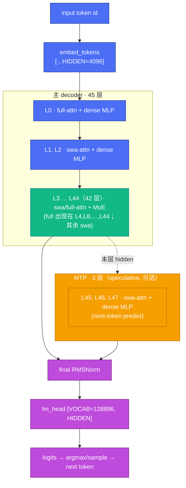
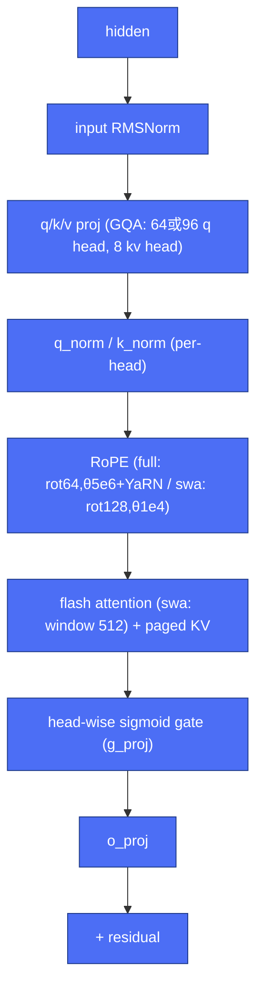
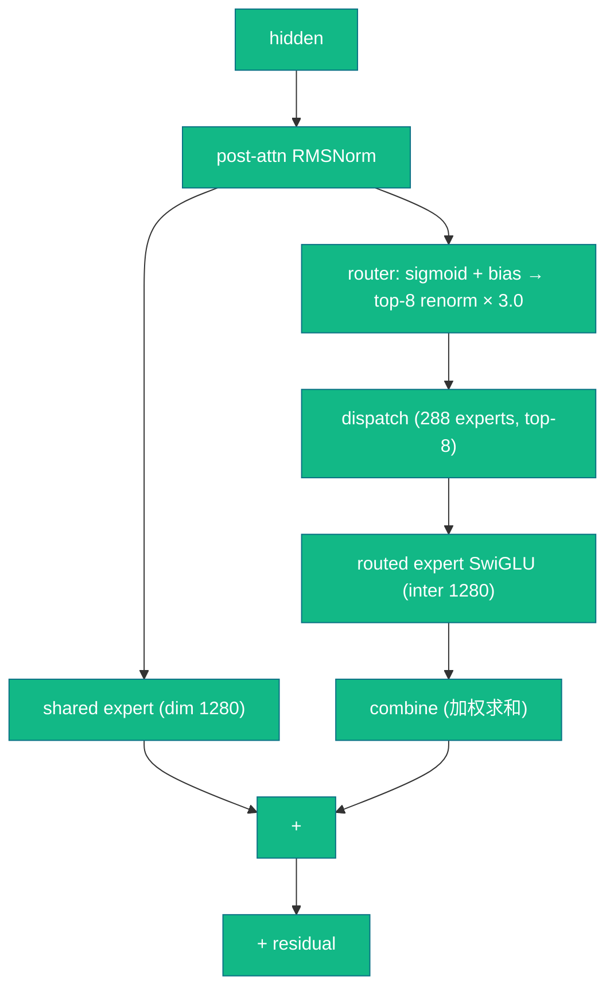

# step3p5 模型架构

> 本文只描述 **step3p5 模型本身**（config + 层结构 + 完整层数流程图），与"怎么在
> pypto 上实现/在 vLLM 里集成"解耦。实现见 [`whole-net/`](whole-net/)，集成见
> [`vllm-pypto/`](vllm-pypto/)。参数源：`pypto-lib/models/step3p5/config.py`
> （对齐 `step3p5_flash_release_hf_mtp3` checkpoint）。

## 1. Config 参数

### 1.1 全局

| 参数 | 值 | 说明 |
|------|----|------|
| `HIDDEN` | 4096 | hidden size |
| `VOCAB` | 128896 | 词表 |
| `NUM_HIDDEN_LAYERS` | 45 | 主 decoder 层数 |
| `NUM_NEXTN_PREDICT_LAYERS` | 3 | MTP（multi-token predict）层，ckpt 索引 45..47 |
| `NUM_TOTAL_LAYERS` | 48 | 45 + 3 |
| `MAX_POSITION_EMBEDDINGS` | 262144 | 最大位置 |
| `EPS` | 1e-5 | RMSNorm epsilon |
| `ZERO_CENTERED_NORM` | True | RMSNorm 有效 gamma = stored_gamma + 1.0 |

### 1.2 Attention（两种变体，逐层由 `LAYER_TYPES` 选）

| 参数 | full_attention | sliding_attention (SWA) |
|------|----------------|--------------------------|
| 每层出现规律 | 每 4 层一次（i % 4 == 0） | 其余 3/4 |
| `NUM_HEADS` | 64（q hidden 8192） | 96（q hidden 12288） |
| `NUM_KV_HEADS` | 8（KV hidden 1024，GQA） | 8 |
| `Q_PER_KV` | 8 | 12 |
| `HEAD_DIM` | 128 | 128 |
| `SLIDING_WINDOW` | —（全局） | 512 tokens |
| RoPE θ | 5e6（+ YaRN scaling） | 1e4 |
| partial rotary | 0.5（rotary_dim=64） | 1.0（rotary_dim=128） |
| `ATTN_SCALE` | 1/√128 | 1/√128 |

公共开关：`USE_QK_NORM=True`（per-head q_norm/k_norm）、
`USE_HEAD_WISE_ATTN_GATE=True`（per-head sigmoid gate `g_proj`，o_proj 前）。

### 1.3 FFN

| 类型 | 层 | 参数 |
|------|----|------|
| **dense MLP** | L0, L1, L2 | `INTERMEDIATE = 11264`（SwiGLU：gate/up/down） |
| **MoE** | L3 … L44（42 层） | 见下 |

**MoE**：`MOE_NUM_EXPERTS=288`、`MOE_TOP_K=8`、`MOE_INTERMEDIATE=1280`（routed
expert hidden）、`SHARE_EXPERT_DIM=1280`（shared expert）、routing =
`sigmoid` + 学习偏置（`USE_MOE_ROUTER_BIAS=True`）+ top-8 renorm
（`NORM_EXPERT_WEIGHT=True`）× `MOE_ROUTER_SCALING_FACTOR=3.0`。

### 1.4 层类型表（`LAYER_TYPES`，`[full, swa, swa, swa] × 12`）

```
idx : 0  1  2  3  4  5  6  7  8 ... 44 | 45 46 47 (MTP)
type: F  S  S  S  F  S  S  S  F ... F  | S  S  S
FFN : D  D  D  M  M  M  M  M  M ... M  | D  D  D
```

`F`=full_attention `S`=sliding_attention · `D`=dense MLP `M`=MoE。
主 45 层 = **12 full + 33 swa**（attention）× **3 dense + 42 MoE**（FFN）。
判定：`is_full_attention(li)` = `i % 4 == 0`；`is_moe_layer(li)` = `3 ≤ i < 45`。

## 2. 完整层数流程图



> **pypto 生产程序边界**：整网 `@pl.program`
> (`whole_decode_faithful_real_single_chip_hidden_only`) 只跑到 **pre-final-norm
> hidden**；下面各图中的 final RMSNorm + lm_head + sampling 由**下游**（standalone
> host / live vLLM）承担，**不在 pypto kernel 内**。详见
> [`whole-net/01-system-design.md`](whole-net/01-system-design.md) §2。

## 2.1 逐层展开图（全 48 层，同类同色）

同类层用同一颜色，一眼看清每层边界与 `[full, swa, swa, swa]` 的重复节奏：

| 颜色 | 类别 | 层 | 数量 |
|------|------|----|------|
| 🟦 深蓝 | full + dense | L0 | 1 |
| 🔵 蓝 | swa + dense | L1, L2 | 2 |
| 🟥 红 | full + MoE | L4, 8, 12, 16, 20, 24, 28, 32, 36, 40, 44 | 11 |
| 🟩 绿 | swa + MoE | L3 及其余 | 31 |
| 🟪 紫 | MTP（swa + dense） | L45, L46, L47 | 3 |
| ⬜ 灰 | embed / final RMSNorm / lm_head | — | — |

```mermaid
flowchart TD
    EMB["embed_tokens"]:::io
    L0["L0 · full+dense"]:::fd
    EMB --> L0
    L1["L1 · swa+dense"]:::sd
    L0 --> L1
    L2["L2 · swa+dense"]:::sd
    L1 --> L2
    L3["L3 · swa+moe"]:::sm
    L2 --> L3
    L4["L4 · full+moe"]:::fm
    L3 --> L4
    L5["L5 · swa+moe"]:::sm
    L4 --> L5
    L6["L6 · swa+moe"]:::sm
    L5 --> L6
    L7["L7 · swa+moe"]:::sm
    L6 --> L7
    L8["L8 · full+moe"]:::fm
    L7 --> L8
    L9["L9 · swa+moe"]:::sm
    L8 --> L9
    L10["L10 · swa+moe"]:::sm
    L9 --> L10
    L11["L11 · swa+moe"]:::sm
    L10 --> L11
    L12["L12 · full+moe"]:::fm
    L11 --> L12
    L13["L13 · swa+moe"]:::sm
    L12 --> L13
    L14["L14 · swa+moe"]:::sm
    L13 --> L14
    L15["L15 · swa+moe"]:::sm
    L14 --> L15
    L16["L16 · full+moe"]:::fm
    L15 --> L16
    L17["L17 · swa+moe"]:::sm
    L16 --> L17
    L18["L18 · swa+moe"]:::sm
    L17 --> L18
    L19["L19 · swa+moe"]:::sm
    L18 --> L19
    L20["L20 · full+moe"]:::fm
    L19 --> L20
    L21["L21 · swa+moe"]:::sm
    L20 --> L21
    L22["L22 · swa+moe"]:::sm
    L21 --> L22
    L23["L23 · swa+moe"]:::sm
    L22 --> L23
    L24["L24 · full+moe"]:::fm
    L23 --> L24
    L25["L25 · swa+moe"]:::sm
    L24 --> L25
    L26["L26 · swa+moe"]:::sm
    L25 --> L26
    L27["L27 · swa+moe"]:::sm
    L26 --> L27
    L28["L28 · full+moe"]:::fm
    L27 --> L28
    L29["L29 · swa+moe"]:::sm
    L28 --> L29
    L30["L30 · swa+moe"]:::sm
    L29 --> L30
    L31["L31 · swa+moe"]:::sm
    L30 --> L31
    L32["L32 · full+moe"]:::fm
    L31 --> L32
    L33["L33 · swa+moe"]:::sm
    L32 --> L33
    L34["L34 · swa+moe"]:::sm
    L33 --> L34
    L35["L35 · swa+moe"]:::sm
    L34 --> L35
    L36["L36 · full+moe"]:::fm
    L35 --> L36
    L37["L37 · swa+moe"]:::sm
    L36 --> L37
    L38["L38 · swa+moe"]:::sm
    L37 --> L38
    L39["L39 · swa+moe"]:::sm
    L38 --> L39
    L40["L40 · full+moe"]:::fm
    L39 --> L40
    L41["L41 · swa+moe"]:::sm
    L40 --> L41
    L42["L42 · swa+moe"]:::sm
    L41 --> L42
    L43["L43 · swa+moe"]:::sm
    L42 --> L43
    L44["L44 · full+moe"]:::fm
    L43 --> L44
    NORM["final RMSNorm"]:::io
    HEAD["lm_head → logits/token"]:::io
    L44 --> NORM --> HEAD
    L44 -. 末层 hidden .-> M45
    M45["L45 · swa+dense (MTP)"]:::mtp
    M46["L46 · swa+dense (MTP)"]:::mtp
    M45 --> M46
    M47["L47 · swa+dense (MTP)"]:::mtp
    M46 --> M47
    classDef fd fill:#1E3A8A,stroke:#0B1E4D,color:#fff;
    classDef sd fill:#4C6EF5,stroke:#1E3A8A,color:#fff;
    classDef fm fill:#A61E1E,stroke:#5C0000,color:#fff;
    classDef sm fill:#12B886,stroke:#0B7285,color:#fff;
    classDef mtp fill:#BE4BDB,stroke:#6B2178,color:#fff;
    classDef io fill:#868E96,stroke:#343A40,color:#fff;
```



> 读图：红色（full attention）每 4 层出现一次（L0,4,8,…,44）；前 3 层（L0–L2）是
> dense MLP（深蓝/蓝），L3 起全是 MoE（绿/红）。MTP 3 层（紫）不在主链上，吃末层
> hidden 做 speculative predict。

## 2.2 分块紧凑图（12 个 4 层 block）

`LAYER_TYPES` 是 `[full, swa, swa, swa] × 12` 的周期结构。下图把 48 层按周期切成
**12 个 block**（每 block 4 层，横向排列，只 4 列宽 → 不超屏），block 框即层边界；
颜色同 §2.1。

```mermaid
flowchart TD
    subgraph B0["Block 0 · L0–L3"]
        direction LR
        N0["L0 · full+dense"]:::fd
        N1["L1 · swa+dense"]:::sd
        N2["L2 · swa+dense"]:::sd
        N3["L3 · swa+moe"]:::sm
    end
    subgraph B1["Block 1 · L4–L7"]
        direction LR
        N4["L4 · full+moe"]:::fm
        N5["L5 · swa+moe"]:::sm
        N6["L6 · swa+moe"]:::sm
        N7["L7 · swa+moe"]:::sm
    end
    subgraph B2["Block 2 · L8–L11"]
        direction LR
        N8["L8 · full+moe"]:::fm
        N9["L9 · swa+moe"]:::sm
        N10["L10 · swa+moe"]:::sm
        N11["L11 · swa+moe"]:::sm
    end
    subgraph B3["Block 3 · L12–L15"]
        direction LR
        N12["L12 · full+moe"]:::fm
        N13["L13 · swa+moe"]:::sm
        N14["L14 · swa+moe"]:::sm
        N15["L15 · swa+moe"]:::sm
    end
    subgraph B4["Block 4 · L16–L19"]
        direction LR
        N16["L16 · full+moe"]:::fm
        N17["L17 · swa+moe"]:::sm
        N18["L18 · swa+moe"]:::sm
        N19["L19 · swa+moe"]:::sm
    end
    subgraph B5["Block 5 · L20–L23"]
        direction LR
        N20["L20 · full+moe"]:::fm
        N21["L21 · swa+moe"]:::sm
        N22["L22 · swa+moe"]:::sm
        N23["L23 · swa+moe"]:::sm
    end
    subgraph B6["Block 6 · L24–L27"]
        direction LR
        N24["L24 · full+moe"]:::fm
        N25["L25 · swa+moe"]:::sm
        N26["L26 · swa+moe"]:::sm
        N27["L27 · swa+moe"]:::sm
    end
    subgraph B7["Block 7 · L28–L31"]
        direction LR
        N28["L28 · full+moe"]:::fm
        N29["L29 · swa+moe"]:::sm
        N30["L30 · swa+moe"]:::sm
        N31["L31 · swa+moe"]:::sm
    end
    subgraph B8["Block 8 · L32–L35"]
        direction LR
        N32["L32 · full+moe"]:::fm
        N33["L33 · swa+moe"]:::sm
        N34["L34 · swa+moe"]:::sm
        N35["L35 · swa+moe"]:::sm
    end
    subgraph B9["Block 9 · L36–L39"]
        direction LR
        N36["L36 · full+moe"]:::fm
        N37["L37 · swa+moe"]:::sm
        N38["L38 · swa+moe"]:::sm
        N39["L39 · swa+moe"]:::sm
    end
    subgraph B10["Block 10 · L40–L43"]
        direction LR
        N40["L40 · full+moe"]:::fm
        N41["L41 · swa+moe"]:::sm
        N42["L42 · swa+moe"]:::sm
        N43["L43 · swa+moe"]:::sm
    end
    subgraph B11["Block 11 · L44–L47"]
        direction LR
        N44["L44 · full+moe"]:::fm
        N45["L45 · swa+dense (MTP)"]:::mtp
        N46["L46 · swa+dense (MTP)"]:::mtp
        N47["L47 · swa+dense (MTP)"]:::mtp
    end
    N3 --> N4
    N7 --> N8
    N11 --> N12
    N15 --> N16
    N19 --> N20
    N23 --> N24
    N27 --> N28
    N31 --> N32
    N35 --> N36
    N39 --> N40
    N43 --> N44
    classDef fd fill:#1E3A8A,stroke:#0B1E4D,color:#fff;
    classDef sd fill:#4C6EF5,stroke:#1E3A8A,color:#fff;
    classDef fm fill:#A61E1E,stroke:#5C0000,color:#fff;
    classDef sm fill:#12B886,stroke:#0B7285,color:#fff;
    classDef mtp fill:#BE4BDB,stroke:#6B2178,color:#fff;
```



> **两个特例**：Block 0 是唯一带 dense 前缀的（L0–L2 dense，L3 起 MoE）；Block 11
> 的后 3 层（L45–47）是 MTP（不在主 decode 链上）。其余 Block 1–10 完全一致
> （1 红 full-moe + 3 绿 swa-moe）——这就是主网的重复单元。

## 3. 单层内部结构

### 3.1 attention 层（full / swa 同构，仅头数/窗口/RoPE 不同）



### 3.2 MoE 层 FFN（L3..L44）



（dense MLP 层把 §3.2 的 router/dispatch/experts/combine 换成单个 SwiGLU，
`INTERMEDIATE=11264`。）

## 4. 相关文档

- 整网怎么在 pypto 上实现（TP=8/EP=8、单 `@pl.program`）：[`whole-net/01-system-design.md`](whole-net/01-system-design.md)
- 怎么接进 vLLM serving：[`vllm-pypto/01-system-design.md`](vllm-pypto/01-system-design.md)
- 参数权威源：`pypto-lib/models/step3p5/config.py`
