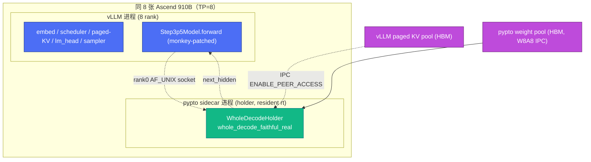
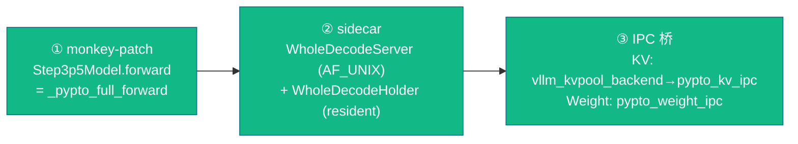
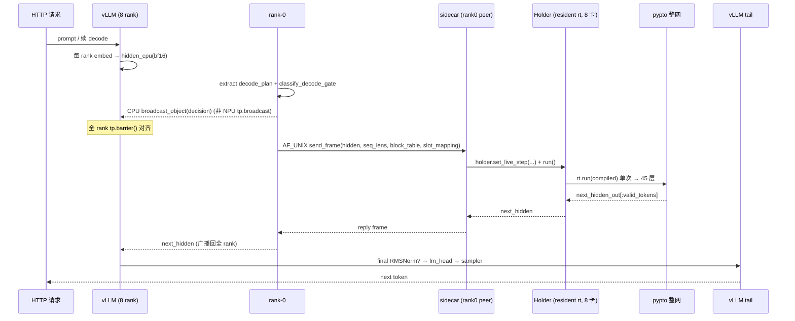
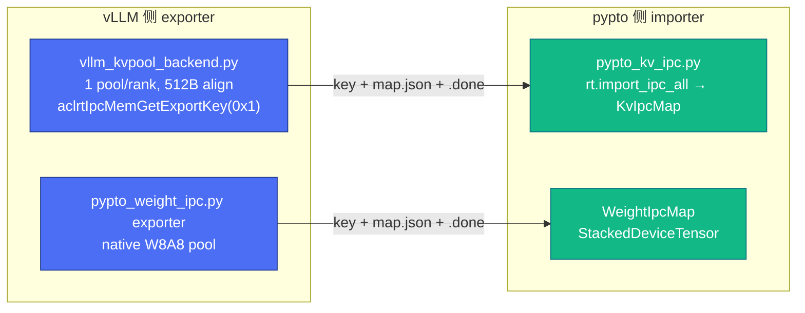

# vLLM + pypto 集成 · 系统设计（HLD）

> **层级**：System Design / High-Level Design。回答"vLLM 与 pypto 怎么分工、
> 怎么在同 8 卡共驻、请求怎么走到 pypto 整网再回来"。落地实现细节（monkey-patch
> / sidecar 协议 / KV·weight IPC / co-tenancy 开关）见
> [`02-detailed-design.md`](02-detailed-design.md)。op 级映射见
> [`03-vllm-op-mapping.md`](03-vllm-op-mapping.md)。上游背景见
> [`../00-context-and-goals.md`](../00-context-and-goals.md)。

## 1. 目标与边界

**目标**：把已在 standalone 验证通过的 pypto 整网
（[`../whole-net/`](../whole-net/)）接进 **vLLM serving 的 decode 路径**，替换
vLLM 原生 step3p5 的 45 层 decoder forward，同 8 卡共驻，IPC 零拷贝共享 KV 与
权重，最终 live token-exact 对齐原生 vLLM。

**职责边界**：

| 归 vLLM | 归 pypto |
|---------|----------|
| tokenizer、scheduler、continuous batching | embed（生成 hidden） |
| paged KV cache **分配与管理** | 45 层 decoder forward（整网） |
| tail：lm_head + sampler + OpenAI API | 消费 vLLM 的 paged KV（IPC 导入） |

**硬边界**：只在 backend seam 打补丁（不在 generic vLLM 路径散布 NPU 分支）；
prefill 仍由 vLLM 原生完成并填充 paged KV；native W8A8 不回退。

## 2. co-tenancy 拓扑

vLLM 世界与 pypto worker **共驻同 8 张卡**。二者各自持有 HCCL/通信状态会冲突，
故 pypto worker 用 `SIMPLER_COMM_NO_HCCL=1` 跳过 simpler 的（vestigial）HCCL
控制 comm，数据面走 file-barrier + IPC peer-access。

> co-tenancy 冲突的根因与 `SIMPLER_COMM_NO_HCCL` 解法见
> [`../../postmortems/03-hccl-cotenancy.md`](../../postmortems/03-hccl-cotenancy.md)。
> HBM 预算（64GB/卡，TP=8 sharded 足够）见 [`00`](../00-context-and-goals.md)。

## 3. 集成机制（三块拼装）

1. **monkey-patch**（`vllm_monkey_patch.py`）：把 `Step3p5Model.forward` 换成 `_pypto_full_forward`（4 模式 tail/shadow/layer_ref/full）。经 `sitecustomize` + `PYPTO_WHOLE_DECODE=1` 自动装载。
2. **sidecar**（`whole_decode_sidecar.py` + `whole_decode_holder.py`）：常驻整网服务，AF_UNIX socket 协议 v2；只有 rank-0 是 socket peer。
3. **IPC 桥**：KV（exporter `vllm_kvpool_backend.py` → importer `pypto_kv_ipc.py`）、权重（`pypto_weight_ipc.py`）。

## 4. 端到端时序（一步 decode）

**关键点**：
- pypto 用 **hidden-only 变体** `whole_decode_faithful_real_single_chip_hidden_only`
  （`decode_layer_single_chip_hidden.py`）：整网返回**末层 hidden**（`next_hidden_out`
  BF16），**final RMSNorm + lm_head + sampler 由 vLLM 承担**——这就是 vLLM↔pypto 的
  清晰边界（sidecar `--layer-name ..._single_chip_hidden_only`）。standalone 用带
  lm_head 的 full 变体（出 logits）。
- 决策广播走 **CPU/Gloo `broadcast_object`**，**不是** NPU `tp.broadcast`（后者会与 pypto 的全卡 collective 在同卡上死锁）。
- socket 不存在 + 真实请求 + tail-only 模型 ⇒ `GATE_FAIL_CLOSED`（raise，不静默 fallback）。
- 非 rank0 worker 阻塞在第二个 `broadcast_object`，不占 NPU/HCCL。

## 5. KV 与权重 IPC（数据面）

- **KV**：BF16（非 int8）；vLLM 每层 `[nb,128,1,128]` → pypto flat `[nb*128,128]`；schema v3 `flat_k_major_v_major_v1`，512B 对齐，`ENABLE_PEER_ACCESS`(0x1)。
- **权重**：native W8A8（routed INT8 + FP32 scale，禁 BF16-dequant）；`production_hidden_only` 剔除 tail 权重（vLLM 拥有 lm_head）。
- 详见 [`02-detailed-design.md`](02-detailed-design.md) §KV / §Weight。

## 6. 精度验收（A/B）

- 目标：live token-exact——8001（pypto hidden → vLLM lm_head → token）对 8000（原生 vLLM oracle），greedy top-1 ≥ 95%（terminal 目标逐 step 完全一致）。
- harness `e2_ab.py N`（spec'd，未编码）。standalone 侧 canonical P42 = argmax 303（[`../../reference/canonical-test.md`](../../reference/canonical-test.md)）。

## 7. 完成度（系统级）

| 能力 | 状态 |
|------|------|
| monkey-patch + sidecar + socket + 同卡共驻 | ✅ device-verified（live 8001 co-resident 跑通、返回 token） |
| `SIMPLER_COMM_NO_HCCL` co-tenancy | ✅ device-verified |
| KV-IPC / weight-IPC 导入 + 整网 serving（plumbing） | ✅ device-verified（PROBE_PASS） |
| **live token-exact A/B** | 🔴 未做（0162 provisioning 阻塞：无 vLLM 容器） |
| per-layer KV bridge（多 KV group ABI） | 🟡 现为单 flat pool，多 group 待做 |
| 3-way HBM / redundant-weight 精简 | 🟡 单 key ~47GB/rank，多 pool split 待做 |

## 8. 相关文档

- 详细设计（LLD）：[`02-detailed-design.md`](02-detailed-design.md) · op 映射：[`03-vllm-op-mapping.md`](03-vllm-op-mapping.md)
- co-tenancy 复盘：[`../../postmortems/03-hccl-cotenancy.md`](../../postmortems/03-hccl-cotenancy.md) · 8001 运维：[`../../postmortems/11-8001-bridge-live-ops.md`](../../postmortems/11-8001-bridge-live-ops.md)
- 整网子系统：[`../whole-net/01-system-design.md`](../whole-net/01-system-design.md)
- 进度：[`../../planning/roadmap.md`](../../planning/roadmap.md) · handoff：[`../../planning/handoff.md`](../../planning/handoff.md)
