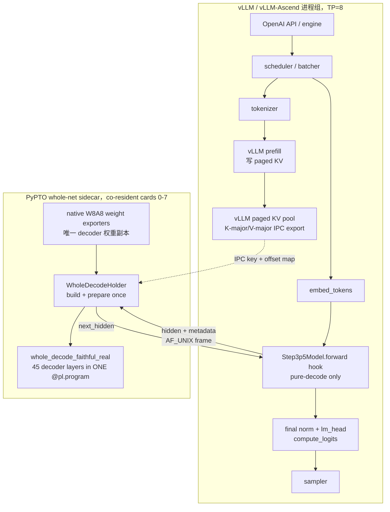
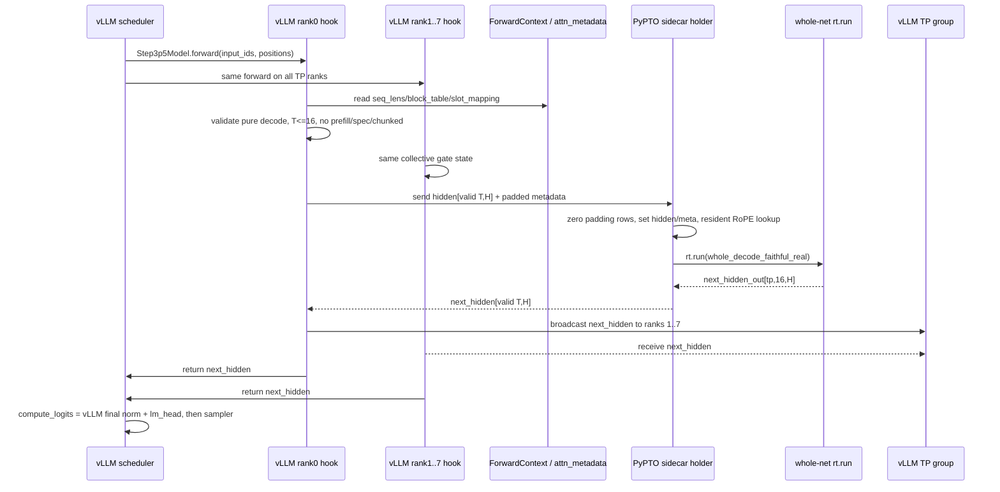
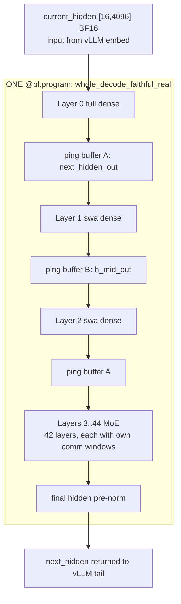
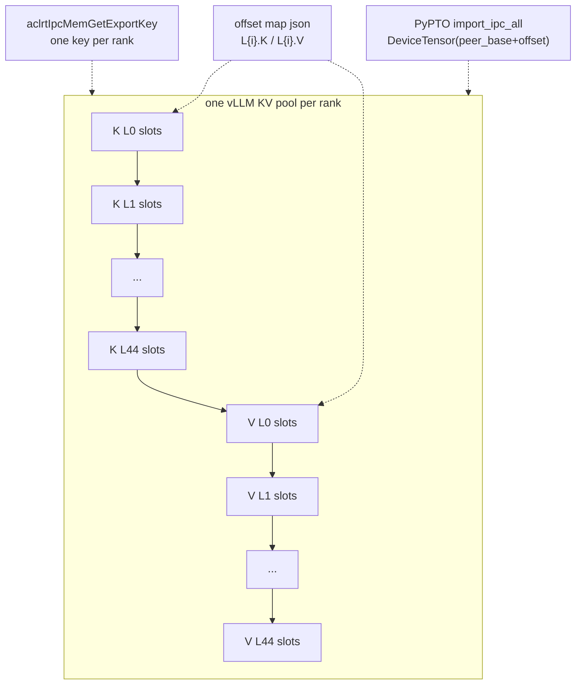
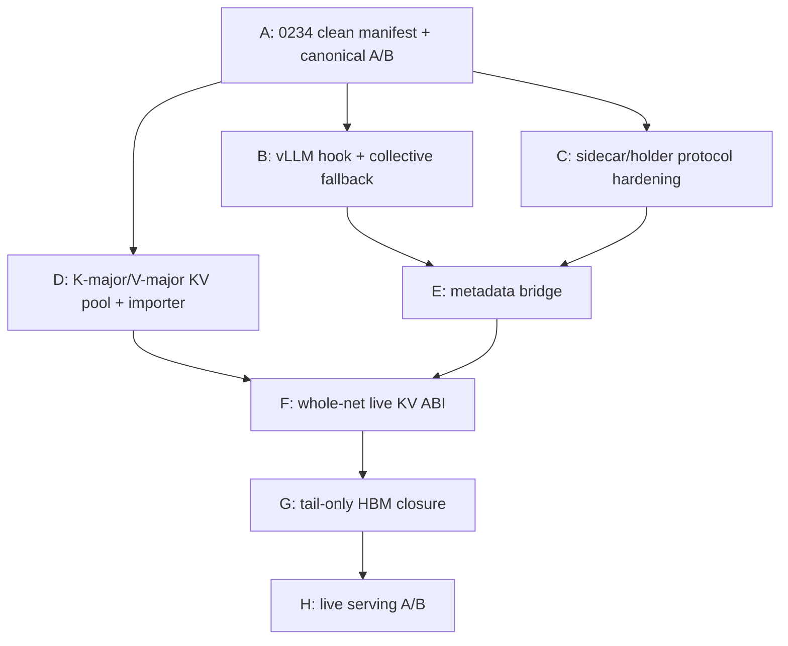

# vLLM + pypto 集成 · 详细设计（LLD）

> **层级**：Detailed / Low-Level Design。系统视角（职责边界 / co-tenancy 拓扑 /
> 端到端时序）见 [`01-system-design.md`](01-system-design.md)；op 级映射见
> [`03-vllm-op-mapping.md`](03-vllm-op-mapping.md)。
> **代码位置**：live 集成实现在 `pypto-lib-live/tools/step3p5/`（比 `pypto-lib`
> 镜像新）。
>
> 目标：把已在 canonical 验证通过的 `whole_decode_faithful_real` N=1 whole-net 接入
> vLLM serving decode 路径，完成 PyPTO 后端替换。
> 关联：[`../../planning/phases/28-n1-live-integration.md`](../../planning/phases/28-n1-live-integration.md)、
> [`../../reference/canonical-test.md`](../../reference/canonical-test.md)、
> [`../../develop/N1/N1-STABLE-ENV-0162-20260717.md`](../../develop/N1/N1-STABLE-ENV-0162-20260717.md)。

本文是 **落地任务导向的详细设计**：说明 vLLM 内如何截获、PyPTO 如何交互、模型/缓存/metadata/buffer 边界在哪里，并把每个可交付项拆成可执行任务。

> ⚠️ **代码实况校正**（据 `pypto-lib-live` 当前代码，供实现时对照）：
> monkey-patch 在 `vllm_monkey_patch.py` 的 `_pypto_full_forward`（4 模式
> tail/shadow/layer_ref/full）；决策广播用 CPU `broadcast_object`（**非** NPU
> `tp.broadcast`）；`classify_decode_gate` 4 态（FAIL_CLOSED/PROCEED/PROFILE_NOOP/
> FALLBACK）；sidecar 为 `whole_decode_sidecar.py` 的 `WholeDecodeServer` AF_UNIX
> 协议 v2 + `whole_decode_holder.py`；KV-IPC schema v3 `flat_k_major_v_major_v1`；
> 权重 native W8A8（`_ROUTED_INT8_KEYS` 禁 BF16-dequant）；co-tenancy 开关
> `SIMPLER_COMM_NO_HCCL=1`（`comm_hccl.cpp:261-317`）。

---

## 0. 设计原则与准出边界

### 0.1 必须保持的硬约束

1. **生产形态只允许单个 whole-net `@pl.program`**：`whole_decode_faithful_real` 继续作为 45 层 decode 的唯一 PyPTO 程序形态；禁止退回 per-layer 多 program。
2. **vLLM 只保留 serving 外壳和 tail**：tokenizer、scheduler、paged KV 管理、sampler、OpenAI API 继续由 vLLM 提供；45 层 decoder forward 由 PyPTO sidecar 替换。
3. **native W8A8 权重路线不回退**：routed expert 权重 INT8 + FP32 scale，activation INT8 + per-token scale，clamp 后二次 requant；禁止恢复历史 BF16 dequant 权重版本。
4. **buffer/metadata 边界必须显式**：hidden、KV、comm window、signal、padding row、valid row、dtype、shape、地址对齐都有唯一 owner 和 lifetime。
5. **测试准出以 canonical 文档为准**：standalone P42 的 PASS 只能是 `token=6127, argmax=303`；live 准出是真实 vLLM 请求 A/B，而不是 compile-only、随机输入、P1/P20。
6. **vLLM 补丁只放在 backend seam**：不在 generic vLLM 路径散布 NPU/PyPTO 分支；优先在 `vllm-ascend` worker/model-runner seam 或自包含 backend patch 中承载。

### 0.2 非目标

- 不实现 PyPTO prefill。prefill 仍由 vLLM 原生路径完成，并填充 vLLM paged KV。
- 不改 tokenizer、sampling、request routing、OpenAI API server。
- 不把 standalone release 文件和 live WIP 混成一个不可复现提交。
- 不把 0234 混合环境现象直接写成模型代码根因；必须先做清洁 A/B。

---

## 1. 总体架构

### 1.1 组件图



### 1.2 Decode step 时序图



### 1.3 vLLM 中的截获位置

**截获点一：`Step3p5Model.forward`**

- 输入：vLLM 已准备好的 `input_ids` / `positions` / optional `inputs_embeds`。
- 行为：
  1. 用 vLLM `embed_tokens` 得到 `hidden [T,HIDDEN]`。
  2. 判断是否满足 PyPTO pure-decode ABI。
  3. rank0 发送 hidden + metadata 到 PyPTO sidecar。
  4. rank0 收回 `next_hidden`，通过 TP broadcast 分发到其它 ranks。
  5. 返回 `next_hidden` 给 vLLM 后续 tail。
- fallback：若 sidecar 不可用、当前不是 pure decode、metadata 缺失或 shape 不满足，全 rank 一致走原始 vLLM forward。

**截获点二：`Step3p5ForCausalLM.compute_logits`**

- 保留 vLLM 已验证 tail：`final_norm + lm_head + logits_processor`。
- PyPTO whole-net 内部 lm_head 只作为 standalone/canonical debug，不作为 live serving 的输出路径。

**截获点三：vLLM KV cache allocation seam**

- 在 `vllm-ascend` 的 `_allocate_kv_cache_tensors` / reshape 后绑定 seam 中，把 Step3p5 45 层 KV pool 改成可导出的一池布局。
- vLLM attention 继续拿每层 view；PyPTO 通过 one IPC key + offset map 导入整池。

---

## 2. 进程与交互协议

### 2.1 进程职责

| 进程 | Owner | 常驻内容 | 不能拥有 |
|---|---|---|---|
| vLLM TP ranks | vLLM/vLLM-Ascend | tokenizer、scheduler、prefill、paged KV allocator、embed、final norm、lm_head、sampler | 45 层 decoder 权重长期副本 |
| PyPTO sidecar | pypto-lib live backend | native W8A8 decoder 权重 IPC、whole-net compiled program、prepared runtime、resident RoPE、导入的 vLLM KV view | vLLM request scheduler / sampler |
| Weight exporters | PyPTO | decoder weights IPC pool | serving control plane |

### 2.2 AF_UNIX socket frame

首阶段以 AF_UNIX + CPU byte frame 做正确性闭环；后续性能优化可替换为 device-side IPC handoff，但 ABI 字段不变。

```text
frame = uint32_be(header_len) + header_json + tensor_blobs...
header_json = {
  "version": 1,
  "op": "decode",
  "order": ["hidden", "meta_seq_lens", ...],
  "tensors": {
    name: {"shape": [...], "dtype": "bfloat16|int32|float32", "nbytes": int}
  },
  "meta": {
    "valid_tokens": T,
    "batch_capacity": 16,
    "kv_layout": "flat_k_major_v_major_v1"
  }
}
```

请求 tensor：

| 名称 | shape | dtype | valid / padding 规则 |
|---|---:|---|---|
| `hidden` | `[T,4096]` | BF16 | `1 <= T <= 16`；sidecar 写入 row0..T-1，rowT..15 清零 |
| `meta_seq_lens` | `[16]` | INT32 | 前 T 行为真实 seq len；padding 行填 1，不允许 0 |
| `meta_block_table` | `[16 * MAX_BLOCKS_PER_SEQ]` | INT32 | 前 T 行真实 block table；padding 行清零 |
| `meta_slot_mapping` | `[16]` | INT32 | 前 T 行真实 slot；padding 行填安全 slot 或 0，且由 valid mask 避免消费 |
| `meta_positions` | `[16]` | INT32 | 前 T 行真实 position；padding 行填 0 |

响应 tensor：

| 名称 | shape | dtype | 说明 |
|---|---:|---|---|
| `next_hidden` | `[T,4096]` | BF16 | rank0 从 PyPTO replicated output row0..T-1 拷出 |

响应 meta：

```text
{"argmax_debug": int, "dt_sec": float, "program": "whole_decode_faithful_real"}
```

### 2.3 collective 一致性 gate

所有 TP rank 必须对“是否走 PyPTO”达成一致，避免 rank0 走 socket、其它 rank 走原始 forward 导致 collective 死锁。

推荐实现：

```text
rank0 computes local_ok:
  sidecar socket reachable
  pure decode
  T <= 16
  metadata complete
  no spec/chunked/prefill path
  KV pool exported and imported
rank0 broadcasts local_ok to TP group
all ranks branch on broadcasted ok
```

不要依赖每个 rank 各自 `os.path.exists(sock)` 的偶然一致性。

---

## 3. 模型层边界与 buffer ledger

### 3.1 45 层交接边界



每层内部固定边界：

```text
hidden_in
  -> input RMSNorm
  -> attention + TP all-reduce + residual add = resid1
  -> post-attn RMSNorm
  -> dense MLP or MoE block
  -> residual add
  -> hidden_out
```

**跨层唯一交接张量**：`hidden [16,4096] BF16`。  
`resid1`、`post_norm`、routed intermediate、dispatch/combine 临时张量均为层内 local，不跨 layer boundary。

### 3.2 buffer ledger

| Buffer | shape / 物理 | dtype | owner | lifetime | 复用规则 |
|---|---:|---|---|---|---|
| `current_hidden` | `[tp,16,4096]` | BF16 | sidecar host shared tensor | per-step | 每 step 先清零再写 valid rows |
| `h_mid_out` | `[tp,16,4096]` | BF16 | whole-net Out | per run | hidden ping-pong B |
| `next_hidden_out` | `[tp,16,4096]` | BF16 | whole-net Out | per run | hidden ping-pong A / response source |
| `seq_lens` | `[tp,16]` | INT32 | vLLM metadata bridge | per-step | padding 行填安全值，不为 0 |
| `block_table` | `[tp,16*MAX_BLOCKS]` | INT32 | vLLM metadata bridge | per-step | padding row 清零 |
| `slot_mapping` | `[tp,16]` | INT32 | vLLM metadata bridge | per-step | valid rows 真实 slot |
| `rope tables` | resident full/SWA table | FP32 | sidecar | process lifetime | 初始化一次，每 step 按 positions 填入 program input 或走内置 lookup |
| `k_cache` | `[tp,45*slots,128]` | BF16 | vLLM KV pool, PyPTO import view | vLLM KV lifetime | K-major，层间不 alias |
| `v_cache` | `[tp,45*slots,128]` | BF16 | vLLM KV pool, PyPTO import view | vLLM KV lifetime | V-major，层间不 alias |
| MoE comm windows | per MoE layer distinct | mixed | whole-net | program lifetime | 禁止跨层共享 SSA window |
| control signals | logical `[8,1] INT32=32B`，physical 512B | INT32 | whole-net/runtime | program lifetime | 物理 512B isolation |

---

## 4. KV cache ABI

### 4.1 选定布局：flat K-major / V-major

当前 standalone `KV_CACHE_ROWS_DYN=4096` 只够 ctx=1 测试。live 需要 vLLM paged KV 的全部 slots。正式 ABI：

```text
per rank K tensor: [45 * slots_per_layer, 128] BF16
per rank V tensor: [45 * slots_per_layer, 128] BF16
host signature:    k_cache [tp, 45*slots_per_layer, 128]
                   v_cache [tp, 45*slots_per_layer, 128]
```

KV row address：

```text
layer_base = layer_idx * slots_per_layer
row        = layer_base + paged_slot
```

### 4.2 KV pool 图



### 4.3 vLLM side responsibilities

1. Step3p5 KV allocation 使用 K-major/V-major contiguous pool。
2. 每层 vLLM attention 仍绑定自己的 K/V view：
   ```text
   L{i}.K -> pool[offset_i_k : offset_i_k+nbytes]
   L{i}.V -> pool[offset_i_v : offset_i_v+nbytes]
   ```
3. 导出：
   ```text
   pypto_kvpool.key.rank{r}
   pypto_kvpool_map.json.rank{r}
   ```
4. map 必须包含：
   ```json
   {
     "version": 1,
     "layout": "flat_k_major_v_major_v1",
     "dtype": "bfloat16",
     "head_dim": 128,
     "num_layers": 45,
     "slots_per_layer": 123456,
     "pool_bytes": 123,
     "map": {
       "L0.K": {"offset": 0, "nbytes": 0, "shape": [slots,128]},
       "L0.V": {"offset": 0, "nbytes": 0, "shape": [slots,128]}
     }
   }
   ```

### 4.4 PyPTO side validator

`pypto_kv_ipc.py` 必须在 import 前 fail-fast：

- `dtype == bfloat16`
- `head_dim == 128`
- `num_layers == 45`
- K/V `slots_per_layer` 一致
- 每个 `offset`、`nbytes` 512B 对齐
- entry 不重叠且不越过 `pool_bytes`
- K section 连续，V section 连续
- vLLM block size 与 PyPTO attention 的 `BLOCK_SIZE` 一致
- shape 推导后 `KV_CACHE_ROWS_DYN == 45 * slots_per_layer`

---

## 5. Attention metadata bridge

### 5.1 vLLM metadata 来源

live hook 从 forward context 读取：

```text
get_forward_context().attn_metadata
common_attn_metadata.block_table_tensor
common_attn_metadata.slot_mapping
seq_lens / _seq_lens_cpu / num_computed_tokens_cpu
positions
```

实际字段在不同 vLLM/vLLM-Ascend 版本会变化，所以必须封装一个窄 shim：

```python
def extract_pypto_decode_meta(forward_context, *, max_batch=16) -> PyPtoDecodeMeta:
    ...
```

shim 输出固定为 PyPTO ABI，不把 vLLM 内部对象传给 sidecar。

### 5.2 pure decode 判定

仅以下情况允许走 PyPTO：

- 当前 step 没有 prefill token；
- 每个 request 本 step query length 为 1；
- `1 <= T <= 16`；
- 不在 profiling dummy run；
- 不在 speculative draft / verify 混合路径；
- block table 和 slot mapping 非空；
- KV pool 已导出并被 sidecar 成功 import；
- 所有 TP ranks 通过 collective gate 进入同一分支。

否则 fallback 到原 vLLM forward。

### 5.3 padding 和初始化

```text
valid rows:   [0, T)
padding rows: [T, 16)
```

规则：

- `hidden`：sidecar 每 step `zero_()` 整个 `[tp,16,H]`，只写 valid rows。
- `seq_lens`：valid rows = 真 seq len；padding rows = 1，避免 position = -1。
- `block_table`：valid rows = 真 block ids；padding rows = 0。
- `slot_mapping`：valid rows = 真 slot；padding rows = 0 或安全 slot；attention 必须不消费 padding rows。
- `logits`：只采样 valid request 对应行。

---

## 6. RoPE 设计

当前 ctx=1 standalone 用 identity RoPE：`cos=1, sin=0`。live 不能每 step 传大表。

选定方案：

1. sidecar 初始化时构建 full attention 和 SWA attention 的 resident RoPE table；
2. 每 step 从 vLLM hook 传 `positions [16] INT32`；
3. sidecar 根据 positions 填充 PyPTO program 需要的 `rope_cos_full/sin_full`、`rope_cos_swa/sin_swa` 当前行；
4. padding positions 填 0。

后续优化：如果 whole-net attention 支持内部 table lookup，可进一步把 per-step rope input 缩成 positions-only。

---

## 7. HBM 方案：vLLM tail-only

### 7.1 问题

三份权重/working set 同时常驻会超过 64GB/card：

```text
PyPTO native W8A8 exporter ≈ 25.35 GiB/card
vLLM W8A8 decoder model   ≈ 24 GiB/card
whole-net runtime workset ≈ 16 GiB/card
sum                       > 64 GiB/card
```

### 7.2 选定方案

vLLM 不常驻 45 层 decoder 权重，只保留：

```text
embed_tokens
final_norm
lm_head
```

PyPTO exporter 是 decoder 权重唯一副本，保持 native W8A8。

### 7.3 三个落地候选

| 方案 | 描述 | 风险 | 建议 |
|---|---|---|---|
| A | loader 跳过 decoder-layer 权重加载，构造 tail-only model | 对 vLLM model config/layer index 影响最大 | 最终形态 |
| B | 正常加载后删除 decoder params 并触发 allocator 回收 | Ascend allocator 是否释放 HBM 待证 | 快速验证 HBM |
| C | 构造 decoder stub module，forward 必然被 hook 替代 | 需要保证 state_dict strict/load 行为 | 推荐第一版工程实现 |

tail-only 改动属于 vLLM-Ascend backend seam，不应改 upstream generic vLLM。

---

## 8. Patch / 文件归属

| 层 | 仓库/路径 | 归属 | 补丁类别 |
|---|---|---|---|
| integration docs/runbooks | `pypto-project/phases`, `develop/N1` | manifest、任务、验证 | integration repo |
| whole-net holder/sidecar/KV importer | `pypto-lib/tools/step3p5/*` | PyPTO live backend | model/product patch |
| generated whole-net live variant | `pypto-lib/models/step3p5/decode_layer.py` + generator | PyPTO model code | generator-owned patch |
| vLLM hook/autoload | `vllm-ascend` backend patch or `/logs/pypto_patch` self-contained backend | backend seam | Class C |
| KV pool allocator/export | `vllm-ascend/worker/model_runner_v1.py` narrow override | backend seam | Class C |
| tail-only loader/stub | `vllm-ascend` Step3p5-specific patch | backend seam/model-specific | Class B/C |

原则：优先新文件和窄 patch；不要把 PyPTO 逻辑散落进 vLLM generic model executor。

---

## 9. 任务拆解表

### A. 环境与基线

| ID | 任务 | 主要文件/命令 | 依赖 | 验收 |
|---|---|---|---|---|
| A1 | 0234 清洁环境 manifest | `develop/N1/collect-0234-manifest.sh` | 无 | manifest 中只有单一 CANN、单一 Python/PYTHONPATH，五仓 pin 和 binary hash 明确 |
| A2 | canonical A/B runner 环境净化 | `develop/N1/run-0234-canonical-ab.sh` | A1 | 使用 `env -i`，禁止混入 beta/non-GA 多套路径；trap 可恢复 runtime binary |
| A3 | 0234 stable binary + CANN A/B | staged 0162 runtime + beta/non-GA CANN | A2 | 每组 fresh exporter + worker，有 rc/argmax/dmesg/manifest |
| A4 | checkpoint 全量 manifest | checkpoint 60/62 文件 sha256 | A1 | 与 0162 SSOT 差异解释清楚，不再只比首尾 shard |

### B. vLLM 截获与 fallback

| ID | 任务 | 主要文件/接口 | 依赖 | 验收 |
|---|---|---|---|---|
| B1 | backend autoload 入口 | self-contained `pypto_whole_decode_backend.py` 或 vLLM-Ascend patch | A1 | `PYPTO_WHOLE_DECODE=1` 时 patch install；flag off 零影响 |
| B2 | collective-consistent gate | `Step3p5Model.forward` hook | B1 | sidecar absent/profile/prefill 时全 rank fallback，无 broadcast 死锁 |
| B3 | `compute_logits` tail hook | `Step3p5ForCausalLM.compute_logits` | B1 | 用 vLLM final norm + lm_head；tail-only logits 与 vanilla 一致 |
| B4 | pure-decode 判定 | metadata shim | B2 | prefill/chunked/spec/profiling 均 fallback；decode qlen=1 才走 PyPTO |

### C. Sidecar / protocol / holder

| ID | 任务 | 主要文件 | 依赖 | 验收 |
|---|---|---|---|---|
| C1 | socket protocol v1 固化 | `whole_decode_sidecar.py` | 无 | offline selftest 覆盖 BF16/INT32/多 tensor |
| C2 | holder padding setter | `whole_decode_holder.py` | C1 | 每 step zero hidden/meta padding；T=1/T=16 均正确 |
| C3 | resident RoPE | `whole_decode_holder.py` | C2 | 不再通过 socket 传整张 rope 表；positions-only 驱动 |
| C4 | holder run telemetry | holder/sidecar | C2 | 输出 dt、argmax_debug、shape、NaN guard、valid token count |

### D. KV pool 与 PyPTO KV importer

| ID | 任务 | 主要文件 | 依赖 | 验收 |
|---|---|---|---|---|
| D1 | vLLM K-major/V-major KV pool | vLLM-Ascend KV allocator seam | A1 | 每 rank one pool，L0..L44 K 连续、V 连续 |
| D2 | KV IPC key/map export | vLLM-Ascend backend | D1 | 生成 `pypto_kvpool.key.rank*` 和 map json |
| D3 | KV map validator | `pypto_kv_ipc.py` | D2 | dtype/head_dim/num_layers/512B/no-overlap/contiguous 全校验 |
| D4 | build stacked flat KV | `pypto_kv_ipc.py` | D3 | 返回 `K,V [tp,45*slots,128]` DeviceTensor/StackedDeviceTensor |
| D5 | vLLM/PyPTO KV live smoke | synthetic + real vLLM | D4 | PyPTO 读到 vLLM prefill 写入的同一 slot 数据 |

### E. Metadata bridge

| ID | 任务 | 主要文件 | 依赖 | 验收 |
|---|---|---|---|---|
| E1 | ForwardContext 探针 | vLLM hook report | B1 | 当前 image 中 block_table/slot_mapping/seq_lens 字段路径固定记录 |
| E2 | metadata extractor shim | vLLM backend patch | E1 | 输出固定 PyPTO ABI tensors，不暴露 vLLM 内部对象 |
| E3 | padding / batch contract tests | offline unit | E2 | T=1、T=2、T=16、padding rows 均通过 |
| E4 | fallback consistency tests | vLLM local | E2 | metadata 缺失时所有 ranks fallback，服务不挂 |

### F. Whole-net live KV ABI

| ID | 任务 | 主要文件 | 依赖 | 验收 |
|---|---|---|---|---|
| F1 | whole-net live KV rows 常量 | generator config | D4 | standalone default 4096 不被污染；live variant 可设 `45*slots` |
| F2 | attention row formula 复核 | `decode_layer.py` generator | F1 | `layer_base = layer_idx * slots_per_layer`，层间不 alias |
| F3 | generator round-trip | `_gen_faithful_real.py` | F2 | strip/regenerate byte compare PASS |
| F4 | standalone canonical 回归 | 0162/0234 clean | F3 | P42 token6127 argmax=303 不回退 |

### G. Native W8A8 与 HBM closure

| ID | 任务 | 主要文件 | 依赖 | 验收 |
|---|---|---|---|---|
| G1 | decoder 权重唯一副本审计 | vLLM + PyPTO HBM logs | A1 | vLLM 不再持有 45 层 decoder params 常驻副本 |
| G2 | tail-only stub/loader | vLLM-Ascend Step3p5 patch | B3 | 只加载 embed/final_norm/lm_head，forward hook 仍可运行 |
| G3 | HBM budget smoke | `npu-smi` + process stats | G2 | exporter + sidecar + vLLM tail < 64GB/card，有 headroom |
| G4 | W8A8 guard | PyPTO loader/checks | G1 | routed weights INT8/scale FP32；无 BF16 dequant 权重路径 |

### H. Live serving 验证

| ID | 任务 | 命令/场景 | 依赖 | 验收 |
|---|---|---|---|---|
| H1 | sidecar 单独启动 | `whole_decode_sidecar --serve` | C/D/F | holder build+prepare once，no crash |
| H2 | vLLM 8001 fallback health | sidecar absent | B | health=200，fallback count 增加，无死锁 |
| H3 | vLLM + sidecar single request | greedy temp=0 | B/C/D/E/F/G | 首个 pure decode step 走 PyPTO，返回 token |
| H4 | multi-batch padding | 2/4/16 req decode | E/G | valid rows 正确，padding 不污染 logits/KV |
| H5 | live A/B | 8001 PyPTO vs 8000 vanilla | H3/H4 | L3 greedy top-1 >= 95%；L1/L2 hidden 指标作为辅证 |
| H6 | 0234 soak | clean env repeated run | H5 | 无 stall/NaN/507018；失败时按 manifest 定位单变量 |

---

## 10. 验证矩阵

| 阶段 | 目的 | 必跑项 | PASS 标准 |
|---|---|---|---|
| static | 防止语法/格式错误 | `py_compile`, `git diff --check` | rc=0 |
| generator | 防止手改 generated code | strip/regenerate/byte compare | cmp rc=0 |
| unit | 协议/KV/metadata 算术 | sidecar selftest, KV validator selftest, metadata padding selftest | 全 PASS |
| standalone | 确认 whole-net 未回退 | canonical P42 token 6127 | rc=0, RUN done, argmax=303 |
| env A/B | 确认 0234 单变量 | CANN/runtime/checkpoint manifest | 每次结果绑定 manifest |
| live fallback | 服务可启动 | sidecar absent / profiling | vLLM health=200，无死锁 |
| live single | 单请求 decode | PyPTO hook + sidecar | token 返回、无 NaN、KV slot 正确 |
| live batch | padding/multi-batch | T=2/4/16 | valid rows 正确 |
| live A/B | token-exact 准出 | 8001 vs 8000 greedy | top-1 >= 95% |

---

## 11. 失败排查顺序

1. **先查测试对象是否一致**：源码 pin、runtime binary、CANN、PTOAS、checkpoint、环境变量、设备是否与 manifest 一致。
2. **再查是否违反框架约束**：单 whole-net、RAW-only 非别名、comm window distinct、512B signal isolation、KV 512B alignment、padding 初始化。
3. **再查 ABI 是否错位**：vLLM metadata 字段、slot_mapping、block_table stride、K/V offset、layer_idx base、dtype。
4. **最后查局部代码逻辑**：attention row、RoPE position、W8A8 scale、broadcast/fallback、sidecar tensor copy。

---

## 12. 推荐落地顺序



第一批推荐提交边界：

1. **docs-only**：本文档 + runbook 更新。
2. **offline plumbing**：sidecar protocol、KV map validator、metadata extractor unit，不触碰 generated whole-net。
3. **vLLM seam**：autoload/hook/fallback/tail-only stub，小而独立。
4. **KV allocator**：vLLM K-major/V-major pool + export map。
5. **whole-net live variant**：generator-owned KV ABI 改动 + canonical 回归。
6. **HBM closure + live A/B**：tail-only loader/stub + 0234 serving 验证。
