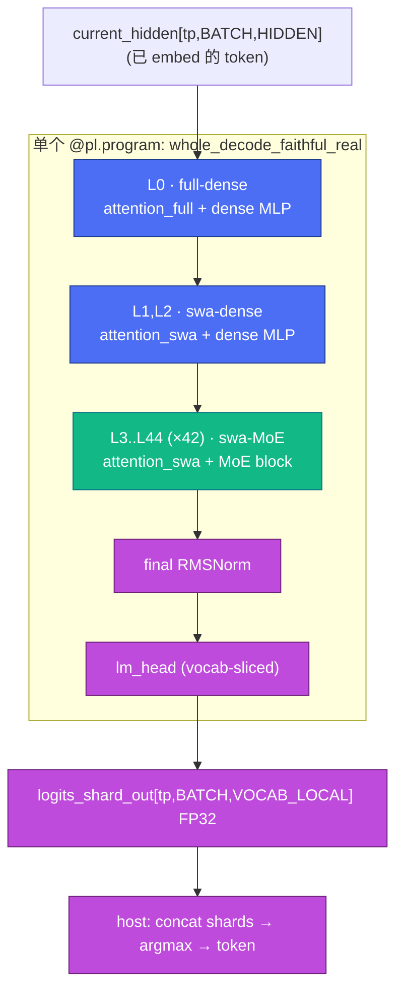
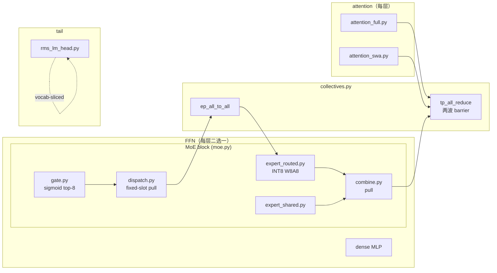
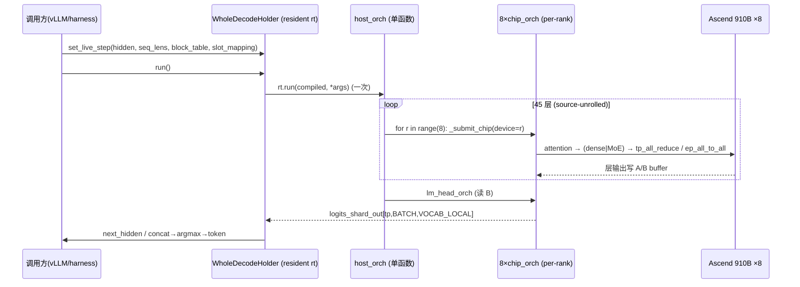

# pypto 整网集成 · 系统设计（HLD）

> **层级**：System Design / High-Level Design。回答"整网由哪些模块组成、
> 怎么连、数据与控制怎么流、8 卡怎么协同"。落到代码结构/接口/算法的细节见
> [`02-detailed-design.md`](02-detailed-design.md)（详细设计 LLD）。
> 上游背景见 [`../00-context-and-goals.md`](../00-context-and-goals.md)。

## 1. 目标与边界

**目标**：把 step3p5 的 45 层 decode + tail 融进**一个 `@pl.program`**
（"N=1 whole-net fusion"），在 8 卡 Ascend 910B 上以 TP=8 / EP=8 跑通，W8A8
native INT8 权重，token-exact 对齐 vLLM 参考。

**硬边界（不可违反）**：

1. 生产形态**只允许单个 whole-net `@pl.program`**——禁止退回 per-layer 多 program（多 program 有 co-prepare 死锁墙，见 [`../../postmortems/08-multiprogram-coprepare-deadlock.md`](../../postmortems/08-multiprogram-coprepare-deadlock.md)）。
2. **native W8A8 不回退**——routed expert INT8 权重 + FP32 scale + in-kernel dequant；禁止 BF16-dequant 权重。
3. 验收金标准唯一：[`../../reference/canonical-test.md`](../../reference/canonical-test.md)（P42 → token 6127 → argmax 303）。

**非目标**：prefill（仍由 vLLM 原生完成）、tokenizer/sampler（vLLM）。

## 2. 整网架构总图

**层表**（`config.py:78-194`，`LAYER_TYPES` 按 `[full,swa,swa,swa]×12` 循环）：

| 层 | attention | FFN | 数量 |
|----|-----------|-----|------|
| L0 | full | dense MLP | 1 |
| L1, L2 | swa | dense MLP | 2 |
| L3 … L44 | swa | MoE（EP=8, 36 local experts/rank） | 42 |
| — | — | final RMSNorm + lm_head | 1 tail |

共 **12 full-attention + 33 sliding-window**（跨全部 45 层），FFN 为
**3 dense + 42 MoE**。判定：`is_full_attention(li)`（`config.py:250`）、
`is_moe_layer(li)`（`config.py:254`）。

## 3. 模块划分

| 模块 | 文件 | 职责 |
|------|------|------|
| full attention | `attention_full.py` | QKV + qk_norm + RoPE + paged flash + head-gate + o_proj；跨 rank `tp_all_reduce` |
| swa attention | `attention_swa.py` | 同上，滑窗变体 |
| MoE gate | `gate.py:112` | FP32 sigmoid + `router_bias` + flat top-8 + renorm ×`MOE_ROUTER_SCALING_FACTOR=3.0`；结果 **replicated** across ranks |
| MoE dispatch | `dispatch.py` | histogram/prefix-sum、pack payload、inverse-map、local-expert CSR；**fixed-slot pull** |
| routed experts | `expert_routed.py` | 每 rank 36 个 local expert（INT8×INT8 W8A8） |
| shared expert | `expert_shared.py` | 共享专家（BF16） |
| MoE combine | `combine.py` | 加权 gather + 回填源 rank；**pull** |
| tail | `rms_lm_head.py:83` | final RMSNorm + vocab-sliced lm_head，出 `logits_shard_out` FP32 |
| collectives | `collectives.py` | `tp_all_reduce`(118) / `tp_all_gather`(255) / `tp_reduce_scatter`(346) / `ep_all_to_all`(451) |

## 4. TP=8 / EP=8 拓扑与权重三分类

8 卡按 **TP=8 且 EP=8** 切分。权重按用途三分类（`weight_loader.py` docstring）：

| 类别 | 例子 | 切法 |
|------|------|------|
| **REPLICATED** | embed、各 RMSNorm、router gate/bias | 每卡整份 |
| **TP-sliced** | attention QKV/O、dense MLP、shared expert、lm_head | 按 hidden/head 维切 8 份 |
| **EP-sliced** | 288 routed experts | 每卡 36 个 |

- attention 输出用 `tp_all_reduce` 跨 8 卡求和（partial → full）。
- MoE token 用 `ep_all_to_all` 在 8 卡间路由到 owning expert，再 combine 回源。
- single-card vs TP=8 只是 `DistributedConfig` 选择，**同一份 `@pl.program`**。

## 5. 数据流：2-buffer ping-pong

整网在 host_orch 内 source-unroll 成 45 层链，用**两个常驻 buffer 乒乓**传递
层间 hidden（避免每层新分配）：`A = h_mid_out`，`B = next_hidden_out`。

- L0：`full_chip_orch`（`current_hidden` → B）
- L1/L2：`swa_chip_orch`（B → A → B）
- L3..44：`swa_attn_only_orch`（B → A）后接 `chip_orch` MoE（A → B）
- tail：`lm_head_orch` 读 B

## 6. 控制流：host_orch rank-local single-submit

**关键设计**：整网**一步 decode 只从一个 `host_orch` 驱动全部 45 层**。每层
段内用 `for r in pl.range(pld.world_size())` 的 SPMD rank 循环，TP=8 下即
**每 rank 一次 `_submit_chip`（共 8 次 submission），不是旧设计的 46 次
layer-level submission**。resident `WholeDecodeHolder`（`whole_decode_holder.py:42`）
持有 prepared `rt`，每 decode step 只调一次 `self.rt.run(compiled, *args)`。

## 7. 通信与稳定性（系统级要点）

- **per-layer 独立 comm window**：每层的通信/信号 buffer 用 `_L{pos}` 前缀命名，**层间不复用**——否则跨层 SSA buffer 别名会触发 scheduler timeout（见 [`../../postmortems/07-whole-net-scheduler-timeout.md`](../../postmortems/07-whole-net-scheduler-timeout.md)）。
- **512B signal 隔离**：`COMM_CONTROL_SIGNAL_BYTES=512`，每个控制信号独占一条 L2 cache line，避免 false-sharing（逻辑仍是 `[tp,1]` INT32）。
- **两波 barrier `tp_all_reduce`**：单波在 ≥41 层流水时挂死，改两波完成 barrier。
- 细节与复盘见 [`../../reference/cache-line-signal-isolation.md`](../../reference/cache-line-signal-isolation.md)。

## 8. KV 与权重接入

- **paged KV**：`k/v_cache[tp,4096,128]` BF16 + `seq_lens`/`block_table[tp,512]`/`slot_mapping`；可从 vLLM 经 IPC 零拷贝导入（`kv_ipc=True`）。
- **native W8A8 权重 IPC**：`pypto_weight_ipc.py` 把每 rank 权重池导成 IPC，`StackedDeviceTensor` 按字节 offset 寻址。routed 权重 INT8 + FP32 scale，禁 BF16-dequant。

## 9. 生成与调参

- 整网 builder 由生成器 `tools/step3p5/_gen_faithful_real.py` 文本生成后写入 `decode_layer.py`；`_strip_real_builder.py` 先剥旧副本。
- 调参旋钮 `P_FAITHFUL_MOE_LAYERS`（默认 42 = 全网）控制发射多少 MoE 层，用于 bisect。

## 10. 相关文档

- 详细设计（LLD，含 file:line）：[`02-detailed-design.md`](02-detailed-design.md)
- per-layer/block/整网三轴 + N≥6 program 墙 + DeepSeek 对照：[`03-integration-axes.md`](03-integration-axes.md)
- 整网 hang 排查 skill：`.claude/skills/pypto-whole-net-hang-debug/`
- 强开发约束：`.claude/skills/pypto-dev-constraints/`
