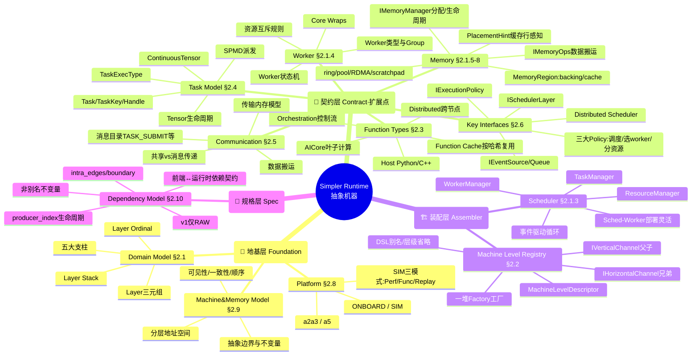
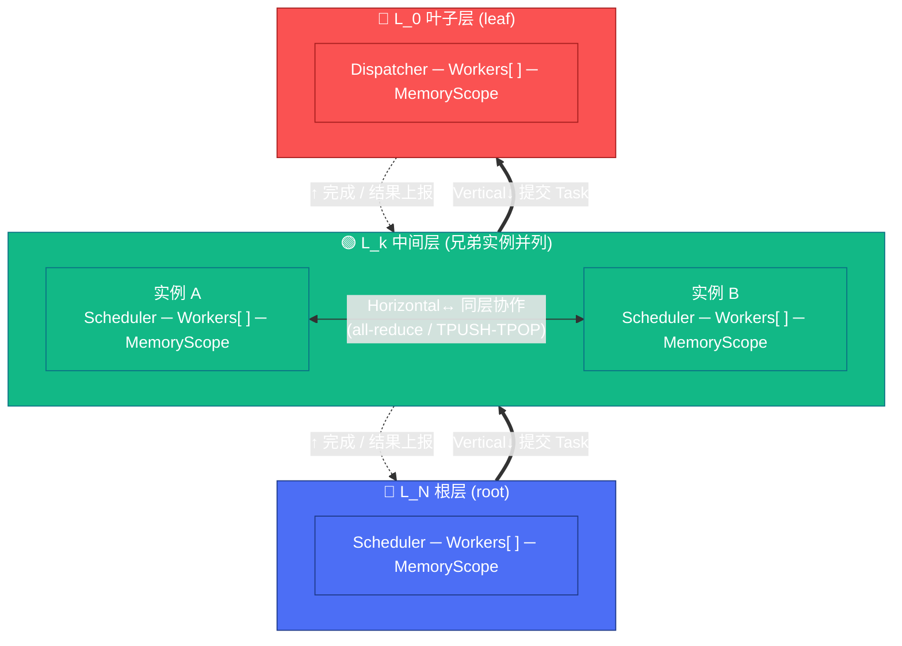
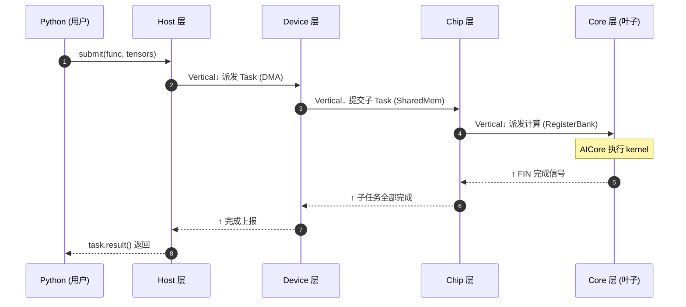
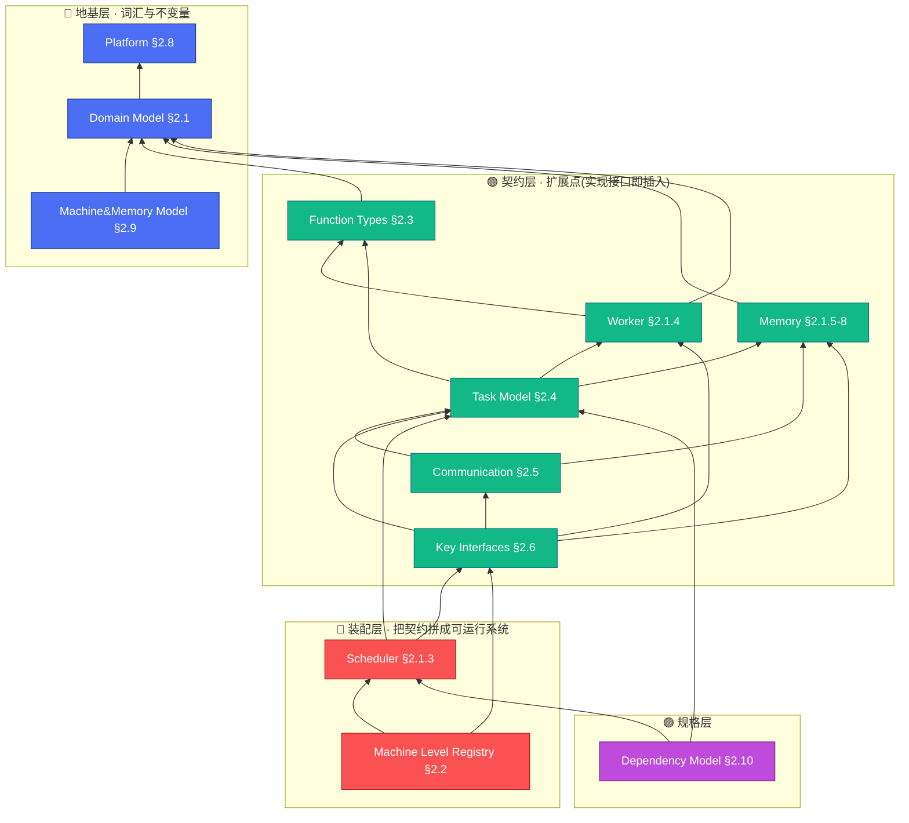

# 学习笔记 · 逻辑视图（Logical View）

> **这是什么**：对 [`pypto-runtime-arch-docs/02-logical-view.md`](../../pypto_top_level_documents/pypto-runtime-arch-docs/02-logical-view.md) 的个人学习总结 + 彩色思维脑图。
> **目的**：一页看懂 Simpler runtime 的"抽象机器（Abstract Machine）"到底由哪些概念组成、它们怎么分层、谁依赖谁。原文档是权威规格，本笔记是"抓主干 + 记心得"。
> **读法**：先看脑图建立全局印象 → 看五大支柱 → 看三层依赖 → 需要细节时跳回原文档对应 §。

---

## 🎯 一句话理解

> **Simpler runtime = 一台"抽象机器"，它把硬件（NPU / host / 多机）抽象成一摞可递归的执行层（Layer），每层都是 `(调度器 Scheduler, 一组 Worker, 内存作用域 MemoryScope)` 三元组；上层把 Task 往下压，下层执行，层与层之间靠 Channel 通信。整套逻辑与平台无关，只有最底下的 Machine Level 实现和 HAL 才是平台相关的。**

一个心智锚点：**"递归"是灵魂**。从"分布式多机"一路到"单卡内 AICore 派发"，全都是同一个 `ISchedulerLayer` 契约，只是每层对"Worker 是什么、Memory 是什么"的解释不同。理解了这点，整份逻辑视图就串起来了。

---

## 🧠 彩色思维脑图 · 全景

> 颜色约定（贯穿全笔记）：🔵 **地基层** ｜ 🟢 **契约层/扩展点** ｜ 🔴 **装配层** ｜ 🟣 **规格层**。
> 若你的 markdown 渲染器不支持 `::icon`（需要 Font Awesome），图标会被忽略但结构与配色不受影响；mindmap 会自动给各分支上色。

---

## 🔀 层次结构 · 垂直通道 vs 水平通道

抽象机器把执行层摞成一个 **Layer Stack**。层与层、层内实例之间靠两种正交的通道通信——这就是文档说的"分成垂直和水平两个方向"：

- **垂直通道 `IVerticalChannel`（父 ↔ 子）**：上层把 **Task 往下压**（提交/派发），下层把 **结果/完成往上报**。一降一升，构成主干数据流。
- **水平通道 `IHorizontalChannel`（兄弟 ↔ 兄弟）**：同一层的实例之间协作，如 all-reduce、Core 间的 TPUSH/TPOP。它不改变层级，只在同层横向流动。

> 读法：**实线粗箭头 = 垂直向下派发 Task，虚线箭头 = 垂直向上回报结果，双向箭头 = 水平同层协作**。每层内部都是同一个 `(Scheduler, Workers[], MemoryScope)` 三元组——这就是"递归"：换一层，只是三元组里"Worker/Memory 是什么"变了。

### 一次任务的"流动"（从 Python 到 AICore 再回来）

垂直通道上的一降一升，串起来就是一次完整调用的生命流。下图自上而下按时间读，就是那种"流动的感觉"：

> 下压走垂直通道的具体载体逐层不同（DMA → SharedMem → RegisterBank），但**契约统一**：每层都是 `ISchedulerLayer`。这正是"同一套代码适配不同硬件"的体现——详见 [过程视图 §4.2](04-process-view.md)。

---

## 🏛️ 五大支柱（Five Pillars）

抽象机器由五件事拼成，记住它们就记住了逻辑视图的骨架：

| # | 支柱 | 一句话 | 关键类型 |
|---|------|--------|----------|
| 1 | **Machine Level Registry** | 蓝图：命名的资源层级 + 注册的通信实现 | `MachineLevelDescriptor` + 各种 Factory |
| 2 | **Execution Layers** | 从蓝图实例化出来的一摞层，每层 = `(Scheduler, Workers[], MemoryScope)` | `Layer` 三元组、`LayerId` |
| 3 | **Function 类型** | 可调用的计算单元（4 类） | AICore / Orchestration / Host / Distributed |
| 4 | **Task 模型** | 可被调度的最小工作单位 | `Task`、`TaskKey`、`SPMDTaskDescriptor` |
| 5 | **Communication 模型** | 层间/机间怎么换控制与数据 | `IVerticalChannel`、`IHorizontalChannel` |

参数化维度：整台机器被 **Platform**（`a2a3` / `a5`）× **Variant**（`ONBOARD` / `SIM`）参数化。**运行时逻辑平台无关**，只有 Machine Level 实现和 HAL 平台相关——这是可移植性（NFR-3）的根。

---

## 🪜 三层依赖（读懂"谁先于谁"）

逻辑模块构成一个**严格 DAG**（无环）。按依赖方向自底向上分三层：

- 🔵 **地基层**（Platform / Domain / Machine&Memory Model）：建立词汇和不变量，其它一切都要先有它们。
- 🟢 **契约层**（Function / Memory / Worker / Task / Comm / Key Interfaces）：引入领域概念 + 抽象接口。**这些就是运行时的扩展点**——加新平台/新传输/新调度启发式，只要实现对应接口 + 注册，不改框架代码（Rule D2 / OCP）。
- 🔴 **装配层**（Scheduler / Registry）：把契约拼成能跑的系统。Scheduler 内部拆成 TaskManager / WorkerManager / ResourceManager 三个子件；Registry 负责按层绑定工厂、组装 Layer Stack。
- 🟣 **规格层**（Dependency Model）：不是代码接口，而是"前端 ↔ 运行时"的依赖契约规范（`intra_edges`、`producer_index`、非别名不变量、v1 只做 RAW）。

> **关于"看似有环"**：Registry 的工厂会产出 Scheduler 实例，而 Scheduler 又用 Registry 提供的 channel——这个环靠**接口/实现分离**打破：Registry 只依赖接口契约，不依赖具体 scheduler 代码。

---

## 🗂️ 模块速查表（12 个子文档索引）

原文档把逻辑视图拆成每模块一份子文档，放在 [`02-logical-view/`](../../pypto_top_level_documents/pypto-runtime-arch-docs/02-logical-view/) 下。速查：

| § | 模块 | 层 | 核心概念 |
|---|------|----|----------|
| §2.1 | Domain Model | 🔵 | 五大支柱、递归 Layer、Layer Stack、Ordinal |
| §2.1.3 | Scheduler | 🔴 | TaskManager / WorkerManager / ResourceManager、事件循环 |
| §2.1.4 | Worker | 🟢 | Worker 状态机、类型、Group、资源互斥、Core Wraps |
| §2.1.5–8 | Memory | 🟢 | `IMemoryManager` / `IMemoryOps`、Region、`PlacementHint`、ring/pool/RDMA |
| §2.2 | Machine Level Registry | 🔴 | Descriptor、Factory、Vertical/Horizontal Channel、层级省略 |
| §2.3 | Function Types | 🟢 | AICore / Orchestration / Host / Distributed、Function Cache |
| §2.4 | Task Model | 🟢 | Task/Key/Handle、ContinuousTensor、SPMD、TaskExecType |
| §2.5 | Communication | 🟢 | 消息目录、传输内存模型、共享 vs 消息传递 |
| §2.6 | Key Interfaces | 🟢 | `ISchedulerLayer`、三大 Policy、Event/Execution 接口 |
| §2.8 | Platform | 🔵 | a2a3/a5、ONBOARD/SIM、build target |
| §2.9 | Machine&Memory Model | 🔵 | 抽象边界、地址空间、可见性/一致性/顺序 |
| §2.10 | Dependency Model | 🟣 | 两段式流水线、前端契约、`producer_index`、RAW-only |

---

## 💡 学习心得 / 关键洞察

1. **"递归的层"是唯一需要死记的抽象**。分布式 host → 单卡 → AICore 派发，全是 `ISchedulerLayer` 的同一套契约，差异只在"Worker/Memory 在这层是什么"。别把它想成固定 3 层树（FR-1 明确反对）。

2. **接口/实现分离 = 全部扩展性的来源**。契约层的每个 `I*` 接口都是扩展点。加新硬件层"只需实现六个组件接口 + 注册"（NFR-2）。看到 `Factory` 就想到"这是可插拔的注入点"。

3. **平台无关是刻意设计，不是巧合**。Platform × Variant 参数化让同一份运行时逻辑既能上真机（ONBOARD）又能跑仿真（SIM 的 Perf/Func/Replay 三模式共享同一套 `ISchedulerLayer` / Task / HAL 契约）。调试时 SIM Functional 模式能在 host CPU 上出真实数值。

4. **Channel 分两向**：`IVerticalChannel`（父↔子，Task 下压 / 结果上报）与 `IHorizontalChannel`（兄弟↔兄弟，同层协作，如 all-reduce）。跨机通信和卡内通信用**同一套传输抽象**（Distributed-First）。

5. **Dependency Model 是"前端与运行时的合同"**，容易被忽略但很关键：它规定了前端必须在 `SubmissionDescriptor` 里给出 `intra_edges` / 边界掩码，运行时据此维护 `producer_index`；还有"中间 memref 非别名"不变量。v1 只支持 RAW 依赖——这条边界解释了很多"为什么现在还不能做 X"。

6. **落到代码模块**（Development View 里详述）：`hal/`(§2.9) · `core/`(§2.3/2.4/2.1.4/2.6) · `scheduler/`(§2.1.3) · `memory/`(§2.1.5-8) · `transport/`(§2.2/2.5) · `distributed/`(§2.6.2) · `runtime/`(§2.2)。逻辑概念 ↔ 目录的映射记住大头即可。

---

## 📖 推荐阅读顺序（跳回原文档）

新手按此顺序啃原始子文档最省力：

1. [§2.1 Domain Model](../../pypto_top_level_documents/pypto-runtime-arch-docs/02-logical-view/01-domain-model.md) — 基础概念（先看这个）
2. [§2.2 Machine Level Registry](../../pypto_top_level_documents/pypto-runtime-arch-docs/02-logical-view/05-machine-level-registry.md) — 拓扑怎么配
3. [§2.1.3 Scheduler](../../pypto_top_level_documents/pypto-runtime-arch-docs/02-logical-view/02-scheduler.md) + [§2.1.4 Worker](../../pypto_top_level_documents/pypto-runtime-arch-docs/02-logical-view/03-worker.md) — 执行引擎
4. [§2.1.5–8 Memory](../../pypto_top_level_documents/pypto-runtime-arch-docs/02-logical-view/04-memory.md) — 内存管理与搬运
5. [§2.3 Functions](../../pypto_top_level_documents/pypto-runtime-arch-docs/02-logical-view/06-function-types.md) + [§2.4 Tasks](../../pypto_top_level_documents/pypto-runtime-arch-docs/02-logical-view/07-task-model.md) — 工作单元
6. [§2.5 Communication](../../pypto_top_level_documents/pypto-runtime-arch-docs/02-logical-view/08-communication.md) — 层间/机间消息
7. [§2.6 Key Interfaces](../../pypto_top_level_documents/pypto-runtime-arch-docs/02-logical-view/09-interfaces.md) — 把一切绑在一起的契约
8. [§2.8 Platform](../../pypto_top_level_documents/pypto-runtime-arch-docs/02-logical-view/10-platform.md) + [§2.9 Machine&Memory Model](../../pypto_top_level_documents/pypto-runtime-arch-docs/02-logical-view/11-machine-memory-model.md) — 横切抽象契约
9. [§2.10 Dependency Model](../../pypto_top_level_documents/pypto-runtime-arch-docs/02-logical-view/12-dependency-model.md) — 前端↔运行时依赖契约

---

*相关笔记入口见同目录其它 notes；架构对比可参考 [`pypto-project/architecture/`](../architecture/)。*
