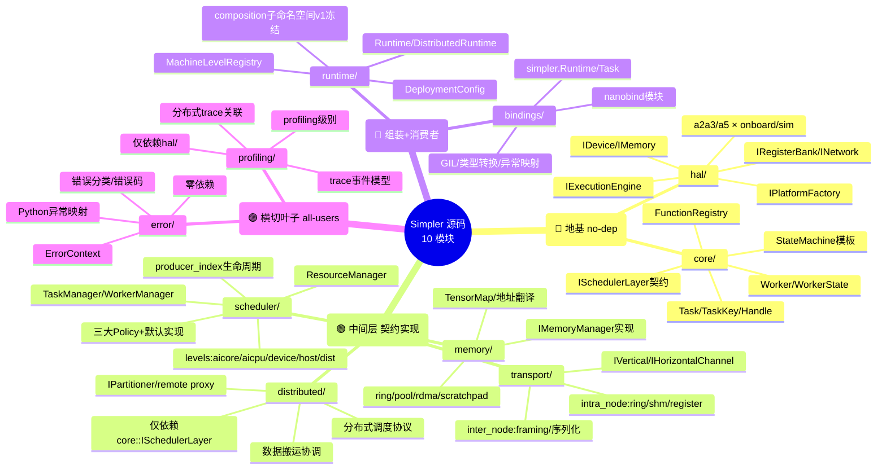
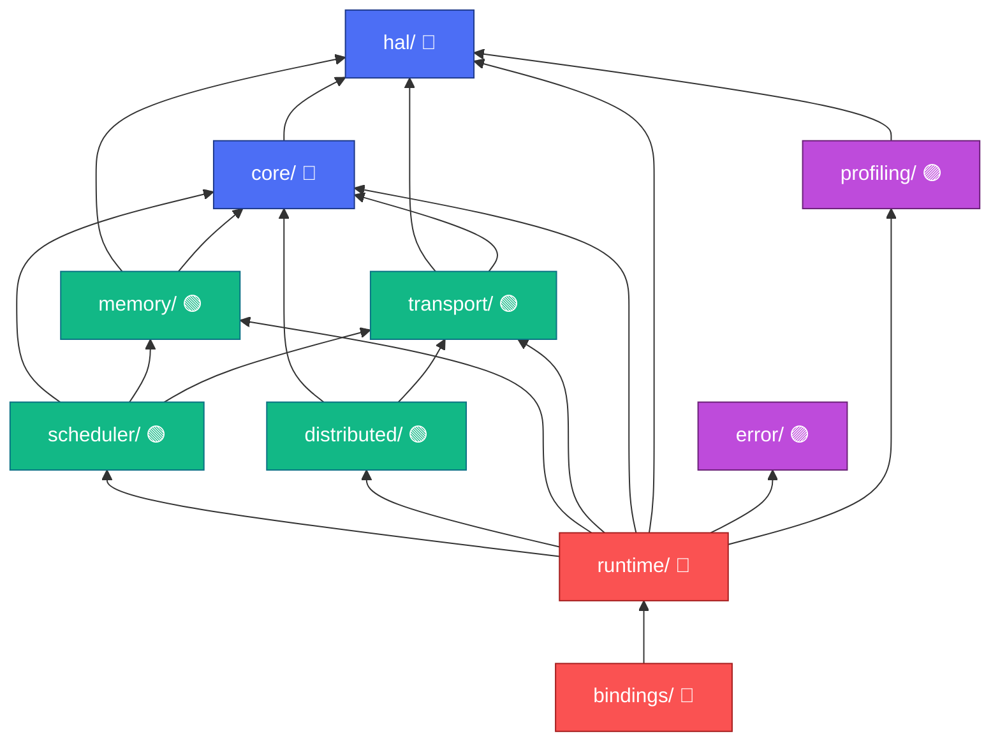

# 学习笔记 · 开发视图（Development View）

> **这是什么**：对 [`pypto-runtime-arch-docs/03-development-view.md`](../../pypto_top_level_documents/pypto-runtime-arch-docs/03-development-view.md) 的学习总结 + 彩色思维脑图。
> **一句话**：逻辑视图讲"有哪些概念"，开发视图讲"这些概念落到源码里是哪 10 个目录、谁 include 谁、怎么编"。
> **配色沿用**：🔵 地基 ｜ 🟢 中间层 ｜ 🔴 组装/消费者 ｜ 🟣 横切。

---

## 🎯 一句话理解

> **Simpler runtime 的源码 = 10 个模块，构成一个严格 DAG：最底下 `hal/`（硬件抽象）+ `core/`（Task/Worker/接口）打地基，中间 `memory/` `transport/` `scheduler/` `distributed/` 各司其职，`runtime/` 把它们组装成能跑的系统，`bindings/` 暴露给 Python。`error/` 和 `profiling/` 是被所有人用的横切叶子。编译顺序 = 依赖顺序（叶子先编）。**

记忆钩子：**"依赖只能向下，编译从叶子起"**。看到某模块想 `#include` 上层头文件，就是违反了 DAG（Rule D6，构建期强制校验）。

---

## 🧠 彩色思维脑图 · 10 模块

---

## 🪜 模块依赖 DAG（编译从下往上）

> **关键不变量 D6**：模块边严格递降 `bindings > runtime > scheduler > distributed > transport > hal > core`，`profiling/`、`error/` 是横切叶子。**曾经存在的 `scheduler → distributed` 反向边已被移除**——`scheduler/` 不许 `#include` `distributed/` 的任何头。远端通知改成：`distributed/` 产出 `SchedulerEvent`，`scheduler/` 只通过 `core/` 类型消费。

---

## 📋 模块职责速查（含设计优先级）

| 优先级 | 模块 | 层 | 职责一句话 | 拥有的关键接口 |
|--------|------|----|-----------|----------------|
| 1 | `error/` | 🟣 | 错误分类/码/传播/Python 异常 | `ErrorContext`、错误码系统 |
| 2 | `hal/` | 🔵 | 把平台硬件藏在统一接口后 | `IDevice`/`IMemory`/`IExecutionEngine`/`IRegisterBank`/`INetwork`/`IPlatformFactory` |
| 3 | `core/` | 🔵 | 基础数据结构 + 调度层契约 | `ISchedulerLayer`、`Task`、`Worker`、`FunctionRegistry`、`StateMachine<*>` |
| 4 | `profiling/` | 🟣 | 采集/关联/导出 trace | profiling 级别、trace 事件模型 |
| 5 | `memory/` | 🟢 | 分配/地址翻译/TensorMap | `IMemoryManager`/`IMemoryOps` 实现 |
| 6 | `transport/` | 🟢 | 卡内/机间通道 | `IVerticalChannel`/`IHorizontalChannel` 实现 |
| 7 | `scheduler/` | 🟢 | 按层实现 `ISchedulerLayer` | `TaskManager`/`WorkerManager`/`ResourceManager` + 三大 Policy |
| 8 | `distributed/` | 🟢 | 跨节点调度编排 | `IPartitioner`、分布式消息、remote proxy |
| 9 | `runtime/` | 🔴 | 组装成可运行系统 | `Runtime`、`DistributedRuntime`、`MachineLevelRegistry` |
| 10 | `bindings/` | 🔴 | 暴露给 Python | `simpler.Runtime`/`Task`/`DistributedRuntime` |

> `scheduler/src/levels/` 里那五个文件正好对应五层的具体调度器：`aicore_dispatcher`(L0) / `aicpu_scheduler`(L1) / `device_orchestrator`(L2) / `host_scheduler`(L3) / `distributed_scheduler`(L4+)。

---

## 🔧 构建与平台矩阵

- **平台 build target**：`a2a3` / `a2a3sim` / `a5` / `a5sim`（Platform × Variant 的四象限）。ONBOARD 交叉编译 device 模块，SIM 全 host 编译走仿真 provider。
- **CMake 结构**：顶层 `CMakeLists.txt` 做平台探测 + options，每模块一份 `CMakeLists.txt`；`cmake/toolchain-a2a3.cmake` / `toolchain-a5.cmake` 管交叉编译。
- **网络后端可选**：`transport_rdma`(`-DENABLE_RDMA=ON`) / `transport_tcp`(总有) / `transport_shm`(总有，仿真默认)。
- **Python 包**：scikit-build-core / nanobind，`pip install simpler[distributed]` 拉分布式 extra。
- **测试四级**：Unit（每模块 `tests/` + CTest）→ Integration（按平台）→ System（端到端真机/仿真）→ Distributed（多进程模拟多节点）。

---

## 💡 学习心得 / 关键洞察

1. **逻辑模块 ↔ 代码模块不是一一对应**。逻辑视图的"Key Interfaces §2.6"落在 `core/` + `scheduler/`；"Machine Level Registry §2.2"落在 `runtime/`。看开发视图时随时对照逻辑视图的 §2.7 映射表。

2. **`error/` 和 `profiling/` 是"横切叶子"**，不是普通依赖。它们几乎零依赖（error 零、profiling 只靠 hal），却被上面所有模块用。这也是为什么设计优先级把它们排前面——先有它们，别人才好写。

3. **接口都在 `include/`，实现都在 `src/`，跨模块只能看 `include/`**。`src/` 的实现细节对其他模块不可见。这条纪律是模块化（NFR-4）的物理保障。

4. **`runtime::composition` 子命名空间 v1 冻结（ADR-014）**：`MachineLevelRegistry`/`MachineLevelDescriptor`/`DeploymentConfig`/`deployment_parser` 的组装顺序和边界锁死，有明确的"解冻触发条件"（跨消费者 ≥2 或部署 schema 频繁变更）。看到"为什么这里不让改"多半能在 `10-known-deviations.md` 找到理由。

5. **`distributed/` 只依赖 `core::ISchedulerLayer`**，不碰 `scheduler/` 的三大 Manager（A7-P5）。要跨节点共享的机制会上提到 `scheduler/core/` 抽象基类。这是保住分层 DAG 的刻意设计。

6. **跨模块契约四件套**：线程安全（每方法标注）、所有权（move / shared_ptr / 带生命周期保证的裸指针）、生命周期（工厂产物归请求它的 Layer 实例所有）、分布式契约（每通道 FIFO、投递保证或报失败、所有远程操作强制超时 Rule R1）。

---

## 📖 配套阅读

- 逻辑概念 → 代码目录映射：[逻辑视图 §2.7](../../pypto_top_level_documents/pypto-runtime-arch-docs/02-logical-view.md)
- 每模块详细设计：[`modules/`](../../pypto_top_level_documents/pypto-runtime-arch-docs/modules/)（hal/core/scheduler/... 各一份，均 Draft）
- 冻结与偏差理由：[`10-known-deviations.md`](../../pypto_top_level_documents/pypto-runtime-arch-docs/10-known-deviations.md)

---

*上一篇：[02 逻辑视图](02-logical-view.md) ｜ 下一篇：[04 过程视图](04-process-view.md)*
