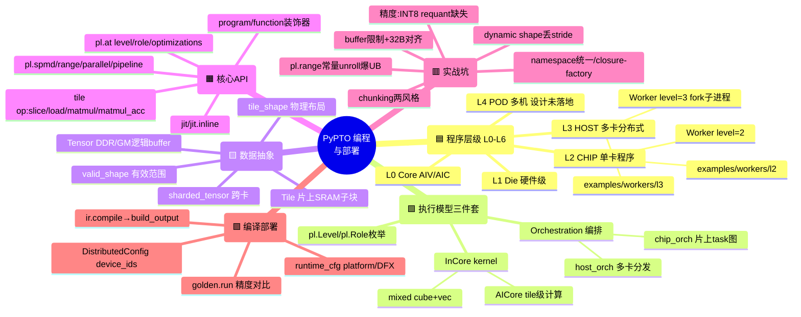

# 学习笔记 · PyPTO 程序编写与部署 API

> **这是什么**：读顶层设计文档 + Simpler runtime 源码 + pypto-lib 实战 docs（`known-pypto-pitfalls.md` 等）+ step3p5 整网 bring-up 踩坑记录，总结出的"**怎么写一个 PyPTO 程序、怎么编译部署到 N 卡、以及项目里真实踩过的坑**"。
> **权威出处**：概念看 `pypto_top_level_documents/`，层级看 `pypto/runtime/docs/hierarchical_level_runtime.md`，坑清单看 `pypto-lib/docs/known-pypto-pitfalls.md`，铁律看项目根 `CLAUDE.md` 顶部。本笔记是提炼+串讲。
> **读法**：先看 mindmap → 层级/执行模型建立框架 → tensor/tile → API 映射 → 后半段全是**实战坑**（buffer/chunking/fusion/namespace/精度），写整网前务必扫一遍。

---

## 🎯 一句话理解

> **写 PyPTO 程序 = 用 Python DSL 描述"一个类里挂三类函数"：host_orch（多卡分发）→ chip_orch（片上 AICPU 的 task 图）→ InCore kernel（AICore 上的 tile 级计算）。编译成 PTOAS 字节码，配 `DistributedConfig(device_ids=[...])` 交给 Simpler runtime 的 L2(单卡)/L3(多卡) Worker 跑，用 `golden.run` 喂输入并和参考对比精度。**

坑的总纲：**tile 有 32B 行对齐 + buffer 容量硬上限；chunk 常量不能跟着 slice 走；融合里 `pl.range(常量)` 会全展开爆 UB；整网要统一 namespace（closure-factory 的 inline body 不能外部调用）。**

---

## 🧠 全景思维脑图

> 颜色靠 mindmap 自动分支上色 + emoji（🟦层级 🟩执行模型 🟨数据 🟧API 🟥坑 🟪部署）。**mindmap 里不要写 `classDef`**（会被当第二个 root 报 "only one root"）。

---

## 一、程序层级：L0–L6，以及"L2/L3 程序"到底是什么

有两套耦合的层级，务必分清：**机器物理层级**（L0–L6）和 **PyPTO 执行模型**（Orchestration/InCore）。项目里口头说的"**L2/L3 程序**"指的是 **Simpler runtime 的 Worker 层级**（`pypto/runtime/docs/hierarchical_level_runtime.md`）：

| Level | 名称 | 是什么 | 状态 | 对应 `pl.Level` |
|-------|------|--------|------|----------------|
| L0 | CORE (AIV/AIC) | 单个算力核 | 硬件 | `AIV`/`AIC`/`CORE_GROUP` |
| L1 | DIE / L2Cache | chip die（多数芯片不存在） | 硬件 | `CHIP_DIE` |
| **L2** | **CHIP** | **单 NPU 卡（共享 device memory）** | ✅ on-device | `CHIP`(=PROCESSOR/UMA) |
| **L3** | **HOST** | **单 host 机（≤16 卡 + M SubWorker）** | ✅ 已实现 | `HOST`(=NODE) |
| L4 | POD | pod（多 host） | 本地+remote sim | `CLUSTER_0` |
| L5/L6 | CLOS1/CLOS2 | supernode / 全集群 | 未测 | `CLUSTER_1/2` |

**`examples/workers/` 里只有 `l2/` 和 `l3/`**（没有 l1/l4）：

- **L2 程序 = 单卡 ChipWorker**：`Worker(level=2, platform=, device_id=)`，生命周期 init→malloc→run→close。代表 example：`hello_worker`（最小生命周期）、`vector_add`（一个 AIV kernel + golden）、`worker_malloc`。
- **L3 程序 = 多卡 host 级 DAG**：`Worker(level=3, device_ids=[...], num_sub_workers=N)`，fork 出每卡一个 chip 子进程 + Python SubWorker，用 `orch.submit_next_level(...)` / `submit_sub(...)` 编排跨卡。代表 example：`allreduce_distributed`（跨卡 all-reduce golden match）、`multi_chip_dispatch`、`ep_dispatch_combine`、`all_to_all_distributed`、`ffn_tp_parallel`。

> 记忆：**L2 = 一张卡内部（AICPU 调度 + AICore 干活），L3 = 一台机器上多张卡的编排（fork 子进程 + shm IPC）**。L2 是分水岭——L0~L2 在 device 上，L3+ 在 host 上，但每级都是同一套 `Orchestrator+Scheduler+Worker` 引擎递归组合（`Worker` 是同一个 C++ 类，`level` 只是诊断 label）。

---

## 二、执行模型三件套 + `pl.Level`/`pl.Role`

一个 `@pl.program` 类里通常挂**三类** `@pl.function`（step3p5 每层都这么写）：

| 函数类型 | 声明 | 跑在哪 | 干什么 |
|---------|------|--------|--------|
| **host_orch** | `level=pl.Level.HOST, role=pl.Role.Orchestrator` | Host (L3) | 多卡分发、建 host 级 DAG |
| **chip_orch** | `type=pl.FunctionType.Orchestration` | AICPU (L2) | 片上 task 图：创建 tensor、submit 子 task、按 scope 管生命周期 |
| **InCore kernel** | `type=pl.FunctionType.InCore` | AICore (L0) | tile 级计算（matmul/vector/softmax） |
| （Inline） | `type=pl.FunctionType.Inline` | 拍扁进调用方 | 复用 body（见 §九 closure-factory 限制） |

- **`pl.Role`**：`Orchestrator`（建 DAG、提交 task、不直接算）vs `SubWorker`（执行同级 orchestrator 派发的具体算/搬运 task）。仅 L3+ 有意义。
- **Cluster / SPMD**：`pl.spmd(n)` 把一个 kernel 在 N 个 cluster/block 并行跑，每实例拿 `spmd_idx`/`spmd_size`（前两个参数是 ABI 约定）。
- **Mixed kernel**：一个 InCore function 同时含数据访问 op 和 compute op（matmul），编译器 `ExpandMixedKernel` pass 按颜色（AIC=RED / AIV=GREEN）拆成两个 kernel + `InCoreFunctionGroup`，跨色边界自动插 TPUSH/TPOP。写 paged attention 这类"访存+matmul+softmax 混合"时用。

---

## 三、Tensor vs Tile（+ valid_shape / tile_shape / sharded_tensor）

| 概念 | 层 | 是什么 | 关键规则 |
|------|----|--------|---------|
| **Tensor** | DDR / GM | 逻辑 buffer，有 producer/consumer、fanout/ref_count，由 orchestration 在 `pl.scope()` 里建、进 ring buffer | tensor 层 |
| **Tile** | 片上 SRAM (UB/L1) | `TLOAD`/`TSTORE` 在 GM↔核内搬的子块 | **512B 对齐**；行字节 **32B 对齐**（见 §六） |
| **`valid_shape`** | — | 把"存储布局(必须对齐)"与"有效数据范围"解耦，`valid_shape[i] ≤ shape[i]` | 沿 view/slice 自动推导，可 override；尾 tile 不处理垃圾 |
| **`tile_shape`** | GM | 可选物理布局提示，把 tensor 排成 tile-contiguous，让每次 TLOAD/TSTORE 变单段连续 burst | `shape[i] % tile_shape[i]==0` |
| **`sharded_tensor`** | 跨卡 | 一个全局 tensor 物理按 `rank_shape` 网格均分到各 rank（实验性） | 访问带 `rank_index`；构造/退役需全局 barrier；collective 写成 `ST.all_reduce(...)` typed 方法 |

> 一句话：**tensor 是逻辑大块（在 HBM/GM），tile 是搬进片上 SRAM 算的小块**；`valid_shape` 解决"对齐要求 vs 真实数据不一样大"，`tile_shape` 是给连续搬运的布局提示。

---

## 四、API ↔ 编程模式映射

| API | 编程模式 | 何时用 |
|-----|---------|--------|
| `@pl.program` + `@pl.function(...)` | 类形式定义整个程序（挂 host_orch/chip_orch/InCore） | 写完整的层/模型 |
| `@pl.jit` / `@pl.jit.inline` | 模块级 helper，不独立编译、原地展开 | 复用小段逻辑（但**不能被外部 program 直接调**，见 §九） |
| `pl.at(level=, role=, optimizations=, name_hint=)` | **当前主推**的统一 scope API | `level=CORE_GROUP` → InCore scope；`+[pl.split(mode)]` → 拆半乒乓；`+[pl.auto_chunk]` → AutoInCore |
| `@pl.incore()` / `@pl.auto_incore()` | 旧 InCore scope | **已被 `pl.at` 取代** |
| `pl.spmd(n)` | SPMD 多 block（既是 scope 又是 loop） | `for i in pl.spmd(n):` 分派 QKV/MLP matmul tile |
| `pl.scope()` / `pl.free(t)` | tensor 生命周期 | scope 自动回收；`pl.free` 提前释放（不绕过 fanout 安全，见 §十三） |
| `pl.dynamic(dim)` | 标记动态维 | 只给 per-request batch，model-bound 维写死 int（见 §十） |

**tile 级 op（InCore body 内）**：`pl.slice(t, shape, offset)`（最常用切片）、`pl.load`、`pl.full(shape, val)`、`pl.matmul(a,b,out_dtype=)` / `pl.matmul_acc(acc,a,b)`、`pl.row_sum`/`pl.row_max`。TLOAD/TSTORE 是底层 pto-isa，由 `pl.load`/`pl.slice` + codegen lower，不在前端直接写。

> 注意：源码里**没有** `pl.call` / `call_spmd` / `call_group` 这样的公开 DSL 函数——`@pl.function` 之间就用普通 `self.method(...)` 调用，SPMD 走 `pl.spmd`，异步 task 提交走 `pl.submit`（IR 层 Submit 节点）。

---

## 五、循环原语放置表（写 kernel 必查）

| 原语 | 放哪 | 语义 | 例子 |
|------|------|------|------|
| `pl.range(a,b,s)` | InCore 内 | 串行循环 | K-block 累加 |
| `pl.parallel(a,b,s)` | 外层 | 并行循环 | batch/vocab 分块 |
| `pl.pipeline(..., stage=)` | `pl.at` 内 | 软件流水 | rmsnorm stage=4 |
| `pl.unroll(...)` | — | **编译期展开**（iter 是 Python int） | 需常量 offset 的 slice |
| `pl.spmd(n)` | body 自带 InCore | 多 block 分派 | matmul tile fan-out |
| `pl.while_(init_values=)` | — | while | 动态终止 |

> **铁律**：kernel 体内**禁止裸 `for x in range(N)`**，必须用上面这些，否则前端直接报错（`known-pypto-pitfalls §6`）。

---

## 六、Buffer 限制与对齐规则（★ 最常爆的坑）

**A2A3 / 910C 各 buffer 硬上限**（`performance-tuning.md` §4 + `known-pypto-pitfalls §7`）：

| Buffer | 容量 | 用途 |
|--------|------|------|
| **UB (Unified Buffer / Vec)** | **192 KB**（报错里写 `188416 bytes` ≈184KB 有效） | 向量运算工作集 |
| **L1 (Mat)** | **512 KB** | cube 左/右操作数 staging |
| **L0A / L0B** | 各 **64 KB** | cube left / right |
| **L0C (Acc)** | **128 KB** | 累加器 |

**32-byte 行对齐（Vec/none_box tile 静态规则，`§2`）**：行字节 `cols × sizeof(dtype)` 必须 32B 对齐 → 最小合法列数：**FP32/INT32=8、BF16/FP16=16、INT8=32**。`pl.full([1,1],FP32)`(4B) 被 reject。

**`[N,1]` intra-UB VEC tile 运行时 fault（`§1`，Phase 15 真凶 / TASK-30）**：`pl.slice` 切出 `[N,1]` FP32 → 行字节=4B 违反对齐，但 slice **漏检**→ 编译过、运行 `errcode 0x800 "UB not aligned"` → 507018。**绕路**：用 `pl.row_sum/row_max` reduction 或 `pl.reshape` 构造 `[N,1]`，**不要用 slice**；head-gate 那种无干净绕路。

**512B 对齐（L2 cache line，`performance-tuning §1`）**：trailing dim 应是 512B 倍数（BF16→256 elem / FP32→128 / INT8→512），否则 MTE 走慢路径，`perf_hints.log` PH001 告警。

> 编译后查 `build_output/<...>/report/memory_after_AllocateMemoryAddr.txt` 看每个 buffer 实占。

---

## 七、Chunking 两风格（★ 单卡/整网必踩）

CLAUDE.md 顶部铁律表：

| 风格 | 写法 | TP=8 sliced(160) | TP=1 unsliced(1280) |
|------|------|------------------|---------------------|
| **固定 chunk（✅推荐）** | `MLP_OUT_CHUNK = 128`（常量） | 11 iter | 88 iter，每块 128 不爆 |
| **chunk 跟 slice 走（❌坑）** | `_CHUNK = INTER_LOCAL` | 1×160 一 tile | 1×1280 一 tile → **爆 L1** |

- **为什么 unslice 会爆**：kernel chunking 按 TP=8 per-rank width（160/1408/36/1）设计。`apply_tp1_patch()` 把 `*_LOCAL` 折回全量（1280/11264/288），凡是"chunk 跟着 slice 走"的常量（`SHARED_GATE_N_CHUNK=INTER_S_LOCAL`、`SHARED_DOWN_K_CHUNK`）就变成 1×1280 单 tile → sh_mlp 1.66MB / gate_matmul 753KB 远超 512KB。
- **避免**：① 单卡 ST/UT **保持 TP=8 per-rank slice 宽度、不 unslice**（collective 在单 rank codegen 自动消除）；② 写新 kernel 用**固定 chunk 常量**；③ 整模型 e2e 走 unslice 路径前，先重构 sh_mlp/gate_matmul 的 chunking。

---

## 八、融合 fusion 细节 + `pl.range(常量)` 爆 UB（★）

- **mixed cube+vec 同一 `pl.at`**（`pypto-coding-style §6`）：matmul + cast/add/norm 放同一 scope，编译器自动 ping-pong；避免拆两 kernel + AICPU hand-off。
- **`optimizations=[pl.split(mode)]`**：UP_DOWN / LEFT_RIGHT 切半，专治 FP32 epilogue 撑爆 UB。
- **`pl.range(常量)` unroll 不复用 SSA buffer → UB overflow（`§7`）**：
  - 触发：`for peer in pl.range(group_size=8)`，bound 是 **Python int**（closure / module global）→ 编译器全展开，每 iter 的 `recv/recv_fp32/acc` 当独立 SSA 同时占 UB；loop-carried liveness 分析未实现。代价 `(N-1)×per_iter_bytes`，单 tile >25KB 就爆 184KB。
  - **三种避免**：(A) 用 **runtime scalar bound** `pld.nranks(ctx)` 让编译器发真循环；(B) 每 iter 把 acc 写回 `local` 再重读；(C) 缩 CHUNK。

---

## 九、namespace 统一 / closure-factory（★ 整网编写关键）

- **现象**：`_build_*` 工厂返回的 `@pl.jit.inline` body（`expert_shared_*`、`expert_routed_*`、`prefill_qkv_*`）在外部模块直接 `@pl.jit`/`@pl.program` 调用**全失败**：`Unsupported function call` / `Undefined variable 'use_swiglu_step'`。
- **根因**：pypto 前端是静态 AST 分析，工厂闭包变量（`use_swiglu_step = swiglu_limit > 0`）是 Python cell，AST 看不到。
- **生产正确做法**：把 `@pl.jit.inline` 当**模板 body**，在 `decode_layer.py`/`moe.py` 的 `@pl.program` 类定义时**直接把 body 内容拷进 `self.method`**（Python 解释器执行 `if use_swiglu_step:` 分支时就写死成线性代码）。参 `gate.py` 注释 + Phase 12 "Lift 11 个 MoE sub-bodies 到 EpTpMoE 方法"。
- **对整网的含义**：整网程序必须让所有被调 kernel body 处在**同一个 program 的 namespace / 静态可见域**里——不能靠工厂闭包跨模块拼装。写 standalone UT 时同理：要么改主干拆工厂，要么复制 body 当 replica，要么直接跑多卡 production 路径。

---

## 十、dynamic shape 坑

- **`pl.dynamic` 首维跨函数 slice 丢父 stride（`§3`）**：dyn tensor 经 `pl.slice` 传给 InCore callee，`ComputeRowMajorStrides` 见 dyn 返空 → 退回 contiguous stride → `pos>0` 读错行。**绕路**：model-bound 维度（context/layer/KV layout/MLP inter）在 `config.py` **写死 int**，`pl.dynamic` 只留给 per-request batch。
- **幻 int32 参数（`§4`）**：同因，codegen 给碰该 tensor 的 kernel 末尾塞未引用的 `int32_t` 参数，runtime 零初始化让偏移退化成 0，表面 work 但脆。

---

## 十一、kernel 体内写法约束

- 循环必须用 `pl.range/parallel/unroll/pipeline/spmd/while_`，**禁止裸 `for`**（`§6`）。
- **AICPU `aicpu_orchestration_entry` 不能 `fprintf(stderr)`（`§5`）**：chip_orch 跑在片上 ARM AICPU，libc stderr 不接 host fd 2；用 `LOG_WARN/LOG_INFO_V5`（`pto_orchestration_api.h`），受 `ASCEND_GLOBAL_LOG_LEVEL` 门控。
- loop bound 优先 `pld.nranks(ctx)` 而非 Python int（避免 §八 的 unroll 爆 UB）。

---

## 十二、精度类坑（简要，深入看 memory）

- **MoE swiglu 缺 per-token INT8 dynamic-quant**（2026-07-07 device 验证）：vLLM W8A8 oracle 对 routed expert 的输入 x **和** clamped intermediate 都做 `npu_dynamic_quant`，pypto 两处都漏 → L43 27.6% / L44 52.9% 偏差。**不是 clamp bug**。修：加 interm-quant + input-quant。gotcha：input-quant 要**独立 stage**（塞进 gate_up 会污染 cube-matmul LEFT tile layout）；scale 用 `row_max`+`reshape` 构造 `[T,1]`（不能 `create_tensor([N,1])`，撞 §六 [N,1] 对齐）。
- **head-gate `matmul_acc` N=16 丢 K 累加（`§8`）**：输出 N=16 时 `pl.matmul_acc` 只返回首 K block 贡献（~20× 偏小）；当前绕路 = host 端预算 gate_exp。
- **wide Vec-tile clamp miscompile**（L44 shared swiglu16，未解）：`[16,160]` wide tile 的 clamp 行为异常。

---

## 十三、`pl.free` 与多层 ring stack

- **`pl.free(tensor)`**（`multi_level_runtime_ring_and_pypto_free_api.md`）：显式提前施加 scope-token，让 buffer 不必等 `scope.exit()` 就回收；**不绕过 fanout 安全**（仍需 `ref_count==fanout_count`），幂等。
- **多层 ring stack**：按 scope depth `d` 分层 `task_ring[d]`/`buffer_ring[d]`，内层回收不被外层阻塞，task 身份升级为 `(scope_level, task_id)`。

---

## 十四、编译 → 部署 → golden 对比（★ 部署流程）

**四步端到端**（`pypto-lib/docs/compile-runtime-workflow.md`）：

1. **写 program**：`@pl.program` class（host_orch + chip_orch + InCore）。
2. **编译**：`pypto.ir.compile(program, output_dir=, distributed_config=, dump_passes=, skip_ptoas=)` → 跑 pass pipeline → codegen 三路（InCore→`.pto`→ptoas→C++ wrapper、Orchestration→`.cpp`、Config→`kernel_config.py`）→ 产物落 `build_output/<Program>_<ts>/`。
3. **多卡配置**：`DistributedConfig(device_ids=[0..7], num_sub_workers=, runtime="tensormap_and_ringbuffer", aicpu_thread_num=4)` 传进 `compile_cfg["distributed_config"]`。
4. **跑 + golden 对比**：`golden.run(program=, specs=, golden_fn=, compile_cfg=, runtime_cfg=, rtol=, atol=)`。内部五阶段：Compile → 按 `specs` 生成 inputs（写 `data/in/`）→ 算 golden（`golden_fn` 填 outputs 写 `data/out/`）→ Runtime（`execute_compiled`，simpler 加载 artifacts 上 device 跑，tensor by-reference 原地写回）→ Validate（默认 `torch.allclose`，可换 `ratio_allclose`/`topk_pair_compare`）。

**单卡 vs 多卡**：
- **单卡**：`-d 0`，不传 `distributed_config`，`Worker(level=2)`。
- **多卡**：`-d 0,1,...,7`，`DistributedConfig(device_ids=[0..7])`，`Worker(level=3)` fork 8 个 chip 子进程；CI 文件需 `# ci: devices=N` marker，必须在 host 上跑（非 docker，HCCL 限制）。

**加速回测 knobs**：`compile_only=True`（只编译，smoke）、`runtime_dir=<build_output>`（复用已编译产物、跳 compile，改 `.cpp`/`.pto` 后 touch mtime 即重编）、`golden_data=<dir>`（从固定 `in/`+`out/` 加载，做确定性回归）。

**`runtime_cfg` 关键字段**：`platform`(`a2a3`/`a2a3sim`/`a5`/`a5sim`)、`device_id`、DFX 四开关 `enable_l2_swimlane`/`enable_dump_tensor`/`enable_pmu`/`enable_dep_gen`（产物进 `dfx_outputs/`）。

---

## 十五、调试 / 工具索引

| 想干啥 | 工具 |
|--------|------|
| 看 buffer 实占 | `build_output/<...>/report/memory_after_AllocateMemoryAddr.txt` |
| 看 <512B 慢路径告警 | `perf_hints.log`（PH001） |
| 看 IR pass diff | `build_output/<...>/passes_dump/`（`dump_passes=True`） |
| 二分定位哪个 task 挂 | `P15_DISPATCH_LIMIT=N`（`tools/p15_trace/run_with_trace.py`） |
| 逐 tensor dump 查精度 | `runtime_cfg enable_dump_tensor=True` → `dfx_outputs/tensor_dump/` |
| 查依赖竞态 | `enable_dep_gen=True` → `deps_graph.html` |
| runtime hang | `log_level="v0"` + `ASCEND_PROCESS_LOG_PATH=/device_log` |
| 数字错误码(507018/507899/0x800) | 先查 simpler wiki `Device-Error-Codes_zh` |

---

## 附：踩坑一句话速查

1. tile 行字节必须 32B 对齐；`[N,1]` FP32 slice 会运行时 507018——用 reduction/reshape 构造。
2. chunk 常量别跟着 `*_LOCAL` slice 走，用固定常量。
3. `pl.range(Python int)` 会全展开爆 UB——用 `pld.nranks(ctx)` 或 acc 写回。
4. 整网别靠工厂闭包跨模块拼——把 inline body 拷进 program 的 method。
5. `pl.dynamic` 只给 batch，model-bound 维写死 int。
6. kernel 体内不许裸 `for`；AICPU 里不许 `fprintf(stderr)`。
7. 单卡 ST 保持 TP=8 per-rank slice，别 `apply_tp1_patch` unslice。
8. W8A8 MoE 精度：input + interm 两处都要 per-token INT8 dynamic-quant。

---

*返回：[notes 索引](README.md) ｜ 相关：[逻辑视图](02-logical-view.md)（runtime 侧的 Host/Device/Chip/Core）*
