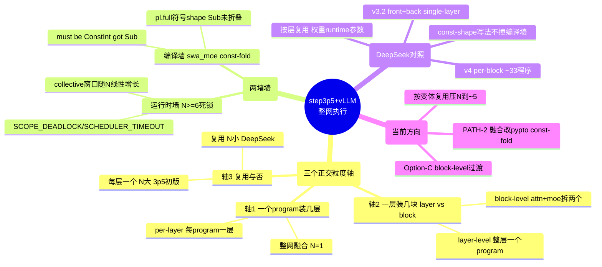
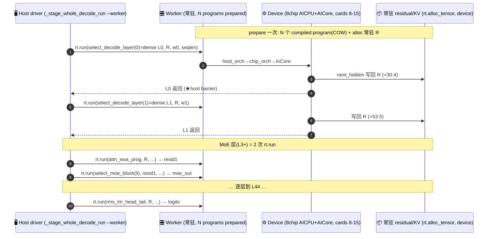

# 学习笔记 · step3p5 + vLLM 集成：per-layer / block / 整网融合

> **这是什么**：step3p5 接入 vLLM 做整网推理时，"逐层跑 vs 整网融合"的架构选择，以及项目里真实撞的两堵墙、和参考模型 DeepSeek 的对照。沉淀自多轮讨论。
> **权威出处**：项目 `CLAUDE.md` Phase 20/25、memory `whole-model-pypto-decode-design`（2026-07-08 定稿）、`models/deepseek/v4/`、`models/deepseek/v3_2/`。
> **一句话**：这里有**三个正交的粒度轴**别混——一个 program 装几层、装一层里的几块、同类型层复不复用。step3p5 撞墙撞在"轴3 program 个数"，不是"轴1 融合与否"。

---

## 🎯 核心结论先行

> **DeepSeek 也不是整网融合，它是"少数几个 block program 按层复用"（N 小）；step3p5 初版是"每层一个 program"（N≈87）才撞 N≥6 的运行时墙。真正的分水岭是"distinct program 个数 N"，不是"per-layer vs fused"。解法是复用 per-block 程序（DeepSeek 那样），不一定非要整网融合。**

---

## 🧠 全景思维脑图



> mindmap 靠自动分支上色（**不要写 `classDef`**，会报 "only one root"）。

---

## 一、两种执行方式：per-layer vs 整网融合（轴1）

| | **per-layer（逐层）** | **整网融合（fused）** |
|---|---|---|
| 编译单元 | N 个程序（每层/块一个） | 1 个巨程序装 45 层 |
| 谁驱动层循环 | **外部 Python driver**（`rt.run` per dispatch） | **pypto 程序内部** |
| 层间 residual | worker-resident `DeviceTensor` 跨 dispatch 串 | 程序内部零拷贝 |
| 跨层融合 | ❌ 每层硬边界 | ✅ 保留跨层融合 + 通信/计算重叠 |
| 派发开销 | 每层一次 dispatch | 一次 kick |
| 编译难度 | 每个小、好编好调、可增量 | 巨程序，撞 namespace/const-fold |
| 精度验证 | 可逐层对 vLLM dump 比（好 bisect） | 只能端到端比 |

`decode_fwd.host_orch` 实际是 **TAIL-ONLY**（只跑最后 RMSNorm+LM-head），45 层的 per-layer dispatch 目前 staged 在 `@pl.program` **之外**——即当前形态是"Python driver 循环 `select_decode_layer(li)`"，不是 in-program chaining。

---

## 二、layer 层面 vs block 层面（轴2，细化）

**这是和轴1 不同的另一个轴**：不是"一个 program 装几层"，而是"一个 program 装一层里的**几块**"。

| | **layer-level（整层）** | **block-level（拆块）** |
|---|---|---|
| 一个 program 装什么 | **一整个 decoder 层**：attention + MoE + 残差全融在一个 `@pl.program` | 把一层**从 resid1 处切开**成 2 个程序 |
| 代表 | `select_decode_layer(li)` → `decode_layer_swa_moe` 等 | `_build_tp_attention_swa_program`(→`resid1_out`) + `select_moe_block(li)`(EpTpMoE: resid1→moe_out) |
| attention→MoE 数据 | 程序内部零拷贝 | 外部串（resid1 经 DeviceTensor/capture 传给 moe 程序） |
| 每层 dispatch 次数 | 1 | 2（attn + moe） |
| 融合 | attention 和 MoE 跨块融合 | attention/MoE 之间硬边界 |

**为什么 step3p5 对 MoE 层被迫用 block-level**：融合的整层 `swa_moe`（layer-level）**编译不过**——`attention_swa` inline 进 EP（MoE）上下文触发 const-fold 级联（见 §四 编译墙）。切成 block 后：attention 程序（TP-only、无 EP 上下文）能编，MoE-block（独立 `EpTpMoE`）能编，两半都过 → 整网 45/45 层在 Option-C 下 compile-complete。

> **关键**：同一个网络里**两种粒度并存**——**dense 层用 layer-level**（`select_decode_layer`，融合能编），**MoE 层用 block-level**（Option-C，因为融合的 swa_moe 编不过）。`full_moe` 其实能融（full attention + MoE 融合 OK），只有 `swa_moe`（~30 层）撞级联。

> block 的切缝在 attention↔MoE（resid1）这个自然接缝；MoE-block 内部的 gate/dispatch/expert/combine 仍然融在一个 moe 程序里，不再往下切。

---

## 三、program 个数 N 的本质（轴3，最要命）

**"program 个数"指 co-resident 在一个 worker 上、被 `prepare` 的"不同已编译 program"的个数 N，不是层数。** 要命处：**每个会做 collective（跨卡通信）的 program，prepare 时各自从共享池切一套 collective signal-window / GM buffer**。

- step3p5 实测：**N=5 能通，N≥6 就 `SCOPE_DEADLOCK`(code -1) / `SCHEDULER_TIMEOUT`(sched=100)**，第一次 dispatch（已验证的 L0）就挂。
- 怀疑真凶 = **per-program 的 collective signal-window / GM 随 N 线性增长，N≥6 顶满共享池**（ring-tuning 三试全败，非 task_window 问题）。要根治需 simpler runtime maintainer 级（signal-window/GM 池按 N 扩）。

**多个 program 又分两种（差在 N 大小）**：

- **复用型（N 小）**：只编**少数几个 distinct program**（block 类型数），**同一个编译好的 program 按层反复 `rt.run`**，每次喂不同层权重（权重是 runtime 参数，不 bake）。N ≈ 2~6，**永远在墙以下**。
- **每层一个型（N 大）**：给每层 co-prepare 一个 distinct program（45 层 × (attn+moe) ≈ **87 个**，连 L1/L2 都是 swa_dense 却编两个）。N 线性爆 → N≥6 死锁。

---

## 四、两堵墙

| 墙 | 属于哪条路 | 现象 | 根因 | 解法 |
|----|-----------|------|------|------|
| **运行时墙** | per-layer 多程序（N 大） | N≥6 `SCOPE_DEADLOCK`/`SCHEDULER_TIMEOUT` | 每 program 一套 collective 窗口/GM，随 N 线性顶满共享池 | 复用 per-block 程序压 N（→§六）；或整网融合 N=1 |
| **编译墙** | 整网融合 / 融合 swa_moe layer-level | `tile.full shape element 0 must be ConstInt, got Sub` | `attention_swa.py:479 pl.full([SWA_Q_PAD_ALIGNED(32 literal) − Q_HEAD_BATCH_SWA(12 符号), HEAD_DIM])` 里 `Sub` 未 const-fold（EP 分布式 lowering pass） | 改 pypto EP-lowering pass 源码 const-fold `Sub/Add/Mul`；或按 DSV4 把 attention_swa 改成 const-shape 写法 |

---

## 五、DeepSeek 对照（标杆是 per-block 复用，不是整网融合）

- **v4**：`models/deepseek/v4/` 下 **~33 个独立 program 文件**（attention 各变体 / moe_ep / gate / dispatch / combine / lm_head…），**没有 `decode_layer.py`/`decode_fwd.py`**（无整网 chaining），`host_orch` 按组件定义。= **per-block program**。
- **v3.2**：decode 拆成 `front` + `back` **两个 "single-layer" 大 program**（docstring 明写 "single-layer decode BACK part"，各 1 个 `@pl.program`），**按层反复 run**，层循环在**外部**。
- 所以 **DeepSeek 也不是整网融合**——它是**少数几个 block/single-layer program 按层复用**（N 小），权重走 runtime 参数。
- **DeepSeek 不撞两堵墙的原因**：① N 小（复用型）→ 不撞运行时墙；② kernel 一开始就 **const-shape 写法**（固定窗口 const tile + mask/fillpad，无 config 符号算术）→ 不撞编译墙。
- **纠正一个常见误解**："DeepSeek 有自己的后端所以整网可行"——**后端归属只解决运行时轴**（自己驱动 per-block 循环、不跟 vLLM 抢卡 co-tenancy 507018），**不等于整网融合可行**；整网融合能否编过取决于 **kernel 是不是 const-shape**，跟后端无关，且 DeepSeek 自己也没做整网融合。

---

## 六、三种形态、三种墙（总表）

```
N=1    整网融合一个大 program        → 无运行时墙，但撞【编译墙】(swa_moe const-fold)
N≈4-6  复用型 per-block (DeepSeek)   → 两墙都不撞          ★标杆
N≈87   每层一个 program (3p5 初版)    → 撞【运行时墙】(N≥6 signal-window/GM 池)
```

**step3p5 的正确方向**：不必非得整网融合。把 program **按 block 类型复用**（一个 swa-attn + 一个 full-attn + 一个 moe-block + tail，权重当 runtime 参数，反复 run 45 层），**N 从 ~87 降到 ~5**，绕过运行时墙——这正是 DeepSeek 的形态。整网融合（N=1）是另一条路，但要先解 const-fold 编译墙（PATH-2：改 pypto 源码）。

---

## 七、当前方向（2026-07-08 定稿）

- 用户拍板**倾向整网融合**（PATH-2）：因为它无 N-ring → 直接消解 N≥6 死锁，且 perf 上限高。下一步**直接改 pypto EP-lowering pass 源码 const-fold** 那个 `Sub`，重编，再融合。
- **过渡/兜底 = Option-C（block-level decompose）**：MoE 层拆"TP-attn 程序 → resid1 → EpTpMoE block"，已 **45/45 层 compile-complete**、dense+MoE device dispatch HW 验证过。融合整层 swa_moe 降级成"Phase 26 纯性能优化"。
- 已 HW 验证积木：45/45 Option-C 编译、dense 前缀 TP=8 device run、多程序 worker dispatch、residual threading、47GiB 单 key 权重 IPC、MoE-block 精度。剩多周工程：worker dispatch loop + 权重/KV IPC + tail + `_pypto_full_forward` single-handoff + live A/B（8001 pypto vs 8000 vanilla token-exact）。
- **精度硬约束**：vLLM dump **无 KV-cache** → 真正的"整网端到端精度对齐"必须是 **live single-handoff A/B**；offline 逐层只能覆盖 MoE/MLP 数学，attention-core 是 live-only。

---

## 八、一个 vs 多个 program：性能差异 + 减少了哪个开销

### 多个 program 是怎么调度的（以 step3p5 当前实现为例）

step3p5 的 whole-decode driver（`_stage_whole_decode_run.py --worker`）就是这个模式：**层循环在 host（Python driver），一个常驻 Worker 持有全部已编译 program、逐层 `rt.run` 派发；层间数据（residual/KV）留在 device 的常驻 tensor 里零拷贝串接**：

- **prepare 一次**：一个 L3 `DistributedWorker`（`device_ids=[8..15]`、fork 8 chip 子进程、常驻）把 N 个 compiled program 全注册好（pre-fork COW），并 `rt.alloc_tensor([TP,BATCH,HIDDEN], bf16)` 出**常驻 residual + KV DeviceTensor**。
- **逐层 dispatch**：driver 循环 `for li in 0..44: rt.run(prog[li], resid, w_li, kv, seqlen)`——
  - **dense 层（L0/L1/L2）** = `select_decode_layer(li)` 返回的整层 program，1 次 `rt.run`；
  - **MoE 层（L3–L44）** = **2 次 `rt.run`**（Option-C）：`_build_tp_attention_{swa,full}_program` → `resid1`，再 `select_moe_block(li)` → `moe_out`（中间需 post-attn RMSNorm）。
- **层间交互 = 常驻 tensor 串 residual**：每层把 `next_hidden_out` 原地写回常驻 residual，下一层直接拿它当输入（**device 上零拷贝，不回 host**）；回 host 的只有控制流 + 一次同步。
- **每层一道 host barrier**：`rt.run` 阻塞，driver 等这层完成才 launch 下一层（就是下表 ②）。

> HW 已验证（cards 8-15）：dense L0/L1/L2 逐层 dispatch，residual 累积 **30.4→53.5→64.0**（与 `golden.run --chain` 逐层一致）；L3 attn `resid1=70.5`、moe_block `moe_out=0.0`（synthetic 置零 expert）；一个 worker 上同时 prepare 了 5 个 program（L0/L1/L2 + attn_swa + moe_block）跑通，rc=0。



> 对比 **融合(N=1)**：整网一个 program，**层间不回 host**——Device 内部靠 program 依赖把层串起来，上图那些 `Dev-->>Dr` 的 host barrier 全消失（这正是下表 ②③ 收益的来源）。多个 program 的调度本质：**data 常驻 device、control 每层回一次 host**。

### 逐项性能差异

**不只是省 dispatch 时间**——逐项标出融合(N=1)相对多程序**减少/影响的是哪类开销**：

| # | 差异项 | 融合(N=1)减少的开销 | 影响量级 |
|---|--------|---------------------|---------|
| ① | host 侧 per-program dispatch | **host CPU 逐 program `rt.run` 派发开销**（~45~87 次/token → 1 次） | 小~中 |
| ② | 层间 host 串行 barrier | **每层一次 host↔device 同步等待**（`rt.run` 阻塞）；融合走 program 内部依赖，无此墙 | ★ 中~大 |
| ③ | 跨层 overlap / 预取丢失 | **通信/计算跨层重叠 + 权重/KV 跨层 double-buffer 预取**（多程序硬边界拿不到） | ★ 大(decode) |
| ④ | 通信域 N 套 → 1 套 | **重复 collective signal-window/GM setup + 资源压力**（也是 N≥6 死锁根） | 中 |
| ⑤ | 全局调度气泡 | **AICPU 看全 DAG 填气泡**；多程序只局部调度、边界更多 idle bubble | 中 |
| ⑥ | 固定 per-program 开销 | **TensorMap 建立 / ring 同步 / arg marshaling** 每 `rt.run` 一次 → 摊成一次 | 小 |

**⚠ pypto 关键澄清（别误会减少了什么）**：N=1 减少的是 **host 侧 + 层间**开销（①②⑥），**不减少 AICPU 逐 InCore kernel 的片上 dispatch**——InCore kernel 数量和其片上派发开销**不变**。要连片上逐 kernel dispatch 也省，得走 megakernel 的 tile 调度（§九档 4）。

**多个 vs 一个的本质区别**：多个 = 层循环在 **host（Python driver）**，每层一道 host 同步墙；一个 = 层循环在 **device（AICPU 编排）**，层间零 host 往返。所以核心差异不是"少几次 dispatch"，而是 **"层循环搬到 device + 层间墙拆掉 + 跨层能 overlap"**。

### 怎么写程序会更高效（实操，按收益/代价排序）

1. **能融就融进一个 `@pl.program`**：整层/多层放一个 program，AICPU 在 device 上串 → 去掉 host 层间墙(②) + 拿跨层 overlap(③)。收益最大。
2. **融不动就按 block 类型复用 program**（不是每层编一个）：权重走 **runtime 参数**，同一 compiled program 反复 `rt.run` → 省编译、压 N 避 N≥6 墙(④)；但**层间 host barrier 仍在**（不如融合）。
3. **kernel 内 mixed cube+vec 融进同一个 `pl.at`**：matmul + norm/cast 同 scope，编译器 ping-pong，省一次 AICPU hand-off。
4. **用 `pl.spmd` 分派 tile、`pl.pipeline` 做软件流水**：把并行/流水显式表达出来，让编译器排满 AIC/AIV。
5. **collective 按 tile 分块**（`ar_chunk` 用固定常量）：让 all_reduce 和前后计算 overlap（tile 粒度 overlap，见前文）。
6. **暂不融合就用 `BatchedExecutionPolicy`**（Chip 级攒批 dispatch）降低逐 kernel 派发，近似 CUDA Graph 效果。
7. **先 profiling 再优化**：`enable_l2_swimlane`/PMU 量出 ①~⑥ 各自占比——decode 常是 ②③ 大，compute-bound 常是算子本身大，别凭感觉。

---

## 九、消除 host 派发开销的四档谱系（CUDA Graph / aclGraph / pypto-fused / megakernel）

同一个敌人（host 派发开销 + op 间气泡），四种狠度递增的打法：

| 档 | 方案 | 减少的开销 | 保留什么 | kernel 数 |
|----|------|-----------|---------|-----------|
| 1 | **CUDA Graph / aclGraph**（capture-replay） | host 逐 kernel launch 的 **CPU driver 开销 + kernel 间气泡** | N 个 kernel 全保留，只是 CPU 一次派发全图 | N（设备上不变） |
| 2 | **pypto per-block 复用**（N 小） | 编译开销 + 部分 host dispatch | 层间 host barrier 仍在 | N≈block 类型数 |
| 3 | **pypto 整网融合 (N=1)** | **host 层间 barrier + 跨层 overlap + 通信域** | AICPU 逐 InCore kernel dispatch 仍在 | 1 program（内部多 kernel） |
| 4 | **megakernel**（持久核 + 片上 tile 调度） | **连 per-kernel launch 都没有** + 跨 op tile fusion/overlap | —（最激进） | 1 持久 kernel |

- **档 1 最轻**：只杀 host launch 开销，**不融合、不动计算、设备上仍 N 个 kernel**（CUDA Graph/aclGraph 的本质）。
- **档 3 pypto-fused 中间**：层循环搬 device、拆层间墙，但**片上逐 kernel dispatch 还在**。
- **档 4 megakernel 最重**：一个持久核 + 片上 tile 调度，连片上 per-kernel launch 都省，还能跨 op tile 融合/overlap。
- **pypto 的位置**：AICPU 本就是片上调度器 + simpler comm 是 device-initiated → pypto **天然在档 3、且具备档 4 的底子**（字面 megakernel 在 pypto 上 ROI 低、逆架构，等价物就是把整网融合做扎实）。

---

## 十、当前 step3p5 整网组织（源码核实 2026-07-09）

**结论：不是单一融合大程序，而是"按层的多个 `@pl.program` + 外部 dispatcher 串联"（per-layer，轴1）。**

### 层表 + 8 个预建 program 类 + 分发器

`select_decode_layer(layer_idx)`（`decode_layer.py:3073`）按 48 层表（45 主层 + 3 MTP）返回 `(program_class, kind)`，分发到 **8 个预建 `@pl.program` 类**：

| 层 | kind | program 类 |
|----|------|-----------|
| L0 | full_dense | `DecodeLayerDenseFull`（`decode_layer.py:490`） |
| L1/L2 | swa_dense | `DecodeLayerDenseSwa`（`:703`） |
| L3–L44 | 6 种 MoE：`{full,swa}×{silu_silu, swiglu7_silu, swiglu7_swiglu16}` | `DecodeLayerMoE`（`:1345`，按 `SWIGLU_LIMITS[li]`/`SWIGLU_LIMITS_SHARED[li]` 选变体） |
| MTP 45–47 | dense | 走 `mtp.py` |

kind 由 `is_full_attention(li)` + `is_moe_layer(li)` + `SWIGLU_LIMITS` 决定。

### 每个 layer program 的内部结构

标准三件套：`@pl.function(level=HOST)` **host_orch** + `@pl.function(Orchestration)` **chip_orch** + `@pl.function(InCore)` **计算 kernel**（对照 notes/06 §二）。

**关键**：`DecodeLayerMoE` 把整套 `EpTpMoE`（gate / dispatch / routed expert / shared expert / combine）**从 `moe.py` 逐字 inline 进类里**（Phase X.8，`decode_layer.py:1272-1274`）——因为 pypto frontend **不允许在一个 `@pl.program` body 里实例化另一个 `@pl.program`**（§10 no-nested-program 铁律）。所以不是"MoE 作为独立子程序被调用"，而是"MoE 每个 `@pl.function` 方法 + `chip_orch` body 全被复制进 `DecodeLayerMoE`"。

### 整网怎么串（不是 in-program 链）

- **`decode_fwd.host_orch` 是 TAIL-ONLY**（只跑最后 RMSNorm + LM-head）；**45 层逐层 dispatch 在 `@pl.program` 之外**。
- 形态 = **外部 Python driver 循环 `select_decode_layer(li)`、逐层 `rt.run`**，多 program `DistributedWorker`（pypto #1706）一次 prepare 多个 program，**residual/KV 用常驻 `DeviceTensor` 跨 dispatch 零拷贝串**（见 §八 时序图）。**这是 per-layer 组织，不是融合 N=1。**

### MoE 层的 Option-C decompose

融合整层 **`swa_moe` 编不过**（`attention_swa` inline 进 EP 上下文触发 const-fold cascade，§四），故 MoE 层拆两 program 串：`_build_tp_attention_{swa,full}_program`（`attention_swa.py:792` / `attention_full.py:849`）→ `resid1` → `select_moe_block(li)`（独立 `EpTpMoE`，`decode_layer.py:152` 导入）→ `moe_out`。dense 层保持整层融合（`DecodeLayerDenseFull/Swa`，能编）。

### 一句话

> **当前 = `select_decode_layer` 分发到 8 个按层预建 `@pl.program`（dense 整层融合 / MoE 层 Option-C 拆 attn+moe_block，MoE 把 EpTpMoE 逐字 inline），45 层由外部 Python driver + 多 program worker 逐层 `rt.run` 串联，`decode_fwd.host_orch` 只做 tail。融合成单一 program（N=1）是目标（PATH-2），卡在 swa_moe const-fold 编译墙，未落地。**

> **诚实边界**：本地 `workspace/pypto-lib` checkout 比目标机（0162）落后——本地能核实 `select_decode_layer` + 8 个 program 类 + attention program + tail，但 driver/集成层（`_stage_whole_decode_run.py`、`pypto_mlp_worker.py`、`vllm_monkey_patch.py`）在目标机分支上；本地 `tools/step3p5/` 只有 `pypto_all_layers_detail_compare.py`。driver 细节（§八/本节第 3 点）来自 memory/STATUS，逐行核实需看目标机。

---

## 💡 心得速查

1. **三轴别混**：一个 program 装几层(轴1) / 装一层几块(轴2 layer-vs-block) / 复不复用(轴3)。step3p5 撞墙撞在轴3。
2. **program 个数 N = distinct 编译程序数**，每个带一套跨卡通信窗口；N≥6 顶满池死锁。
3. **layer-level vs block-level 是编译粒度**：dense 用 layer-level（能融），MoE 用 block-level（融合 swa_moe 编不过）。
4. **DeepSeek = per-block 复用（N 小）+ const-shape 写法**，两墙都不撞；它不是整网融合。
5. **"有自己的后端"只免于 vLLM 抢卡，不等于整网融合可行**——后者看 kernel 是不是 const-shape。
6. **step3p5 最省事的解 = 按 block 类型复用程序把 N 压到 ~5**（不一定整网融合）；整网融合要先改 pypto const-fold。

---

*返回：[notes 索引](README.md) ｜ 相关：[06 编程与部署 API](06-pypto-programming-and-deploy-api.md)（namespace/融合/buffer 通用坑）*
