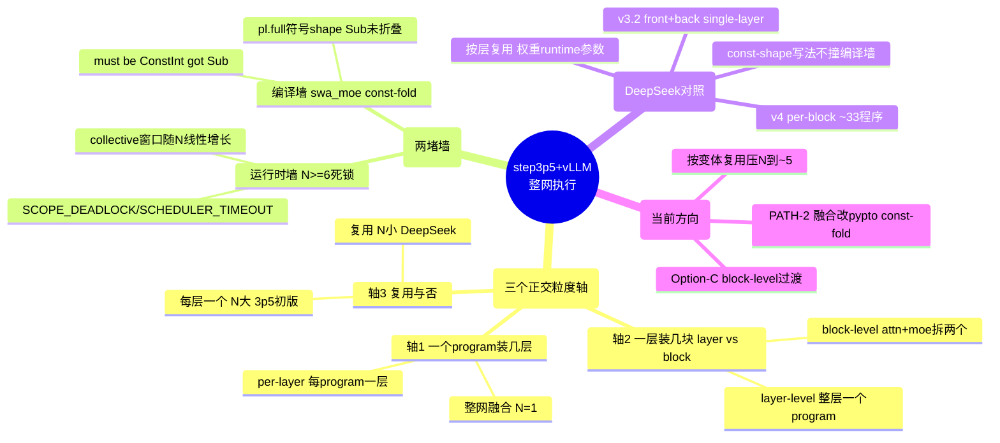

# 学习笔记 · step3p5 + vLLM 集成：per-layer / block / 整网融合

> **这是什么**：step3p5 接入 vLLM 做整网推理时，"逐层跑 vs 整网融合"的架构选择，以及项目里真实撞的两堵墙、和参考模型 DeepSeek 的对照。沉淀自多轮讨论。
> **权威出处**：项目 `CLAUDE.md` Phase 20/25、memory `whole-model-pypto-decode-design`（2026-07-08 定稿）、`models/deepseek/v4/`、`models/deepseek/v3_2/`。
> **一句话**：这里有**三个正交的粒度轴**别混——一个 program 装几层、装一层里的几块、同类型层复不复用。step3p5 撞墙撞在"轴3 program 个数"，不是"轴1 融合与否"。

---

## 🎯 核心结论先行

> **DeepSeek 也不是整网融合，它是"少数几个 block program 按层复用"（N 小）；step3p5 初版是"每层一个 program"（N≈87）才撞 N≥6 的运行时墙。真正的分水岭是"distinct program 个数 N"，不是"per-layer vs fused"。解法是复用 per-block 程序（DeepSeek 那样），不一定非要整网融合。**

---

## 🧠 全景思维脑图



> mindmap 靠自动分支上色（**不要写 `classDef`**，会报 "only one root"）。

---

## 一、两种执行方式：per-layer vs 整网融合（轴1）

| | **per-layer（逐层）** | **整网融合（fused）** |
|---|---|---|
| 编译单元 | N 个程序（每层/块一个） | 1 个巨程序装 45 层 |
| 谁驱动层循环 | **外部 Python driver**（`rt.run` per dispatch） | **pypto 程序内部** |
| 层间 residual | worker-resident `DeviceTensor` 跨 dispatch 串 | 程序内部零拷贝 |
| 跨层融合 | ❌ 每层硬边界 | ✅ 保留跨层融合 + 通信/计算重叠 |
| 派发开销 | 每层一次 dispatch | 一次 kick |
| 编译难度 | 每个小、好编好调、可增量 | 巨程序，撞 namespace/const-fold |
| 精度验证 | 可逐层对 vLLM dump 比（好 bisect） | 只能端到端比 |

`decode_fwd.host_orch` 实际是 **TAIL-ONLY**（只跑最后 RMSNorm+LM-head），45 层的 per-layer dispatch 目前 staged 在 `@pl.program` **之外**——即当前形态是"Python driver 循环 `select_decode_layer(li)`"，不是 in-program chaining。

---

## 二、layer 层面 vs block 层面（轴2，细化）

**这是和轴1 不同的另一个轴**：不是"一个 program 装几层"，而是"一个 program 装一层里的**几块**"。

| | **layer-level（整层）** | **block-level（拆块）** |
|---|---|---|
| 一个 program 装什么 | **一整个 decoder 层**：attention + MoE + 残差全融在一个 `@pl.program` | 把一层**从 resid1 处切开**成 2 个程序 |
| 代表 | `select_decode_layer(li)` → `decode_layer_swa_moe` 等 | `_build_tp_attention_swa_program`(→`resid1_out`) + `select_moe_block(li)`(EpTpMoE: resid1→moe_out) |
| attention→MoE 数据 | 程序内部零拷贝 | 外部串（resid1 经 DeviceTensor/capture 传给 moe 程序） |
| 每层 dispatch 次数 | 1 | 2（attn + moe） |
| 融合 | attention 和 MoE 跨块融合 | attention/MoE 之间硬边界 |

**为什么 step3p5 对 MoE 层被迫用 block-level**：融合的整层 `swa_moe`（layer-level）**编译不过**——`attention_swa` inline 进 EP（MoE）上下文触发 const-fold 级联（见 §四 编译墙）。切成 block 后：attention 程序（TP-only、无 EP 上下文）能编，MoE-block（独立 `EpTpMoE`）能编，两半都过 → 整网 45/45 层在 Option-C 下 compile-complete。

> **关键**：同一个网络里**两种粒度并存**——**dense 层用 layer-level**（`select_decode_layer`，融合能编），**MoE 层用 block-level**（Option-C，因为融合的 swa_moe 编不过）。`full_moe` 其实能融（full attention + MoE 融合 OK），只有 `swa_moe`（~30 层）撞级联。

> block 的切缝在 attention↔MoE（resid1）这个自然接缝；MoE-block 内部的 gate/dispatch/expert/combine 仍然融在一个 moe 程序里，不再往下切。

---

## 三、program 个数 N 的本质（轴3，最要命）

**"program 个数"指 co-resident 在一个 worker 上、被 `prepare` 的"不同已编译 program"的个数 N，不是层数。** 要命处：**每个会做 collective（跨卡通信）的 program，prepare 时各自从共享池切一套 collective signal-window / GM buffer**。

- step3p5 实测：**N=5 能通，N≥6 就 `SCOPE_DEADLOCK`(code -1) / `SCHEDULER_TIMEOUT`(sched=100)**，第一次 dispatch（已验证的 L0）就挂。
- 怀疑真凶 = **per-program 的 collective signal-window / GM 随 N 线性增长，N≥6 顶满共享池**（ring-tuning 三试全败，非 task_window 问题）。要根治需 simpler runtime maintainer 级（signal-window/GM 池按 N 扩）。

**多个 program 又分两种（差在 N 大小）**：

- **复用型（N 小）**：只编**少数几个 distinct program**（block 类型数），**同一个编译好的 program 按层反复 `rt.run`**，每次喂不同层权重（权重是 runtime 参数，不 bake）。N ≈ 2~6，**永远在墙以下**。
- **每层一个型（N 大）**：给每层 co-prepare 一个 distinct program（45 层 × (attn+moe) ≈ **87 个**，连 L1/L2 都是 swa_dense 却编两个）。N 线性爆 → N≥6 死锁。

---

## 四、两堵墙

| 墙 | 属于哪条路 | 现象 | 根因 | 解法 |
|----|-----------|------|------|------|
| **运行时墙** | per-layer 多程序（N 大） | N≥6 `SCOPE_DEADLOCK`/`SCHEDULER_TIMEOUT` | 每 program 一套 collective 窗口/GM，随 N 线性顶满共享池 | 复用 per-block 程序压 N（→§六）；或整网融合 N=1 |
| **编译墙** | 整网融合 / 融合 swa_moe layer-level | `tile.full shape element 0 must be ConstInt, got Sub` | `attention_swa.py:479 pl.full([SWA_Q_PAD_ALIGNED(32 literal) − Q_HEAD_BATCH_SWA(12 符号), HEAD_DIM])` 里 `Sub` 未 const-fold（EP 分布式 lowering pass） | 改 pypto EP-lowering pass 源码 const-fold `Sub/Add/Mul`；或按 DSV4 把 attention_swa 改成 const-shape 写法 |

---

## 五、DeepSeek 对照（标杆是 per-block 复用，不是整网融合）

- **v4**：`models/deepseek/v4/` 下 **~33 个独立 program 文件**（attention 各变体 / moe_ep / gate / dispatch / combine / lm_head…），**没有 `decode_layer.py`/`decode_fwd.py`**（无整网 chaining），`host_orch` 按组件定义。= **per-block program**。
- **v3.2**：decode 拆成 `front` + `back` **两个 "single-layer" 大 program**（docstring 明写 "single-layer decode BACK part"，各 1 个 `@pl.program`），**按层反复 run**，层循环在**外部**。
- 所以 **DeepSeek 也不是整网融合**——它是**少数几个 block/single-layer program 按层复用**（N 小），权重走 runtime 参数。
- **DeepSeek 不撞两堵墙的原因**：① N 小（复用型）→ 不撞运行时墙；② kernel 一开始就 **const-shape 写法**（固定窗口 const tile + mask/fillpad，无 config 符号算术）→ 不撞编译墙。
- **纠正一个常见误解**："DeepSeek 有自己的后端所以整网可行"——**后端归属只解决运行时轴**（自己驱动 per-block 循环、不跟 vLLM 抢卡 co-tenancy 507018），**不等于整网融合可行**；整网融合能否编过取决于 **kernel 是不是 const-shape**，跟后端无关，且 DeepSeek 自己也没做整网融合。

---

## 六、三种形态、三种墙（总表）

```
N=1    整网融合一个大 program        → 无运行时墙，但撞【编译墙】(swa_moe const-fold)
N≈4-6  复用型 per-block (DeepSeek)   → 两墙都不撞          ★标杆
N≈87   每层一个 program (3p5 初版)    → 撞【运行时墙】(N≥6 signal-window/GM 池)
```

**step3p5 的正确方向**：不必非得整网融合。把 program **按 block 类型复用**（一个 swa-attn + 一个 full-attn + 一个 moe-block + tail，权重当 runtime 参数，反复 run 45 层），**N 从 ~87 降到 ~5**，绕过运行时墙——这正是 DeepSeek 的形态。整网融合（N=1）是另一条路，但要先解 const-fold 编译墙（PATH-2：改 pypto 源码）。

---

## 七、当前方向（2026-07-08 定稿）

- 用户拍板**倾向整网融合**（PATH-2）：因为它无 N-ring → 直接消解 N≥6 死锁，且 perf 上限高。下一步**直接改 pypto EP-lowering pass 源码 const-fold** 那个 `Sub`，重编，再融合。
- **过渡/兜底 = Option-C（block-level decompose）**：MoE 层拆"TP-attn 程序 → resid1 → EpTpMoE block"，已 **45/45 层 compile-complete**、dense+MoE device dispatch HW 验证过。融合整层 swa_moe 降级成"Phase 26 纯性能优化"。
- 已 HW 验证积木：45/45 Option-C 编译、dense 前缀 TP=8 device run、多程序 worker dispatch、residual threading、47GiB 单 key 权重 IPC、MoE-block 精度。剩多周工程：worker dispatch loop + 权重/KV IPC + tail + `_pypto_full_forward` single-handoff + live A/B（8001 pypto vs 8000 vanilla token-exact）。
- **精度硬约束**：vLLM dump **无 KV-cache** → 真正的"整网端到端精度对齐"必须是 **live single-handoff A/B**；offline 逐层只能覆盖 MoE/MLP 数学，attention-core 是 live-only。

---

## 💡 心得速查

1. **三轴别混**：一个 program 装几层(轴1) / 装一层几块(轴2 layer-vs-block) / 复不复用(轴3)。step3p5 撞墙撞在轴3。
2. **program 个数 N = distinct 编译程序数**，每个带一套跨卡通信窗口；N≥6 顶满池死锁。
3. **layer-level vs block-level 是编译粒度**：dense 用 layer-level（能融），MoE 用 block-level（融合 swa_moe 编不过）。
4. **DeepSeek = per-block 复用（N 小）+ const-shape 写法**，两墙都不撞；它不是整网融合。
5. **"有自己的后端"只免于 vLLM 抢卡，不等于整网融合可行**——后者看 kernel 是不是 const-shape。
6. **step3p5 最省事的解 = 按 block 类型复用程序把 N 压到 ~5**（不一定整网融合）；整网融合要先改 pypto const-fold。

---

*返回：[notes 索引](README.md) ｜ 相关：[06 编程与部署 API](06-pypto-programming-and-deploy-api.md)（namespace/融合/buffer 通用坑）*
