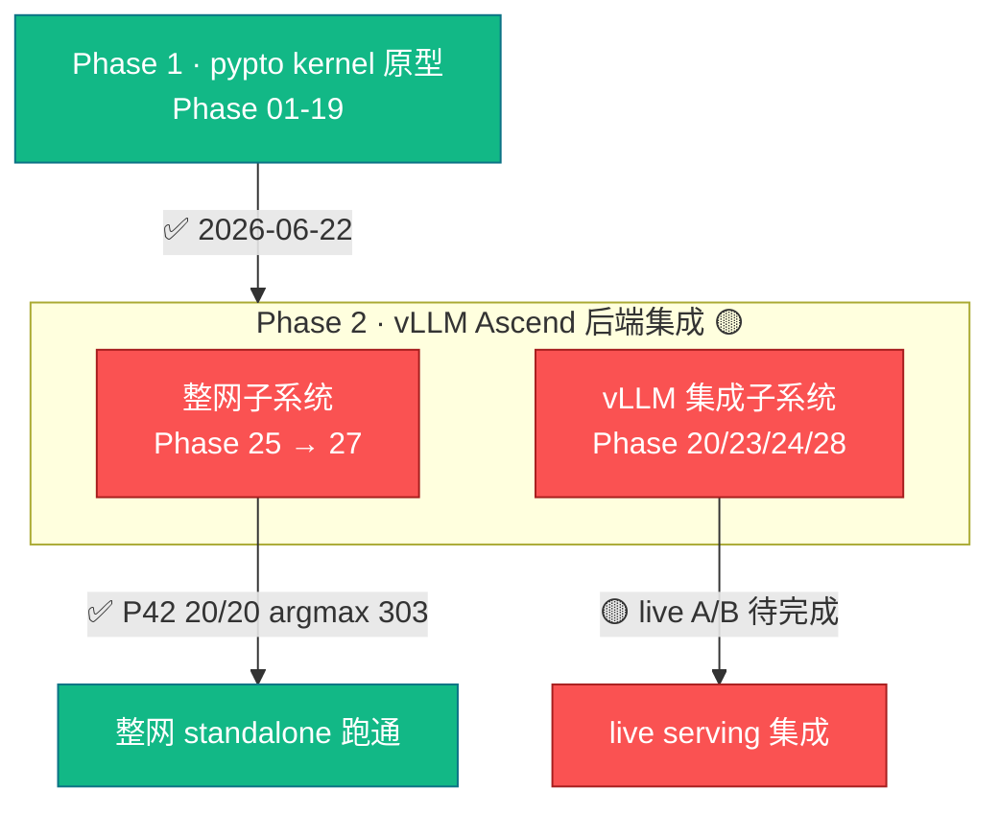
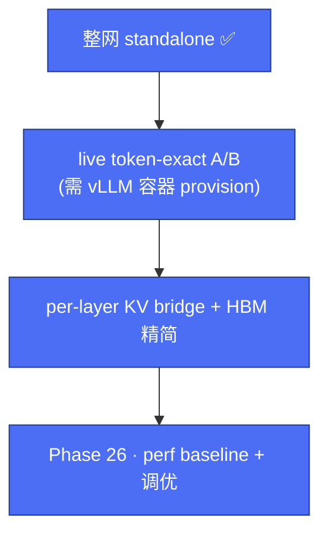

# 项目路线图（Roadmap）

> **这是"整体规划"文档，不含每日 session 流水。** 每日进展在
> [`../archive/milestones-2026-Q2.md`](../archive/milestones-2026-Q2.md)（session 日志
> SSOT）；此刻状态在 [`../STATUS.md`](../STATUS.md)；接力上下文在
> [`handoff.md`](handoff.md)。想讲进度给别人听 → 看本文。

## 1. 一眼看清

## 2. 里程碑

| 阶段 | 内容 | 状态 | 交付/证据 |
|------|------|------|-----------|
| **Phase 1** | pypto kernel 原型（config→attention→MoE→45 层 decode→MTP→prefill→TP/EP 重构→frontend bring-up→codegen→单卡/多卡 NPU） | ✅ 2026-06-22 | 见 [`../archive/prototype-phase-01-19-summary.md`](../archive/prototype-phase-01-19-summary.md) |
| Phase 16 | 多卡三剑合璧（driver/firmware/CANN） | ✅ 2026-06-19 | [`../deployment/phase16-three-pillars.md`](../deployment/phase16-three-pillars.md) |
| Phase 23 | 零拷贝 KV-IPC 验证（IPC 主卡点解除） | ✅ 2026-07-03 | [`../archive/completed-phases/23-zero-copy-kv-ipc-validation.md`](../archive/completed-phases/23-zero-copy-kv-ipc-validation.md) |
| **Phase 27** | **N=1 整网融合**（单 `@pl.program` 45 层 + tail） | ✅ 2026-07-18 | P42 20/20 PASS，token 6127 → argmax 303；合入三仓 `stepfun/develop` |
| **Phase 28** | **N=1 整网 → vLLM live 集成** | 🟡 进行中 | plumbing device-verified；live token-exact A/B 待完成 |

> Phase 20/21/22/24/25/26 的设计/中间态已归档到
> [`../archive/completed-phases/`](../archive/completed-phases/)（被 27/28 取代或吸收）。

## 3. 两条子系统主线

### 3.1 整网子系统（pypto whole-net）→ 设计 [`../design/whole-net/`](../design/whole-net/)

- **目标形态**：单个 `@pl.program`，45 层 source-unroll，TP=8/EP=8，native W8A8。
- **已达成**：standalone canonical P42 稳定 20/20，argmax=303，rank-local single-submit，per-layer window + 512B signal + 两波 barrier。
- **遗留**：padding-row 完全等价（诊断项，不影响 canonical）；perf 调优（gate 见 §4）。

### 3.2 vLLM 集成子系统（vllm-pypto）→ 设计 [`../design/vllm-pypto/`](../design/vllm-pypto/)

- **目标形态**：monkey-patch `Step3p5Model.forward` → sidecar → 整网；同卡共驻 + KV/weight IPC。
- **已达成**：monkey-patch + sidecar + socket + `SIMPLER_COMM_NO_HCCL` 共驻 + IPC plumbing 均 device-verified；live 8001 返回 token。
- **遗留**（gate 项）：
  1. **live token-exact A/B**（🔴 0162 provisioning 阻塞：无 vLLM 容器）。
  2. per-layer KV bridge（多 KV group ABI；现为单 flat pool）。
  3. 3-way HBM / redundant-weight 精简（单 key ~47GB/rank）。

## 4. 下一步（gate 关系）

1. 恢复/provision 可用 vLLM serving 容器 → 跑 `e2_ab.py` live token-exact A/B。
2. per-layer KV bridge + HBM/redundant-weight 精简。
3. Phase 26 perf baseline + 调优（gate 在 live A/B 通过 + 多卡稳定）。

## 5. 更新协议

- phase 状态变化：改本表 + [`phases/README.md`](phases/README.md) + [`../STATUS.md`](../STATUS.md)。
- 每日进展：追加到 [`../archive/milestones-2026-Q2.md`](../archive/milestones-2026-Q2.md)，**不写本文**。
- 新 blocker：[`../blockers.md`](../blockers.md)；解决后转 [`../postmortems/`](../postmortems/)。
