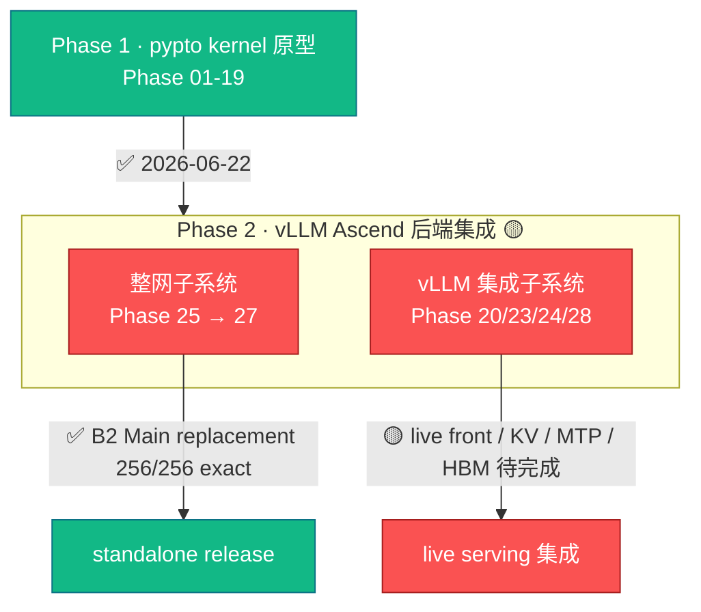
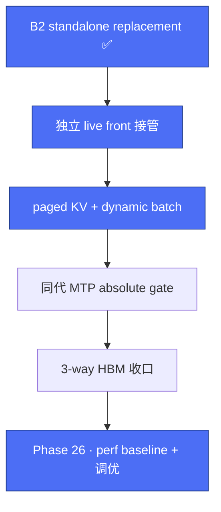

# 项目路线图（Roadmap）

> **这是"整体规划"文档，不含每日 session 流水。** 每日进展在
> [`../archive/milestones-2026-Q2.md`](../archive/milestones-2026-Q2.md)（session 日志
> SSOT）；此刻状态在 [`../STATUS.md`](../STATUS.md)；接力上下文在
> [`handoff.md`](handoff.md)。想讲进度给别人听 → 看本文。

## 1. 一眼看清

```mermaid
graph TD
    P1["Phase 1 · pypto kernel 原型<br/>Phase 01-19"] -->|✅ 2026-06-22| P2
    subgraph P2["Phase 2 · vLLM Ascend 后端集成 🟡"]
        direction TB
        WN["整网子系统<br/>Phase 25 → 27"]
        VL["vLLM 集成子系统<br/>Phase 20/23/24/28"]
    end
    WN -->|"✅ B2 Main replacement 256/256 exact"| DONE1["standalone release"]
    VL -->|"🟡 live front / KV / MTP / HBM 待完成"| DONE2["live serving 集成"]
    classDef d fill:#12B886,stroke:#0B7285,color:#fff;
    classDef w fill:#FA5252,stroke:#A61E1E,color:#fff;
    class P1,DONE1 d; class WN,VL,DONE2 w;
```

## 2. 里程碑

| 阶段 | 内容 | 状态 | 交付/证据 |
|------|------|------|-----------|
| **Phase 1** | pypto kernel 原型（config→attention→MoE→45 层 decode→MTP→prefill→TP/EP 重构→frontend bring-up→codegen→单卡/多卡 NPU） | ✅ 2026-06-22 | 见 [`../archive/prototype-phase-01-19-summary.md`](../archive/prototype-phase-01-19-summary.md) |
| Phase 16 | 多卡三剑合璧（driver/firmware/CANN） | ✅ 2026-06-19 | [`../deployment/phase16-three-pillars.md`](../deployment/phase16-three-pillars.md) |
| Phase 23 | 零拷贝 KV-IPC 验证（IPC 主卡点解除） | ✅ 2026-07-03 | [`../archive/completed-phases/23-zero-copy-kv-ipc-validation.md`](../archive/completed-phases/23-zero-copy-kv-ipc-validation.md) |
| **Phase 27** | **N=1 整网融合**（单 `@pl.program` Main） | ✅ 2026-07-18 | 历史 P42 20/20；0724 canonical baseline 保留为 rollback |
| **B2 release** | **45 层 loop-form Main replacement** | ✅ 2026-07-26 | `stepfun/develop@29547af6` 默认 `whole_decode_step3p5`；N=256 canonical↔baseline、rename 前后均 `256/256` exact |
| **Phase 28** | **N=1 整网 → vLLM live 集成** | 🟡 进行中 | release 镜像与 Main replacement 已完成；live front、paged KV、同代 MTP、HBM 待完成 |

> Phase 20/21/22/24/25/26 的设计/中间态已归档到
> [`../archive/completed-phases/`](../archive/completed-phases/)（被 27/28 取代或吸收）。

## 3. 两条子系统主线

### 3.1 整网子系统（pypto whole-net）→ 设计 [`../design/whole-net/`](../design/whole-net/)

- **当前形态**：单个 `@pl.program`，45 层 loop-form Main，TP=8/EP=8，
  native W8A8；0724 hidden-only unroll baseline 仅作显式 rollback。
- **已达成**：`pypto-lib stepfun/develop@29547af6` 已作为默认 release Main；
  正式路径为 `models.step3p5.decode_fwd:whole_decode_step3p5`；固定环境
  N=256 canonical↔baseline token/hidden `256/256` exact、`max_abs_diff=0`、
  TP spread `0.0`。
- **口径**：同一 vanilla oracle 的 raw canonical/baseline 都是
  `240/256=93.75%`，低于历史 95% raw gate；这不是 opt regression，
  但也不是 raw precision PASS。
- **遗留**：C1 通信优化、perf 调优，以及 serving 侧独立闭环。

### 3.2 vLLM 集成子系统（vllm-pypto）→ 设计 [`../design/vllm-pypto/`](../design/vllm-pypto/)

- **目标形态**：monkey-patch `Step3p5Model.forward` → sidecar → 整网；同卡共驻 + KV/weight IPC。
- **已达成**：sidecar 默认 Main 已接到 `whole_decode_step3p5`；rename 前后
  N=256 bit-exact。镜像构建、smoke、
  默认入口和 standalone N=256 replacement 已验证。历史 monkey-patch/socket/
  co-tenancy plumbing 有 device 证据。
- **遗留**（gate 项）：
  1. **独立 live vLLM front 真正接管请求**并完成 token/hidden A/B。
  2. live per-layer paged-KV bridge + dynamic batch metadata。
  3. current Main→MTP 的同代 absolute oracle。
  4. 3-way HBM / redundant-weight 精简。

## 4. 下一步（gate 关系）

```mermaid
graph TD
    A["B2 standalone replacement ✅"] --> B["独立 live front 接管"]
    B --> C["paged KV + dynamic batch"]
    C --> M["同代 MTP absolute gate"]
    M --> H["3-way HBM 收口"]
    H --> D["Phase 26 · perf baseline + 调优"]
    classDef g fill:#4C6EF5,stroke:#1E3A8A,color:#fff;
    class A,B,C,D g;
```

1. 用当前 release 镜像/代码完成独立 live vLLM front 接管和 A/B。
2. 接 live paged-KV bridge、dynamic batch metadata。
3. 建 current Main→MTP 同代 absolute oracle。
4. 收口 HBM/redundant weights。
5. Phase 26 perf baseline + 调优（gate 在 live A/B、MTP、HBM 均闭环后）。

## 5. 更新协议

- phase 状态变化：改本表 + [`phases/README.md`](phases/README.md) + [`../STATUS.md`](../STATUS.md)。
- 每日进展：追加到 [`../archive/milestones-2026-Q2.md`](../archive/milestones-2026-Q2.md)，**不写本文**。
- 新 blocker：[`../blockers.md`](../blockers.md)；解决后转 [`../postmortems/`](../postmortems/)。
