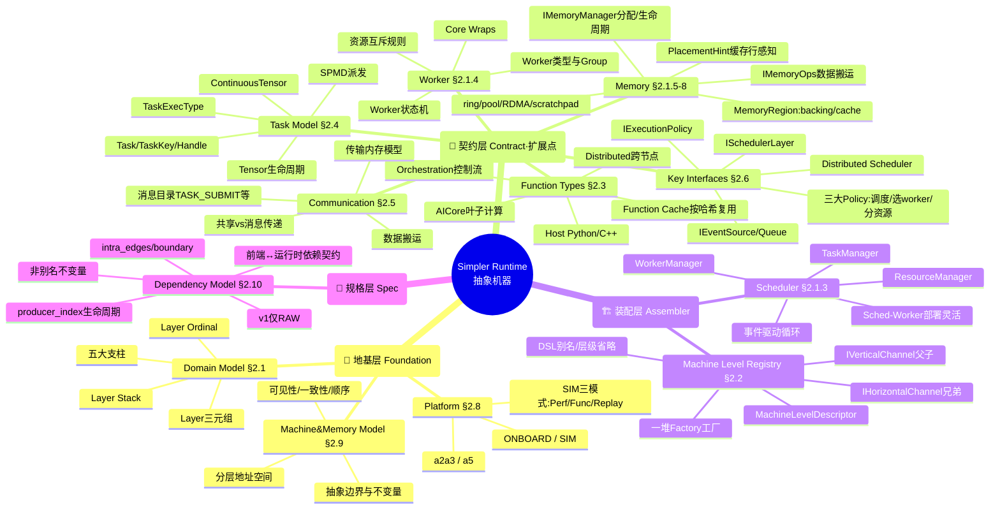
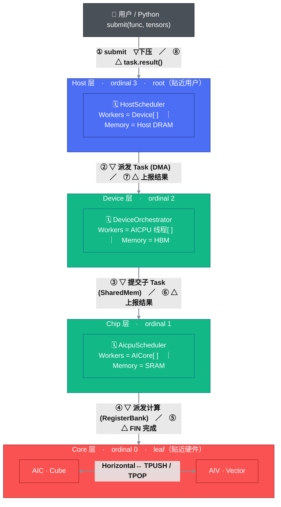
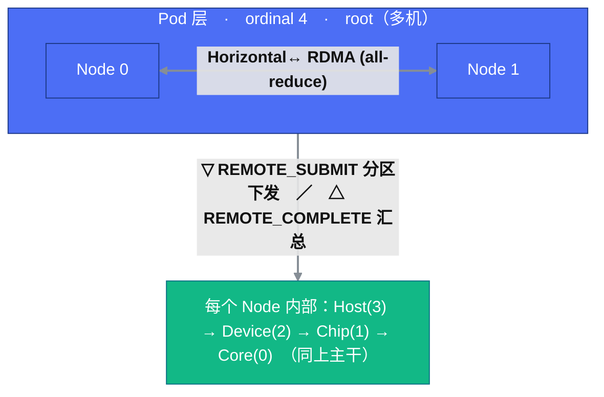
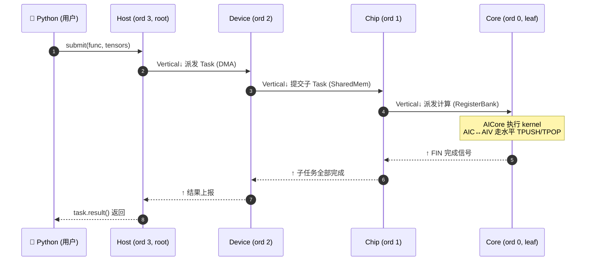
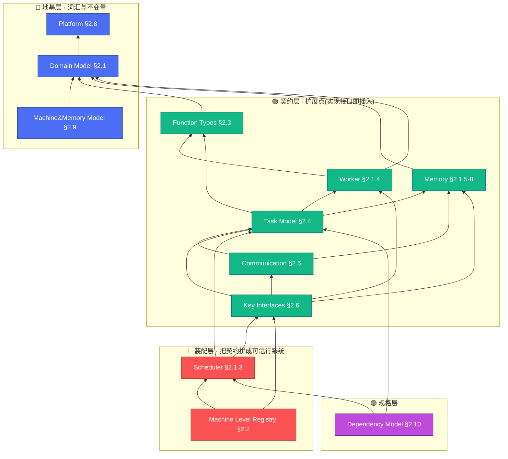

# 学习笔记 · 逻辑视图（Logical View）

> **这是什么**：对 [`pypto-runtime-arch-docs/02-logical-view.md`](../../../pypto_top_level_documents/pypto-runtime-arch-docs/02-logical-view.md) 的个人学习总结 + 彩色思维脑图。
> **目的**：一页看懂 Simpler runtime 的"抽象机器（Abstract Machine）"到底由哪些概念组成、它们怎么分层、谁依赖谁。原文档是权威规格，本笔记是"抓主干 + 记心得"。
> **读法**：先看脑图建立全局印象 → 看五大支柱 → 看三层依赖 → 需要细节时跳回原文档对应 §。

---

## 🎯 一句话理解

> **Simpler runtime = 一台"抽象机器"，它把硬件（NPU / host / 多机）抽象成一摞可递归的执行层（Layer），每层都是 `(调度器 Scheduler, 一组 Worker, 内存作用域 MemoryScope)` 三元组；上层把 Task 往下压，下层执行，层与层之间靠 Channel 通信。整套逻辑与平台无关，只有最底下的 Machine Level 实现和 HAL 才是平台相关的。**

一个心智锚点：**"递归"是灵魂**。从"分布式多机"一路到"单卡内 AICore 派发"，全都是同一个 `ISchedulerLayer` 契约，只是每层对"Worker 是什么、Memory 是什么"的解释不同。理解了这点，整份逻辑视图就串起来了。

---

## 🧠 彩色思维脑图 · 全景



> 颜色约定（贯穿全笔记）：🔵 **地基层** ｜ 🟢 **契约层/扩展点** ｜ 🔴 **装配层** ｜ 🟣 **规格层**。
> 若你的 markdown 渲染器不支持 `::icon`（需要 Font Awesome），图标会被忽略但结构与配色不受影响；mindmap 会自动给各分支上色。

---

## 🔀 层次结构 · 垂直通道 vs 水平通道（含数据流动）

抽象机器把执行层摞成一个 **Layer Stack**。先立住方向约定（跟源文档一致）：

- **ordinal 0 = Core = 叶子（leaf）**，贴近硬件、离用户最远；
- **ordinal 越大越往上、越贴近用户**（单机到 Host=3，多机再加 Pod=4，大集群到 Global=7）；
- **root = 最顶那层**（单机是 Host，多机是 Pod）——它直接接用户提交。

层与层、层内实例之间靠两种正交通道通信，这就是"分成垂直和水平两个方向"：

- **垂直通道 `IVerticalChannel`（父 ↔ 子，跨相邻 ordinal）**：一条主干上有**两个方向**——上层把 **Task 往下压**（提交/派发），叶子算完把 **结果/完成往上报**。载体逐层不同：`DMA Control` → `SharedMemory` → `RegisterBank`。
- **水平通道 `IHorizontalChannel`（兄弟 ↔ 兄弟，同 ordinal）**：同层实例协作，**不跨级**。典型两处：Core 内 `AIC ↔ AIV` 的 `TPUSH/TPOP`；多机时 Pod 层 `Node ↔ Node` 的 `RDMA` all-reduce。

### 主干：单机 4 层的垂直层次 + 数据流动

编号 ①→⑧ 就是一次调用的流动顺序（下压 Task → 叶子执行 → 结果上报）：



> 读图：图**从上到下 = 从用户到硬件**，最顶 Host(ordinal 3)=root 贴用户，**最底 Core(ordinal 0)=leaf 贴硬件**。每条垂直主干边同时承载两个方向——**▽ = 向下压 Task（提交/派发），△ = 向上报结果/完成**；编号 ①→⑧ 是完整流动顺序（下行 ①→④，上行 ⑤→⑧）。Core 内 `AIC ↔ AIV` 的双向箭头 = 水平同层协作。每层内部都是同一个 `(Scheduler, Workers[], MemoryScope)` 三元组——这就是"递归"：换一层，只是三元组里"Worker/Memory 是什么"变了（Host 的 Worker 是 Device，Chip 的 Worker 是 AICore）。

### 多机扩展：root 上移到 Pod，出现第二处水平通道

多机时在 Host 之上再加一层 **Pod（ordinal 4，此时 root 上移到 Pod）**。Pod 层的 Node ↔ Node 走**水平 RDMA**（如跨卡 all-reduce），纵向仍靠 `REMOTE_SUBMIT` 把分区下发给各 Node：



### 时间轴视角：同一次流动按"发生先后"读

上面的层次图是**空间结构**，下面的时序图是**同一条流动的时间轴**——自上而下就是"流动的感觉"：



> 下压走垂直通道的载体逐层不同（DMA → SharedMem → RegisterBank），但**契约统一**：每层都实现同一个 `ISchedulerLayer`。这正是"同一套代码适配不同硬件"的根——具体的并发/事件循环见 [过程视图 §4.1–§4.2](04-process-view.md)，物理部署见 [物理视图](05-physical-view.md)。

### 每条边的媒介是什么、为什么这么选

**核心原则：媒介由两端的物理关系决定**——是否共享地址空间、中间隔着什么（片内总线 / PCIe / 网络）。距离越近，媒介越"裸"、延迟越低。

**垂直通道（父 ↔ 子，跨相邻 ordinal）：**

| 边界 | 媒介 | 为什么是它 | 量级 |
|------|------|-----------|------|
| **Host ↔ Device**（主机 ↔ NPU 卡） | **DMA + MMIO doorbell**（经 CANN，走 PCIe） | 主机是 x86 CPU、Device 是 PCIe 上的 NPU，**两者不共享地址空间**，只能跨 PCIe 搬。DMA 让数据不经 CPU 逐字节拷贝、直接搬运；再用一次 MMIO 写"门铃"寄存器通知"数据好了"。 | ~16 GB/s (PCIe4)，~μs |
| **Device ↔ Chip**（AICPU ↔ AICore 簇） | **共享内存 + 轮询** | AICPU 与 AICore **在同一芯片、共享片上内存**，可直接用共享内存区零拷贝交换。用轮询而非中断，因为这里是 ns 级，**中断开销比数据本身还大**。 | 片上带宽，~ns |
| **Chip ↔ Core**（AICPU → AICore 派发） | **Register Bank（MMIO 寄存器）+ ACK/FIN 握手** | 派发本质是**写 AICore 的控制寄存器**（"去算这个 kernel"），再读寄存器等 ACK/FIN。**这是控制信号、不是大块数据**，寄存器写最直接最快，AICore 硬件轮询 COND 寄存器检测。 | 寄存器写延迟，~ns |

**水平通道（兄弟 ↔ 兄弟，同 ordinal）：**

| 边界 | 媒介 | 为什么是它 | 量级 |
|------|------|-----------|------|
| **Core ↔ Core**（同 CoreGroup 内 AIC ↔ AIV） | **TPUSH/TPOP + flag ring buffer（片上 SRAM）** | 兄弟核要**细粒度高频传数据**（如 Cube 算完喂给 Vector）。片上 SRAM 环形缓冲 + flag 信号 = 无锁生产者/消费者队列，ns 级。 | 片上 SRAM 带宽，~ns |
| **Node ↔ Node**（Pod 层跨节点） | **RDMA（InfiniBand/RoCE），TCP 兜底** | 跨机器，**既无共享内存也无 PCIe**，只能走网络。RDMA 让一端**直接读写另一端内存、绕过对方 CPU**（单边操作），低延迟高吞吐；TCP 作为通用兜底。 | 100–400 Gbps，1–5 μs |

**一句话记忆——媒介是"物理距离"的函数：**

```
共享地址空间(同芯片) → 寄存器 / 共享内存      ~ns    (最裸、最快)
跨 PCIe(主机↔卡)     → DMA + MMIO 门铃        ~μs
跨网络(节点↔节点)     → RDMA / TCP            μs~ms  (最重)
```

三条通用取舍逻辑：

1. **能共享内存就共享内存**（同芯片）——零拷贝、最低延迟；
2. **控制信号用寄存器，大块数据用 DMA/共享内存**——把"通知"和"搬运"分开，各用最省的手段；
3. **ns 级场景一律用轮询不用中断**——中断的上下文切换开销在纳秒尺度不可接受。

> 抽象层面：这些媒介都是 `IVerticalChannel` / `IHorizontalChannel` 的不同**实现**，在 Machine Level Registry 里按层**注册绑定**。上层逻辑只认"通道"接口、不关心底下是 DMA 还是寄存器——这就是"同一套调度代码适配不同硬件"的落点（对应开发视图的 `transport/` 模块、过程视图 §4.1.2 同步机制、物理视图 §5.2 网络拓扑）。

### Device 层 vs Chip 层：都在 AICPU 上，角色为何不同

这俩最容易混，因为**它们其实都跑在 AICPU 上**，区别在"扮演的角色"。一句话：**Device 层是"编排面"（决定要算什么、生成子任务），Chip 层是"派发面"（把每个 kernel 排到具体某个 AICore 上）。**

| 维度 | **Device 层（ordinal 2）** | **Chip 层（ordinal 1）** |
|------|---------------------------|--------------------------|
| Scheduler | `DeviceOrchestrator` | `AicpuScheduler` |
| Workers（谁干活）| **AICPU 线程**（默认 4） | **AICore**（72/108 个） |
| 跑什么 | 执行 **Orchestration Function**（控制流：定算子顺序、提交子任务） | 把 **计算 kernel 派发到 AICore**，管 ACK/FIN 握手 |
| Memory scope | **HBM**（设备全局大内存，tensor 住这） | **Shared Memory / SRAM**（片上暂存，放调度元数据/核间数据） |
| AICPU 线程角色 | 当 **worker**（跑编排代码） | 当 **scheduler**（调度 AICore） |
| 向下通道 | Device→Chip：**共享内存** | Chip→Core：**Register Bank (MMIO)** |
| 回答的问题 | "**要算哪些任务**"（产出 compute DAG） | "**每个任务放哪个核**"（细粒度派发） |

**接力流程**（一次调用里它们怎么衔接）：

```
Host: "跑这一层 forward"
  │ DMA↓
Device 层：AICPU worker 线程执行 orchestration
  │  函数体里 submit(matmul), submit(rmsnorm), ... → 产出一批 compute 子任务
  │ 共享内存↓
Chip 层：AicpuScheduler 拿到这批 compute 任务
  │  把 matmul 派给 AICore#3、rmsnorm 派给 AICore#7 ...（写 RegisterBank）
  │ RegisterBank↓
Core 层：AICore 执行 kernel，算完写 FIN
```

**怎么记（命名视角）**：这些名字不是按"软件角色"起的，而是按**物理封装的嵌套层级、从外到内**起的——软件角色是物理位置的*结果*，不是命名依据。

```
主机 Host ⊃ 设备 Device ⊃ 芯片 Chip ⊃ 核 Core
  │           │              │           │
用户的机器    插在机器上的     卡上那块      硅片上单个
             一块 NPU 卡      算力硅片      计算流水线
```

- **Device = 站在主机视角**：host-device 编程模型的通用词（CUDA/CANN 同），指挂在 PCIe 上、能 `setDevice(0)` 寻址、有自己 **HBM** 的那块卡。贴着 host → 负责**接活 + 编排**。
- **Chip = 站在硅片内部视角**：那块封装了 AICPU + AICore 阵列的计算芯片本体，用**片上 SRAM**。贴着 core → 负责**把 kernel 派到具体的核**。

> **一句话记忆**：**Device 是"对外的卡"，Chip 是"对内的芯"**。卡跨 PCIe、用 HBM、靠近 host 做编排；芯在片内、用 SRAM、靠近 core 做派发。辅助记忆：**内存名对上层名**——Device→device memory(HBM)、Chip→片上 SRAM。所以不用死记 `DeviceOrchestrator` vs `AicpuScheduler`，记住它俩在物理链条上的位置，角色自然推得出来。

---

## 🏛️ 五大支柱（Five Pillars）

抽象机器由五件事拼成，记住它们就记住了逻辑视图的骨架：

| # | 支柱 | 一句话 | 关键类型 |
|---|------|--------|----------|
| 1 | **Machine Level Registry** | 蓝图：命名的资源层级 + 注册的通信实现 | `MachineLevelDescriptor` + 各种 Factory |
| 2 | **Execution Layers** | 从蓝图实例化出来的一摞层，每层 = `(Scheduler, Workers[], MemoryScope)` | `Layer` 三元组、`LayerId` |
| 3 | **Function 类型** | 可调用的计算单元（4 类） | AICore / Orchestration / Host / Distributed |
| 4 | **Task 模型** | 可被调度的最小工作单位 | `Task`、`TaskKey`、`SPMDTaskDescriptor` |
| 5 | **Communication 模型** | 层间/机间怎么换控制与数据 | `IVerticalChannel`、`IHorizontalChannel` |

参数化维度：整台机器被 **Platform**（`a2a3` / `a5`）× **Variant**（`ONBOARD` / `SIM`）参数化。**运行时逻辑平台无关**，只有 Machine Level 实现和 HAL 平台相关——这是可移植性（NFR-3）的根。

---

## 🪜 三层依赖（读懂"谁先于谁"）

逻辑模块构成一个**严格 DAG**（无环）。按依赖方向自底向上分三层：



- 🔵 **地基层**（Platform / Domain / Machine&Memory Model）：建立词汇和不变量，其它一切都要先有它们。
- 🟢 **契约层**（Function / Memory / Worker / Task / Comm / Key Interfaces）：引入领域概念 + 抽象接口。**这些就是运行时的扩展点**——加新平台/新传输/新调度启发式，只要实现对应接口 + 注册，不改框架代码（Rule D2 / OCP）。
- 🔴 **装配层**（Scheduler / Registry）：把契约拼成能跑的系统。Scheduler 内部拆成 TaskManager / WorkerManager / ResourceManager 三个子件；Registry 负责按层绑定工厂、组装 Layer Stack。
- 🟣 **规格层**（Dependency Model）：不是代码接口，而是"前端 ↔ 运行时"的依赖契约规范（`intra_edges`、`producer_index`、非别名不变量、v1 只做 RAW）。

> **关于"看似有环"**：Registry 的工厂会产出 Scheduler 实例，而 Scheduler 又用 Registry 提供的 channel——这个环靠**接口/实现分离**打破：Registry 只依赖接口契约，不依赖具体 scheduler 代码。

---

## 🗂️ 模块速查表（12 个子文档索引）

原文档把逻辑视图拆成每模块一份子文档，放在 [`02-logical-view/`](../../../pypto_top_level_documents/pypto-runtime-arch-docs/02-logical-view/) 下。速查：

| § | 模块 | 层 | 核心概念 |
|---|------|----|----------|
| §2.1 | Domain Model | 🔵 | 五大支柱、递归 Layer、Layer Stack、Ordinal |
| §2.1.3 | Scheduler | 🔴 | TaskManager / WorkerManager / ResourceManager、事件循环 |
| §2.1.4 | Worker | 🟢 | Worker 状态机、类型、Group、资源互斥、Core Wraps |
| §2.1.5–8 | Memory | 🟢 | `IMemoryManager` / `IMemoryOps`、Region、`PlacementHint`、ring/pool/RDMA |
| §2.2 | Machine Level Registry | 🔴 | Descriptor、Factory、Vertical/Horizontal Channel、层级省略 |
| §2.3 | Function Types | 🟢 | AICore / Orchestration / Host / Distributed、Function Cache |
| §2.4 | Task Model | 🟢 | Task/Key/Handle、ContinuousTensor、SPMD、TaskExecType |
| §2.5 | Communication | 🟢 | 消息目录、传输内存模型、共享 vs 消息传递 |
| §2.6 | Key Interfaces | 🟢 | `ISchedulerLayer`、三大 Policy、Event/Execution 接口 |
| §2.8 | Platform | 🔵 | a2a3/a5、ONBOARD/SIM、build target |
| §2.9 | Machine&Memory Model | 🔵 | 抽象边界、地址空间、可见性/一致性/顺序 |
| §2.10 | Dependency Model | 🟣 | 两段式流水线、前端契约、`producer_index`、RAW-only |

---

## 💡 学习心得 / 关键洞察

1. **"递归的层"是唯一需要死记的抽象**。分布式 host → 单卡 → AICore 派发，全是 `ISchedulerLayer` 的同一套契约，差异只在"Worker/Memory 在这层是什么"。别把它想成固定 3 层树（FR-1 明确反对）。

2. **接口/实现分离 = 全部扩展性的来源**。契约层的每个 `I*` 接口都是扩展点。加新硬件层"只需实现六个组件接口 + 注册"（NFR-2）。看到 `Factory` 就想到"这是可插拔的注入点"。

3. **平台无关是刻意设计，不是巧合**。Platform × Variant 参数化让同一份运行时逻辑既能上真机（ONBOARD）又能跑仿真（SIM 的 Perf/Func/Replay 三模式共享同一套 `ISchedulerLayer` / Task / HAL 契约）。调试时 SIM Functional 模式能在 host CPU 上出真实数值。

4. **Channel 分两向**：`IVerticalChannel`（父↔子，Task 下压 / 结果上报）与 `IHorizontalChannel`（兄弟↔兄弟，同层协作，如 all-reduce）。跨机通信和卡内通信用**同一套传输抽象**（Distributed-First）。

5. **Dependency Model 是"前端与运行时的合同"**，容易被忽略但很关键：它规定了前端必须在 `SubmissionDescriptor` 里给出 `intra_edges` / 边界掩码，运行时据此维护 `producer_index`；还有"中间 memref 非别名"不变量。v1 只支持 RAW 依赖——这条边界解释了很多"为什么现在还不能做 X"。

6. **落到代码模块**（Development View 里详述）：`hal/`(§2.9) · `core/`(§2.3/2.4/2.1.4/2.6) · `scheduler/`(§2.1.3) · `memory/`(§2.1.5-8) · `transport/`(§2.2/2.5) · `distributed/`(§2.6.2) · `runtime/`(§2.2)。逻辑概念 ↔ 目录的映射记住大头即可。

---

## 📖 推荐阅读顺序（跳回原文档）

新手按此顺序啃原始子文档最省力：

1. [§2.1 Domain Model](../../../pypto_top_level_documents/pypto-runtime-arch-docs/02-logical-view/01-domain-model.md) — 基础概念（先看这个）
2. [§2.2 Machine Level Registry](../../../pypto_top_level_documents/pypto-runtime-arch-docs/02-logical-view/05-machine-level-registry.md) — 拓扑怎么配
3. [§2.1.3 Scheduler](../../../pypto_top_level_documents/pypto-runtime-arch-docs/02-logical-view/02-scheduler.md) + [§2.1.4 Worker](../../../pypto_top_level_documents/pypto-runtime-arch-docs/02-logical-view/03-worker.md) — 执行引擎
4. [§2.1.5–8 Memory](../../../pypto_top_level_documents/pypto-runtime-arch-docs/02-logical-view/04-memory.md) — 内存管理与搬运
5. [§2.3 Functions](../../../pypto_top_level_documents/pypto-runtime-arch-docs/02-logical-view/06-function-types.md) + [§2.4 Tasks](../../../pypto_top_level_documents/pypto-runtime-arch-docs/02-logical-view/07-task-model.md) — 工作单元
6. [§2.5 Communication](../../../pypto_top_level_documents/pypto-runtime-arch-docs/02-logical-view/08-communication.md) — 层间/机间消息
7. [§2.6 Key Interfaces](../../../pypto_top_level_documents/pypto-runtime-arch-docs/02-logical-view/09-interfaces.md) — 把一切绑在一起的契约
8. [§2.8 Platform](../../../pypto_top_level_documents/pypto-runtime-arch-docs/02-logical-view/10-platform.md) + [§2.9 Machine&Memory Model](../../../pypto_top_level_documents/pypto-runtime-arch-docs/02-logical-view/11-machine-memory-model.md) — 横切抽象契约
9. [§2.10 Dependency Model](../../../pypto_top_level_documents/pypto-runtime-arch-docs/02-logical-view/12-dependency-model.md) — 前端↔运行时依赖契约

---

*相关笔记入口见同目录其它 notes；架构对比可参考 [`pypto-project/architecture/`](../../design/)。*
