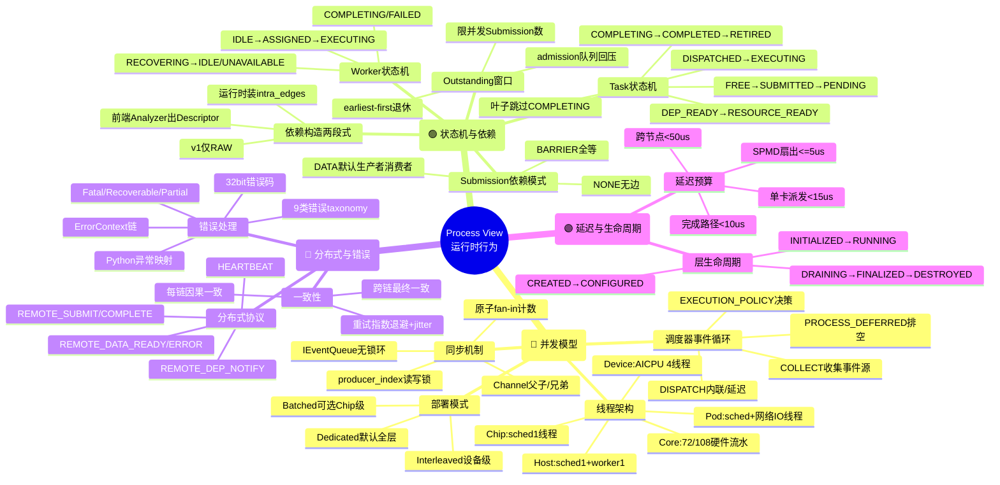
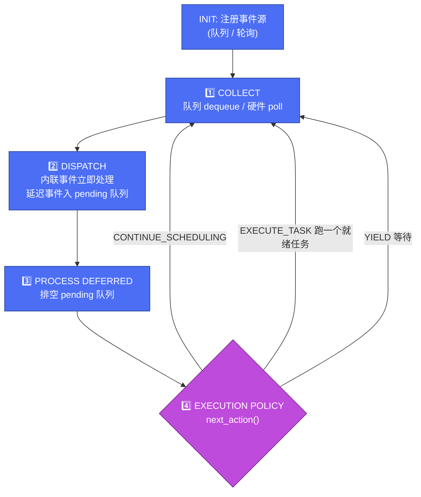
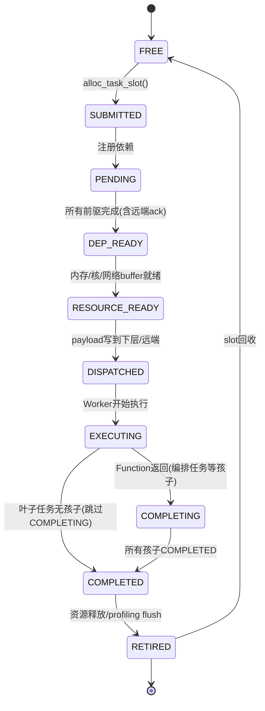
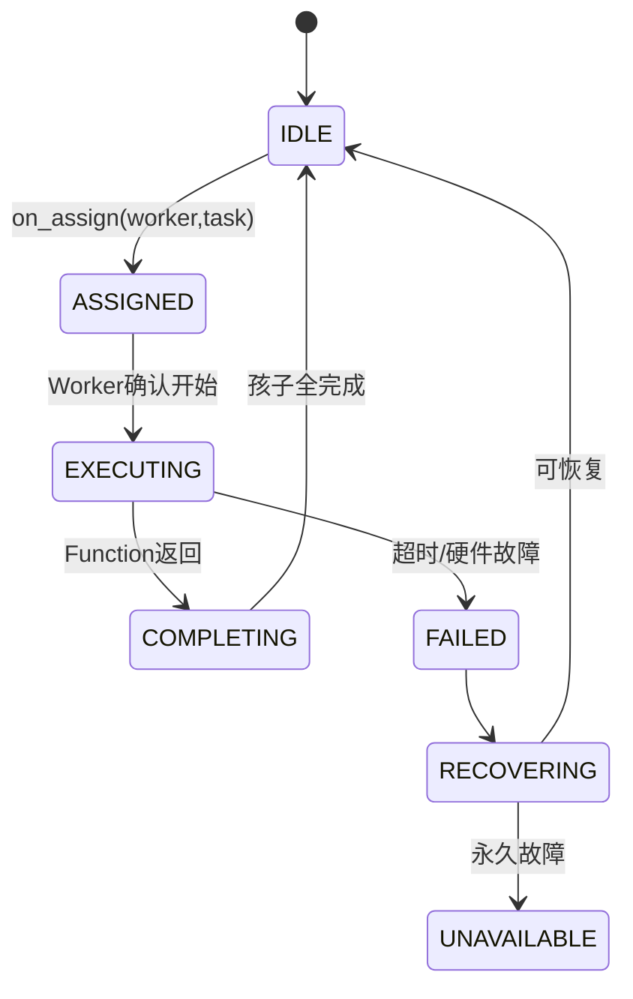

# 学习笔记 · 过程视图（Process View）

> **这是什么**：对 [`pypto-runtime-arch-docs/04-process-view.md`](../../../pypto_top_level_documents/pypto-runtime-arch-docs/04-process-view.md) 的学习总结 + 彩色思维脑图。
> **一句话**：逻辑视图讲"是什么"，开发视图讲"代码在哪"，**过程视图讲"跑起来时怎么动"**——线程、事件循环、状态机、依赖、通信、错误、延迟预算。
> **配色**：🔵 并发/线程 ｜ 🟢 状态机/依赖 ｜ 🔴 分布式/错误 ｜ 🟣 延迟预算/生命周期。

---

## 🎯 一句话理解

> **每一层都是一个单线程事件循环（COLLECT → DISPATCH → PROCESS DEFERRED → EXECUTION POLICY）。Task 在所有层走同一套状态机（FREE→…→EXECUTING→COMPLETING→COMPLETED→RETIRED），Worker 也走统一状态机。外部生产者只能通过无锁队列或轮询硬件寄存器跟调度器交互，绝不跨线程直接调方法。上层 Task 执行时提交子 Task 给下层，父 Task 卡在 COMPLETING 等所有孩子完成。**

记忆钩子：**"事件循环单线程 + 状态机全层统一 + 只用队列/寄存器跨线程"**。这三条一立，并发正确性就有了骨架。

---

## 🧠 彩色思维脑图 · 运行时行为全景



---

## 🔄 调度器事件循环（每层的心脏）



- **单线程保证**：一个 Scheduler 实例内事件循环单线程；即使 `scheduler_thread_count>1`，每线程跑独立的事件分区。deferred pending 队列是循环线程内部的，无需加锁。
- **三种执行策略**：`Dedicated`（默认，调度线程从不跑任务）/ `Interleaved`（设备级 AICPU 线程少，排空事件后内联跑一个任务）/ `Batched`（Chip 级可选，攒 N 个再一起跑，`max_batch` 默认 8）。**Batched 必须显式开启，没有路径会偷偷启用**。

---

## 🟢 Task 状态机（全层统一）



> **叶子跳边（A3-P14）**：AICore 计算、数据搬运、barrier 这类无孩子的叶子任务，直接 `EXECUTING → COMPLETED`，不经 COMPLETING。只有编排任务（要等子任务）才走 COMPLETING。
> **TaskHandle = {slot_index, generation}**：generation 每次复用单调 +1，用来检测过期 handle。

---

## 🟢 Worker 状态机（全层统一，WorkerManager 拥有）



- **Group 可用性索引**：有 Worker Group 的层（如 Core 的 Core Wrap = 1 AIC + 2 AIV），WorkerManager 维护"每组每类型 IDLE 数"，供选 worker / 分资源策略用。判定某 `TaskExecType` 能否被某组接收 = 检查该组每个 `required_slots{type,count}` 都有 ≥count 个 IDLE。

---

## 🔀 Submission 依赖三模式 + 窗口

| 模式 | 入场时干什么 | 成本 | 何时用 |
|------|-------------|------|--------|
| `BARRIER` | 每个 boundary-in 任务 join 所有在飞 Submission（每前序一个 barrier token） | O(W+B) | 显式同步点（迭代末 collective、checkpoint） |
| `DATA` | 扫 IN/INOUT tensor，对每个 `BufferRef` 命中前序输出的建生产者→消费者边 | O(B×A) | **默认**，放行真正的生产者消费者并行 |
| `NONE` | 不建外部边（intra 边仍在） | O(1) | 可证独立的流（data loader、独立 micro-batch），调用方自证 |

- **Outstanding Submission Window**：限制**同时在飞的 Submission 数**（不是任务数），bound 住 DATA 扫描成本、`BufferRef→producer` 索引寿命、BARRIER 扇入。默认 `FifoTaskSchedulePolicy` 按 `submission_id` 升序偏置，让最早的先退休，admission 队列持续排空。
- **依赖构造两段式**：前端 Dep Analyzer 把 op 流转成 `SubmissionDescriptor`（内含**全部** intra RAW/WAR/WAW/assemble 边 + boundary 掩码 + dep_mode）→ 运行时 TaskManager 原样装 intra_edges，只把 dep_mode 解成**跨 Submission 的 RAW 边**。**v1 运行时不做跨 Submission 的 WAR/WAW**，靠"中间 memref 非别名"不变量兜底。

---

## 🔴 分布式协议 + 错误 + 延迟预算（速记）

- **6 类消息**：`REMOTE_SUBMIT`（协调者→目标）、`REMOTE_DEP_NOTIFY`、`REMOTE_COMPLETE`、`REMOTE_DATA_READY`、`REMOTE_ERROR`、`HEARTBEAT`。
- **一致性**：每任务链因果一致（B 依赖 A 则 B 必见 A 输出）；跨链最终一致。重试 `RetryPolicy{base=50ms, max=2000ms, jitter=0.3, max_retries=5}` 指数退避。
- **协调者失效 v1 = fail-fast**：`heartbeat_timeout_ms` 内所有存活 peer 报 `CoordinatorLost`，Python 侧收 `DistributedError` 不静默挂起。三种部署变体：`SingleCoordinator`（默认）/ `StickyCoordinator`（opt-in）/ `QuorumCoordinator`（v2 路线图）。
- **错误码 32bit**：`[domain:8][severity:4][code:20]`；9 类 taxonomy；`ErrorContext` 带 `remote_error_chain` 聚合子节点错误。Fatal（硬件/内存损坏→立即停）/ Recoverable（超时/忙→重试）/ Partial（部分节点失败→策略：全abort/减容续跑/换节点重试）。
- **延迟预算**（设计目标 + profiling 验收线）：单卡 Host→AICore 派发 **<15μs**、跨节点 **<50μs**、完成路径 AICore→Python **<10μs**、SPMD 扇出 **≤5μs**、事件循环空转 **≤300ns**。

---

## ♻️ 层生命周期

```
CREATED → CONFIGURED → INITIALIZED → RUNNING → DRAINING → FINALIZED → DESTROYED
```

DRAINING = 不收新提交、把在飞任务跑完；FINALIZED = 全退休、资源释放、Worker 终止、Channel 关闭。

---

## 💡 学习心得 / 关键洞察

1. **"跨线程只走队列/寄存器"是并发正确性的第一原理**。外部生产者（Worker、Channel）只能 `IEventQueue.try_enqueue()` 或写被轮询的硬件寄存器，从不跨线程直接调 Scheduler 方法。理解这条，很多"为什么要绕一圈发事件"就通了。

2. **同一套 Scheduler 代码靠 `IExecutionPolicy` + `IEventSource` 适配不同硬件**。Host 用 Dedicated、Device 用 Interleaved、Chip 可选 Batched——**不改代码，只换策略注册**。这是逻辑视图"递归层统一契约"在运行时的兑现。

3. **叶子跳过 COMPLETING（A3-P14）不是优化是语义**。叶子没孩子可等，硬走 COMPLETING 反而错。看状态机时先问"这个任务有没有子任务"。

4. **DATA 模式是默认，但它只做 RAW**。跨 Submission 的写后写/写后读 hazard 必须前端在 intra_edges 里捕获。这条 v1 边界解释了很多"为什么前端要自己排依赖"。

5. **延迟预算是可执行的验收标准，不是口号**。每段预算对应具体机制（如 DEP_READY→DISPATCHED 的 5μs 靠"批量 DMA 描述符 + 预注册内存"）。profiling Level 2 按 stage 边界打纳秒时间戳验证，超阈值告警。

6. **Outstanding Window 把"提交压力"和"每任务回压"解耦**。窗口深度直接 bound 住 DATA 扫描成本和索引寿命——这是个把复杂度锁死在窗口深度而非 Submission 大小的巧妙设计。

---

*上一篇：[03 开发视图](03-development-view.md) ｜ 下一篇：[05 物理视图](05-physical-view.md)*
