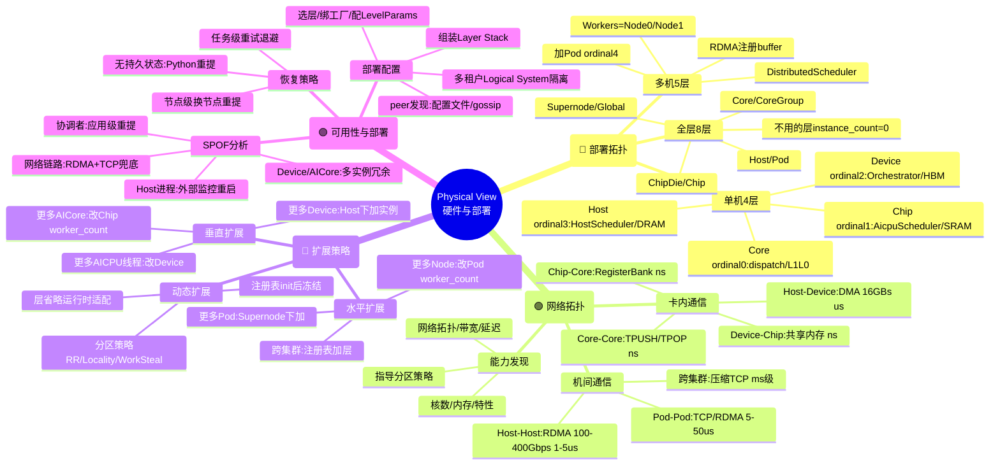
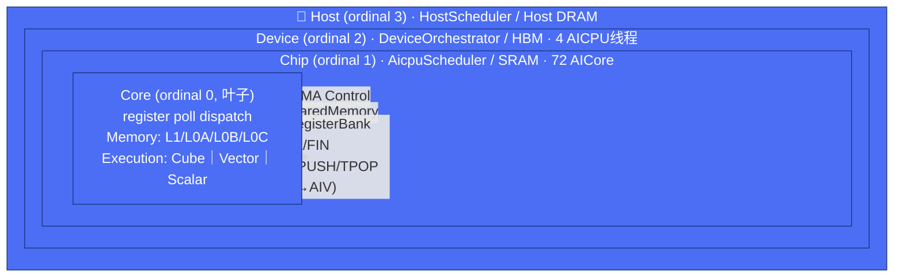
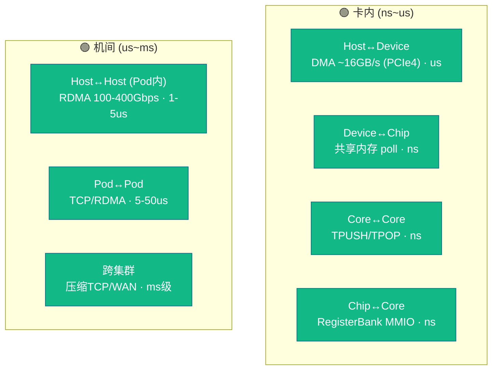

# 学习笔记 · 物理视图（Physical View）

> **这是什么**：对 [`pypto-runtime-arch-docs/05-physical-view.md`](../../../pypto_top_level_documents/pypto-runtime-arch-docs/05-physical-view.md) 的学习总结 + 彩色思维脑图。
> **一句话**：过程视图讲"运行时怎么动"，**物理视图讲"这套东西跑在什么硬件上、怎么部署、怎么扩、坏了怎么办"**——拓扑、网络、扩展、可用性、部署配置。
> **配色**：🔵 部署拓扑 ｜ 🟢 网络 ｜ 🔴 扩展 ｜ 🟣 可用性/部署配置。

---

## 🎯 一句话理解

> **同一份运行时，通过"注册几层 Machine Level"就能变成 4 层（单机）/ 5 层（多机加 Pod）/ 8 层（大集群）。层与层的映射是固定的：Host→Device→Chip→Core 对应 主机→NPU→芯片→AICore；跨节点加 Pod 用 RDMA/TCP。扩容 = 改 Machine Level Registry 配置（worker 数 / 实例数），不改代码。不需要的层用 `instance_count=0` 省略掉。**

记忆钩子：**"部署就是选层数 + 绑实现 + 配参数，扩容只动配置"**。物理差异全被 Machine Level Registry 吸收。

---

## 🧠 彩色思维脑图 · 物理部署全景

---

## 🏗️ 单机 4 层部署（生产最小集）

| 层 | Workers | 内存 | 线程 | 垂直通道↓ |
|----|---------|------|------|-----------|
| Host (3) | 1 Device | Host DRAM | 1 sched + 1 worker | DMA Control |
| Device (2) | 4 AICPU 线程 | HBM (~32GB) | 4 worker 线程 | SharedMemory |
| Chip (1) | 72 AICore | SRAM | 1 sched 线程 | RegisterBank ACK/FIN |
| Core (0) | 1 计算流水 | L1/L0A/L0B/L0C scratchpad | 硬件流水 | —（叶子） |

> 多机 = 在 Host 之上加 **Pod (ordinal 4)**：`DistributedScheduler` + RDMA 注册 buffer，Workers 是各 Node，横向 RDMA、纵向 TCP。全层 8 层再往上叠 `Supernode`/`Global`。

---

## 🌐 网络分层（带宽/延迟量级）

**能力发现**：每个 Platform 提供 capability struct（核数、内存、特性、profiling 能力、仿真标志、网络拓扑/邻居/带宽/延迟、设备间链路）。分布式调度器据此选分区策略（如按数据局部性 + 链路带宽）。

---

## 📈 扩展 + 可用性速记

**扩展（核心思想：只动 Machine Level Registry 配置，不改代码）**
- 垂直：更多 AICore → 改 Chip 的 `worker_count`；更多 AICPU 线程 → 改 Device 的 `worker_thread_count`；更多设备 → Host 下加 Device 实例。
- 水平：更多 Node → 改 Pod 的 `worker_count`（DistributedScheduler 自动分更多节点）；更多 Pod → Supernode 下加。
- 动态：层省略做运行时适配；分区策略 ROUND_ROBIN / DATA_LOCALITY / WORK_STEALING 随节点数变化适配。**注册表在初始化后冻结**（运行时不做动态增删节点）。

**SPOF 分析（Rule R5：每个关键路径组件都要有冗余/兜底）**

| 组件 | 是否 SPOF | 兜底 |
|------|-----------|------|
| Host 进程 | ✅ 是 | 外部进程监控重启；在飞任务丢失，应用级重提 |
| Host Scheduler 线程 | ✅ 是 | 崩溃检测→运行时关停并向 Python 传错 |
| Device (NPU) | ❌ 否 | 多设备；调度器避开坏设备，降容不全挂 |
| AICPU 线程 | ❌ 否 | 多线程；单线程崩溃传错给父任务 |
| AICore | ❌ 否 | 72+ 核；坏核标不可用，派发给其余核 |
| 网络链路 | ✅ 每链路是 | 多路径 RDMA+TCP 兜底；全挂则心跳超时触发 `failure_policy` |
| 协调者节点 (Pod) | ✅ 是 | 初版无自动 failover；应用级从别的协调者重提 |

> **无持久状态恢复**：运行时不跨进程重启持久化任务状态。恢复在 Python 层（用户重提计算）。这是"计算引擎"而非"数据库"的刻意取舍。

---

## ⚙️ 部署配置五步 + 多租户

一个部署由 **Deployment Configuration** 完整描述：
1. **选层**：注册哪些 Machine Level，省略哪些（`instance_count=0`）。
2. **绑实现**：每层六个组件接口的工厂注册。
3. **配参数**：每层 `LevelParams`（线程数、队列大小、内存大小、DSL 别名）。
4. **组装 Layer Stack**：运行时自顶向下构造 Layer 实例、连通道、初始化。
5. **部署 Function**：把 Function 注册进各层 Function Cache。

配置来源：C++ 初始化序列（编译期绑定）/ YAML·JSON（运行时加载）/ 二者组合。
- **Peer 发现**：配置文件静态列表（默认）或 SWIM gossip（`discovery_mode="gossip"`）。
- **多租户**：多个 **Logical System**（命名隔离命名空间）可共享物理层实例；TaskKey / ring buffer / Function Cache 按 Logical System 分区，调度只在同一 Logical System 内，横向消息按 `logical_system_name` 过滤。单租户用默认命名空间零开销。

---

## 💡 学习心得 / 关键洞察

1. **层数是配置出来的，不是写死的**。4/5/8 层同一份代码，靠 Machine Level Registry 选层 + `instance_count=0` 省略。理解这点，"单机怎么变多机"就不神秘了——加一层 Pod 而已。

2. **物理层级 ↔ 硬件是固定映射**：Host=主机、Device=NPU 卡、Chip=芯片（AICPU+AICore 簇）、Core=单个 AICore 流水线。往上 Pod=机架、Supernode=多机架、Global=全局协调。看物理视图先在脑里贴好这张对照。

3. **通信延迟差 3~6 个数量级**：卡内 ns（寄存器/共享内存）→ PCIe DMA us → 机间 RDMA us → 跨集群 ms。这解释了为什么"数据局部性"是分区策略的头等输入——一次跨集群搬运顶几百万次卡内操作。

4. **扩容只动配置是 NFR-2（可扩展性）的兑现**。加硬件 = 改 worker_count / instance_count，不碰代码。这跟开发视图"加新硬件层只需实现六接口 + 注册"是同一条设计原则的两面。

5. **冗余是分层的**：硬件级（多 Device / 多 AICore / 多线程）天然冗余；进程级和协调者级是真 SPOF，只能靠外部监控 + 应用级重提兜底。看可用性表先分清"哪些硬件自带冗余、哪些要外部兜"。

6. **"无持久状态"是刻意的**。运行时不做 checkpoint/恢复，崩了就 Python 重提。这把复杂度挡在运行时之外，符合"计算引擎"定位——别指望它当有状态服务。

---

*上一篇：[04 过程视图](04-process-view.md) ｜ 返回：[notes 索引](README.md)*
